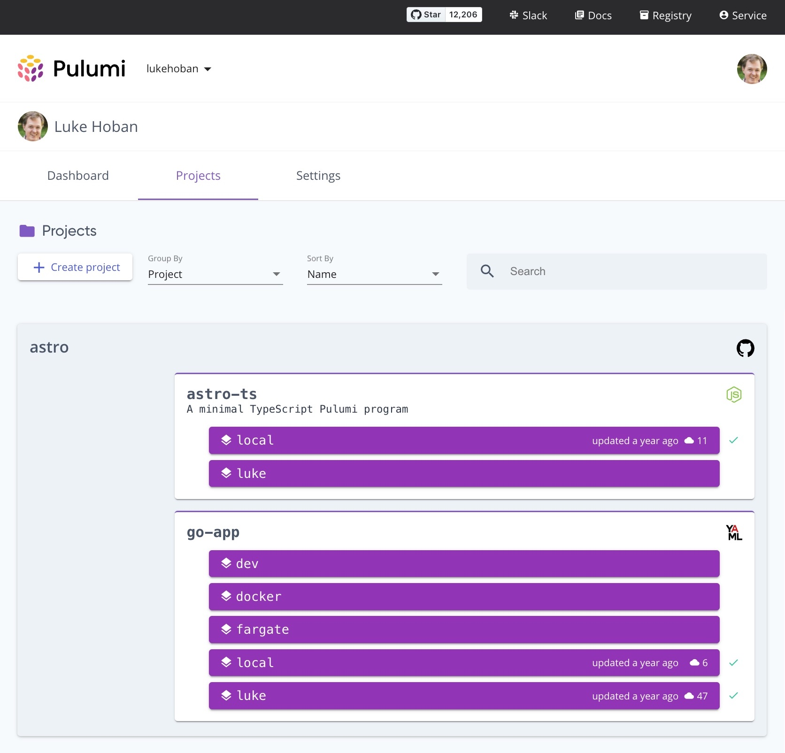

Since we first launched Pulumi 4 years ago, a core point of differentiation between Pulumi and other Infrastructure as Code offerings has been the ability to use popular general purpose programming languages - and their rich software engineering ecosystems - in order to scale up the complexity and richness of cloud infrastructure workloads. This approach has enabled cloud builders to adopt and embrace modern Infrastructure as Code with Pulumi using a wide variety of languages, including TypeScript, Python, Go, C# and Java.

Our goal though has always been to offer the broadest range of programming language options to empower __*every*__ cloud builder so that they could benefit from the best of Pulumi’s Infrastructure as Code platform.

Today, we are excited to launch [Pulumi YAML](), a simple YAML-based interface to the entirety of the Pulumi Infrastructure as Code platform.  

<!--more-->

Pulumi YAML is a great option for smaller scale cloud infrastructure use cases.  This includes:

* Teams that don’t (yet) need the richness of a general purpose programming language, and feel more comfortable with YAML.
* Simple infrastructure definitions which only need to compose a small number of cloud building blocks together.  
* Providing a simple interface to a complex set of high-level cloud components built with existing general-purpose Pulumi languages.
* Systems which will generate infrastructure as code definitions programmatically -- such as self-service provisioning portals.

Like all other Pulumi languages, Pulumi YAML programs have access to all the core features of Pulumi’s infrastructure-as-code tooling, including native providers, secrets management, stack references, Pulumi Packages, and all the features of the Pulumi Service.  Critically, Pulumi YAML programs can interoperate seamlessly with the rest of the Pulumi ecosystem, consuming the outputs of other Pulumi programs and using Pulumi components built in existing Pulumi languages.  If the complexity of your Pulumi YAML projects increases, the new `pulumi convert` feature, enabled by the underlying [Pulumi CrossCode]() technology, can be used to convert your Pulumi YAML program into your favorite general purpose Pulumi language.



## Pulumi YAML

Pulumi YAML programs are defined in the same `Pulumi.yaml` file that all Pulumi projects contain.  Instead of specifying a runtime like `nodejs` or `python`, Pulumi YAML programs use the `yaml` runtime.  This allows them to also include the set of `resources` and `outputs` that their infrastructure requires.  All that is needed is the single `Pulumi.yaml` file.

To get started with Pulumi YAML, run the `pulumi new <cloud>-yaml` command -- templates are available for all of the most popular cloud providers.

The following example shows a Pulumi YAML program that deploys two AWS resources, an AWS S3 Bucket and an S3 Bucket Object to create in that bucket.  The program outputs the name of the bucket for use in external tooling.

```yaml
name: yamldemo
runtime: yaml
resources:
  bucket:
    type: aws:s3:Bucket
    properties:
      website:
        indexDocument: index.html
  index.html:
    type: aws:s3:BucketObject
    properties:
      bucket: ${bucket.id}
      content: <h1>Hello, world!</h1>
      contentType: text/html
      acl: public-read
outputs:
  url: http://${bucket.websiteEndpoint}
```

This can be deployed with the same familiar `pulumi` CLI experience - including previews, stacks, configuration and more:

```
> pulumi up

Updating (dev)

View Live: https://app.pulumi.com/lukehoban/yamldemo/dev/updates/32

     Type                    Name          Status
 +   pulumi:pulumi:Stack     yamldemo-dev  created
 +   ├─ aws:s3:Bucket        bucket        created
 +   └─ aws:s3:BucketObject  index.html    created

Outputs:
    url: "http://bucket-801e3f9.s3-website-ap-southeast-2.amazonaws.com"

Resources:
    + 3 created

Duration: 8s

```

And outputs can be used just as in any other Pulumi project:

```
> curl $(pulumi stack output url)
<h1>Hello, world!</h1>
```

## Why YAML?

Pulumi already supports rich general purpose programming languages, so our goal with Pulumi YAML was to support the other extreme -- to be the simplest, most broadly understandable and recognizable, and easiest to generate option for specifying cloud infrastructure.  We didn’t want to invent a new proprietary DSL, instead we wanted to support a widely recognized existing markup language.

YAML is the lingua franca of so many existing cloud technologies in use today -- from Kubernetes and CloudFormation, to Docker Compose and Serverless Framework. Pulumi YAML takes inspiration from all of these, with a simple document model and direct expression of the Pulumi resource model.

The one key feature of Pulumi YAML is that all property values are implicitly interpolations.  This means that any property value can include `${...}` to use the output of one resource as part of the input to another resource.

Using YAML does lead to some constraints.  There are no loops, no conditionals, no unit testing, and (currently) no rich IDE tooling. All of these are things you can get from any other Pulumi language.  But Pulumi YAML explicitly targets simple use cases where these are not needed and avoids the additional complexity of supporting these features.

## Use Components Built in Other Pulumi Languages

Pulumi YAML programs can use any package and any resource defined in the Pulumi Registry.  This includes 80+ cloud and SaaS providers, comprising tens of thousands of cloud infrastructure resources.  Programs can combine resources from multiple providers -- such as using AWS, Docker, PostgreSQL and Cloudflare resources from a single infrastructure definition -- to describe the complete provisioning of a cloud application's infrastructure.

Pulumi YAML programs can also use any Pulumi component package defined in another Pulumi language.  Pulumi component packages are reusable infrastructure components built in one Pulumi language, and exposed via Pulumi Schema to all other Pulumi languages - including Pulumi YAML.

For example, a complete EKS cluster can be configured using the EKS package (implemented in TypeScript):

```yaml
name: eks-cluster
runtime: yaml
resources:
 cluster:
   type: eks:Cluster
outputs:
 kubeconfig: ${cluster.kubeconfig}
```

Organizations can also build their own reusable components in existing Pulumi languages like TypeScript, Python and Go to capture key aspects of their internal design patterns and compliance criteria, and make those available to other developers within the organization to consume from Pulumi YAML.  For example, a hypothetical ACMECorp organization could create a high-level serverless application framework built in Go or TypeScript, which would support deploying serverless apps with just a few lines of YAML (note that this results in something similar to Serverless Framework, but as just a simple library defined in Pulumi):

```yaml
name: serverless-simple-yaml
resources:
  receiverQueue:
    type: aws:sqs:Queue
  svc:
    type: acmecorp:serverless:Service
    properties:
      provider:
        name: aws
        runtime: nodejs10.x
        iam:
          role:
            managedPolicies:
              - arn:aws:iam::aws:policy/AmazonSQSFullAccess
      functions:
        sender:
          handler: handler.sender
          environment:
            QUEUE_NAME: ${receiverQueue.name}
          events:
            - http:
                method: post
                path: sender
        receiver:
          handler: handler.receiver
          events:
            - sqs:
                arn: ${receiverQueue.arn}
```

## Kubernetes Resources

Kubernetes resources are a very common place to use YAML in practice today, and because Pulumi’s Kubernetes provider is a native provider that projects the exact same API as the Kubernetes API Server, this means you can in most cases just copy/paste Kubernetes YAML into a Pulumi YAML program to deploy the Kubernetes resources using the Pulumi deployment engine.  For example, everything nested inside `properties` below is directly copy-pasted from a Kubernetes YAML specification.

```yaml
name: yamldemo
runtime: yaml
resources:
 pod:
   type: kubernetes:core/v1:Pod
   properties:
     apiVersion: v1
     kind: Pod
     metadata:
       name: debug-network-pod
     spec:
       containers:
         - command:
             - sleep
             - "3600"
           image: praqma/network-multitool
           name: debug-network-container
```

This allows you to then opt-in to additional features of Pulumi - like passing outputs of one resource into another, waiting for resource readiness before completing an update, passing secret configuration into a deployment, or mixing Kubernetes resources with other cloud infrastructure specifications, such as cloud-native data stores or  IAM permissions.

## Full Features of the Pulumi Platform

Although most use cases for Pulumi YAML are for simple programs, it’s possible to describe larger collections of infrastructure in Pulumi YAML, using all of the features of the Pulumi Platform.

The following example highlights the use of a variety of Pulumi features via Pulumi YAML to deploy a complete Azure Container Apps application with Pulumi:

* __Config__: Specify the Pulumi configuration parameters and their defaults
* __Variables__: Use Pulumi function invokes to get data from the cloud provider for use in constructing resources.
* __Providers__:  Create resource providers to connect to specific instances of a target cloud, like an Azure account or in this case a Docker registry.
* __Resource Options__: Pass any Pulumi [Resource Option]() to a resource definition, to define replacement behavior, resource protection, secret outputs and more.
* __Multiple Providers__:  Pass outputs from Azure resources into Docker resources, and outputs from Docker resources back into Azure resources to orchestrate a complete application deployment.

```yaml
name: azure-container-apps
runtime: yaml
description: Azure Container Apps example
configuration:
 sqlAdmin:
   type: String
   default: pulumi
variables:
 sharedKey:
   Fn::Invoke:
     Function: azure-native:operationalinsights:getSharedKeys
     Arguments:
       resourceGroupName: ${resourceGroup.name}
       workspaceName: ${workspace.name}
     Return: primarySharedKey
 adminUsername:
   Fn::Invoke:
     Function: azure-native:containerregistry:listRegistryCredentials
     Arguments:
       resourceGroupName: ${resourceGroup.name}
       registryName: ${registry.name}
     Return: username
 adminPasswords:
   Fn::Invoke:
     Function: azure-native:containerregistry:listRegistryCredentials
     Arguments:
       resourceGroupName: ${resourceGroup.name}
       registryName: ${registry.name}
     Return: passwords
resources:
 resourceGroup:
   type: azure-native:resources:ResourceGroup
 workspace:
   type: azure-native:operationalinsights:Workspace
   properties:
     resourceGroupName: ${resourceGroup.name}
     sku:
       name: "PerGB2018"
     retentionInDays: 30
 kubeEnv:
   type: azure-native:web:KubeEnvironment
   properties:
     resourceGroupName: ${resourceGroup.name}
     environmentType: Managed
     appLogsConfiguration:
       destination: "log-analytics"
       logAnalyticsConfiguration:
         customerId: ${workspace.customerId}
         sharedKey: ${sharedKey}
 registry:
   type: azure-native:containerregistry:Registry
   properties:
     resourceGroupName: ${resourceGroup.name}
     sku:
       name: "Basic"
     adminUserEnabled: true
 provider:
   type: pulumi:providers:docker
   properties:
     registryAuth:
       - address: ${registry.loginServer}
         username: ${adminUsername}
         password: ${adminPasswords[0].value}
 myImage:
   type: docker:RegistryImage
   properties:
     name: ${registry.loginServer}/node-app:v1.0.0
     build:
       context: ${pulumi.cwd}/node-app
   options:
     provider: ${provider}
 containerapp:
   type: azure-native:web:ContainerApp
   properties:
     resourceGroupName: ${resourceGroup.name}
     kubeEnvironmentId: ${kubeEnv}
     configuration:
       ingress:
           external: true
           targetPort: 80
       registries:
         - server: ${registry.loginServer}
           username: ${adminUsername}
           passwordSecretRef: "pwd"
       secrets:
         - name: "pwd"
           value: ${adminPasswords[0].value}
     template:
       containers:
         - name: "myapp"
           image: ${myImage.name}
outputs:
 endpoint: https://${containerapp.configuration.ingress.fqdn}
```

## Full Support for the Pulumi Service

For users of the Pulumi Service, including the Individual, Team, Enterprise and Business Critical offerings, all of the features you rely on from the Pulumi Service are available for your Pulumi YAML programs as well.

Your Pulumi YAML projects are shown along with the rest of your Pulumi projects authored in other languages, and each Pulumi YAML project can have multiple stacks.



Policy as Code written in any Pulumi language can be applied to your Pulumi YAML programs, and resources provisioned with Pulumi YAML are deep linked to the corresponding resources in your cloud provider. And most fundamentally, your infrastructure state is managed completely transparently.

## YAML as a Compilation Target and Cue Support

Pulumi’s YAML runtime supports both YAML and JSON natively.  Both of these formats are easy targets for machine generation of infrastructure specifications, which opens up a wide range of additional interesting use cases for Pulumi YAML.  For example, early users have built web-based provisioning portals that generate Pulumi YAML programs on the fly to deploy with Pulumi Automation API.

This also means that the rich set of languages that are designed to compile down to YAML/JSON can be used directly with Pulumi YAML.  Teams that prefer to use Cue, Jsonnet, HCL or any other DSL that compiles to YAML/JSON can be used with Pulumi YAML.

For example, this Cue program defines a collection of Azure cloud infrastructure resources using Pulumi YAML.

In `Pulumi.yaml`:

```yaml
name: cuedemo
runtime:
  name: yaml
  options:
    compiler: cue export
```

In `main.cue`:

```cue
package main

resources: {
   (#StaticWebApp & {
       _name: "bob"
   }).resources

   (#StaticWebApp & {
       _name: "anna"
       _documents: {
           root:  "website"
           index: "index.html"
       }
   }).resources
}

#StaticWebApp: {
   _name: string
   _documents: {
       root:     string | *"website"
       index:    string | *"index.html"
       error404: string | *"404.html"
   }

   resources: {
       "\(_name)-group":
           type: "azure-native:resources:ResourceGroup"

       "\(_name)-storage": {
           type: "azure-native:storage:StorageAccount"
           properties: {
               resourceGroupName: "${\(_name)-group.name}"
               kind:              "StorageV2"
               sku: {
                   name: "Standard_LRS"
               }
           }
       }

       "\(_name)-website": {
           type: "azure-native:storage:StorageAccountStaticWebsite"
           properties: {
               resourceGroupName: "${\(_name)-group.name}"
               accountName:       "${\(_name)-storage.name}"
               indexDocument:     "\(_documents.index)"
               error404Document:  "\(_documents.error404)"
           }
       }

       "\(_name)-\(_documents.index)": {
           type: "azure-native:storage:Blob"
           properties: {
               resourceGroupName: "${\(_name)-group.name}"
               accountName:       "${\(_name)-storage.name}"
               containerName:     "${\(_name)-website.containerName}"
               contentType:       "text/html"
               type:              "Block"
               source: {
                   "Fn::FileAsset": "./\(_documents.root)/\(_documents.index)"
               }
           }
       }
   }
}
```

Running `pulumi up` will now automatically compile the Cue into JSON and deploy it - no need to manually run a transpiler.

```
> pulumi up

Previewing update (dev)

View Live: https://app.pulumi.com/lukehoban/cuedemo/dev/previews/7ac07d0c-262e-41c8-a2c7-6d3f2734cf95

     Type                                                 Name             Plan
 +   pulumi:pulumi:Stack                                  cuedemo-dev      create
 +   ├─ azure-native:resources:ResourceGroup              bob-group        create
 +   ├─ azure-native:resources:ResourceGroup              anna-group       create
 +   ├─ azure-native:storage:StorageAccount               anna-storage     create
 +   ├─ azure-native:storage:StorageAccount               bob-storage      create
 +   ├─ azure-native:storage:StorageAccountStaticWebsite  anna-website     create
 +   ├─ azure-native:storage:StorageAccountStaticWebsite  bob-website      create
 +   ├─ azure-native:storage:Blob                         anna-index.html  create
 +   └─ azure-native:storage:Blob                         bob-index.html   create

Resources:
    + 9 to create
```

## Convert to Other Pulumi Languages

When the complexity of infrastructure managed by a Pulumi YAML program grows beyond what can be managed easily with YAML, users have a variety of options to “grow up” without disruption to their infrastructure.

First and foremost, complexity can be pushed into a reusable component defined in another Pulumi language, and then used from Pulumi YAML, to keep the interface simple and clean for Pulumi YAML consumers.

But for cases where the YAML program itself does need to get more complex, using languages like Cue or Jsonnet provides an easy path, similar to what is frequently found in the Kubernetes ecosystem as complexity increases.  This often introduces expressivity limitations and slightly cumbersome templating as you continue to scale through.

So to give the best of both worlds, Pulumi YAML also supports the option to convert your Pulumi YAML programs into programs defined in any other Pulumi language.  For example, the original example above can be converted to a Python program with just a single command:

```
> pulumi convert --language python --out ./bucket-py
```

This will generate a new Python project in the `./bucket-py/` folder which specifies the exact same infrastructure so that you can `cd` into that folder, `pulumi up` and see no changes.  The `__main__.py` generated by `pulumi convert` looks exactly like what you would have written in Python.

```python
import pulumi
import pulumi_aws as aws

bucket = aws.s3.Bucket("bucket", website=aws.s3.BucketWebsiteArgs(
   index_document="index.html",
))
indexhtml = aws.s3.BucketObject("index.html",
   bucket=bucket.id,
   content="<h1>Hello, world!</h1>",
   content_type="text/html",
   acl="public-read")
pulumi.export("url", bucket.website_endpoint)
```

From here, you can adopt more features available in Pulumi Python - loops and conditionals, testing, components, and much more!

## Summary

We are really excited to be introducing YAML to the collection of languages supported by Pulumi’s Universal Infrastructure as Code platform.  With the addition of Pulumi YAML, every cloud builder now has a great option for deploying cloud infrastructure using Pulumi.  All of the benefits of Pulumi are available from YAML - the richest Native Providers for major cloud platforms, a wide range of higher-level components in the Pulumi Registry, deep support for secrets, infrastructure refactoring with `aliases`, a long tail of Cloud and SaaS providers, enforcement of Policy as Code and Audit Logs for all deployments in the Pulumi Service, and so much more.  Because you can use components built with other Pulumi languages, the interface to Pulumi YAML can be kept simple, allowing platform teams to define simple interfaces to their cloud infrastructure platform.  But if and when the Pulumi YAML does get more complex than is appropriate for YAML, the `pulumi convert` command provides an easy path to continue to get the full benefits of Pulumi’s general purpose programming language options.

The Pulumi YAML language support is open source at [https://github.com/pulumi/pulumi-yaml](https://github.com/pulumi/pulumi-yaml), and YAML examples are available for all packages and cloud providers in the [Pulumi Registry](). You can get started with Pulumi YAML today in the [Pulumi Getting Started]() guide and the [Pulumi YAML language docs]().  We can’t wait to see what you build!
