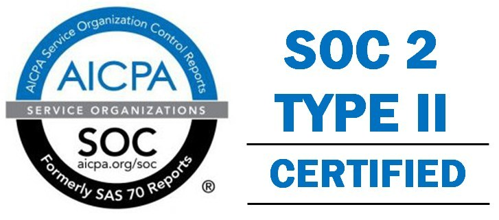

## Pulumi’s Commitment

Pulumi is committed to operational excellence for our customers and one of the ways that we decided to demonstrate this was by completing our SOC 2 Type 2 Audit. After a lot of hard work these past few months, we are pleased to announce that Pulumi is now SOC 2 compliant!

<!--more-->

The audit involved the entire Pulumi team. We needed to have proper controls in place across the organization and ensure that our key processes were documented and exercised. In addition, we reviewed our vendor selection process and made sure that all of our key partners were compliant with SOC as well. Our team used the overall process as an opportunity to review our overall governance and risk management procedures. Interestingly, the change in our work environment caused by Covid-19 actually helped us stress some of our process and policies, since we were forced to work remotely, much as if we had any type of interesting “event” at our headquarters.

Of course, we spent a large amount of time reviewing the security of our service. Security is already baked into our culture, with processes around training, code reviews, and the like, however, there’s no doubt this process helped us “up our game.” The policies that we already had in place (encryption of data at rest and in transit, auditing, logging, secure backup, etc.) gave us a strong foundation, however, as we reviewed key areas we found several areas for simplification and improvement.

## The SOC 2 Journey

As an organization, SOC 2 requires us to promise that we abide by well-documented policies, procedures, and operational controls and to prove it to an accredited firm that reviews our operational discipline for several months. We were fortunate to find a great partner that was a superb resource as we initiated our first report. The auditors had to review a tremendous amount of data, much of it over shared screens in Zoom. Their experience also helped us think about how we can continuously improve in several key areas.

We decided to use a third party tool to help with the process. In retrospect, this was one of the best decisions we made, and picking a tool that fits with your organization is hugely important. Our engineering culture definitely believes in “get clean, stay clean” and a great tool that automates many of the routine checks is indispensable. In addition, having a central dashboard that lets you know “where you are” in your journey is incredibly valuable and can really help motivate the team. The tool also helped us find a number of enhancements that go above and beyond what SOC strictly requires. For example, we created a network diagram, which, while not strictly a SOC requirement, was a suggestion from the tool. Finally, all team members now have agent software on their laptops that helps maintain key standards that we’ve chosen for our security profile.

In addition, much of the operational excellence for SOC certification requires great DevOps discipline. Here, we had a huge insider’s advantage! We were able to use Pulumi itself to automate key procedures required by the process.

## Going Forward

While we already had the key cultural attributes required for operational excellence, our SOC 2 journey was a great way to reinforce the importance of this to the entire team. Security, privacy, and resiliency are everyone’s job!

We’ve added additional training, and some templates and processes that will help us do an even better job in the future.

We have a leadership team that reviews key areas of the SOC profile quarterly, with each quarter having a special focus. For example, one quarter may focus on security, while the next may zero-in on disaster recovery. The meetings are documented and any work items identified go onto our team’s task list.

Most importantly, the journey isn’t over! Pulumi will continue to evolve. The SOC standards will continue to evolve. Industry tools and best practices will continue to evolve. We’ve come a long way since we started our SOC 2 journey and we’re committed to continuing to improve our operational excellence every day.

