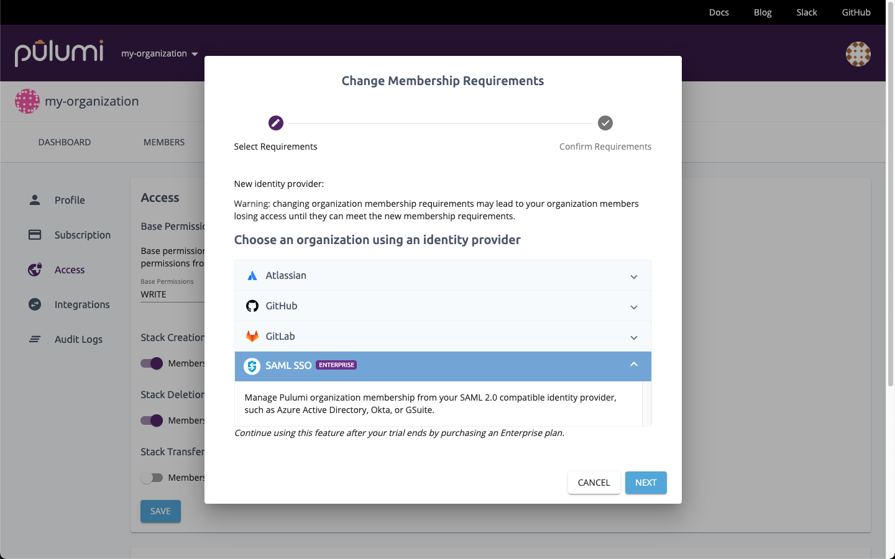

Pulumi's Cloud Engineering Platform helps teams of all sizes deliver and manage cloud apps and infrastructure. In the Pulumi Service, everyone on the team can see the infrastructure the team is responsible for, when it was last deployed, how it’s configured, and more. You can see a full breakdown of the infrastructure and understand how the team brings together individual cloud services to create applications. When you bring your teams together on Pulumi, you get a “single pane of glass” over all the cloud applications and infrastructure managed with Pulumi.

<!--more-->

Most teams larger than a few people define their team members, and the groups they’re a part of, using an Identity Provider (IdP) like [Okta](https://www.okta.com/products/single-sign-on/), Microsoft’s [Azure Active Directory](https://azure.microsoft.com/en-us/services/active-directory/), or [Google Cloud Identity & Access Management](https://cloud.google.com/iam/). Defining groups allows you to set policies based on logical groupings of teammates, such as giving different capabilities to individual developers versus infrastructure administrators. Pulumi works seamlessly with these IdPs (and many more) by providing [Single Sign-On with SAML]() and [user and group synchronization via SCIM 2.0](). When you use both SAML SSO and SCIM, you can manage the users who should have access to Pulumi and the [Pulumi teams]() they belong to entirely from your IdP. Managing users and teams this way helps keep your organization more secure by ensuring a single point of control over the users who have access to manage and update your infrastructure. It also saves you time by centralizing all of your identity and access management workflows in your identity provider.

{}
SAML SSO and SCIM support are only available in **Pulumi Enterprise**. See [pricing]() for more details.
{}

## SAML SSO

In a world of many cloud applications and service providers, IT departments can use single sign-on with SAML to make it easier for their employees to sign in and be productive. In addition, if an employee leaves, all of that employee’s access can be disabled from a single pane of glass, rather than having to manually update each application and service provider separately. Pulumi’s support for single sign-on with SAML provides this functionality. We support any IdP that implements the SAML 2.0 specification, with specific integrations for Azure Active Directory, Okta, and GSuite.

To configure single sign-on with SAML for your Pulumi organization, use the guide that matches your IdP:

- [Okta]()
- [Azure Active Directory]()
- [Google Cloud Identity & Access Management]()
- [Generic guide (for all other IdPs)]()

After configuring your IdP, any and all changes, either to your cloud applications and infrastructure, or your account's settings, will be tracked and associated with the user who performed that activity. The end result is full end-to-end visibility and attestation for important changes to your Pulumi organization.

## User and group synchronization via SCIM

After you’ve configured single sign-on with SAML, you can take it one step further by synchronizing your users and groups using [SCIM](https://developer.okta.com/docs/concepts/scim/). Synchronization extends the power of single sign-on by enabling organization administrators to use their IdP to manage the users who have access to Pulumi and which teams each user belongs to. Granting and revoking user access is seamless and automatically provides the right level of permissions to critical infrastructure.

To configure user and group synchronization via SCIM, use the guide that matches your IdP:

- [Okta]()
- [Azure Active Directory]()

## Distributed, least privilege access permissions model

In addition to support for standards like SAML and SCIM, the Role-Based Access Control (RBAC) permissions model enables you to set up a least privilege access model for your infrastructure resources. In such a model, all access to infrastructure is specifically granted to individual users by creating [Teams]() that have the appropriate level of access (Read, Write, or Admin) to a set of [Stacks](), then adding users to those teams. Team membership can be managed manually by Team Admins or automatically using SCIM group synchronization.

Learn how to create Teams in the [Teams docs]().

## Next steps

The Pulumi Cloud Engineering Platform's support for the SAML and SCIM standards for SSO, user synchronization, and group synchronization makes it easy to ensure every team member has the right access and the right permissions, allowing you to empower the right teammates while still applying the principle of least privilege. Here’s how to get started:

- If you’re an existing Pulumi customer, you can enable SAML [in your organization settings](https://app.pulumi.com/pulumi/settings/saml).
- If you’re new to Pulumi, [start your trial now](https://app.pulumi.com/site/trial) or [contact sales to request a demo]().
