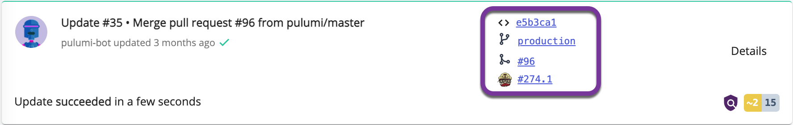

Pulumi's CI/CD Assistant helps you bring your infrastructure under version control and create a continuous integration and delivery pipeline that deploys changes to your cloud applications and infrastructure whenever you make a change in source control. Using CI/CD secures your production delivery while ensuring that every deployment is expressed in a committed Pulumi program and quickly reflected in your deployed infrastructure.  With the CI/CD Assistant, it's easier than ever before to set up version control and a CI/CD pipeline for your favorite CI/CD system, even if you're new to CI/CD workflows.

Since its launch late last year, the CI/CD Assistant has been available to organizations using the Team and Enterprise offerings; today at PulumiUP, we announced that it's now also available to all teams, including Team organizations. Get started with the CI/CD Assistant on any stack's settings page, or [learn more in the docs]().

<!-- more -->

## Get your cloud applications and infrastructure to production faster and safer

Building source code safely in version control and deploying using continuous integration and delivery (CI/CD) pipelines are best practices of cloud engineering. Using version control creates a full history of changes to Pulumi infrastructure as code programs you write: when the change was made, who made it, and what was changed. Version control systems also provide an easy mechanism to revert to an old infrastructure configuration: you can restore a past version of your infrastructure as code and redeploy it, effectively rolling back by rolling forward. Adding a CI/CD pipeline adds even more benefit by accelerating the deployment of changes. The CI/CD pipeline for your cloud code can deploy updates on every change, on a schedule, or in many CI/CD systems by an external event or workflow you've configured. A well-configured CI/CD pipeline is also much more secure: you can focus on restricting access to production deployments, generating temporary access keys for the CI/CD environment, and also also use the Pulumi [Secrets]() feature to safeguard and minimize access to any and all secrets you use to deploy.

The CI/CD Assistant helps you realize all these benefits by getting version control and CI/CD configured for your infrastructure stacks. The Assistant walks you through a 4-step guided procedure:

1. **Configuring version control,** so Pulumi can show you the code history associated with each update
1. **Configuring your CI/CD system** to access Pulumi, including any secrets Pulumi safeguards for your stack
1. **Creating a CI/CD workflow file** that shows how to run Pulumi in your CI/CD system
1. **Validating** that everything was configured correctly

When you've configured version control and CI/CD on a Pulumi stack, you get additional helpful metadata in the Pulumi Console: each update shows the commit, branch, pull request (if applicable), and build number - all with links to your version control and CI/CD systems so you can dig into additional detail.

👉 [Learn more]()

## Support for many CI/CD providers

The CI/CD Assistant delivers on the Pulumi Cloud Engineering Platform's promise of your cloud, your language, your way, by providing broad support for over a dozen of the most popular CI/CD services:

If you use a version control or CI/CD provider that's not on this list, you can file a feature request. We'd love to hear from you!

👉 [Request a new version control or CI/CD provider](https://github.com/pulumi/ci-workflow-templates/issues/new?assignees=&labels=&template=ci-cd-request.md&title=%5BNEW+CI+REQUEST%5D)

## Keep exploring

This announcement is just one part of the story. Watch the PulumiUP event for more.

👉 [PulumiUP](https://www.pulumi.com/pulumi-up/)
