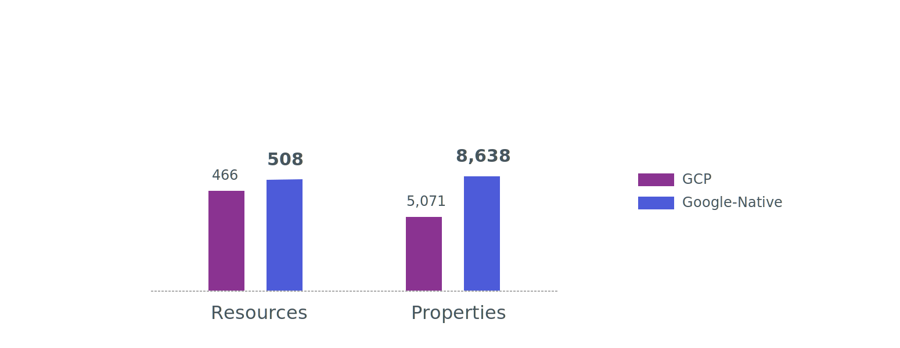

Today at [PulumiUP](), we announced the public preview of our Google Cloud Native provider. Google Cloud usage amongst Pulumi users has grown rapidly in the past year and Google Cloud has been adding [new features and updates almost every day](https://cloud.google.com/blog/products/gcp). The new native provider gives Pulumi users the best support possible for Google Cloud in Pulumi.

<!--more-->

The Google Cloud Native provider works directly with the Google Cloud APIs, as surfaced by the [Google API Discovery Service](https://developers.google.com/discovery/), instead of depending on a handwritten layer like other current infrastructure as code technologies. This new approach is similar to that which we've taken for our [Kubernetes]() and [Azure Native]() providers and ensures higher quality and complete coverage of the resources available in GCP.

## Full API coverage

Google Cloud Native covers 100% of the resources available in the Google Cloud APIs. The new provider supports 508 resource types at launch, 10% more than the number supported by the previous Google Cloud provider, and over 70% more properties, each of which represents a new capability or feature exposed by Google Cloud but unavailable in other infrastructure as code tools. Every property of each resource is represented in the SDKs.  In addition, every version of each resource is available, providing access to each version of beta and GA features in a stable way from a single provider.



Like our [other native providers](), the new SDKs include 100% coverage of Google Cloud resources.

## Always up-to-date

Unlike the original Google Cloud provider, which requires manual work to keep updated, the new provider is always up-to-date with additions and changes to the Google Cloud APIs. This also ensures very high quality since a human doesn't need to manually implement support for all of those services and features.

We generate Pulumi SDKs for Google Cloud Native automatically using updates from the [Google API Discovery Service](https://developers.google.com/discovery/). This has been designed to enable an automated pipeline to release updated resources within hours after any current API specifications are merged. That pipeline will publish daily updates via automated builds and minor SDK versions every two weeks.

By generating the SDKs directly from the Google Cloud APIs, the Google Cloud Native provider is robust and reliable, with fewer moving parts involved and fewer sources of potential bugs and incompatibilities. For example, when Google's new GKE Autopilot feature shipped, early builds of this provider supported it within hours, compared to over a month for legacy infrastructure as code tools.

Excited about a new service announced by Google? Chances are it’s already in the latest Google Cloud Native package!

## Every language

Google Cloud Native is available in public preview today for all Pulumi languages. Because it's built on the [Pulumi Packages]() technology, every update to Google Cloud Native is available in all languages on the day of release. The new Google Cloud Native SDKs are [open source on GitHub](https://github.com/pulumi/pulumi-google-native/) and available on [npm](https://www.npmjs.com/package/@pulumi/google-native), [NuGet.org](https://www.nuget.org/packages/Pulumi.GoogleNative/), [PyPI](https://pypi.org/project/pulumi-google-native/), and [Go modules](https://pkg.go.dev/github.com/pulumi/pulumi-google-native/sdk/go/google#section-directories).



{}

```typescript
import * as pulumi from "@pulumi/pulumi";
import * as google from "@pulumi/google-native";

const config = new pulumi.Config("google-native");
const project = config.require("project");

const region = "us-central1";
const clusterName = "gke-native";

const cluster = new google.container.v1.Cluster("cluster", {
    projectsId: project,
    locationsId: region,
    clustersId: clusterName,
    name: clusterName,
    parent: `projects/${project}/locations/${region}`,
    autopilot: { enabled: true }
});
```

{}
{}

```python
import pulumi
from pulumi_google_native.container import v1 as container

config = pulumi.Config('google-native')
project = config.require('project')

region = "us-central1"
cluster_name = "gke-native"

cluster = container.Cluster(
            "cluster",
            projects_id=project,
            locations_id=region,
            clusters_id=cluster_name,
            name=cluster_name,
            autopilot=container.AutopilotArgs(enabled=True))
```

{}
{}

```go
package main

import (
    container "github.com/pulumi/pulumi-google-native/sdk/go/google/container/v1"
    "github.com/pulumi/pulumi/sdk/v3/go/pulumi/config"
    "github.com/pulumi/pulumi/sdk/v3/go/pulumi"
)

func main() {
    const region = "us-central1"
    const clusterName = "gke-native"

    pulumi.Run(func(ctx *pulumi.Context) error {
        conf := config.New(ctx, "google-native")
        project := conf.Require("project")
        cluster, err := container.NewCluster(ctx, "cluster", &container.ClusterArgs{
            Name:        pulumi.StringPtr(clusterName),
            ClustersId:  pulumi.String(clusterName),
            LocationsId: pulumi.String(region),
            ProjectsId:  pulumi.String(project),
            Autopilot: container.AutopilotArgs{
                Enabled: pulumi.Bool(true),
            },
        })
        if err != nil {
            return err
        }

        ctx.Export("clusterSelfLink", cluster.SelfLink)

        return nil
    })
}
```

{}
{}

```csharp
using System.Threading.Tasks;
using Pulumi;
using Pulumi.GoogleNative.Container.V1;
using Pulumi.GoogleNative.Container.V1.Inputs;

class Program
{
    static Task<int> Main() => Deployment.RunAsync(() =>
    {
        var config = new Config("google-native");
        var project = config.Require("project");

        var region = "us-central1";
        var clusterName = "gke-native";

        var cluster = new Cluster("cluster", new ClusterArgs
        {
            ProjectsId = project,
            LocationsId = region,
            ClustersId = clusterName,
            Name = clusterName,
            Autopilot = new AutopilotArgs { Enabled = true }
        });
    });
}
```

{}



API documentation is available in our [API reference]().

## Works side-by-side with the existing Pulumi GCP Provider

We will continue to invest in the existing Google Cloud provider. Pulumi users can use either provider or use both providers side-by-side in their applications.

A single Pulumi project can use both providers. The outputs of a resource from one provider can flow to inputs of a resource from the other provider. In both cases, they are the values available from Google Cloud itself, such as the name or ID of a Google Cloud resource.

If you have existing projects using the current Pulumi GCP provider, you can continue to use that provider, and Pulumi will continue to update it indefinitely. You can add new cloud resources using the existing provider or start creating new infrastructure with the new provider. At a later date in the preview, we will publish a [migration guide](https://github.com/pulumi/docs/issues/5781) to help you move existing projects from GCP to Google Cloud Native.

New Pulumi projects for Google Cloud will default to using Google Cloud Native once it reaches general availability later this year.

## Getting started

New Pulumi templates are available for the Google Cloud Native provider:



{}

```sh
$ pulumi new google-native-typescript
```

{}
{}

```sh
$ pulumi new google-native-python
```

{}
{}

```sh
$ pulumi new google-native-csharp
```

{}
{}

```sh
$ pulumi new google-native-go
```

{}
{}

Several more extensive examples are also available in the [Pulumi Examples](https://github.com/pulumi/examples) repo:

- Containerized Ruby on Rails App Delivery using the Google Native Pulumi Provider: [TypeScript](https://github.com/pulumi/examples/tree/master/google-native-ts-k8s-ruby-on-rails-postgresql)
- Google Cloud Functions: [TypeScript](https://github.com/pulumi/examples/tree/master/google-native-ts-functions)

The preview of the Google Cloud Native provider is ready for you to try. It’s easy to get started by trying one of our examples. We look forward to hearing your feedback! We look forward to hearing your feedback! Please [file any bugs and feature requests on GitHub](https://github.com/pulumi/pulumi-google-native/issues) or ask questions in the [Pulumi Community Slack](https://slack.pulumi.com/). We are eager to hear your feedback and how we can help.

## Keep exploring

The Google Cloud Native announcement is just one part of Pulumi’s Cloud Engineering Platform. Watch the PulumiUP event for more.

👉 [PulumiUP]()
👉 [Google Cloud Native API reference]()
