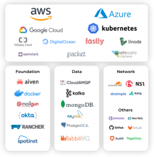

Pulumi native providers are a new type of [Pulumi Package]() that give you the most complete and consistent interface for the modern cloud. Pulumi native providers bring the full power of the top cloud providers to the Pulumi Cloud Engineering Platform, faster and with more complete coverage than any other infrastructure as code offering. Today at PulumiUP, we announced native providers for Microsoft Azure (GA), [Google Cloud (public preview)](), and AWS (later this year). Along with an existing native provider for Kubernetes, these providers enable you to build, deploy, and manage cloud infrastructure and applications for the most common cloud vendors and technologies. This best-in-class support for the major clouds joins our library of [more than 50 cloud providers]() and delivers on our promise of cloud engineering for any cloud, any architecture, and any language.

<!--more-->

## 100% API coverage, same-day access

Legacy infrastructure as code tools rely on providers that are often hand-coded. These providers have fairly broad coverage of the modern cloud ecosystem, but they can’t always keep up with the pace of innovation of that ecosystem. That can leave you stuck with an awkward choice: wait until the provider is updated and miss out on the first-mover advantage, or try out the new infrastructure directly without any of the control, repeatability, or scalability you expect from infrastructure as code.

With Pulumi native providers, you don’t need to make that choice. Native providers are built directly and automatically from the cloud provider’s API. As a result, you can trust that these new native providers give you access to 100% of the resources covered by the cloud provider’s API and same-day access to feature updates and new services. When you see a new resource at AWS re:Invent, Microsoft Build, or Google Cloud Next, you can be sure that it’ll be available for use in Pulumi the same day that it’s added to the provider’s API. You can get productive with that new resource quickly because native providers also pull documentation from the API. As with all Pulumi providers, you get the full benefits of code completion, syntax highlighting, and everything else you expect from your programming language and development environment. That means you can start using those new services as soon as you hear about them without losing any of the benefits and protections of your infrastructure as code. And of course, like Pulumi itself, Pulumi native providers are open source, so you can see the code, file issues, and contribute fixes and new features.

## Azure Native is generally available

Microsoft delivers new value to the Azure platform quickly and frequently, with [hundreds of new resources, features, and improvements](https://azure.microsoft.com/en-us/updates/) just this year. As those updates became available, we added them to the Pulumi Azure Native provider. Since we announced Azure Native [last September](), we’ve maintained its 100% coverage of the [Azure Resource Manager API surface](https://docs.microsoft.com/en-us/rest/api/azure/) by adding the 166 new resources (e.g. new service or features within existing services) added to the ARM APIs. Those new resources have been contained in the 279 daily builds of the provider we’ve released since that announcement. These releases guarantee same-day coverage of Azure updates, so you don’t have to wait to use new Azure features and updates.

Since the release of Azure Native, many Azure Classic provider users have already started using it in their projects and filing bugs and feature requests. We’ve been fixing those issues, and today we’re excited to ****make Azure Native generally available at version 1.0.0.**** Azure Native is your best choice for any new project that uses resources from Azure; you can also mix in new resources from Azure Native in a project that uses the Azure Classic provider today. If you’d like, you can migrate existing projects to use Azure Native using the [migration guide](). However, the Azure Classic provider remains fully supported.

A great example of the unique value you get from the Pulumi native provider approach is Consumption Budgets. Consumption Budgets allow you to control your Azure spend proactively, so you’re not surprised when your bill arrives. Consumption Budgets are covered by the [Azure Resource Manager API](https://docs.microsoft.com/en-us/azure/cost-management-billing/manage/consumption-api-overview), so you can [create a Consumption Budget](https://www.pulumi.com/docs/reference/pkg/azure-native/consumption/budget/) with Azure Native right now. In contrast, Consumption Budgets has been a pending feature request for over 2 years in the Terraform provider used by the Azure Classic provider.

With the Azure platform evolving as rapidly as it does, you might worry that it’ll be hard to manage API versions or know which APIs are stable and ready to use. But fear not! Each major version of the Azure Native provider exposes a top-level namespace with a consistent set of stable APIs. Any breaking changes made in the Azure APIs will be released in a new major version of the Azure Native provider. If you need a different version of an API, you have access to that as well: every API version is exposed as a separate namespace in the provider.

👉 Get started with [Azure Native]()

## Public preview: a native provider for Google Cloud Platform

Google Cloud Platform is also growing at a rapid pace, with [new features and updates almost every day](https://cloud.google.com/blog/products/gcp). To track that growth, today at PulumiUP, we announced a **public preview of GCP-Native**, a Pulumi native provider for the Google Cloud Platform. Just like the Azure Native provider, GCP-Native gives you 100% coverage of [every Google Cloud Platform API](https://developers.google.com/discovery/), so you can do things that aren’t possible with the current Terraform-based Google Cloud provider<!--TODO add examples-->. And just like the Azure Native provider, Google Native is updated with a new release every time those APIs are updated, so you have access to new GCP features as soon as they’re released.

👉 Read the [GCP-Native public preview announcement]()

## AWS later this year, and more to come

Of course, we’re not stopping with native providers for Azure, Google Cloud, and [Kubernetes](). Later this year, we’ll release a native provider for Amazon Web Services. Just like the Azure Native and Google Cloud Native providers, the AWS Native provider will support 100% of CloudFormation resources and give you same-day access when new resources are released.

Pulumi native providers are the best way to build, deploy, and manage resources in AWS, Azure, GCP, and Kubernetes, but you’re not limited to just those clouds. Pulumi’s [broad library of more than 50 cloud providers]() remains available and ready to use.

You can help us decide which providers to build next! Add your vote to [existing provider requests here](https://github.com/pulumi/pulumi/issues?q=is%3Aopen+is%3Aissue+label%3Aarea%2Fproviders+label%3Akind%2Fenhancement) or [request a provider](https://github.com/pulumi/pulumi/issues/new?assignees=&labels=kind%2Fenhancement,area%2Fproviders&template=1-feature-request.md).

👉 See [all the cloud providers you can use with Pulumi]()

## A peek under the hood

Native providers fulfill a core promise of the Pulumi Cloud Engineering Platform: to be your most complete and consistent interface to model and program the cloud. Here’s how we deliver on that promise of 100% API coverage and same-day updates.

### Full API coverage via automated nightly updates

Automation in GitHub Actions checks the Azure, Google, and Amazon API specifications every night and automatically generates a pull request to update the corresponding native provider Pulumi Package with any changes. That pull request updates the Pulumi Package’s schema (the metadata file that defines the resources, inputs, and outputs that make up the native provider), re-generates all four language SDKs, and creates a new minor version of the provider. That new minor version contains:

- New namespaces for any new API versions, so you can access new features, even if they’re behind a preview API version
- All non-breaking updates to the top-level APIs, so you get bug fixes and non-breaking improvements as soon as they’re ready

Periodically, we also create a new major version release of the provider that promotes new API major versions to the top-level namespace. This ensures that new APIs become part of the “default” set available in the top-level namespace.

If you want to dive deeper into how we keep the native provider Pulumi Packages up to date, you can see Azure Native’s [automation in GitHub Actions](https://github.com/pulumi/pulumi-azure-native/actions/workflows/nightly-sdk-generation.yml) and an [example pull request](https://github.com/pulumi/pulumi-azure-native/pull/728).

### Going beyond the API

Sometimes, a cloud provider doesn’t cover some scenarios or resources in their primary API. For example, the Azure Resource Manager API doesn’t currently include support for managing Azure Key Vault secrets and keys. In these cases, to provide the best experience, we hand-author extensions to the native provider Pulumi Package to cover these scenarios.

## Keep exploring

These native provider announcements are just one part of Pulumi’s Cloud Engineering Platform. Watch the PulumiUP event for more.

👉 [PulumiUP](https://www.pulumi.com/pulumi-up/)
