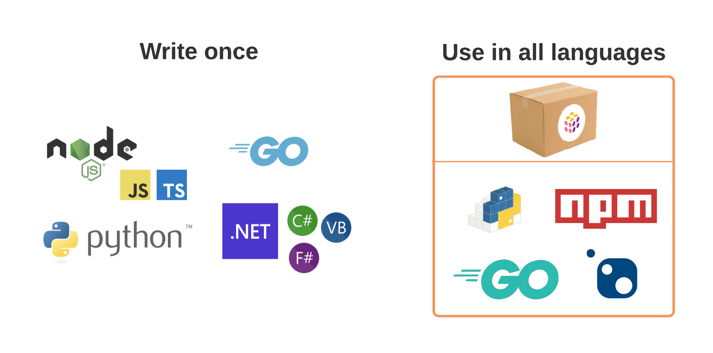
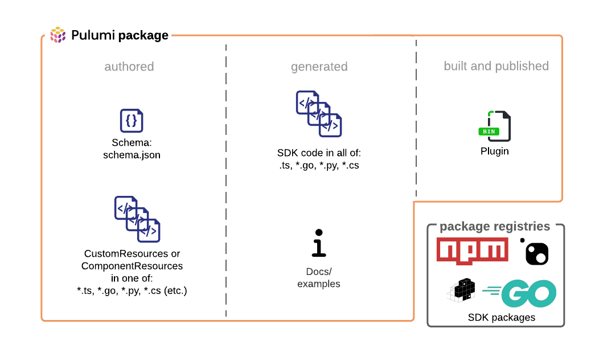

Pulumi Packages are the core technology that enables cloud infrastructure resource provisioning to be defined once, in your language of choice, and made available to users in all Pulumi languages. If you’ve used a Pulumi [cloud provider](), including one of our new [Pulumi native providers](), you’ve used a Pulumi Package. But until today, Pulumi Packages only worked with Pulumi Resources: direct, low-level representations of individual cloud services like object storage. Many of us, however, enjoy creating Pulumi Components, which combine low-level resources into higher-level, more opinionated building blocks like the production-grade Kubernetes cluster component in [Pulumi EKS](https://github.com/pulumi/pulumi-eks/). Unfortunately, those components, though powerful and unique to Pulumi's IaC approach, were previously confined to a single language: so if your infrastructure team built a component in Python, your developers who might want to use TypeScript could not use it.

In [Pulumi 3.0]() Pulumi Components can now be authored in a fundamentally multi-language way, enabling you to write them once in your preferred language and make them available in all the other languages supported by Pulumi—all thanks to Pulumi Packages.

<!-- more -->

👉 Read on to learn more about Pulumi Packages, or jump right in and author your own with the [user guide]()

## Using Pulumi Packages

Pulumi Packages bring the full power of the modern cloud and the amazing creativity of the Pulumi Community to you. Using a Pulumi Package is easy: find one, install it into your project, and get started.



{}

1. Choose from any of Pulumi’s [cloud provider]() packages, or search the [npm registry](https://www.npmjs.com/search?q=pulumi) for other Pulumi Packages
1. Install into your project with `npm i [package-name]`
1. Reference a namespace in the newly-installed package and start writing code

{}
{}

1. Choose from any of Pulumi’s [cloud provider]() packages, or search [PyPI](https://pypi.org/search/?q=pulumi) for other Pulumi Packages
1. Install into your project with `pip install [package-name]`
1. Reference a namespace in the newly-installed package and start writing code

{}
{}

1. Choose from any of Pulumi’s [cloud provider](), or search the [NuGet Gallery](https://www.nuget.org/packages?q=pulumi) for other Pulumi Packages
1. Install into your project with `dotnet add package [package-name]`
1. Reference a namespace in the newly-installed package and start writing code

{}
{}

1. Choose from any of Pulumi’s [cloud provider]() packages
1. Install into your project with `go get [package-url]`
1. Reference a namespace in the newly-installed package and start writing code

{}
{}
Notably, you don't need to know how a Pulumi Package was authored to use it. Using any Pulumi Package is the same regardless of whether that package contains native cloud resources, custom components, resources that came from a bridged Terraform provider, or anything of the other many possibilities. No matter what, the same idiomatic Pulumi IaC programming model is used to interact with those resource types and objects.

## Creating Pulumi Packages

You can use Pulumi successfully without ever creating a Pulumi Package. But, we'd love to have you join the community of Pulumi Package authors! Here's a quick overview of how Pulumi Packages work and how to create one.

A Pulumi Package is comprised of two inputs: a Pulumi schema, which describes the resource model the package exposes, and the Resources or Components described in that schema. From those inputs, Pulumi Packages can generate language-specific SDKs and documentation and then package those into SDK packages (npm, NuGet, and Python packages) that can be published to a public or private package registry. Along the way, a resource provider plugin is also created. The plugin is used by the Pulumi engine to instantiate, configure, and destroy the Resources or Components defined by the package.

There are several different ways to author a Pulumi Package depending on the kind of cloud infrastructure you want to define:

1. **Native Pulumi Provider Package:** Use the full features of the Pulumi resource model to create a provider for a new cloud platform. Examples: the [`kubernetes`](), [`azure-native`](), and [`google-native`]() packages.
2. **Bridged Provider Package:** Take an existing resource provider from another supported ecosystem (like a Terraform provider), and bridge it to be exposed as a Pulumi Package. Examples: the [`aws`](), [`tls`](), and [`cloudflare`]() packages.
3. **Component Package:** Write a Pulumi Component in your language of choice and expose it to users in all Pulumi languages. Example: the [`eks`]() package.

Together, these options provide a combination of breadth and depth for the kinds of resources and components that can be exposed to Pulumi developers via Pulumi Packages. In the weeks ahead, we have [many improvements](https://github.com/pulumi/pulumi/issues/6804) underway to make the authoring and publishing of packages much easier. We also look forward to your feedback on the overall experience!

👉 [Author your first Pulumi Package]()

## Keep exploring

Pulumi Packages are just one part of Pulumi’s Cloud Engineering Platform. Watch the PulumiUP! event for more.

👉 [PulumiUP!]()
