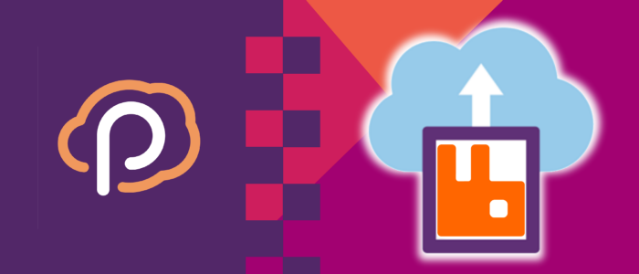
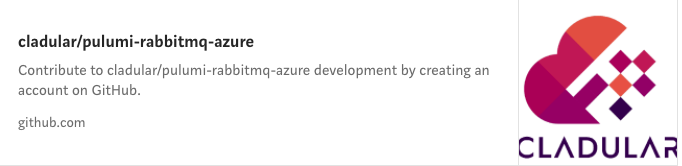

Itay Podhajcer is Chief Architect at Velocity Career Labs and a highly experienced software development and technology professional, consultant, architect & project manager. He shared his article on building an Azure serverless cluster for deploying RabbitMQ with C#. The original article was published [here](https://medium.com/microsoftazure/deploying-a-geo-redundant-serverless-rabbitmq-cluster-on-azure-using-pulumi-for-net-71e6b417378d).

<!--more-->

 

Pulumi, an open source cloud development platform that supports multiple languages and platforms, allows programming and managing cloud environments using a consistent model and the power of full programming languages.

One of those supported languages is C#, which we will be using to deploy a geo-redundant serverless cluster of the well-known messaging solution RabbitMQ. To run the cluster, we will be using three regions, in which we will be deploying:

- Two peered virtual networks, one internal for the containers, and one external for connecting to the other regions. Two networks are required because (at least at the writing of this article) Azure Container Instances only support one peered network, so to overcome that, we will be peering the network with the containers with an additional network in the region, which in turn, connects with the external networks from the other regions.
- A RabbitMQ node using Azure Container Instances that will be deployed in the internal virtual network.
- An Azure Firewall, which will be deployed in the external virtual network, acting as a network virtual appliance (NVA) with rules for forwarding traffic between the internal node and the other regions.
- Route tables with routes that will enable the inter-network transfer of data.
- A storage account with file shares for maintaining the node’s state.

Additionally, as we will be using RabbitMQ’s DNS based cluster peer discovery mechanism, we will also be deploying at the global level:

- DNS zone for the node’s A records and the discovery record required by RabbitMQ.
- A reverse DNS zone for the PTR records of the nodes required by RabbitMQ.



## Prerequisites

As we will be using Pulumi for .NET to deploy to Azure, we will need the following installed on our workstation:

- Azure CLI: installation guide is available [here](https://docs.microsoft.com/en-us/cli/azure/install-azure-cli?view=azure-cli-latest).
- .N ET Core SDK: download is available [here](https://dotnet.microsoft.com/download).
- Pulumi: installation guide is available [here](https://www.pulumi.com/docs/get-started/install/).

## Example Repository

The complete example of deploying the RabbitMQ cluster can be downloaded or cloned for the following GitHub repository:

 

When running `pulumi up` you will be asked to create a stack (you can use whatever you here like `Example`) and set a passphrase (you can leave it empty and press enter as there are no stored secrets in this stack).

## Setup the Project

After all the required tools are installed, we can start by creating the empty Pulumi project running `pulumi new azure-csharp` inside an empty folder. Set a name for the project (like `Example`), a description (like `RabbitMQ Serverless Cluster`), a stack name (like `Example`), a passphrase (you can use an empty one and just press enter as we won’t be storing secrets in the stack) and an Azure location (just use the default).

Now that we have an initial project, we will also add the `Pulumi.Random` package to the project by running the command `dotnet add package Pulumi.Random`, as we will be using it to generate the cluster sec, And rename the `MyStack` class and file to `ExampleStack` (it also needs to be changed inside `Program.cs` which holds the code that triggers the deployment of the stack).

Lastly, we call `dotnet restore` to also download the `Pulumi.Azure` package that was included in the project when it was created.

## Writing the Stack

We will start by defining a few constants, the constructor, an empty method called `Stack()`, which will be called by the constructor to start creating the resources and a property named `Cookie`, which will hold the cluster’s secret, decorated with the `Output` attribute to let Pulumi know that the value needs to be printed out once the deployment is complete:



Now that we have our initial class, we can start writing methods for the resources we will be creating:

- Resource groups:
 

 
- Private DNS zone:


 

- Private reverse DNS zone:


 

- Random string for the RabbitMQ cluster secret:


 

- DNS zone links:


 

- RabbitMQ node container:



 
Note that we are overriding RabbitMQ docker image’s default command with `{ “/bin/bash”, “-c”, $”(sleep {ContainerStartupDelay} && docker-entrypoint.sh rabbitmq-server) & wait” }` to delay the startup of the container, but still keep it responsive. More on this later.
  

- Container mounted volumes:


 

- Storage accounts:


 

- File shares:


 

- Container ports:


 

- Virtual networks:


 

- Internal virtual network subnets:


 

Note that we are creating it with the Microsoft.Storage service endpoint to allow access to storage accounts and the `Microsoft.ContainerInstance/containerGroups` delegation, which is required for deploying containers into virtual networks.
  

- Network profiles, also required for deploying containers into virtual networks:


 

- External virtual network subnets:


 

- Internal and external virtual networks peering:


 

- External virtual network firewalls:


 

- Internal and external virtual networks routing:


 

- RabbitMQ nodes DNS records:


 

- RabbitMQ nodes reverse DNS records:


 

- Reversing the IP address as required by a reverse PTR record:


 

- Firewall IP forwarding rules:


 

- RabbitMQ’s discovery DNS record:


 

- Global peering of the external virtual networks:


 

- Global routes for the virtual networks:


 

- Firewall virtual appliance routes:


 

- Internet outbound routes:


 

Now that we can create all the necessary resources, it is time to put it all together inside the empty `Stack()` method we created earlier:
  


 

Note that we are using two loops to create the required resources. The first one creates most of the resources (storage, firewall, networks, container, etc.) and the second one creates the DNS A records of the nodes. The second loop combined with the custom container startup command helps us ensure that the nodes will start without failing only when the entire infrastructure is ready.

This workaround is required because (at the writing of the article) Azure Container Instances do not allow manual allocation of private IP address, and because RabibtMQ’s discovery record requires those IPs which are available only after the containers are created, we end up in a chicken-and-the-egg situation. To overcome that, we need to allow the containers to start, but delay the execution of RabbitMQ’s startup script without blocking the container and use to our advantage the fact that RabbitMQ doesn’t start when it can‘t resolve its own hostname (that is why we create those DNS records last).

## Deploying the Stack

Once the script is complete, we can call `pulumi up --yes` to deploy it, where the `--yes` argument just skips the question whether to deploy or not once Pulumi has built the deployment app and discovered all the resources.

Remember that you need to call Azure CLI to login to your subscription, so that Pulumi can execute the deployment. You can call `az login` to login to the Azure portal in an interactive manner.
Checking the Cluster

## Checking the Cluster

To check that all nodes have managed to join the cluster we will connect to one of the nodes using `az container exec` to stream a shell from within that container (see more on the exec command [here](https://docs.microsoft.com/en-us/cli/azure/container?view=azure-cli-latest#az-container-exec)).

Once the shell is connected, you can call `rabbitmqctl cluster_status` and you should see all three nodes in the printed information.

## Conclusion

The example in this article can be used as a base for a complete solution, which includes additional containers and managed services provided by Azure. Also, the code for deploying the example, in a real-world scenario, would be better split off to smaller files, as looking at all the code in one large file is overwhelming, therefore harder to maintain.
