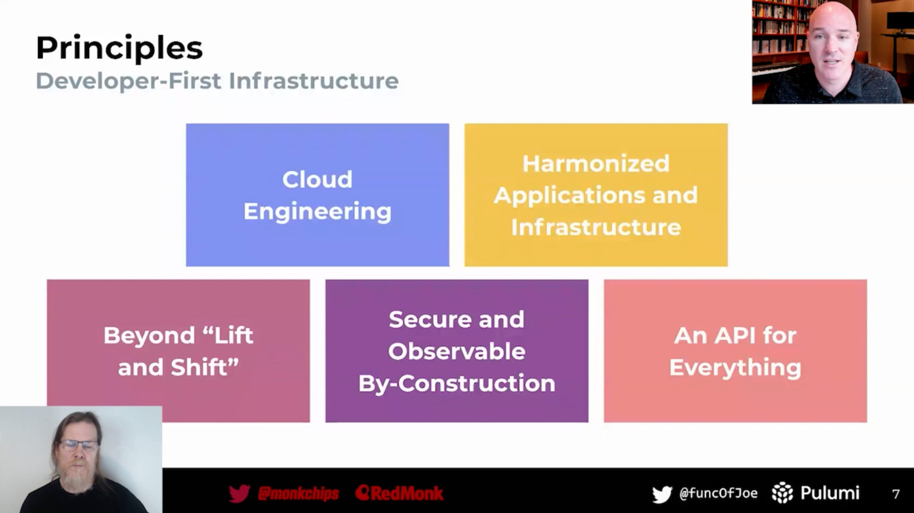
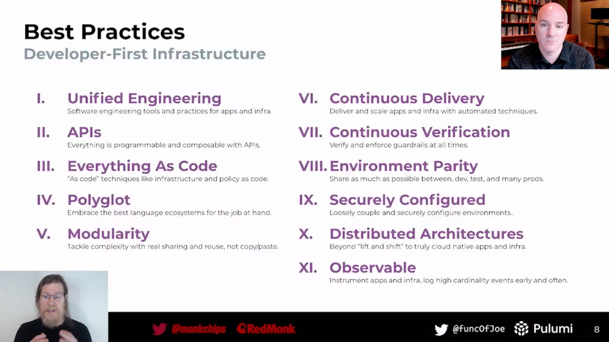

What do assembly languages and the cloud have in common? Are abstractions the future of cloud computing? What does "infrastructure" really mean? And why do these questions matter to the platform engineers, infrastructure engineers, and developers who are building modern cloud applications today?

Joe Duffy (Founder & CEO, Pulumi) and James Governor (Co-founder, RedMonk) recently answered these questions and more in a conversation about developer-first infrastructure. Developer-first infrastructure means empowering developers to build and deploy modern cloud applications and infrastructure through the use of software engineering practices that tame modern cloud complexity.

If you're interested in learning how the worlds of software engineering and cloud infrastructure are intersecting in addition to principles and best practices for building in the cloud, then watch the 28-minute video below.



## Highlights of Pulumi and RedMonk's discussion on developer-first infrastructure

In the first half of the discussion, Joe and James discuss the complexities of building on the modern cloud as application architectures have evolved from simple three-tier apps to the modern, distributed applications of today. Joe traces the evolution of modern computing in which complexity has been tamed over time through abstractions: from low-level assembly languages to higher-level languages and runtimes that make software more accessible, and finally to operating systems. They then discuss how an analogous transformation has yet to occur in the cloud on a mainstream basis.

>"The level of abstraction [that most people are doing] with cloud infrastructure reminds me of assembly languages. You look at writing these YAML templates that over-specify every detail of the underlying architecture. I think [the industry] can do better. I think we can be inspired by what we've done in programming languages." --- Joe Duffy

In the second half of the discussion, the two discuss what developer-first infrastructure is, and how companies can use this philosophy to tame modern cloud complexity and accelerate development velocity. Companies that execute this well have a "developer-first multiple" --- that is, the most valuable companies in the world today are the ones who've thought hard about the developer experience for their own employees or the communities that interact with them.

Joe describes five principles of developer-first infrastructure that make developers' lives easier when building on the cloud.

1. [Cloud Engineering]()
1. Harmonized Applications and Infrastructure
1. Beyond "Lift and Shift"
1. Secure and Observable By-Construction
1. An API for Everything

Finally, Joe dives into the best practices of developer-first infrastructure:

1. **Unified Engineering**: Software engineering tools and practices for applications and infrastructure.
1. **APIs**: Making everything programmable and composable with APIs.
1. **Everything as Code**: Use "as code" techniques like infrastructure as code and policy as code.
1. **Polyglot**: Embrace the best language ecosystems for the job at hand.
1. **Modularity**: Tackle complexity with real sharing and reuse, not copy & paste.
1. **Continuous Delivery**: Deliver and scale applications and infrastructure with automated techniques.
1. **Continuous Verification**: Verify and enforce guardrails at all times.
1. **Environment Parity**: Share as much as possible between dev, test, and prod environments.
1. **Securely Configured**: Loosely couple and securely configure environments.
1. **Distributed Architectures**: Go beyond "lift and shift" to building truly cloud-native applications and infrastructure.
1. **Observable**: Instrument applications and infrastructure to log high cardinality events, early and often.

## Next steps

Developer-first infrastructure means empowering developers to build and deploy modern cloud applications and infrastructure through the use of software engineering practices that tame modern cloud complexity. If you feel inspired after viewing the Pulumi/RedMonk discussion video, then consider applying developer-first principles and practices for your next greenfield project or application using an infrastructure as code tool like [Pulumi](). You can also [watch Joe Duffy's presentation](https://www.youtube.com/watch?v=SQRM0r5U1js) on developer-first infrastructure from the Cloud Engineering Summit to learn more about developer-first.
