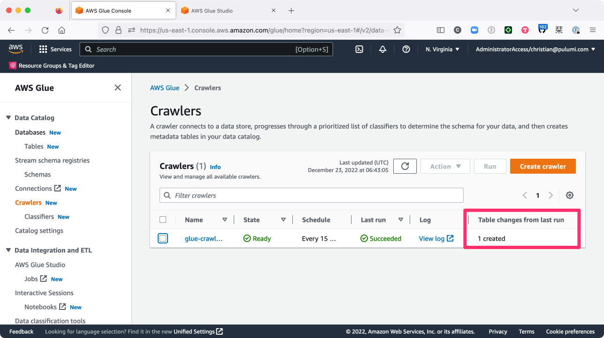
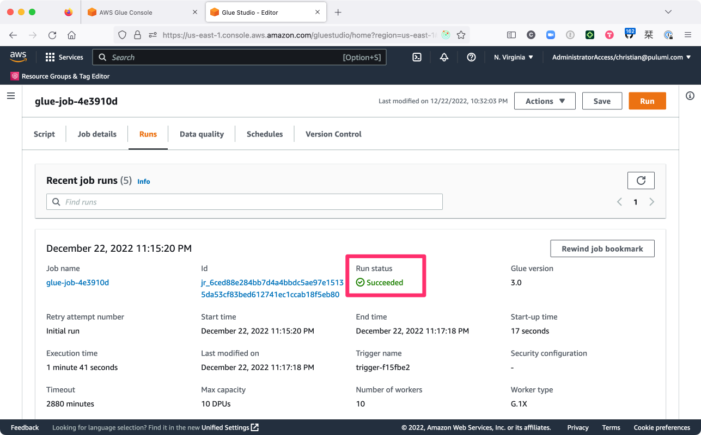
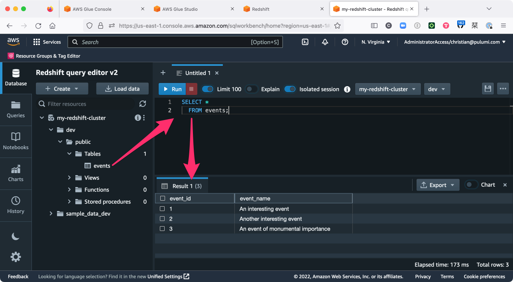
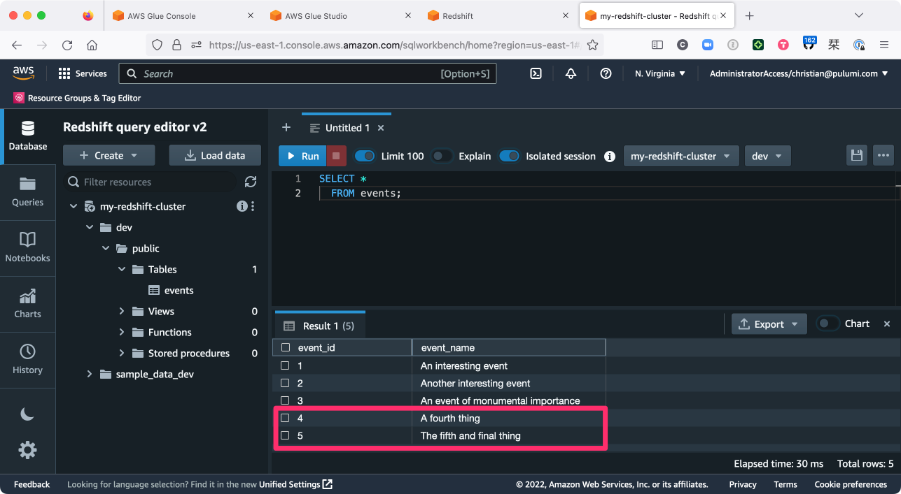

In our last episode, [Deploying a Data Warehouse with Pulumi and Amazon Redshift](/blog/building-a-data-warehouse-on-aws-with-redshift-and-pulumi/), we covered using Pulumi to load unstructured data from Amazon S3 into an Amazon Redshift cluster. That went well, but you may recall that at the end of that post, we were left with a few unanswered questions:

* How do we avoid importing and processing the same data twice?
* How can we transform the data during the ingestion process?
* What are our options for loading data automatically --- for example, on a regular schedule?

These are the kinds of questions you'll almost always have when setting up a data-processing (or [ETL](https://en.wikipedia.org/wiki/Extract,_transform,_load)) pipeline --- and every platform tends to answer them a little differently.

When your platform of choice is Amazon Redshift, those questions will often be answered by pointing you to another Amazon service (actually a collection of services) called [AWS Glue](https://aws.amazon.com/glue/). With Glue, you can define processes that monitor external data sources like S3, keep track of the data that's already been processed (to avoid corruption from duplicate records, as we saw in the previous post), and write code in general-purpose programming languages like Python to process and transform the data on its way into Redshift.

There's a [lot more](https://aws.amazon.com/glue/features/) you can do with AWS Glue than what we need for this project, but as you'll see, it's also an excellent fit. So without further ado, let's finish things off by using AWS Glue (and Pulumi of course) to set up a full ETL pipeline that loads all of our S3 data into Redshift automatically.

But first ...

## Picking up where we left off

If you haven't already, I'd encourage you to [read through the previous post](/blog/building-a-data-warehouse-on-aws-with-redshift-and-pulumi/) to get up to speed on what we're building and why. In that post, the situation was such that some hypothetical application was generating "events" --- little bits of JSON, essentially --- and writing them periodically to a text file in S3, and as data scientists, we needed some way to gather up all of these events and load them into a Redshift cluster in order to analyze them later.

When we left off, we'd gotten Redshift up and running, and we were able to pull the data from S3 into Redshift directly (by running a manual query in the Redshift console), but that's as far as we got --- no automation, no protection from duplicate records, just the absolute basics.

So to pick up from there, let's start by bootstrapping a new project with the code from the previous post. As always, make sure you've [installed Pulumi](/docs/install/) and [configured your AWS credentials](/registry/packages/aws/installation-configuration/) in the usual way first, then run the following commands to get going:



{}

```bash
$ mkdir my-data-warehouse-part2 && cd my-data-warehouse-part2
$ pulumi new aws-typescript
```

{}

{}

```bash
$ mkdir my-data-warehouse-part2 && cd my-data-warehouse-part2
$ pulumi new aws-python
```

{}

Step through the prompts, choosing the AWS region that works best for you. When the new-project wizard completes, replace the contents of  with the following code to fast-forward to where we left off:



{}

```typescript
import * as pulumi from "@pulumi/pulumi";
import * as aws from "@pulumi/aws";

// Import the stack's configuration settings.
const config = new pulumi.Config();
const clusterIdentifier = config.require("clusterIdentifier");
const clusterNodeType = config.require("clusterNodeType");
const clusterDBName = config.require("clusterDBName");
const clusterDBUsername = config.require("clusterDBUsername");
const clusterDBPassword = config.requireSecret("clusterDBPassword");

// Import the provider's configuration settings.
const providerConfig = new pulumi.Config("aws");
const awsRegion = providerConfig.require("region");

// Create an S3 bucket to store some raw data.
const eventsBucket = new aws.s3.Bucket("events", {
    forceDestroy: true,
});

// Create a VPC.
const vpc = new aws.ec2.Vpc("vpc", {
    cidrBlock: "10.0.0.0/16",
    enableDnsHostnames: true,
});

// Create a private subnet within the VPC.
const subnet = new aws.ec2.Subnet("subnet", {
    vpcId: vpc.id,
    cidrBlock: "10.0.1.0/24",
});

// Declare a Redshift subnet group with the subnet ID.
const subnetGroup = new aws.redshift.SubnetGroup("subnet-group", {
    subnetIds: [
        subnet.id,
    ],
});

// Create an IAM role granting Redshift read-only access to S3.
const redshiftRole = new aws.iam.Role("redshift-role", {
    assumeRolePolicy: {
        Version: "2012-10-17",
        Statement: [
            {
                Action: "sts:AssumeRole",
                Effect: "Allow",
                Principal: {
                    Service: "redshift.amazonaws.com",
                },
            },
        ],
    },
    managedPolicyArns: [
        aws.iam.ManagedPolicy.AmazonS3ReadOnlyAccess,
    ],
});

// Create a VPC endpoint so the cluster can read from S3 over the private network.
const vpcEndpoint = new aws.ec2.VpcEndpoint("s3-vpc-endpoint", {
    vpcId: vpc.id,
    serviceName: `com.amazonaws.${awsRegion}.s3`,
    routeTableIds: [
        vpc.mainRouteTableId,
    ],
});

// Create a single-node Redshift cluster in the VPC.
const cluster = new aws.redshift.Cluster("cluster", {
    clusterIdentifier: clusterIdentifier,
    databaseName: clusterDBName,
    masterUsername: clusterDBUsername,
    masterPassword: clusterDBPassword,
    nodeType: clusterNodeType,
    clusterSubnetGroupName: subnetGroup.name,
    clusterType: "single-node",
    publiclyAccessible: false,
    skipFinalSnapshot: true,
    vpcSecurityGroupIds: [
        vpc.defaultSecurityGroupId,
    ],
    iamRoles: [
        redshiftRole.arn,
    ],
});
```

{}

{}

```python
import json
import pulumi
from pulumi_aws import ec2, iam, redshift, s3, glue

# Import the stack's configuration settings.
config = pulumi.Config()
cluster_identifier = config.require("clusterIdentifier")
cluster_node_type = config.require("clusterNodeType")
cluster_db_name = config.require("clusterDBName")
cluster_db_username = config.require("clusterDBUsername")
cluster_db_password = config.require_secret("clusterDBPassword")

# Import the provider's configuration settings.
provider_config = pulumi.Config("aws")
aws_region = provider_config.require("region")

# Create an S3 bucket to store some raw data.
events_bucket = s3.Bucket("events", s3.BucketArgs(
    force_destroy=True,
))

# Create a VPC.
vpc = ec2.Vpc("vpc", ec2.VpcArgs(
    cidr_block="10.0.0.0/16",
    enable_dns_hostnames=True,
))

# Create a private subnet within the VPC.
subnet = ec2.Subnet("subnet", ec2.SubnetArgs(
    vpc_id=vpc.id,
    cidr_block="10.0.1.0/24",
))

# Declare a Redshift subnet group with the subnet ID.
subnet_group = redshift.SubnetGroup("subnet-group", redshift.SubnetGroupArgs(
    subnet_ids=[
        subnet.id,
    ],
))

# Create an IAM role granting Redshift read-only access to S3.
redshift_role = iam.Role("redshift-role", iam.RoleArgs(
    assume_role_policy=json.dumps({
        "Version": "2012-10-17",
        "Statement": [
            {
                "Action": "sts:AssumeRole",
                "Effect": "Allow",
                "Principal": {
                    "Service": "redshift.amazonaws.com",
                },
            },
        ],
    }),
    managed_policy_arns=[
        iam.ManagedPolicy.AMAZON_S3_READ_ONLY_ACCESS,
    ],
))

# Create a VPC endpoint so the cluster can read from S3 over the private network.
vpc_endpoint = ec2.VpcEndpoint("s3-vpc-endpoint", ec2.VpcEndpointArgs(
    vpc_id=vpc.id,
    service_name=f"com.amazonaws.{aws_region}.s3",
    route_table_ids=[
        vpc.main_route_table_id,
    ],
))

# Create a single-node Redshift cluster in the VPC.
cluster = redshift.Cluster("cluster", redshift.ClusterArgs(
    cluster_identifier=cluster_identifier,
    database_name=cluster_db_name,
    master_username=cluster_db_username,
    master_password=cluster_db_password,
    node_type=cluster_node_type,
    cluster_subnet_group_name=subnet_group.name,
    cluster_type="single-node",
    publicly_accessible=False,
    skip_final_snapshot=True,
    vpc_security_group_ids=[
        vpc.default_security_group_id,
    ],
    iam_roles=[
        redshift_role.arn,
    ],
))
```

{}

At the top of the program, you'll see that the code assumes you've set several [Pulumi configuration](/docs/concepts/config/) values --- `clusterIdentifier`, `clusterNodeType`, and others --- so take a moment to do that now with the Pulumi CLI as well:

```bash
$ pulumi config set clusterIdentifier my-redshift-cluster
$ pulumi config set clusterNodeType ra3.xlplus
$ pulumi config set clusterDBName dev
$ pulumi config set clusterDBUsername admin
$ pulumi config set clusterDBPassword StrongPass1 --secret
```

That should be all you need to pick up where we left off. Deploy with an initial `pulumi up` to bring this project back to life:

```
$ pulumi up
...

Updating (dev)

     Type                         Name                         Status
 +   pulumi:pulumi:Stack          my-data-warehouse-part2-dev  created (5s)
 +   ├─ aws:ec2:Vpc               vpc                          created (13s)
 +   ├─ aws:iam:Role              redshift-role                created (2s)
 +   ├─ aws:s3:Bucket             events                       created (3s)
 +   ├─ aws:ec2:VpcEndpoint       s3-vpc-endpoint              created (6s)
 +   ├─ aws:ec2:Subnet            subnet                       created (1s)
 +   ├─ aws:redshift:SubnetGroup  subnet-group                 created (1s)
 +   └─ aws:redshift:Cluster      cluster                      created (105s)

Resources:
    + 8 created

Duration: 2m7s
```

When the deployment completes, you should see that eight new resources were created, including a VPC with a private subnet, a Redshift cluster deployed into the subnet, an S3 bucket that we'll use to hold some raw data, and a VPC endpoint allowing direct access to the bucket over the private network.

Now it's time to start adding the Glue components to --- well, glue it all together.

## Extending the program

At a high-level, we'll need three components to complete our ETL pipeline-to-be:

1. A Glue [_crawler_](https://docs.aws.amazon.com/glue/latest/dg/add-crawler.html). The crawler is responsible for fetching data from some external source (for us, an S3 bucket) and importing it into a Glue [_catalog_](https://docs.aws.amazon.com/glue/latest/dg/catalog-and-crawler.html). A catalog is a kind of staging database that tracks your data through the ingestion process. Our particular crawler will poll our S3 bucket for new data and import that data into a catalog [_table_](https://docs.aws.amazon.com/glue/latest/dg/tables-described.html).

2. A Glue [_job_](https://docs.aws.amazon.com/glue/latest/dg/author-job-glue.html). The job is responsible for running an ETL script (e.g., on a schedule) to process the data imported by the crawler into the catalog.

3. A Glue [_script_](https://docs.aws.amazon.com/glue/latest/dg/add-job-python.html). The script is where the ETL magic happens. Ours will be written in Python and be responsible for extracting data from the catalog, applying some slight transformations to it (mostly just for demonstration purposes), and loading the transformed data into Redshift.

We'll translate these high-level components into concrete Pulumi resources in the steps ahead.

### Step 1: Add a Glue crawler

The first thing we'll need is a unique name for our Glue catalog database. Rather than hard-code this name into our program code (which would be problematic for projects consisting of multiple stacks), let's instead use Pulumi to set this catalog name stack-specifically:

```bash
$ pulumi config set glueDBName my-glue-db
```

Next, back in your editor, add the following code to read this new setting and declare the new AWS resources you'll need to enable the crawler. The comments inline explain each one: there's a [`glue.CatalogDatabase`](/registry/packages/aws/api-docs/glue/catalogdatabase/) to house imported data, a [`glue.Crawler`](/registry/packages/aws/api-docs/glue/crawler/) to poll our bucket every 15 minutes for new data, and an [`iam.Role`](/registry/packages/aws/api-docs/iam/role/) granting the Glue service the appropriate set of privileges to read from S3 and write temporary data as needed:



{}

```typescript
// ...
const glueDBName = config.require("glueDBName");

// ...

// Define an AWS cron expression of "every 15 minutes".
// https://docs.aws.amazon.com/lambda/latest/dg/services-cloudwatchevents-expressions.html
const every15minutes= "cron(0/15 * * * ? *)";

// Create a Glue catalog database.
const glueCatalogDB = new aws.glue.CatalogDatabase("glue-catalog-db", {
    name: glueDBName,
});

// Define an IAM role granting AWS Glue access to S3 and other Glue-required services.
const glueRole = new aws.iam.Role("glue-role", {
    assumeRolePolicy: JSON.stringify({
        Version: "2012-10-17",
        Statement: [
            {
                Action: "sts:AssumeRole",
                Effect: "Allow",
                Principal: {
                    Service: "glue.amazonaws.com",
                },
            },
        ],
    }),
    managedPolicyArns: [
        aws.iam.ManagedPolicy.AmazonS3FullAccess,
        "arn:aws:iam::aws:policy/service-role/AWSGlueServiceRole",
    ],
});

// Create a Glue crawler to process the contents of the data bucket on a schedule.
// https://docs.aws.amazon.com/glue/latest/dg/monitor-data-warehouse-schedule.html
const glueCrawler = new aws.glue.Crawler("glue-crawler", {
    databaseName: glueCatalogDB.name,
    role: glueRole.arn,
    schedule: every15minutes,
    s3Targets: [
        {
            path: pulumi.interpolate`s3://${eventsBucket.bucket}`,
        }
    ],
});
```

{}

{}

```python
# ...
glue_db_name = config.require("glueDBName")

# ...

# Define an AWS cron expression of "every 15 minutes".
# https://docs.aws.amazon.com/lambda/latest/dg/services-cloudwatchevents-expressions.html
every_15_minutes = "cron(0/15 * * * ? *)"

# Create a Glue catalog database.
glue_catalog_db = glue.CatalogDatabase("glue-catalog-db", glue.CatalogDatabaseArgs(
    name=glue_db_name,
))

# Define an IAM role granting AWS Glue access to S3 and other Glue-required services.
glue_role = iam.Role("glue-role", iam.RoleArgs(
    assume_role_policy=json.dumps({
        "Version": "2012-10-17",
        "Statement": [
            {
                "Action": "sts:AssumeRole",
                "Effect": "Allow",
                "Principal": {
                    "Service": "glue.amazonaws.com",
                },
            },
        ],
    }),
    managed_policy_arns=[
        iam.ManagedPolicy.AMAZON_S3_FULL_ACCESS,
        "arn:aws:iam::aws:policy/service-role/AWSGlueServiceRole",
    ],
))

# Create a Glue crawler to process the contents of the data bucket on a schedule.
# https://docs.aws.amazon.com/glue/latest/dg/monitor-data-warehouse-schedule.html
glue_crawler = glue.Crawler("glue-crawler", glue.CrawlerArgs(
    database_name=glue_catalog_db.name,
    role=glue_role.arn,
    schedule=every_15_minutes,
    s3_targets=[
        glue.CrawlerS3TargetArgs(
            path=events_bucket.bucket.apply(lambda name: f"s3://{name}")
        ),
    ],
))
```

{}

Run a quick `pulumi up` to deploy these new additions:

```bash
$ pulumi up
...

Updating (dev)

     Type                         Name                         Status
     pulumi:pulumi:Stack          my-data-warehouse-part2-dev
 +   ├─ aws:iam:Role              glue-role                    created (2s)
 +   ├─ aws:glue:CatalogDatabase  glue-catalog-db              created (1s)
 +   └─ aws:glue:Crawler          glue-crawler                 created (10s)

Resources:
    + 3 created
    8 unchanged

Duration: 15s
```

Now let's add the Glue job.

### Step 2: Add a Glue job

The job we need is a fairly simple one, but it still requires a handful of AWS resources.

First, we'll need a [`glue.Connection`](/registry/packages/aws/api-docs/glue/connection/) to allow Glue to connect to the Redshift database to load the data processed by our TBD Python script. We'll also need the script itself, which Glue expects to be able to find in an S3 bucket, so we'll need to define a [`Bucket`](/registry/packages/aws/api-docs/s3/bucket/) and [`BucketObject`](/registry/packages/aws/api-docs/s3/bucketobject/) for that as well. We'll need a [`glue.Job`](/registry/packages/aws/api-docs/glue/job/) resource to define the compute settings and other parameters with which to run our Python script (passing it various arguments such as which Glue catalog to read from and Redshift database to write to), and then finally, we'll need a [`glue.Trigger`](/registry/packages/aws/api-docs/glue/trigger/) to kick off the process every 15 minutes. It's only a few resources, but there's a fair bit of configuration baked into some of them, so I'd encourage you to spend a little time [with the AWS Glue docs](https://docs.aws.amazon.com/glue/latest/dg/what-is-glue.html) to gain a better understanding of what each option does and what else can be done with them.

Believe it or not, that's all we'll need for the Pulumi program itself. So to wrap up, add the following code to , taking note of the last line, which exports the name of the S3 bucket to give us something to upload to:



{}

```typescript
// ...

// Create a Glue connection to the Redshift cluster.
const glueRedshiftConnection = new aws.glue.Connection("glue-redshift-connection", {
    connectionType: "JDBC",
    connectionProperties: {
        JDBC_CONNECTION_URL: pulumi.interpolate`jdbc:redshift://${cluster.endpoint}/${clusterDBName}`,
        USERNAME: clusterDBUsername,
        PASSWORD: clusterDBPassword,
    },
    physicalConnectionRequirements: {
        securityGroupIdLists: cluster.vpcSecurityGroupIds,
        availabilityZone: subnet.availabilityZone,
        subnetId: subnet.id,
    },
});

// Create an S3 bucket for Glue scripts and temporary storage.
const glueJobBucket = new aws.s3.Bucket("glue-job-bucket", {
    forceDestroy: true,
});

// Upload a Glue job script.
const glueJobScript = new aws.s3.BucketObject("glue-job.py", {
    bucket: glueJobBucket.id,
    source: new pulumi.asset.FileAsset("./glue-job.py"),
});

// Create a Glue job that runs our Python ETL script.
const glueJob = new aws.glue.Job("glue-job", {
    roleArn: glueRole.arn,
    glueVersion: "3.0",
    numberOfWorkers: 10,
    workerType: "G.1X",
    defaultArguments: {
        // Enabling job bookmarks helps you avoid loading duplicate data.
        // https://docs.aws.amazon.com/glue/latest/dg/monitor-continuations.html
        "--job-bookmark-option": "job-bookmark-enable",

        "--ConnectionName": glueRedshiftConnection.name,
        "--GlueDBName": glueDBName,
        "--GlueDBTableName": eventsBucket.bucket.apply(name => name.replace('-', '_')),
        "--RedshiftDBName": clusterDBName,
        "--RedshiftDBTableName": "events",
        "--RedshiftRoleARN": redshiftRole.arn,
        "--TempDir": pulumi.interpolate`s3://${glueJobBucket.bucket}/glue-job-temp`,
    },
    connections: [
        glueRedshiftConnection.name,
    ],
    command: {
        scriptLocation: pulumi.interpolate`s3://${glueJobBucket.bucket}/glue-job.py`,
        pythonVersion: "3",
    },
});

// Create a Glue trigger to run the job every 15 minutes.
const glueJobTrigger = new aws.glue.Trigger("trigger", {
    schedule: every15minutes,
    type: "SCHEDULED",
    actions: [{
        jobName: glueJob.name,
    }],
});

// Export the name of the data bucket.
export const dataBucketName = eventsBucket.bucket;
```

{}

{}

```python
# ...

# Create a Glue connection to the Redshift cluster.
glue_redshift_connection = glue.Connection("glue-redshift-connection", glue.ConnectionArgs(
    connection_type="JDBC",
    connection_properties={
        "JDBC_CONNECTION_URL": cluster.endpoint.apply(lambda endpoint: f"jdbc:redshift://{endpoint}/{cluster_db_name}"),
        "USERNAME": cluster_db_username,
        "PASSWORD": cluster_db_password,
    },
    physical_connection_requirements=glue.ConnectionPhysicalConnectionRequirementsArgs(
        security_group_id_lists=cluster.vpc_security_group_ids,
        availability_zone=subnet.availability_zone,
        subnet_id=subnet.id,
    ),
))

# Create an S3 bucket for Glue scripts and temporary storage.
glue_job_bucket = s3.Bucket("glue-job-bucket", s3.BucketArgs(
    force_destroy=True,
))

# Upload a Glue job script.
glue_job_script = s3.BucketObject("glue-job.py", s3.BucketObjectArgs(
    bucket=glue_job_bucket.id,
    source=pulumi.asset.FileAsset("./glue-job.py"),
))

# Create a Glue job that runs our Python ETL script.
glue_job = glue.Job("glue-job", glue.JobArgs(
    role_arn=glue_role.arn,
    glue_version="3.0",
    connections=[
        glue_redshift_connection.name,
    ],
    number_of_workers=10,
    worker_type="G.1X",
    default_arguments={
        # Enabling job bookmarks helps you avoid loading duplicate data.
        # https://docs.aws.amazon.com/glue/latest/dg/monitor-continuations.html
        "--job-bookmark-option": "job-bookmark-enable",

        "--ConnectionName": glue_redshift_connection.name,
        "--GlueDBName": glue_db_name,
        "--GlueDBTableName": events_bucket.bucket.apply(lambda name: name.replace('-', '_')),
        "--RedshiftDBName": cluster_db_name,
        "--RedshiftDBTableName": "events",
        "--RedshiftRoleARN": redshift_role.arn,
        "--TempDir": glue_job_bucket.bucket.apply(lambda name: f"s3://{name}/glue-job-temp"),
    },
    command=glue.JobCommandArgs(
        script_location=glue_job_bucket.bucket.apply(lambda name: f"s3://{name}/glue-job.py"),
        python_version="3",
    ),
))

# Create a Glue trigger to run the job every 15 minutes.
glue_job_trigger = glue.Trigger("trigger", glue.TriggerArgs(
    schedule=every_15_minutes,
    type="SCHEDULED",
    actions=[
        glue.TriggerActionArgs(
            job_name=glue_job.name,
        ),
    ],
))

# Export the name of the data bucket.
pulumi.export("dataBucketName", events_bucket.bucket)
```

{}

We're not quite ready to deploy yet though --- we need a script!

### Step 3: Add a Glue script

To finish things off, create a new file called `glue-job.py` (alongside ) and paste in the following code. This is the file that'll be  run by the `glue.Job` we just declared. There's a lot going on in this script, but the gist is that when it runs, it'll _extract_ all unprocessed data from our Glue catalog, _transform_ that data using a simple mapping to tweak some field names (again, just to demonstrate how that's done), and _load_ the resulting data into Redshift. A [Glue job bookmark](https://docs.aws.amazon.com/glue/latest/dg/monitor-continuations.html) guarantees that we don't process the same data more than once:

```python
import sys
from awsglue.utils import getResolvedOptions
from awsglue.transforms import ApplyMapping
from awsglue.context import GlueContext
from awsglue.job import Job
from pyspark.context import SparkContext

# Collect the arguments passed in by the glue.Job run.
args = getResolvedOptions(
    sys.argv,
    [
        "JOB_NAME",
        "TempDir",
        "ConnectionName",
        "GlueDBName",
        "GlueDBTableName",
        "RedshiftRoleARN",
        "RedshiftDBName",
        "RedshiftDBTableName",
    ],
)

glueContext = GlueContext(SparkContext.getOrCreate())

job = Job(glueContext)
job.init(args["JOB_NAME"], args)

# Extract all unprocessed data from the Glue catalog.
source0 = glueContext.create_dynamic_frame.from_catalog(
    database=args["GlueDBName"],
    table_name=args["GlueDBTableName"],
    additional_options={
        "jobBookmarkKeys": ["id"],
        "jobBookmarkKeysSortOrder": "asc",
    },
    transformation_ctx="source0",
)

# Transform the data (mostly just to show how to do so).
transformed0 = ApplyMapping.apply(
    frame=source0,
    mappings=[
        ("id", "int", "event_id", "int"),
        ("name", "string", "event_name", "string"),
    ],
)

# Load the data into the Redshift database.
glueContext.write_dynamic_frame.from_jdbc_conf(
    frame=transformed0,
    catalog_connection=args["ConnectionName"],
    connection_options={
        "database": args["RedshiftDBName"],
        "dbtable": args["RedshiftDBTableName"],
        "aws_iam_role": args["RedshiftRoleARN"],
    },
    redshift_tmp_dir=args["TempDir"],
)

# Call commit() to reset the job bookmark for the next run.
job.commit()
```

And that's it --- you're ready to deploy.

## Deploy!

With everything now in place --- VPC, private network, Redshift cluster, and the Glue componentry to handle all of the automation (crawler, job, Python ETL script), you're ready to deploy. Do that now with a final `pulumi up`:

```bash
$ pulumi up
...

Updating (dev)

     Type                      Name                         Status
     pulumi:pulumi:Stack       my-data-warehouse-part2-dev
 +   ├─ aws:s3:Bucket          glue-job-bucket              created (2s)
 +   ├─ aws:glue:Connection    glue-redshift-connection     created (1s)
 +   ├─ aws:glue:Job           glue-job                     created (0.95s)
 +   ├─ aws:s3:BucketObject    glue-job.py                  created (0.63s)
 +   └─ aws:glue:Trigger       trigger                      created (0.89s)


Outputs:
  + dataBucketName: "events-e713608"

Resources:
    + 5 created
    11 unchanged

Duration: 7s
```

You should see that the Glue components were created. Now let's load some sample data.

## Upload some data

As before, we'll simulate this part, since we don't have an actual application generating real data for us. Run the following command to write a few JSON records to a file called `events-1.txt`:

```bash
$ echo '{"id": 1, "name": "An interesting event"}
{"id": 2, "name": "Another interesting event"}
{"id": 3, "name": "An event of monumental importance"}' > events-1.txt
```

With the AWS CLI, upload the file into the S3 data bucket using the name we exported at the end of the last deployment:

```bash
$ aws s3 cp events-1.txt s3://$(pulumi stack output dataBucketName)
```

And now ... we wait.

Grab a coffee, take a walk, watch an episode of your favorite sitcom, whatever you like --- just be gone for a good half-hour or so to give the crawler and job enough time to run so that when you get back, you'll have something to look at. (Of course, if you'd rather not wait, you can always just log into the AWS console and kick off the crawler and job manually --- but it's definitely more fun to let the `glue.Crawler` a `glue.Trigger` do that for you.)

Soon enough, you should be able to verify, by navigating to Crawlers in the AWS Glue console, that the crawler indeed ran, creating a new table in the Glue catalog database:



As well, you should see (at AWS Glue Studio &gt; Jobs) that the job ran successfully as well:



A successful job run, of course, means that our data must've made it into Redshift, too --- and you can verify by running a query that in the Redshift query editor:



And with that, your work is done. You're now running a fully-automated, Pulumi-managed ETL pipeline with Amazon Redshift and AWS Glue.

If you like, you can create a second data file --- call it `events-2.txt`:

```bash
$ echo '{"id": 4, "name": "A fourth thing"}
{"id": 5, "name": "The fifth and final thing"}' > events-2.txt
```

upload that file to S3 as well:

```bash
$ aws s3 cp events-2.txt s3://$(pulumi stack output dataBucketName)
```

and sit back while the pipeline ingests this new data, blissfully ignoring the file that's already been processed (thanks to the Glue job bookmark) and dropping the new records right into Redshift as you'd expect:



## Tidying up

When you're finished experimenting, be sure to tear down the Redshift cluster and all other resources with a single `pulumi destroy`:

```bash
$ pulumi destroy
...

Destroying (dev)

     Type                         Name                         Status
 -   pulumi:pulumi:Stack          my-data-warehouse-part2-dev  deleted
 -   ├─ aws:glue:Trigger          trigger                      deleted (36s)
 -   ├─ aws:glue:Job              glue-job                     deleted (0.32s)
 -   ├─ aws:glue:Connection       glue-redshift-connection     deleted (0.44s)
 -   ├─ aws:redshift:Cluster      cluster                      deleted (229s)
 -   ├─ aws:redshift:SubnetGroup  subnet-group                 deleted (0.33s)
 -   ├─ aws:ec2:VpcEndpoint       s3-vpc-endpoint              deleted (6s)
 -   ├─ aws:s3:BucketObject       glue-job.py                  deleted (0.88s)
 -   ├─ aws:ec2:Subnet            subnet                       deleted (1s)
 -   ├─ aws:glue:Crawler          glue-crawler                 deleted (1s)
 -   ├─ aws:s3:Bucket             events                       deleted (1s)
 -   ├─ aws:iam:Role              glue-role                    deleted (1s)
 -   ├─ aws:s3:Bucket             glue-job-bucket              deleted (2s)
 -   ├─ aws:ec2:Vpc               vpc                          deleted (1s)
 -   ├─ aws:glue:CatalogDatabase  glue-catalog-db              deleted (1s)
 -   └─ aws:iam:Role              redshift-role                deleted (1s)


Outputs:
  - dataBucketName: "events-e713608"

Resources:
    - 16 deleted
```

## See it in action

If you'd like to see a demonstration of what you've read in this blog post, then this [Modern Infrastructure video](https://www.youtube.com/playlist?list=PLyy8Vx2ZoWloyj3V5gXzPraiKStO2GGZw) covers the whole process:



## What's next?

I hope you learned as much as I did with this post --- we covered a lot, and we've only scratched the surface of what's possible with these tools. Once again, I'd encourage you to spend some time digging into the [Redshift](https://docs.aws.amazon.com/redshift/index.html) and [Glue](https://docs.aws.amazon.com/glue/index.html) documentation to explore both in more depth, as there's lots more to learn than what we've covered so far.

Once you're up and running with Redshift, you might also want to check out the [Metabase package](/registry/packages/metabase/) in the Pulumi Registry. The Metabase package makes it easy to deploy [Metabase](https://www.metabase.com/) [alongside Redshift](https://www.metabase.com/data_sources/amazon-redshift) on AWS, allowing you to build powerful data-analysis and visualization experiences with your data.

You'll find the full source of this walkthrough (in [TypeScript](https://github.com/pulumi/examples/tree/master/aws-ts-redshift-glue-etl) and [Python](https://github.com/pulumi/examples/tree/master/aws-py-redshift-glue-etl)) on GitHub as well.

Happy data-warehousing!
