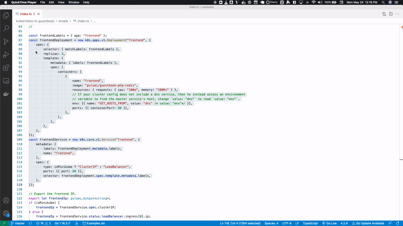

The central principle of cloud engineering is adopting software engineering practices. Refactoring is a technique for making changes to code that improve maintainability, enhance performance, scalability, and security without changing its external behavior. In devops, refactoring often occurs with modern applications; however, we can apply those same techniques to cloud infrastructure with [infrastructure as code]().

<!--more-->

Refactoring results in many advantages. First and foremost, the code is more readable and easier to understand for other team members –this aids in maintainability and well-organized code, providing a solid foundation for future releases. Overall, if done well, refactoring reduces complexity which makes future changes more efficient.

The topic of refactoring is a broad topic covering many different techniques. Many references, such as [Martin Fowler's Refactoring](https://martinfowler.com/books/refactoring.html), cover refactoring in depth. In this article, we examine standard practices used with infrastructure as code.

## Infrastructure is different

A major difference between refactoring application and infrastructure code is that resources, such as databases persist. Typically, if you change the name, type, or parent path of a resource, it is deleted and a new resource is created. Other infrastructure as code solutions tie a file or module to a resource's identity. An advantage of Pulumi is that moving a resource across file boundaries does not recreate the resource because a resource’s identity is based on its object ID, irrespective of its file location.

In cases where an object’s ID changes -- due to a rename, reparenting to a new component, or otherwise -- Pulumi provides [aliases](). An `Alias` accepts a list of identifiers that can include old `Alias` objects or old resource URNs. When a resource is annotated with an alias, Pulumi can connect the old to the new object state, and the resource can be updated in place.

A similar situation occurs with [`component resources`](), i.e., a logical grouping of related resources such as `VPC` with subnets pre-configured. When you change a parent resource of a component resource, the identity of the component resource also changes. Pulumi provides a [`parent`]() option to tie a child resource to the parent resource. The combination of `alias` and `parent` arguments to resources
lets you refactor infrastructure while preserving existing resources.

Let's examine how to apply refactoring to infrastructure.

## Test-Driven Development

Test-driven development (TDD) is a common technique used for code refactoring. TDD breaks down refactoring into three steps:

- Red: consider the required behavior and what needs to be coded
- Green: get the code to pass a test for that behavior
- Refactor: review the code for improvements and implement as needed.

In a previous blog post, Ringo de Smeti used TDD to [refactor Cumundi's code for provisioning repositories by customer](). Ringo created a ComponentResource subclass which moved individual resources into a customer resource class.

```typescript
// Pulumi custom resource representing a customer project
export class Project extends pulumi.ComponentResource {
    constructor(name: string, args: ProjectArgs, opts: pulumi.CustomResourceOptions = {}) {
        super('customer:Project', name, {}, opts);

        var customerId = name.replace(/([a-zA-Z])(?=[A-Z])/g, '$1-').toLowerCase();
        var serviceId = name.replace(/([a-zA-Z])(?=[A-Z])/g, '$1').toLowerCase();

        const gitlabProject = new gitlab.Project(name,
            {
                name: customerId,
                description: pulumi.interpolate`${args.customer} code`,
                namespaceId: args.gitlabNamespace,
                visibilityLevel: "private",
                defaultBranch: "master",
                pipelinesEnabled: true,
                issuesEnabled: false,
                wikiEnabled: false,
                snippetsEnabled: false,
                containerRegistryEnabled: false,
                mergeRequestsEnabled: false,
                mergeMethod: "ff",
                onlyAllowMergeIfPipelineSucceeds: true,
                sharedRunnersEnabled: true
            }
        )

```

Calling the `Project` class creates a new customer.

```typescript
const firstCustomer = new customer.Project("FirstCustomer",
    {
        customer: 'First Customer',
        needsGoogleInfra: false,
        gitlabNamespace: gitlabNamespace
    }
)

const secondCustomerProject = new customer.Project('SecondCustomer',
    {
        customer: 'Second Customer',
        needsGoogleInfra: true,
        gitlabNamespace: gitlabNamespace
    }
)
```

By using TDD, Ringo reduced code duplication, resulting in a clean and efficient codebase.

## Refactoring by Abstraction: Pull-Up/Push-Down

The Pull-Up/Push-Down method is used frequently to reduce duplicate code. It does this by abstracting methods into classes to implement inheritance and extraction. The Pull-Up method uses a superclass to consolidate similar methods, whereas Push-Down moves methods from a superclass into subclasses.

The Pull-Up method in this example deploys the [Kubernetes Guest Book](https://github.com/pulumi/examples/tree/master/kubernetes-ts-guestbook). The simple version is a port of the original YAML and the component version, shown below, creates a service class that creates both the service and deployment.

```typescript
export class ServiceDeployment extends pulumi.ComponentResource {
    public readonly deployment: k8s.apps.v1.Deployment;
    public readonly service: k8s.core.v1.Service;
    public readonly ipAddress?: pulumi.Output<string>;

    constructor(name: string, args: ServiceDeploymentArgs, opts?: pulumi.ComponentResourceOptions) {
        super("k8sjs:service:ServiceDeployment", name, {}, opts);

        const labels = { app: name };
        const container: k8stypes.core.v1.Container = {
            name,
            image: args.image,
            resources: args.resources || { requests: { cpu: "100m", memory: "100Mi" } },
            env: [{ name: "GET_HOSTS_FROM", value: "dns" }],
            ports: args.ports && args.ports.map(p => ({ containerPort: p })),
        };
        this.deployment = new k8s.apps.v1.Deployment(name, {
            spec: {
                selector: { matchLabels: labels },
                replicas: args.replicas || 1,
                template: {
                    metadata: { labels: labels },
                    spec: { containers: [ container ] },
                },
            },
        }, { parent: this });

        this.service = new k8s.core.v1.Service(name, {
            metadata: {
                name: name,
                labels: this.deployment.metadata.labels,
            },
            spec: {
                ports: args.ports && args.ports.map(p => ({ port: p, targetPort: p })),
                selector: this.deployment.spec.template.metadata.labels,
                // Minikube does not implement services of type `LoadBalancer`; require the user to specify if we're
                // running on minikube, and if so, create only services of type ClusterIP.
                type: args.allocateIpAddress ? (args.isMinikube ? "ClusterIP" : "LoadBalancer") : undefined,
            },
        }, { parent: this });

        if (args.allocateIpAddress) {
            this.ipAddress = args.isMinikube ?
                this.service.spec.clusterIP :
                this.service.status.loadBalancer.ingress[0].ip;
        }
    }
}
```

With infrastructure as code, you can use your IDE to refactor.



## Composing

Composing is another refactoring method for reducing duplicate code. The most common way to use composing is through extraction and inline methods.

Extraction consolidates code by creating a new method and replacing duplicate methods with a call to the new method. For example, when we create services, we often export information about the service, such as IP address or hostname, as shown in the example below.

```typescript
export const publicIp = server.publicIp;
export const publicHostName = server.publicDns;
```

We can create a function that exports the information about a service and call it as needed.

```typescript
function public_server_info(server) {
	export const publicIp = server.publicIp;
export const publicHostName = server.publicDns;
}

public_server_info(server);
```

Inline refactoring reduces unnecessary methods by finding all calls to the method and replacing them with the content of the method. In this policy as code example, we can refactor two methods into a single method.

```typescript
export function requireEbsVolumesOnEc2Instances(name: string): ResourceValidationPolicy {
    // TODO: Check if EBS volumes are marked for deletion.
    return {
        name: name,
        description: "EBS volumes should be attached to all EC2 instances",
        enforcementLevel: "mandatory",
        validateResource: validateResourceOfType(aws.ec2.Instance, (instance, args, reportViolation) => {
            if (instance.ebsBlockDevices !== undefined) {
                reportViolation("EC2 Instance should have EBS volumes attached.");
            }
            if (instance.ebsBlockDevices.length === 0) {
                reportViolation("EC2 Instance should have EBS volumes attached.");
            }

        }),
    };
}
```

The function can be simplified to the following:

```typescript
export function requireEbsVolumesOnEc2Instances(name: string): ResourceValidationPolicy {
    // TODO: Check if EBS volumes are marked for deletion.
    return {
        name: name,
        description: "EBS volumes should be attached to all EC2 instances",
        enforcementLevel: "mandatory",
        validateResource: validateResourceOfType(aws.ec2.Instance, (instance, args, reportViolation) => {
            if (instance.ebsBlockDevices !== undefined && instance.ebsBlockDevices.length === 0) {
                reportViolation("EC2 Instance should have EBS volumes attached.");
            }
        }),
    };
}
```

## Simplifying Method Calls

Simplifying method calls makes them easier to understand by clarifying the logic for interaction between classes. One way to simplify code is to add, remove, or introduce new parameters with explicit methods and method calls.

Roles in AWS are typically stored as JSON documents. In the example below, we create the role by passing in a string.

```typescript
lambda_role = iam.Role('lambdaRole',
    assume_role_policy="""{
        "Version": "2012-10-17",
        "Statement": [
            {
                "Action": "sts:AssumeRole",
                "Principal": {
                    "Service": "lambda.amazonaws.com"
                },
                "Effect": "Allow",
                "Sid": ""
            }
        ]
    }"""
)

sfn_role = iam.Role('sfnRole',
    assume_role_policy="""{
        "Version": "2012-10-17",
        "Statement": [
            {
                "Effect": "Allow",
                "Principal": {
                    "Service": "states.%s.amazonaws.com"
                },
                "Action": "sts:AssumeRole"
            }
        ]
    }""" % config.region
)
```

You can write a function called `create_role` and pass in the name and policy as JSON to create many roles.

```typescript
const lambda_role_document = JSON.parse('{"Version": "2012-10-17","Statement": [{"Action": "sts:AssumeRole","Principal": {"Service": "lambda.amazonaws.com"},"Effect": "Allow","Sid": ""}]}')

function create_role(role :string, policy :JSON) {
	const newrole = new aws.iam.Role(role,{
		assumeRolePolicy: JSON.stringify(policy),
	})
	return role;
}

const lambdaRole = create_role("my_lambdarole",lambda_role_document);
```

## Moving Features

Moving features creates new classes and moves functionality between old and new classes. A utility class may not have some methods you need, but you can't add those methods to that class. The solution is to create a new class with the methods you need.

In this [example](https://github.com/pulumi/examples/tree/master/aws-ts-ec2-provisioners), we extend a class and add new methods that configure an EC2 instance post-provisioning.

```typescript
export class Provisioner<T, U> extends pulumi.dynamic.Resource {
    dep: pulumi.Output<T>;
    result: pulumi.Output<U>;
    constructor(name: string, props: ProvisionerProperties<T, U>, opts?: pulumi.CustomResourceOptions) {
        const provider: pulumi.dynamic.ResourceProvider = {
            diff: async (id: pulumi.ID, olds: State<T, U>, news: State<T, U>) => {
                let replace = false;
                let replacementProperties = [];
                if (JSON.stringify(olds.dep) !== JSON.stringify(news.dep)) {
                    replace = true;
                    replacementProperties.push("dep");
                }
                // Only trigger replacement due to the `changeToken` property, IFF
                // the changeToken still has a value in the new inputs, and it doesn't
                // match with the old value. If, say, the user decides to no longer specify
                // the changeToken in the new inputs, then we don't trigger a replacement.
                if (news.changeToken && olds.changeToken !== news.changeToken) {
                    replace = true;
                    replacementProperties.push("changeToken");
                }
                return {
                    changes: replace,
                    replaces: replace ? replacementProperties : undefined,
                    deleteBeforeReplace: true,
                };
            },
            create: async (inputs: State<T, U>) => {
                const result = await props.onCreate(inputs.dep);
                if (result !== undefined) {
                    inputs.result = result;
                }
                return { id: uuid.v4(), outs: inputs };
            },
        };
        super(provider, name, { dep: props.dep, changeToken: props.changeToken, result: null }, opts);
    }
}
```

## Preparatory Refactoring

Preparatory refactoring occurs when adding a new feature to a release. It is typically part of a software update instead of a separate refactoring process. Preparatory refactoring reduces future technical debt.

## Conclusion

Writing clean and efficient code is part of cloud engineering, and we can achieve this by using well-established refactoring methods used by application developers. Pulumi has many easy-to-understand examples in Node.js, Python, Go, and .Net. Because the examples are written explicitly to make them understandable, some could use refactoring. What code samples can you find in the [Pulumi Github repository](https://github.com/pulumi/examples) that could use some refactoring?
