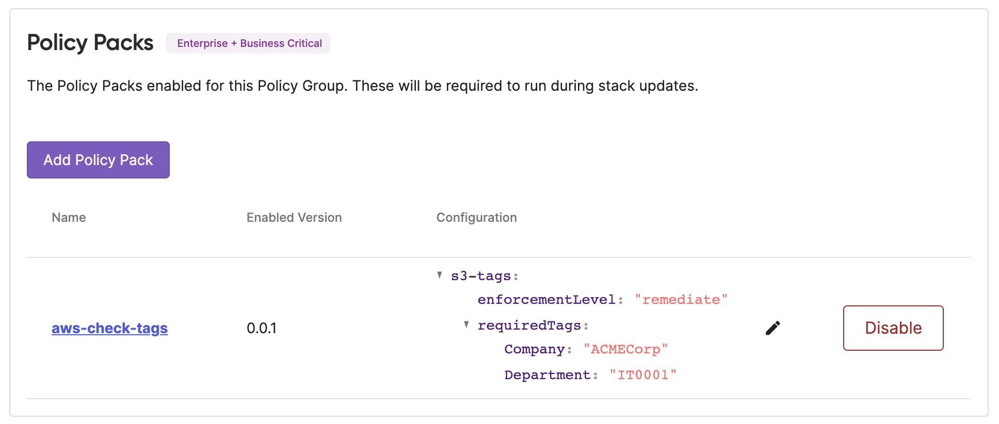

Pulumi’s policy as code engine, [CrossGuard](/crossguard), is already very flexible, and can enforce custom or predefined policies across a wide variety of use cases, including security, compliance, cost, and overall best practices. CrossGuard warns or issues errors should a deployment attempt to violate a policy. Last week we announced a new extension to CrossGuard called _remediation policies_. Remediation policies don’t just check for compliance, they go ahead and actually fix the problems in place. This ensures that every deployment across your entire team conforms, no questions asked, while also not needing to pester end users to remember all of the rules as they write their infrastructure as code, such as tagging resources a specific way. In this post, we will dig deeper into remediation policies and their use cases.

<!--more-->

## A Refresher on CrossGuard

CrossGuard policies are rules that run during `pulumi preview` and `up` to check that resource state conforms to some set of criteria. You can use off-the-shelf policies like [AWSGuard](/docs/using-pulumi/crossguard/awsguard) and the new [Pulumi Compliance-Ready Policies](https://github.com/pulumi/compliance-policies/) or write your own.

To roll your own, you create a "policy pack" in one of the supported languages (currently JavaScript, Python, TypeScript, or Open Policy Agent (OPA) Rego). A policy pack is a collection of policies which are just objects and functions that are given an opportunity to inspect the resource graph and report whether any policy violations have been detected. They're packaged natively (such as NPM, PyPI, etc) and Pulumi runs the policies at the right time with the right data to enforce them.

For example, this code enforces that S3 buckets are tagged:



{}

```typescript
import * as aws from "@pulumi/aws";
import { PolicyPack, validateResourceOfType } from "@pulumi/policy";

new PolicyPack("aws-check-tags", {
    policies: [
        {
            enforcementLevel: "mandatory",
            name: "s3-tags",
            description: "Ensure required tags are present on S3 buckets.",
            validateResource: validateResourceOfType(aws.s3.Bucket, (bucket, args, reportViolation) => {
                if (!bucket.tags || !bucket.tags["Company"] || !bucket.tags["Department"]) {
                    reportViolation("S3 Bucket is missing required Company/Department tags");
                }
            }),
        },
    ],
});
```

{}

{}

```python
from pulumi_policy import (
    EnforcementLevel,
    PolicyPack,
    ResourceValidationPolicy,
)

def s3_check_required_tags(args, report_violation):
    if args.resource_type == "aws:s3/bucket:Bucket":
        if ("tags" not in args.props or
                "Company" not in args.props["tags"] or
                "Department" not in args.props["tags"]):
            report_violation("S3 Bucket is missing required Company/Department tags")

PolicyPack(
    name="aws-check-tags",
    enforcement_level=EnforcementLevel.MANDATORY,
    policies=[
        ResourceValidationPolicy(
            name="s3-tags",
            description="Ensure required tags are present on S3 buckets.",
            validate=s3_check_required_tags,
        ),
    ],
)
```

{}



In the event of failure, we will see something like the following:

```bash
Policies:
    ❌ aws-check-tags@v0.0.1
        - [mandatory]  s3-tags  (aws:s3/bucket:Bucket: my-bucket)
          Ensure required tags are present on S3 buckets.
          S3 Bucket is missing required Company/Department tags
```

In this case, the policy is checking a single resource at a time --- but stack-wide policies are supported too, where an entire stack’s worth of resources can be checked at once.

There are two ways to tell the Pulumi engine to run a policy pack:

1. Pass `--policy-pack=...` when running a `pulumi preview` or `up`; this just uses a policy pack locally from wherever the Pulumi CLI is being run.

2. Publish a policy to your organization using `pulumi policy publish` and then enable it using `pulumi policy enable` or in the Pulumi Cloud UI. After this is done, policies automatically run, without any opt-in necessary by the end user (and indeed, opt-out is not even possible). This is much better because you don’t need to worry about distributing policy packs a priori and users can’t forget to enable the right policies.

The first option is available to all state backends while the second requires Pulumi Cloud. The first is a fine option for experimenting, developing your own policy packs, or just getting started.

Finally, there are two levels of enforcement: `mandatory` violations issue errors that stop the deployment in its tracks; `advisory` violations issue warnings and are a good way to let a user know something lower priority has been detected and/or to gradually roll out policy enforcement. The same policy can be configured to be either `advisory` or `mandatory` when it is enabled depending on the scenario (or even `none` if you want to skip a policy but run others from the same policy pack).

## Introducing Remediation Policies

Policies can now remediate violations to actually fix the problems they find in addition to or instead of reporting them as violations. Just like normal policies, a remediation is given a resource’s state for inspection. If the policy finds a problem, however, it can fix that state in place, and return it, and the engine will use the remediated state in place of the original state produced by the Pulumi program.

For example, this remediates, rather than validates, using the S3 tagging policy logic shown above:



{}

```typescript
import * as aws from "@pulumi/aws";
import { PolicyPack, remediateResourceOfType } from "@pulumi/policy";

new PolicyPack("aws-check-tags", {
    policies: [
        {
            enforcementLevel: "remediate",
            name: "s3-tags",
            description: "Ensure required tags are present on S3 buckets.",
            remediateResource: remediateResourceOfType(aws.s3.Bucket, (bucket, args) => {
                if (!bucket.tags || !bucket.tags["Company"] || !bucket.tags["Department"]) {
                    bucket.tags = bucket.tags || {};
                    bucket.tags["Company"] = bucket.tags["Company"] || "ACMECorp";
                    bucket.tags["Department"] = bucket.tags["Department"] || "IT0001";
                    return bucket;
                }
            }),
        },
    ],
});
```

{}

{}

```python
from pulumi_policy import (
    EnforcementLevel,
    PolicyPack,
    ResourceValidationPolicy,
)

def s3_check_required_tags(args):
    if args.resource_type == "aws:s3/bucket:Bucket":
        had_violation = False
        if "tags" not in args.props:
            args.props["tags"] = dict()
            had_violation = True
        if "Company" not in args.props["tags"]:
            args.props["tags"]["Company"] = "ACMECorp"
            had_violation = True
        if "Department" not in args.props["tags"]:
            args.props["tags"]["Department"] = "IT0001"
            had_violation = True
        if had_violation:
            return args.props

PolicyPack(
    name="aws-check-tags-py",
    enforcement_level=EnforcementLevel.REMEDIATE,
    policies=[
        ResourceValidationPolicy(
            name="s3-tags",
            description="Ensure required tags are present on S3 buckets.",
            remediate=s3_check_required_tags,
        ),
    ],
)
```

{}



To enable remediations to take place, the policy is configured with a new enforcement level, `remediate`, which is stricter than `mandatory`.

When we run `pulumi up`, rather than reporting a violation, we will see that it's automatically remediated:

```bash
Policies:
    ✅ aws-check-tags@v0.0.1
        - [remediate]  s3-tags  (1 resource)
```

To see the full details, we can select `details` from the preview menu:

```bash
  Policy Remediations:
    aws-check-tags@v0.0.1 [remediate]  s3-tags  (aws:s3/bucket:Bucket: my-bucket)
      + tags        : {
          + Company   : "ACMECorp"
          + Department: "IT0001"
        }
```

This specific policy is written in a way that only works in remediation mode. That means if a different enforcement level, like `advisory` or `mandatory` is enabled, the policy will do nothing. It is possible to write a policy that can work in any enforcement level:



{}

```typescript
import * as aws from "@pulumi/aws";
import { PolicyPack, validateRemediateResourceOfType } from "@pulumi/policy";

new PolicyPack("aws-check-tags", {
    policies: [
        {
            enforcementLevel: /*any enforcement level possible*/,
            name: "s3-tags",
            description: "Ensure required tags are present on S3 buckets.",
            ...validateRemediateResourceOfType(aws.s3.Bucket, (bucket, args, reportViolation) => {
                if (!bucket.tags || !bucket.tags["Company"] || !bucket.tags["Department"]) {
                    reportViolation("S3 Bucket is missing required Company/Department tags");
                    bucket.tags = bucket.tags || {};
                    bucket.tags["Company"] = bucket.tags["Company"] || "ACMECorp";
                    bucket.tags["Department"] = bucket.tags["Department"] || "IT0001";
                    return bucket;
                }
            }),
        },
    ],
});
```

{}

{}

```python
from pulumi_policy import (
    EnforcementLevel,
    PolicyPack,
    ResourceValidationPolicy,
)

def s3_check_required_tags(args, report_violation):
    if args.resource_type == "aws:s3/bucket:Bucket":
        had_violation = False
        if "tags" not in args.props:
            args.props["tags"] = dict()
            had_violation = True
        if "Company" not in args.props["tags"]:
            args.props["tags"]["Company"] = "ACMECorp"
            had_violation = True
        if "Department" not in args.props["tags"]:
            args.props["tags"]["Department"] = "IT0001"
            had_violation = True
        if had_violation:
            report_violation("S3 Bucket is missing required Company/Department tags")
            return args.props

PolicyPack(
    name="aws-check-tags-py",
    enforcement_level=# Any enforcement level possible,
    policies=[
        ResourceValidationPolicy(
            name="s3-tags",
            description="Ensure required tags are present on S3 buckets.",
            validate_remediate=s3_check_required_tags,
        ),
    ],
)
```

{}



Notice in the code that we are both reporting and remediating policy issues at the same time. This might seem not to make sense at first --- if we’re remediating the policy error, doesn’t that by definition mean we don’t need to report the violation? Indeed, that is a choice you can make. However, these "dual mode" policies also ensure the same policy can be run with any enforcement level --- `advisory`, `mandatory`, or `remediate` --- as appropriate.

For instance, in some settings we may prefer to issue an error to the developer so that they fix their code. In other settings, we may prefer that this same remediation happens automatically. The policy remediations feature is very flexible in that it supports a range of policy enforcement.

## Configurable Remediations

In the above example, we hard-coded the set of tags we want to check for. For a simple policy for a very targeted use case, that may be ok. However, if we are writing a more general purpose policy, or one that needs to run across many organizations, this hard-coding can be unfortunate.

[Policy configuration](/docs/using-pulumi/crossguard/configuration), on the other hand, enables us to write rules that are parameterized. If we used policy configuration for this example, we could configure the set of tags to check for independent of the policy itself. This would mean that we could write a single tagging policy, once, and then enable/configure it many times. This is useful for enforcement in different organizations and also within the same organization if, say, if our production tags were different than development.

Here’s a rewritten variant of that policy above which uses policy configuration:



{}

```typescript
import * as aws from "@pulumi/aws";
import { PolicyPack, validateRemediateResourceOfType } from "@pulumi/policy";

new PolicyPack("aws-auto-tagger", {
    policies: [
        {
            enforcementLevel: "remediate",
            name: "s3-tags",
            description: "Ensure required tags are present on S3 buckets.",
            configSchema: {
                properties: {
                    requiredTags: {
                        type: "object",
                        items: { type: "string" },
                    },
                },
            },
            ...validateRemediateResourceOfType(aws.s3.Bucket, (bucket, args, reportViolation) => {
                const config = args.getConfig<{ requiredTags?: Record<string, string> }>();
                if (config.requiredTags) {
                    let hadViolations = false;
                    if (!bucket.tags) {
                        bucket.tags = {};
                    }
                    for (const key of Object.keys(config.requiredTags)) {
                        if (!bucket.tags[key]) {
                            reportViolation(`S3 Bucket is missing required tag '${key}'`);
                            bucket.tags[key] = config.requiredTags[key];
                            hadViolations = true;
                        }
                    }
                    if (hadViolations) {
                        return bucket;
                    }
                }
            }),
        },
    ],
});

```

{}

{}

```python
from pulumi_policy import (
    EnforcementLevel,
    PolicyConfigSchema,
    PolicyPack,
    ResourceValidationPolicy,
)

def s3_check_required_tags(args, report_violation):
    if args.resource_type == "aws:s3/bucket:Bucket":
        had_violations = False
        config = args.get_config()
        if config and "requiredTags" in config:
            if "tags" not in args.props or not args.props["tags"]:
                args.props["tags"] = dict()
            for tag, value in config["requiredTags"].items():
                if tag not in args.props["tags"]:
                    report_violation(f"S3 bucket is missing required tag '{tag}'.")
                    args.props["tags"][tag] = value
                    had_violations = True
            if had_violations:
                return args.props

PolicyPack(
    name="aws-check-tags-py",
    enforcement_level=EnforcementLevel.REMEDIATE,
    policies=[
        ResourceValidationPolicy(
            name="s3-tags",
            description="Ensure required tags are present on S3 buckets.",
            config_schema=PolicyConfigSchema(
                properties={
                    "requiredTags": {
                        "type": "object",
                        "items": { "type": "string" },
                    },
                },
            ),
            validate_remediate=s3_check_required_tags,
        ),
    ],
)
```

{}



Now when we enable the policy, we can supply a configuration file. Here is a `policy.json` file:

```json
{
    "s3-tags": {
        "enforcementLevel": "remediate",
        "requiredTags": {
            "Company": "ACMECorp",
            "Department": "IT0001"
        }
    }
}
```

This can be done at the command line in one of two ways:

1. If using `--policy-pack`, we can also pass `--policy-config-file=policy.json`.

2. If using organization policies, supply it when enabling your pack, with `pulumi policy enable --config=policy.json`.

It is also possible to edit or alter the configuration in the Pulumi Cloud console UI:



This Pulumi Cloud console experience makes it very easy to set default policies that apply to all stacks in your organization, hyper-target individual stacks with specific policies, or even group stacks together and enforce policies homogeneously across them, e.g. "all SOC2 stacks."

## Example Use Cases for Remediations

Remediation policies are great for many use cases. Here are a few examples:

* Tagging resources with standard, organization-wide tags.

* Disabling Internet access for gateways and firewall rules.

* Enabling encryption on storage or buckets.

* Down-sizing virtual machine configuration to use less expensive machine types.

Clearly this is not an exhaustive list, but it should serve to jog your imagination.

There are certainly use cases where you may elect not to automatically remediate violations. For example, outright misconfigurations are likely better reported to the end user, so that the infrastructure as code author is aware and can fix the source code definitions. It may not always be advisable to silently correct mistakes. And yet, there are clear use cases where it is likely preferable; for instance, rather than pestering every end user in your organization to remember precisely what set of tags and their values you want on all resources, they can just be added automatically. This enhances compliance while also enhancing productivity --- a win win!

## Sources of Inspiration

Before winding down, it’s worth calling out a few sources of inspiration for this feature. When we initially built policy as code, we were inspired by [static analysis](https://en.wikipedia.org/wiki/Static_program_analysis) more generally which we use all the time with programming languages. These techniques allow us to find and fix errors closer to the source, as we are writing code, rather than after the fact when it’s already too late.

That inspiration included technologies we built during the [Trustworthy Computing](https://www.wired.com/2002/01/bill-gates-trustworthy-computing/) era at Microsoft, such as [PREfix](https://www.cs.cmu.edu/~aldrich/courses/654-sp08/slides/14-prefix.pdf), [PREfast](https://www.infoworld.com/article/2668293/source-code-analysis-breaks-new-ground.html), [FxCop](https://en.wikipedia.org/wiki/FxCop), [SAL](https://learn.microsoft.com/en-us/cpp/code-quality/understanding-sal), and advanced programming language type systems including [Spec#](https://research.microsoft.com/specsharp). At the time, security vulnerabilities were running rampant, and the more code can be "correct by construction," the fewer security mistakes will slip through the cracks and result in costly security flaws. The analogies with the current state of the art in the cloud are abundant.

The Roslyn project took this a step further. As the C# compiler was rewritten in C# itself, the entire compiler object model was suddenly accessible to C# code itself. This facilitated a much easier way to [write static analyzers which were paired with code fixes](https://learn.microsoft.com/en-us/dotnet/csharp/roslyn-sdk/tutorials/how-to-write-csharp-analyzer-code-fix). Code fixes are very similar to policy remediations in that they don’t just report problems, they actually fix them up!

Both Azure and Kubernetes have ways to automatically remediate policy problems also. [Azure Policy offers a similar remediations feature](https://learn.microsoft.com/en-us/azure/governance/policy/how-to/remediate-resources?tabs=azure-portal), although it is somewhat difficult to extend since it is all expressed in JSON and limited to Azure Resource Manager resources. Kubernetes offers [a mutating admission webhook controller](https://kubernetes.io/docs/reference/access-authn-authz/admission-controllers/#mutatingadmissionwebhook) that can rewrite Kubernetes manifests on the fly before they are ever actually applied to the desired state that the controller sees.

In some ways, remediation policies are reminiscent of [Aspect Oriented Programming (AOP)](https://en.wikipedia.org/wiki/Aspect-oriented_programming), a popular technique in the Java community in the 2000s. Generally speaking, AOP was seen as too "magical" for widespread use. However, for targeted compliance scenarios like those discussed earlier, this approach strikes the right balance. Furthermore, we took great steps to ensure you can always find out precisely when and why a remediation changed things.

Finally, Pulumi has always had [transformations](https://www.pulumi.com/docs/concepts/options/transformations/) to perform in-memory modifications of resources as they get registered, either one at a time or across the whole stack. These run within a process and can hook resource registrations and mutate their state. The reason remediation policies are so different and interesting, however, is that they can be applied to programs without the program itself even having to opt-in. This is precisely what enables cross-organization enforcement.

## Winding Down

Remediation policies take Pulumi’s very powerful policy engine, CrossGuard, to the next level. Using them you can not just detect incompliant resources but actually fix them automatically.

Everything described in this post, except for organizational enforcement, is available in the free Pulumi open source SDK. To get started, just run `pulumi policy new` in a directory to begin creating your new policy pack. Also, [check out the CrossGuard get started guide](https://www.pulumi.com/docs/using-pulumi/crossguard/get-started/), which walks through the entire process of creating a new policy pack from scratch and running it. You can [read more details about policies and remediations](https://www.pulumi.com/docs/using-pulumi/crossguard/core-concepts/#resource-remediation) in the documentation.

Check it out and let us know what you think!
