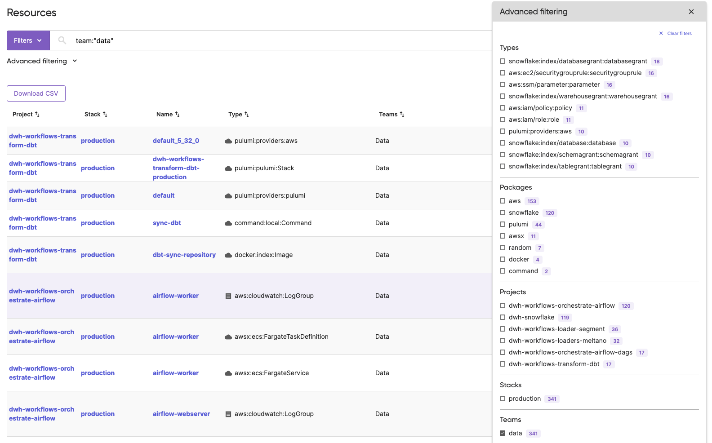

Last month we announced a new [Pulumi Cloud](/product/pulumi-cloud/) feature available for everyone: Resource Search. In the past month, Resource Search has been the fasted adopted feature since launching Pulumi Cloud, with thousands of users leveraging the feature to find resources across cloud environments, projects, stacks, teams, and users. Today we are announcing two new improvements to Resource Search: advanced filtering and Pulumi Teams support.

<!--more-->
## Introduction to Resource Search

Platform and developer teams are spinning up resources across many cloud accounts within multiple cloud providers. A common pain point we have heard from our customers is having a uniform view of resources across them, as every account (by design) is a walled garden. Often to answer key questions about their business, such as "which team has the largest cloud footprint", teams need to combine data across various clouds, cloud accounts, and SaaS tools. This prevents organizations from getting quick answers to operational questions and barriers to build aggregations to derive insights.

Pulumi Resource Search offers multi-cloud search and analytics across every environment in your organization. You can issue queries that find all of your AWS VPCs, or all of your VPCs in AWS and Azure, or all resources with the “production” tag across all cloud environments. You also have access to statistics about cloud usage, including a breakdown by cloud provider, resource type, and department. Resource search enables you to find the needle within your cloud haystack and visualize cloud consumption trends.

When we undertook solving this pain point for our customers we partnered with multiple companies to inform the design. Without the dozens of organizations that participated in the Pulumi Resource Search private beta we would not have been able to release a feature with such strong adoption so quickly. Today we are announcing two improvements to Resource Search: more advanced filtering options and Pulumi Teams support.

**See it in action!**


## Feature Overview

Pulumi Resource Search is composed of:

1. **Query syntax**: Infrastructure can be discovered interactively with a rich, structured query language, for example `package:snowflake`.
2. **AI Assist**: A natural language query interface that generates the query syntax for you. You can use it to express queries where you might not know the exact syntax, type tokens, or package names. You can [join the waitlist](https://www.pulumi.com/product/private-previews/#preview-assist) for access to this additional functionality for search.
3. **Search advanced filtering**: Advanced filtering allows you to see aggregations over your data at a glance, such as top stacks, projects, providers, teams and types by resource count. Additionally, if you are searching for something specific they can help you understand the shape of your search results and further refine them.
4. **Search API**: We understand that console searches aren't the only way our customers want to utilize Resource Search. To meet this need, we're also launching new Resource Search API endpoints, allowing you to integrate Resource Search into your internal systems and workflows. Use the API to add search functionality to your Internal Developer Platform or create automation around search results. API spec details are in the [Pulumi Service REST API documentation](/docs/pulumi-cloud/cloud-rest-api/#resource-search).
5. **Data Export**: Export resource data to ingest in your data warehouse. This will be covered in more detail in a future blog post, stay tuned!

## Query Syntax

It can be helpful when picking up a new feature to see some example queries that you can edit for your organization. See below a list of example query syntax queries:

See all resources that have not been modified in a year

```modified:<=2022-05-18```

See all resources with a certain tag in your cloud provider

```type:aws:s3/bucket:Bucket tags.costcenter:1234```

Find the Snowflake resources used in your data engineering team

```package:snowflake stack:production team:data```

Find resources in a project that aren't in a certain stack

```package:aws project:pulumi-cloud-import-aws stack:-staging-us-west-2```

## AI Assist Examples

show me all virtual machines across all cloud providers

```(type:aws:ec2/instance:Instance OR type:azure:compute:VirtualMachine OR type:gcp:compute:Instance)```

show me all s3 buckets not tagged in production

```(type:aws:s3/bucket:Bucket -tags.enviornment:production```

show azure and azure native security groups

```((type:azure:network:NetworkSecurityGroup OR type:azure-native:network:NetworkSecurityGroup)```

## Advanced Filtering & Pulumi Teams support

**The new advanced filtering menu!**


When navigating to the Resources page you will find your top 3 resource types, projects, stacks, teams and packages by resource count. We have extended this to show the top 10 when you click 'Show more'. This came as a direct byproduct of the feedback we have gotten from our customers that this feature added value upon first page load, and having more items would make it even more valuable.

Customers who use [Pulumi Teams](/docs/pulumi-cloud/access-management/teams) for role based access control on Pulumi Cloud can now filter resources by team access. We have added a new advanced filter option for Teams, allowing you to see at a glance the teams in your organization with the most resources. You can query which teams have access to what resources, track resource usage by team by exporting your resource data and see in the search results table which teams have access to that resource.

## Wrapping it up

Resource Search is available to all Pulumi users for free, making it even easier to manage your cloud resources and gain valuable insights into your infrastructure. It's just one of the many ways Pulumi continues to innovate and support organizations in their journey to the cloud. Try Resource Search today and see the difference it can make in helping you explore and find resources in your organization.

[Login to Pulumi Cloud](https://app.pulumi.com)
