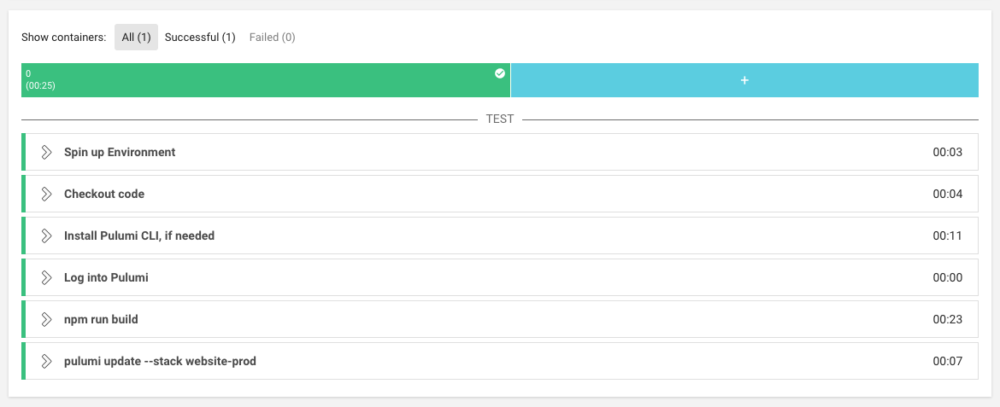

This morning [CircleCI announced the launch](https://circleci.com/blog/announcing-orbs-technology-partner-program/)
of [CircleCI Orbs](https://circleci.com/orbs/) which enable you to
create reusable components for CircleCI workflows. Orbs enable you to
simplify your CI/CD configuration by reusing existing orb jobs or
commands, in much the same way Pulumi enables you to simplify the
delivery of your cloud native infrastructure by sharing and reusing
[existing components]().

Pulumi is proud to be a [CircleCI technology partner](https://circleci.com/partners/), and we were excited to get a
head start on seeing how orbs could make it easier to take Pulumi into
production within CircleCI. The [Pulumi Orbs for CircleCI](https://circleci.com/orbs/registry/orb/pulumi/pulumi) are
available *today* for you to start using.
<!--more-->

## Pulumi Orbs

You can see the Pulumi orbs in-action in the following CircleCI
`config.yml`. It's a simple job to build and update a JavaScript-based
stack.

    version: 2.1
    Orbs:
      pulumi: pulumi/pulumi@1.0.0
    jobs:
      build:
        docker:
          - image: circleci/node:7.10
        working_directory: ~/repo
        steps:
          - checkout
          - pulumi/login
          - run:
              command: |
                npm install
                npm run build
          - pulumi/update:
              stack: website-prod

First, the Pulumi orbs (and fixed version) are referenced by the name
`pulumi/pulumi@1.0.0`. Then, the two Pulumi orbs `pulumi/login` and
`pulumi/update` are invoked.

CircleCI orbs can be parameterized, so you can set the version of the
Pulumi client to download, whether the update should skip its preview,
and so on. ([Full orb reference](https://github.com/pulumi/circleci#orb-reference))

With other CI/CD systems, you'd typically need to write one-off Bash
scripts to download the client from <https://get.pulumi.com>, add it to
the current `$PATH` and so on. Orbs allow for simpler, more declarative
CI/CD workflows.

The source code for the Pulumi orbs is available [on GitHub](https://github.com/pulumi/circleci),
if you have any suggestions or feedback.

## Other Integrations

Of course Pulumi's integration with CircleCI doesn't end with orbs.

Newer versions of the Pulumi command-line client will start associating
CircleCI build metadata with stack updates, so you you will soon see
links from <https://app.pulumi.com> to any stack updates or previews
that happened during a CircleCI workflow.

Also, if you are using CircleCI with GitHub, you can consider installing
the [Pulumi GitHub application](). The Pulumi
GitHub app will surface the results of any previews or updates from your
CI/CD on the source GitHub pull request. It's always good to know if a
pull request is going to lead to changes to your cloud infrastructure!

We are continuing to make Pulumi the best tool for the "Continuous
Deployment" part of CI/CD workflows, and with the release of CircleCIs
Orbs, it's just that much easier.

Having trouble? Questions? Join our [community Slack](https://slack.pulumi.io/)
or [drop us a line]().

Links:

-   [Get Started with Circle CI Orbs](https://circleci.com/orbs/)

