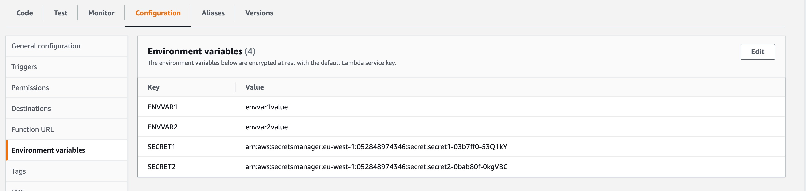

The subject of how to make use of secrets in Lambda Functions comes up a fair bit, and although there seems to be a lot of discussion on where you _should_ store them, the one thing that comes up is that **you should never store the plain text values of secrets in the Lambda Function's environment variables**. One such discussion I was having with a customer made me think about how it should be possible to take the secrets that you've got on your [stack config file](https://www.pulumi.com/docs/intro/concepts/config) and then use them to configure your Lambda Function, with the plain text values going into the Function's environment variables and the encrypted secret values going into AWS' Secrets Manager.

<!--more-->

## Getting started

I'm going to assume you've already got Pulumi and AWS set up, you're logged into your backend, and you've already created a project and stack. I'm also using the Pulumi Service as my [secrets provider]().

{}
Although Lambda Functions are free to deploy, and you get a generous allowance as part of AWS' free tier, storing and accessing secrets is not. You can view the cost on the [AWS Secrets Manager Pricing page](https://aws.amazon.com/secrets-manager/pricing/).
{}

## Structured configuration

We're going to start by adding settings, both secret and plaintext, to our [stack configuration](), in a [structured way](). We're going to add these settings as a dictionary so we can use the names as the variable names in our Lambda Function.

First we add two settings in plaintext that are going to be used as environment variables in our lambda:

```bash
pulumi config set --path 'lambdawithsecrets.envvars["envvar1"]' envvar1value
pulumi config set --path 'lambdawithsecrets.envvars["envvar2"]' envvar2value
```

and then we add the secret settings:

```bash
pulumi config set --path 'lambdawithsecrets.secrets["secret1"]' secretvalue1 --secret
pulumi config set --path 'lambdawithsecrets.secrets["secret2"]' secretvalue2 --secret
```

If we take a look at the stack config (in my stack named `dev` it's the `Pulumi.dev.yaml` file):

```yaml
config:
  lambda-secrets:lambdawithsecrets:
    envvars:
      envvar1: envvar1value
      envvar2: envvar2value
    secrets:
      secret1:
        secure: AAABALZIAzDaE45MbdO08w/QMHK6CE4hssidMK70pyYt6hIFHpKeq0mBNic=
      secret2:
        secure: AAABAI+y9HpdgQ1u1rSPKGZeBkAIIbZfki84zmRrcWVltIMI5SGWZbYOyfQ=
```

there are several things I want to point out:

1. The entire config item is named `lambdawithsecrets` (this is how we'll retrieve the configuration later)
1. There are two sections, `envvars` and `secrets`. These are how I'll refer to the dictionaries later on in the code, but you can name these in any way you want.
1. We'll use the dictionary keys (`envvar1`, `envvar2`, `secret1`, `secret2`) to refer to the variables in the Lambda Function so we know what they're named and can easily access them. Again, you can name these to be whatever values you want.

## Writing our Pulumi program

Next we're going to start updating our `index.ts` file. Everything from now on can be copied and pasted in order into the file, and [I'll post the entire contents at the end]().

As we're only going to use the Pulumi and the AWS NPM packages you can replace everything in the file with the following:

```typescript
import * as pulumi from "@pulumi/pulumi";
import * as aws from "@pulumi/aws";
```

### A warning about accessing the configuration

Before we continue, it's worth pointing out the following (from the [Pulumi documentation on secrets]() ):

{}
On `pulumi up`, secret values are decrypted and made available in plaintext at runtime. These may be read through any of the standard `pulumi.Config` getters. While it is possible to read a secret using ordinary non-secret getters, this is almost certainly not what you want. Use the secret variants of the configuration APIs instead since this ensures that all transitive uses of that secret are themselves also marked as secrets.
{}

Now that's out the way, let's continue.

### Accessing the configuration

Since we're using structured configuration to store the values, we can access them in a strongly-typed way. We're going to create an interface to hold the structure:

```typescript
interface LambdaConfig {
    envvars: string[];
    secrets: pulumi.Output<string>[];
}
```

You'll notice that the property names match the dictionary names in the stack config and that the secrets property is of type `pulumi.Output<string>[]` instead of `string[]`. This is because they're Pulumi secrets, and we want to handle them in the correct way.

Next we'll access the config and store the values in a variable:

```typescript
const config = new pulumi.Config();
const lambdaconfig = config.requireObject<LambdaConfig>("lambdawithsecrets");
```

### Storing the secret values

As I said in the beginning, we're going to store the secrets from the stack config in AWS Secrets Manager, and then the ARN of each of the secrets will be stored in the Lambda Function's environment variables.

We're going to create a couple of arrays to store (non-sensitive) information about the Secret resources that we're going to create to use later on. One to hold the `Secret` resources and one to hold the ARNs of the secrets. Due to the fact that it's the `SecretVersion` where we store the secret value, it's pretty safe to store the `Secret`.

Next we'll loop through the config's secrets dictionary, grab the values and for each one create a `Secret` and a `SecretValue` resource, and then populate the two arrays with the relevant values.

```typescript
const secretsArnArray: pulumi.Output<string>[] = new Array();
const secretArray: aws.secretsmanager.Secret[] = new Array();
for (const key in lambdaconfig.secrets) {
    if (lambdaconfig.secrets.hasOwnProperty(key)) {
        const secret = new aws.secretsmanager.Secret(`${key}`);
        const secretVersion = new aws.secretsmanager.SecretVersion(`secretversion-${key}`, {
            secretId: secret.id,
            secretString: lambdaconfig.secrets[key],
        });
        secretArray.push(secret);
        secretsArnArray[key.toLocaleUpperCase()] = secret.id;
    }
}
```

We're not actually doing anything with the `SecretVersion` resources, so that's why we're not assigning them to any variables.

### Identity and Access Management

There are a few resources we're going to need to create and assign to the Lambda Function to give it access to the `Secret` resources:

- A role that we can assign to the Lambda Function
- A `Policy` that is going to give that role read access to the values of the secrets we've created
- A couple of `RolePolicyAttachment` resources which is how we attach policies to the above role

Firstly, the role:

```typescript
const role = new aws.iam.Role("roleLambdaWithSecrets", {
    assumeRolePolicy: aws.iam.assumeRolePolicyForPrincipal(aws.iam.Principals.LambdaPrincipal),
});
```

We're using the `assumeRolePolicyForPrincipal` function because doesn't that look better than this:

```typescript
const role = new aws.iam.Role("roleLambdaWithSecrets", {
    assumeRolePolicy: JSON.stringify({
        Version: "2012-10-17",
        Statement: [{
            Action: "sts:AssumeRole",
            Effect: "Allow",
            Sid: "",
            Principal: {
                Service: "lambda.amazonaws.com",
            },
        }],
    }),
});
```

(either of the above `Role` resources can be used, but I'm using the top one because I think it's neater).

Next we create a policy document and a policy. We're going to use the `secretArray` variable that we created earlier to allow us to only allow the Lambda Function access to the secrets that we've created:

```typescript
const secretManagerPolicyDoc = aws.iam.getPolicyDocumentOutput({
    statements: [
        {
            effect: "Allow",
            actions: [
                "secretsmanager:GetSecretValue",
            ],
            resources: secretArray.map(x => pulumi.interpolate`${x.arn}`),
        },
    ],
});

const secretManagerPolicy = new aws.iam.Policy("secretsPolicy", {
    policy: secretManagerPolicyDoc.apply(doc => doc.json),
});
```

Finally we're going to attach the above policy and the AWS Managed `AWSLambdaBasicExecutionRole` policy to the IAM role we created:

```typescript
const rpaBasic = new aws.iam.RolePolicyAttachment("rpa-basic", {
    role: role,
    policyArn: aws.iam.ManagedPolicy.AWSLambdaBasicExecutionRole,
});

const rpaSecrets = new aws.iam.RolePolicyAttachment("rpa-secrets", {
    role: role,
    policyArn: secretManagerPolicy.arn,
});
```

The `aws.iam.ManagedPolicy.AWSLambdaBasicExecutionRole` is one of our enums that points at the relevant ARN for this policy.

### Finally, the Function

There are two parts to this: the `Lambda Function` resource and the code we're going to deploy as part of the function.

#### The Resource

The function resource itself is pretty simple. The interesting bit is how we take the array of the ARNs we created earlier, combine it with the array of environment variable values we have in the config and assign them to the `environment` input:

```typescript
const lambdaEnvVars: pulumi.Input<{
    [key: string]: pulumi.Input<string>;
}> = {};

for (const key in secretsArnArray) {
    if (secretsArnArray.hasOwnProperty(key)) {
        lambdaEnvVars[key] = secretsArnArray[key];
    }
}

for (const key in lambdaconfig.envvars) {
    if (lambdaconfig.envvars.hasOwnProperty(key)) {
        lambdaEnvVars[key.toLocaleUpperCase()] = lambdaconfig.envvars[key];
    }
}
```

The reason that we're using the `.toLocaleUpperCase()` function is because as a rule, the usual way of defining environment variable names is using upper case letters.

Once we've done this we can put together the function resource:

```typescript
const lambda = new aws.lambda.Function("lambdaWithSecrets", {
    code: new pulumi.asset.AssetArchive({
        ".": new pulumi.asset.FileArchive("./app"),
    }),
    role: role.arn,
    handler: "index.handler",
    runtime: aws.lambda.Runtime.NodeJS16dX,
    environment: {
        variables: lambdaEnvVars,
    },
    timeout: 15,
});

export const lambdaName = lambda.name;
```

There's nothing complicated about the function. We're using the role from earlier, setting the environment variables to be the object we created just above and pointed the `code` input at a local folder called `app`, which we'll look at next. The lambda name being exported at the end is so that we can use the Pulumi CLI to get this value and invoke the function using the AWS CLI.

#### The Code

First we need somewhere to put the code:

```bash
mkdir app && cd app
```

Then we create a new NPM application and install the AWS `client-secrets-manager` package that we'll use to access the secrets in the code:

```bash
npm init -y && npm install @aws-sdk/client-secrets-manager
```

We're also going to update the `type` setting in the `package.json` file to be `module` so that we can have a top level async function. Here's what our file looks like:

```json
{
  "name": "app",
  "version": "1.0.0",
  "description": "",
  "main": "index.js",
  "scripts": {
    "test": "echo \"Error: no test specified\" && exit 1"
  },
  "keywords": [],
  "author": "",
  "license": "ISC",
  "dependencies": {
    "@aws-sdk/client-secrets-manager": "^3.183.0"
  },
  "type": "module"
}
```

The `index.js` file for the lambda isn't exciting. We're going to make the function more efficient by making the calls to the secrets manager API outside of the main handler code, so it doesn't get run for all invocations (just the ones during a cold start):

```javascript
import { SecretsManagerClient, GetSecretValueCommand } from "@aws-sdk/client-secrets-manager"; // ES Modules import
const client = new SecretsManagerClient();

const getSecretForLambda = async (secretId) => {
    const input = { "SecretId": secretId };
    const command = new GetSecretValueCommand(input);
    console.log('Retrieving secret during top-level await');
    return await client.send(command);
}

const secret1 = getSecretForLambda(process.env.SECRET1);
const secret2 = getSecretForLambda(process.env.SECRET2);

export async function handler() {
    console.log('Using secret in handler');
    return {
        secret1: (await secret1).SecretString,
        secret2: (await secret2).SecretString,
    };
};
```

{}
The above JavaScript code will return the secret values from the function and is purely for demo purposes. In the Real World<sup>TM</sup> you definitely shouldn't do this.
{}

### Deployment time

Now that we've got everything together we can deploy this:

```bash
pulumi up
```

and you should see something like the following:

```bash
Previewing update (dev)

View Live: https://app.pulumi.com/acmecorp/lambda-secrets/dev/previews/209f07fb-190d-4596-af9f-d2d72e9c5cc9

     Type                                 Name                   Plan
 +   pulumi:pulumi:Stack                  lambda-secrets-dev     create
 +   ├─ aws:secretsmanager:Secret         secret1                create
 +   ├─ aws:secretsmanager:Secret         secret2                create
 +   ├─ aws:iam:Role                      roleLambdaWithSecrets  create
 +   ├─ aws:secretsmanager:SecretVersion  secretversion-secret2  create
 +   ├─ aws:secretsmanager:SecretVersion  secretversion-secret1  create
 +   ├─ aws:iam:Policy                    secretsPolicy          create
 +   ├─ aws:iam:RolePolicyAttachment      rpa-basic              create
 +   ├─ aws:iam:RolePolicyAttachment      rpa-secrets            create
 +   └─ aws:lambda:Function               lambdaWithSecrets      create

Outputs:
    lambdaName: "lambdaWithSecrets-b8ac5e9"

Resources:
    + 10 to create

Do you want to perform this update? yes
Updating (dev)

View Live: https://app.pulumi.com/acmecorp/lambda-secrets/dev/updates/1

     Type                                 Name                   Status
 +   pulumi:pulumi:Stack                  lambda-secrets-dev     created
 +   ├─ aws:secretsmanager:Secret         secret1                created
 +   ├─ aws:secretsmanager:Secret         secret2                created
 +   ├─ aws:iam:Role                      roleLambdaWithSecrets  created
 +   ├─ aws:secretsmanager:SecretVersion  secretversion-secret2  created
 +   ├─ aws:secretsmanager:SecretVersion  secretversion-secret1  created
 +   ├─ aws:iam:Policy                    secretsPolicy          created
 +   ├─ aws:iam:RolePolicyAttachment      rpa-basic              created
 +   ├─ aws:lambda:Function               lambdaWithSecrets      created
 +   └─ aws:iam:RolePolicyAttachment      rpa-secrets            created

Outputs:
    lambdaName: "lambdaWithSecrets-ca62cf8"

Resources:
    + 10 created

Duration: 24s
```

Let's see what this has done. If we go to look at the Lambda Function in the console, click on the `Configuration` tab and select `Environment variables` you'll see the two plaintext environment variables and their values along with the two secret environment variables containing the ARNs to the relative secret in the Secrets Manager. Since we know the environment variable key (the uppercase version of what's in the stack config), we can reliably use that same name in the function code (the two lines where we call the `getSecretForLambda` function).

For me, it looks something like this:



Finally, let's run the function via the AWS CLI and see what we get:

```bash
aws lambda invoke --function-name $(pulumi stack output lambdaName) /dev/stdout
```

You should see something like the following (depending on what values you added to the stack config at the beginning):

```bash
{"secret1":"secret1value","secret2":"secret2value"}
```

You can also use the test function in the AWS Console and see the results there.

### Tidying up

As stated earlier, it costs to store and access secrets so we need to make sure that we remove the infrastructure once we've completed this demo. As ever, you can do this by running `pulumi destroy`:

```bash
Previewing destroy (dev)

View Live: https://app.pulumi.com/pierskarsenbarg/lambda-secrets/dev/previews/f111f92e-1dbb-4615-9871-30de417bf8f1

     Type                                 Name                   Plan
 -   pulumi:pulumi:Stack                  lambda-secrets-dev     delete
 -   ├─ aws:iam:RolePolicyAttachment      rpa-secrets            delete
 -   ├─ aws:iam:RolePolicyAttachment      rpa-basic              delete
 -   ├─ aws:secretsmanager:SecretVersion  secretversion-secret1  delete
 -   ├─ aws:iam:Policy                    secretsPolicy          delete
 -   ├─ aws:lambda:Function               lambdaWithSecrets      delete
 -   ├─ aws:secretsmanager:SecretVersion  secretversion-secret2  delete
 -   ├─ aws:secretsmanager:Secret         secret2                delete
 -   ├─ aws:iam:Role                      roleLambdaWithSecrets  delete
 -   └─ aws:secretsmanager:Secret         secret1                delete

Outputs:
  - lambdaName: "lambdaWithSecrets-ca62cf8"

Resources:
    - 10 to delete

Do you want to perform this destroy?  [Use arrows to move, enter to select, type
Do you want to perform this destroy?  [Use arrows to move, enter to select, type
Do you want to perform this destroy? yes
Destroying (dev)

View Live: https://app.pulumi.com/pierskarsenbarg/lambda-secrets/dev/updates/64

     Type                                 Name                   Status
 -   pulumi:pulumi:Stack                  lambda-secrets-dev     deleted
 -   ├─ aws:iam:RolePolicyAttachment      rpa-secrets            deleted
 -   ├─ aws:iam:Policy                    secretsPolicy          deleted
 -   ├─ aws:secretsmanager:SecretVersion  secretversion-secret1  deleted
 -   ├─ aws:secretsmanager:SecretVersion  secretversion-secret2  deleted
 -   ├─ aws:lambda:Function               lambdaWithSecrets      deleted
 -   ├─ aws:iam:RolePolicyAttachment      rpa-basic              deleted
 -   ├─ aws:secretsmanager:Secret         secret2                deleted
 -   ├─ aws:secretsmanager:Secret         secret1                deleted
 -   └─ aws:iam:Role                      roleLambdaWithSecrets  deleted

Outputs:
  - lambdaName: "lambdaWithSecrets-ca62cf8"

Resources:
    - 10 deleted

Duration: 9s

The resources in the stack have been deleted, but the history and configuration associated with the stack are still maintained.
If you want to remove the stack completely, run `pulumi stack rm dev`.
```

And to complete the tidying up, let's delete the stack and all the relevant history as well:

```bash
pulumi stack rm dev
```

## Complete code

If you just want to copy and paste the entire `index.ts` file without worrying which section goes where, I got you covered:

```typescript
// Copyright 2016-2022, Pulumi Corporation.  All rights reserved.

import * as aws from "@pulumi/aws";
import * as pulumi from "@pulumi/pulumi";

interface LambdaConfig {
    envvars: string[];
    secrets: pulumi.Output<string>[];
}

const config = new pulumi.Config();
const lambdaconfig = config.requireObject<LambdaConfig>("lambdawithsecrets");

const secretsArnArray: pulumi.Output<string>[] = new Array();
const secretArray: aws.secretsmanager.Secret[] = new Array();
for (const key in lambdaconfig.secrets) {
    if (lambdaconfig.secrets.hasOwnProperty(key)) {
        const secret = new aws.secretsmanager.Secret(`${key}`);
        const secretVersion = new aws.secretsmanager.SecretVersion(`secretversion-${key}`, {
            secretId: secret.id,
            secretString: lambdaconfig.secrets[key],
        });
        secretArray.push(secret);
        secretsArnArray[key.toLocaleUpperCase()] = secret.id;
    }
}

const role = new aws.iam.Role("roleLambdaWithSecrets", {
    assumeRolePolicy: aws.iam.assumeRolePolicyForPrincipal(aws.iam.Principals.LambdaPrincipal),
});

const rpaBasic = new aws.iam.RolePolicyAttachment("rpa-basic", {
    role: role,
    policyArn: aws.iam.ManagedPolicy.AWSLambdaBasicExecutionRole,
});


const secretManagerPolicyDoc = aws.iam.getPolicyDocumentOutput({
    statements: [
        {
            effect: "Allow",
            actions: [
                "secretsmanager:GetSecretValue",
            ],
            resources: secretArray.map(x => pulumi.interpolate`${x.arn}`),
        },
    ],
});

const secretManagerPolicy = new aws.iam.Policy("secretsPolicy", {
    policy: secretManagerPolicyDoc.apply(doc => doc.json),
});

const rpaSecrets = new aws.iam.RolePolicyAttachment("rpa-secrets", {
    role: role,
    policyArn: secretManagerPolicy.arn,
});

const lambdaEnvVars: pulumi.Input<{
    [key: string]: pulumi.Input<string>;
}> = {};

for (const key in secretsArnArray) {
    if (secretsArnArray.hasOwnProperty(key)) {
        lambdaEnvVars[key] = secretsArnArray[key];
    }
}

for (const key in lambdaconfig.envvars) {
    if (lambdaconfig.envvars.hasOwnProperty(key)) {
        lambdaEnvVars[key.toLocaleUpperCase()] = lambdaconfig.envvars[key];
    }
}

const lambda = new aws.lambda.Function("lambdaWithSecrets", {
    code: new pulumi.asset.AssetArchive({
        ".": new pulumi.asset.FileArchive("./app"),
    }),
    role: role.arn,
    handler: "index.handler",
    runtime: aws.lambda.Runtime.NodeJS16dX,
    environment: {
        variables: lambdaEnvVars,
    },
    timeout: 15,
});

export const lambdaName = lambda.name;
```

## Summary

This post describes one of the ways that you can securely access secrets in your Lambda Functions by adding secrets to your stack config, uploading them to AWS Secrets Manager and then accessing them in your functions, all without exposing the plaintext values. There are other ways, but I think this is one of the neatest.

Of course you can use other tools to manage your secrets, such as [Azure Key Vault](), [Google Cloud Secret Manager]() or [Hashicorp Vault](), getting the path to the key back from the resource and using it in the same way as we used the ARN from the Secret.

If you'd like more information on how you can use Pulumi to securely and easily deploy your cloud infrastructure using modern programming languages, [get in touch and ask us how]().
