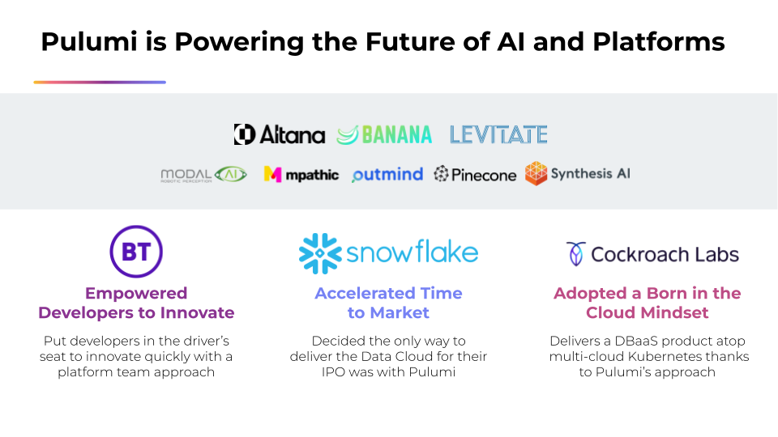
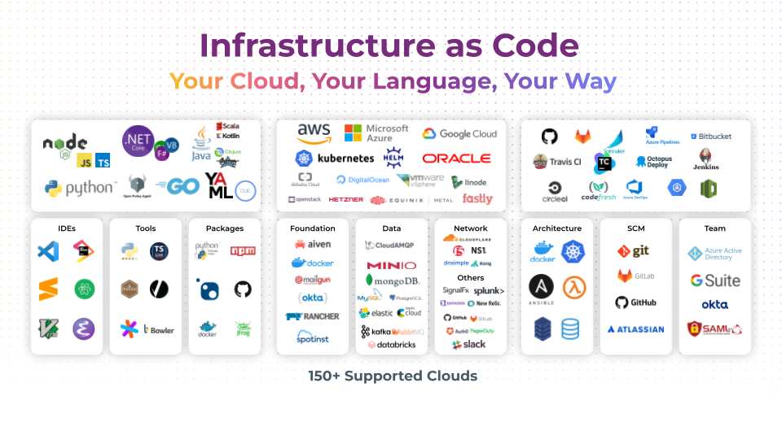
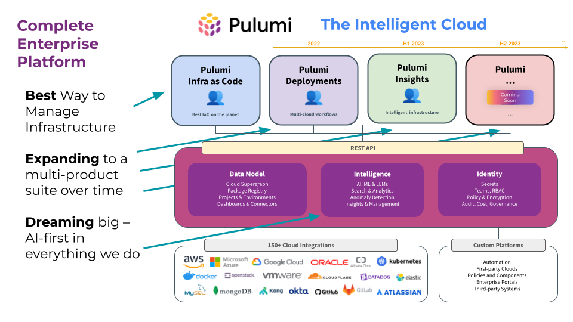

Today we announced a $41M Series C fundraise from Madrona Ventures, NEA, Tola Capital, and Strike Capital. These new funds will help us accelerate momentum, keep innovating with the best infrastructure as code technology on the market, and expand into new product areas to solve even more of our customers’ most pressing cloud challenges. We’ve had a year of exciting milestones – surpassing 150,000 end users in our community, 2,000 customers, and 100 employees – and look forward to many more to come. The future is full of cloud, and yet incredibly bright!

<!--more-->

## Incredible momentum

Over 2,000 customers have chosen Pulumi Cloud for their infrastructure as code needs. Many more companies build on our open source, including over half of the Fortune 50. And we estimate that our community recently surpassed 150,000 happy and productive end users.

This year we made the top 5% of the [Inc. 5000](https://www.inc.com/inc5000) Fastest Growing Companies in America and were listed in [Redpoint’s InfraRed 100](https://www.redpoint.com/infrared/100/), to highlight transformative cloud infrastructure companies. This momentum will continue to propel us even further on our growth trajectory.

## The best infrastructure as code

Why have we seen such incredible growth? It’s a combination of things: an amazing, multi-billion-dollar fast-growing market – infrastructure as code – plus a product that is widely recognized as the best product and clearly leading the innovation agenda in that market.

Pulumi’s unique approach to infrastructure as code is to stand on the shoulders of giants by letting you use any language. At the time we began, this was not a popular idea! In fact, a good friend of mine, who is a legend in the cloud native space, bluntly told me, “YAML is good enough – infrastructure as code doesn’t need that good of a developer experience.” We disagreed.

Our thesis was that we went through a one way door with cloud software. We have entered into the era of real distributed applications. And that is super exciting! It means all developers are building cloud software and that infrastructure is central to innovating in the modern cloud.

By applying the industry’s best languages to the infrastructure as code space, we gave the cloud a programmable surface area. We can now treat cloud building blocks as programmable objects and build bigger things out of smaller things. The cloud is the new operating system and this foundational technology lays the groundwork for us to realize our long-term vision.

Fast forward 7 years, and Pulumi is the fastest growing infrastructure as code product and has inspired others, fundamentally reshaping the landscape. Our end users and customers tell us all the time they feel not just 10% more productive, but 10x more productive, thanks to rich, expressive languages, great tools and editors, sharing and reuse, and because infrastructure as code in any language also means infrastructure as code for anybody in the whole team.

We also bet big on open source. Open source is in our entire team’s DNA. We honestly felt it was table stakes that something so fundamental to how we write code and build platforms be open source. This builds trust, helps to foster an ecosystem and community of openness, and enables new scenarios that we couldn’t have even imagined. We paired our open source technology with a great Pulumi Cloud SaaS that 2/3rds of our end users elect to use simply because it’s the easiest, most reliable, and most secure way to adopt Pulumi at scale. Because we were very thoughtful, intentional, and smart about the relationship between our open source and commercial products, we can stand confidently by our open source heritage forever.

## Building a platform

Over time, we have expanded beyond infrastructure as code, by solving one problem after another that we see our customers facing. Let there be no question, we are still very much all about infrastructure as code! But as we have worked with our over 2,000 customers, we recognize they have other challenges in areas adjacent to infrastructure as code.

This began with [**Policy as Code**](). Policy as code allows you to verify that infrastructure state follows cost, compliance, security, reliability, or best practice guidelines. I ran static analysis efforts at Microsoft for many years during the Trustworthy Computing era and saw just how important and powerful enforcing policy as close to development time as possible is. We are still very early days here but we built Pulumi’s engine to support policy as code right from the outset.

Next came many obvious adjacencies to the infrastructure as code workflow, including [**Testing**]() and [**CI/CD Automation**](). Thanks to our choice of general purpose languages, we decided to tap into software engineering practices too; we sometimes call this “infrastructure as software” because it goes well beyond “just code.” We then built the [**Automation API**]() to answer the question of, what if infrastructure as code were a library you could link with, and not just a command line interface? The things our customers have built with these capabilities have been mind blowing: self-serve portals, custom CLIs and frameworks, and even entire SaaS products.

Last year, we then began branching out into entirely new product lines:

* [**Pulumi Deployments**]() delivers server-side orchestration of deployment workflows. We frequently heard from customers that no product on the market solved this for them. You can point Pulumi Cloud at a Git repo and get automatic Pull Request validations and deployments upon merges. Or do one-click deployments straight from the Pulumi Cloud console. Pulumi Deployments is highly extensible with a REST API unlocks a world of possibilities for platform teams, including but not limited to drift detection and remediation, blue/green and multi-region rollouts, dependent stack updates, ephemeral stacks, and automatic infrastructure cleanup.

* [**Pulumi Insights**]() provides search, analytics, and intelligence over your infrastructure, across any clouds. Our customers frequently told us they had trouble taming, or even getting visibility into, cloud chaos. The headline feature here is our Pulumi AI coding assistant: if you can dream up an infrastructure as code configuration, it can build it for you in any language. Pulumi AI quickly surpassed 100K prompts within its first couple of months. Insights also enables you to search over any infrastructure anywhere, helping you gain understanding over your team’s use of cloud infrastructure, analyze it further, or even just to find that needle in the haystack.

Pulumi is gradually shifting from a single infrastructure as code product to a complete enterprise platform. As we build out the platform, we do so in a highly integrated way. Pulumi Cloud pulls it all together with a unified data model, REST API, identity model, and AI model. These are not a loosely related assortment of technologies – they are deeply integrated, and can increasingly be adopted independently, but are better together even more than the sum of the parts.

## What’s next for Pulumi

It is still day one for us and we’re only just getting started. Our ambitious mission is to democratize the cloud so that every builder, no matter their background, can make the most out of the cloud. And although infrastructure as code in any language makes a giant step in that direction, there is so much more to be done. If the cloud is the new operating system, there are entire application and security models still missing. For our customers, the cloud is a competitive advantage and they’re always wanting to do more, and to do it faster, with the cloud. 

As we look to the future, there are several key themes we are excited to tackle:

* **The best infrastructure as code.** We hear all the time from users and customers that they think Pulumi is the best infrastructure as code technology on the market. We want to keep it that way. Best means the most productive, the most fun, the most flexible, and the most enterprise grade. We will continue investing substantially into making this technology even better and more accessible while also growing our community.

* **Reimagined cloud developer experiences.** The modern cloud’s capabilities are endless–and yet that can be daunting. For engineers simply wanting to build a modern cloud application or architecture, the concept count and level of abstraction demanded by the cloud are still often an order of magnitude more complex than they should be. We will continue leveraging our infrastructure as code foundations to deliver revolutionary new developer experiences that make us more productive and impactful in the cloud.

* **Security and best practices by-construction.** Simply put, security should not be an afterthought. No best practice should be. Yet for most cloud platform teams, both still are. We have chipped away at this problem but there is more to be done. Pulumi’s approach enables us to apply tried and true techniques from the programming languages domain to ensure that applications and infrastructure are increasingly correct by-construction. We need to shift from finding things after-the-fact towards stopping security issues dead in their tracks before they ever make their way to production.

* **AI powers the next wave of cloud innovation.** We are big believers in AI. We have already extended large models to deeply understand the cloud infrastructure domain and have realized immense benefits of doing so. We have begun to add AI to our product in areas that improve the user experience or deliver unique capabilities. As we go forward, just as we always relentlessly pursue the best developer experiences for our end users, we expect to ask ourselves, “How can this be better in an AI-first world?”

In short, the new Series C funds will allow us to double down on innovation that is already working, while breaking new ground in pursuit of our mission. Most importantly, we look forward to working with you, our end users and community, to build the best product experiences that solve your hardest and most pressing problems.

## Thank you

It is a privilege to count over 2,000 customers, and 150,000 end users, as part of our community. I still remember coding furiously in my basement with Eric and Luke, and going live with our first customer, like it was yesterday. We are just as passionate about our original dream today as we were back then – perhaps even more so, since it is coming true!

We are also so lucky to have such incredible investors at Madrona, NEA, Tola, and Strike who believe in the Pulumi dream too, and are helping us to build an iconic company.

To our end users, we would not be here if it weren’t for you. Whether you are a community member, an enterprise customer, or anywhere in between, your continued feedback, success stories, and belief in the Pulumi vision keep us going and make it all worthwhile.

From the entire Pulumi team, thank you!

