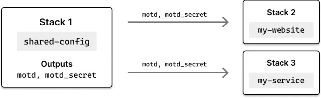
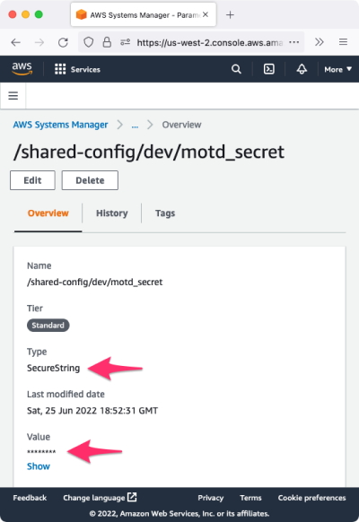
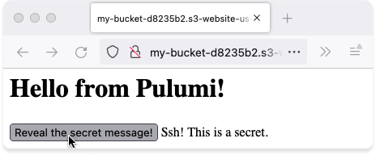
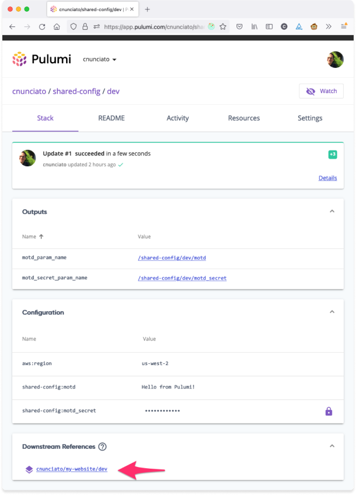

One thing I love about Pulumi is how easy it is to configure a stack. As a builder mainly of web applications, I'm always thinking about how I'll configure my apps from one environment to the next, and being able to use Pulumi's built-in support for [configuration]() and [secrets]() to manage the API keys and database credentials for my dev, staging, and production stacks individually is incredibly convenient.

For larger teams and organizations, though, where multiple applications rely on a set of common configuration settings --- dozens of apps, say, depending on the the same API service or database --- having to keep all of those config settings in sync across all of those individually can become a bit of a pain. When this happens, you may find yourself looking for ways to extract those settings into some sort of a service to allow you to manage them easily in one place, and in a way that allows any application to inherit them automatically.

There are lots of ways of addressing this sort of problem. One that I like is [AWS Systems Manager (SSM)](https://docs.aws.amazon.com/systems-manager/latest/userguide/what-is-systems-manager.html) --- specifically, SSM [Parameter Store](https://docs.aws.amazon.com/systems-manager/latest/userguide/systems-manager-parameter-store.html). With Systems Manager and Parameter Store, you can store plain-text and encrypted secrets and expose them easily to any other resource in your AWS infrastructure. Parameter Store is a powerful tool to have in your cloud-programming toolbox --- and combined with Pulumi, and in particular Pulumi [stack references](), you can use it to build specialized stacks make managing shared configuration simple.

In this post, I'll show you one way to do this. We'll start with a simple Pulumi stack that defines a few config settings with Parameter Store, then stand up a couple of other stacks to illustrate how to inherit and use those settings. We'll also use [Pulumi YAML](), one of the newest additions to the Pulumi language family, to give you an opportunity to kick the tires on that as well.

Let's get going.

## Sketching it out

The plan is to begin with a Pulumi stack to act as the keeper of our hypothetical organization's shared configuration. This stack will define two config settings: a message of the day, which we'll store in plain text, and a _secret_ message of the day (ssh!), which we'll store as an encrypted secret. Later, we'll build two stacks to act as downstream consumers of this shared-config stack --- one, a static website that'll use our config values to render some text in the browser, the other a serverless function that'll return those values as JSON. Both will use Pulumi [stack references]() to obtain their config values from Parameter Store. Here's a visual:



Let's start Stack 1 --- the `shared-config` stack.

## Building the shared config stack

First, make sure you've [installed]() and [configured Pulumi for AWS](), and then, in your shell of choice, create a new folder to house our three stacks-to-be:

```bash
$ mkdir shared-config-with-ssm && cd shared-config-with-ssm
$ mkdir shared-config my-website my-service
```

This'll leave you with three folders to work with, one for each stack:

```bash
$ tree .
.
├── my-service
├── my-website
└── shared-config
```

Change to the `shared-config` folder and generate a new [Pulumi YAML]() project, accepting the defaults to create a new `dev` stack:

```bash
$ cd shared-config
$ pulumi new aws-yaml
```

When the new-project wizard completes, add two new settings for the `dev` stack with [`pulumi config set`]():

```bash
$ pulumi config set motd 'Hello from Pulumi!'
$ pulumi config set motd_secret 'Ssh! This is a secret.' --secret
```

These are the two values we're going to make available to Stacks 2 and 3.

Now let's build out the Pulumi program to provision these items as parameters in AWS Systems Manager. Replace the contents of `Pulumi.yaml` with the following YAML program, which reads the config values we just set, declares two new `aws.ssm.Parameter` resources (using [fully-qualified paths](https://docs.aws.amazon.com/systems-manager/latest/userguide/sysman-paramstore-hierarchies.html) as a best practice), and exports their parameter names as Pulumi stack outputs:

```yaml
name: shared-config
runtime: yaml

# The values we're reading from stack configuration.
configuration:
  motd:
    type: String
  motd_secret:
    type: String

# The AWS SSM Parameters managed by this stack.
resources:
  motd_param:
    type: aws:ssm:Parameter
    properties:
      name: /shared-config/dev/motd
      value: ${motd}
      type: String
  motd_secret_param:
    type: aws:ssm:Parameter
    properties:
      name: /shared-config/dev/motd_secret
      value: ${motd_secret}
      type: SecureString

# Outputs are the fully-qualified AWS SSM Parameter names
# that consuming stacks can use to retrieve associated values.
outputs:
  motd_param_name: ${motd_param.name}
  motd_secret_param_name: ${motd_secret_param.name}
```

At this point, you might be wondering why we're only exporting our parameters' _names_, and not their values.

We certainly _could_ export their values, since we already have them at hand. But if we did, there wouldn't be much point to using Parameter Store at all, since Pulumi itself is perfectly capable of managing plain-text and encrypted values, and stack references give other stacks an easy way of accessing them programmatically. Why not export the values, then?

For one, it'd be less flexible. If we exposed these values as stack outputs, downstream stacks referencing them would only be able to read them at deploy-time --- i.e., _during_ their own Pulumi updates. For `shared-config` values that change rarely, that might be okay, but for others, it'd be less than ideal in that all downstream stacks would have to be updated immediately whenever one of those values were changed.

Secondly, it keeps secrets a bit more secret. Pulumi is great at protecting the secrets it manages, even [across stack boundaries]() like these, but applications still need a way to get access to the underlying plain-text values of secrets at runtime. Lambda functions, for example, need access tokens and database passwords to do the work we need them to do --- but figuring out how to provide them with those raw values safely can be tricky. By requiring client applications to fetch secrets from Parameter Store, we can keep their plain-text values out of the bodies of our Lambda functions and prevent them from surfacing inadvertently in the AWS Lambda Console.

Finally, it leaves room for the occasional out-of-band change. Now and then, you might be faced with having to update a value in Parameter Store directly --- e.g., with the AWS Console or CLI. Downstream stacks not reading from Parameter Store, however, wouldn't have access to these updated values until _after_ the `shared-config` stack were refreshed and redeployed --- and would themselves have to be redeployed in order to use them.

Perhaps that was more explanation than necessary for what amounts to just a few lines of YAML, but hopefully it gives you a sense of the kinds of things to be thinking about as you explore solutions like this on your own. For now, let's forge ahead and get this first stack deployed.

Back in your terminal, do that with `pulumi up`. The deployment should take only a few seconds to complete:

```bash
$ pulumi up
...

Updating (dev)

     Type                  Name               Status
 +   pulumi:pulumi:Stack   shared-config-dev  created
 +   ├─ aws:ssm:Parameter  motd_param         created
 +   └─ aws:ssm:Parameter  motd_secret_param  created

Outputs:
    motd_param_name       : "/shared-config/dev/motd"
    motd_secret_param_name: "/shared-config/dev/motd_secret"

Resources:
    + 3 created

Duration: 4s
```

Notice we've named our outputs clearly, and that the secret message is safely encrypted in `Pulumi.dev.yaml` and in Parameter Store. You can confirm the latter by visiting the AWS Console:



Now let's put these two new values to practical use.

## Fetching configuration at deploy-time

Assuming you're still in the `shared-config` folder, change to the `my-website` folder you created a few moments ago and generate another YAML project, this one for our humble little website:

```bash
$ cd ../my-website
$ pulumi new aws-yaml
```

Once again, follow the prompts to create a new `dev` stack, then replace the contents of `Pulumi.yaml` with the program below. Here, we're fetching the names of the parameters being managed by `shared-config`, pulling their values from Systems Manager, and creating a one-page website to render those values in the browser. (Be sure to adjust the [`Fn::StackReference`](https://github.com/pulumi/pulumi-yaml#fnstackreference)s to point to your stack instead of mine.)

```yaml
name: my-website
runtime: yaml

variables:

  # Get the names of the parameters we care about from the shared-config stack.
  motd_param_ref:
    Fn::StackReference:
      - cnunciato/shared-config/dev  # <-- Change this.
      - motd_param_name
  motd_secret_param_ref:
    Fn::StackReference:
      - cnunciato/shared-config/dev  # <-- And this.
      - motd_secret_param_name

  # Fetch (and decrypt) their values from Systems Manager.
  motd_param:
    Fn::Invoke:
      Function: aws:ssm:getParameter
      Arguments:
        name: ${motd_param_ref}
  motd_secret_param:
    Fn::Invoke:
      Function: aws:ssm:getParameter
      Arguments:
        name: ${motd_secret_param_ref}
        withDecryption: true

resources:

  # Create an S3 bucket and configure it as a website.
  my-bucket:
    type: aws:s3:Bucket
    properties:
      website:
        indexDocument: index.html

  # Create a homepage and render the values.
  index.html:
    type: aws:s3:BucketObject
    properties:
      bucket: ${my-bucket}
      acl: public-read
      contentType: text/html
      content: |
        <html>
          <head>
            <meta charset="utf-8">
            <style>
              span { display: none; }
              button:active + span { display: inline; }
            </style>
          </head>
          <body>
            <h1>${motd_param.value}</h1>
            <button>Reveal the secret message!</button>
            <span>${motd_secret_param.value}</span>
          </body>
        </html>

outputs:

  # Export the publicly accessible URL of the website.
  url: http://${my-bucket.websiteEndpoint}
```

Save the file and deploy the stack, which again should take only a few seconds to complete:

```bash
$ pulumi up
...

Updating (dev)

     Type                    Name            Status
 +   pulumi:pulumi:Stack     my-website-dev  created
 +   ├─ aws:s3:Bucket        my-bucket       created
 +   └─ aws:s3:BucketObject  index.html      created

Outputs:
    url: "http://my-bucket-269e711.s3-website-us-west-2.amazonaws.com"

Resources:
    + 3 created

Duration: 5s
```

With the exported URL, open the website in your favorite browser, and you should also see the message of the day on the homepage, along with a button you can click to reveal the secret message:



If you're using the Pulumi Service, which tracks dependencies between stacks, you should see that the `my-website` stack is now listed as a downstream consumer of `shared-config`:



Now, when the hypothetical team managing the `shared-config` stack decides it's time to update the message of the day, it can do so with a `pulumi config set` and `pulumi up`, and `my-website` will be able to pick up the new message automatically.

However, it's worth mentioning that that won't happen _immediately_, as the `my-website` stack is configured to pull the message from Systems Manager at _deploy-time_. If we want to reflect the new value on the homepage, we'll either need to deploy the `my-website` again or come up with a way to fetch the message at _runtime_ --- which brings us to our third and final stack, in which you'll learn how to do just that.

## Fetching configuration at runtime

The easiest way to see this in action is with [AWS Lambda](https://docs.aws.amazon.com/lambda/latest/dg/welcome.html). With Lambda and Pulumi's support for [function serialization](), we can capture the parameter names with stack references, pass them into the Lambda at deploy-time (as plain-text strings, which is fine, because they're just names), and fetch their values from Systems Manager at runtime --- i.e., when the Lambda is invoked sometime later --- with the [AWS SDK for Node.js](https://docs.aws.amazon.com/sdk-for-javascript/v3/developer-guide/getting-started-nodejs.html). This way, any updates made by the `shared-config` team will be usable by our Lambda function _immediately_, no redeployment necessary.

So to finish things off, change to the `my-service` folder you created earlier and generats a third and final project, this one with TypeScript, again accepting the defaults to create a `dev` stack for it:

```bash
$ cd ../my-service
$ pulumi new aws-typescript
```

Replace the contents of `index.ts` with the following program. As before, we're using `StackReference`s to read our parameter names from the `shared-config` stack --- except here, because `StackRerefence`s are provided as [`pulumi.Output`]()s, which can't be serialized into the Lambda, we'll need to use `.get()` to unwrap the parameter name into a string so we can use it at runtime with the AWS SDK:

```typescript
import * as pulumi from "@pulumi/pulumi";
import * as aws from "@pulumi/aws";

// Get the names of the parameters we care about from the shared-config stack.
const stack = new pulumi.StackReference("cnunciato/shared-config/dev"); // <-- Your name here.
const motdParamRef = stack.requireOutput("motd_param_name");
const motdSecretParamRef = stack.requireOutput("motd_secret_param_name");

const callback = new aws.lambda.CallbackFunction("lambda", {
    policies: [
        aws.iam.ManagedPolicy.LambdaFullAccess,

        // Give the Lambda read-only access to AWS Systems Manager.
        aws.iam.ManagedPolicy.AmazonSSMReadOnlyAccess
    ],
    callback: async () => {

        // Use the AWS SDK for JavaScript to fetch parameter values from Systems Manager.
        const ssm = new aws.sdk.SSM();

        // Fetch the message of the day.
        const motdParam = await ssm.getParameter({
            Name: motdParamRef.get(),  // <-- Use .get() for you runtime access to Output values.
        }).promise();

        // Fetch the secret message of the day.
        const motdSecretParam = await ssm.getParameter({
            Name: motdSecretParamRef.get(),
            WithDecryption: true,
        }).promise();

        return {
            statusCode: 200,
            contentType: "application/json",

            // Return the result.
            body: JSON.stringify({
                motd: motdParam.Parameter?.Value,
                motd_secret: motdSecretParam.Parameter?.Value
            }),
        };
    },
});

const lambdaUrl = new aws.lambda.FunctionUrl("lambda-url", {
    functionName: callback.name,
    authorizationType: "NONE",
});

// Export the publicly accessible URL of the service.
export const url = lambdaUrl.functionUrl;
```

When you're ready, deploy the `my-service` stack with `pulumi up`:

```bash
$ pulumi up
...

Updating (dev)

     Type                             Name             Status
 +   pulumi:pulumi:Stack              my-service-dev   created
 +   ├─ aws:iam:Role                  lambda           created
 +   ├─ aws:lambda:Function           lambda           created
 +   ├─ aws:iam:RolePolicyAttachment  lambda-b63d666c  created
 +   ├─ aws:iam:RolePolicyAttachment  lambda-b5aeb6b6  created
 +   └─ aws:lambda:FunctionUrl        lambda-url       created

Outputs:
    url: "https://6y3vkpktyybylhua266bu7yplu0dgqgv.lambda-url.us-west-2.on.aws/"

Resources:
    + 6 created

Duration: 19s
```

Verify the deployment with a request to the Lambda function's public endpoint:

```bash
$ curl $(pulumi stack output url)
{
  "motd": "Hello from Pulumi!",
  "motd_secret": "Ssh! This is a secret."
}
```

That tells you the runtime lookup is working, which is great.

Now try updating the message of the day. Change to the `shared-config` folder, use `pulumi config set` to update the stack's configured value, and finally, run `pulumi up` to write the new value to Systems Manager:

```bash
$ cd ../shared-config
$ pulumi config set motd 'Hello *again* from Pulumi!'
$ pulumi up
...

Updating (dev)

     Type                  Name               Plan       Info
     pulumi:pulumi:Stack   shared-config-dev
 ~   └─ aws:ssm:Parameter  motd_param         updated    [diff: ~value]

Resources:
    ~ 1 updated
    2 unchanged
```

If all goes well, you should be able to invoke the Lambda again and see the new value immediately:

```bash
$ cd ../my-service
$ curl $(pulumi stack output url)
{
  "motd": "Hello *again* from Pulumi!",
  "motd_secret": "Ssh! This is a secret."
}
```

And with that, we're done. You can tear everything down with `pulumi destroy`:

```bash
$ cd ..
$ pulumi -C my-service destroy
$ pulumi -C my-website destroy
$ pulumi -C shared-config destroy
```

## Wrapping up, and next steps

Managing configuration at scale is a much bigger topic than we could possibly cover in a blog post, but hopefully you've learned enough here to fuel some experimentation of your own. You'll find the [full source code for this walkthrough on GitHub](https://github.com/cnunciato/shared-config-with-pulumi-and-ssm) as well.

Additionally, as an alternative to Parameter Store, you might also want to check out [AWS Secrets Manager](https://aws.amazon.com/secrets-manager/). It's built specifically for managing secrets, and gives you additional capabilities like rotation and auditing, so depending on your use case, it could be a better fit for certain scenarios.

Happy configuring!
