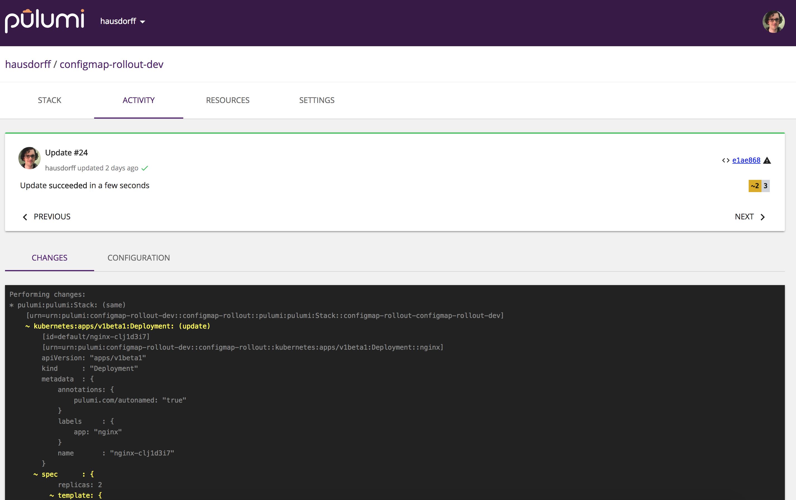

Kubernetes is a powerful container orchestrator for cloud native
applications that can run on any cloud -- AWS, Azure, GCP -- in
addition to hybrid and on-premises environments. Its CLI, `kubectl`,
offers basic built-in support for performing deployments, but
intentionally stops short here. In particular, it doesn't offer diffs
and previews, the ability to know when a deployment has succeeded or
failed, and why, and/or sophisticated deployment orchestration.

In this post, we'll see how Pulumi, an open source cloud native
development platform, can not only let you express Kubernetes programs
in real programming languages, like TypeScript, instead of endless YAML
templates, but also how Pulumi delivers simple and reproducible, yet
powerful, Kubernetes deployment workflows.
<!--more-->

## Less YAML, More Robustness

[Pulumi 0.15]()
introduced Kubernetes support to Pulumi. When we started working on
this, we already loved being able to write in our favorite languages --
with the benefits of IDEs, classes and functions, and reuse through
packages -- instead of YAML. But we felt just having great programming
language alone wasn't enough.

As we looked to how teams wanted to operationalize our Kubernetes
support, we set our sights on one major area: delivering simple,
reproducible application deployment workflows. When an app attempts to
roll out, it should be obvious if it succeeded. If the rollout failed,
on the other hand, errors should be clear and useful enough that most
problems are simple to fix -- and resuming where you left off after
fixing should be similarly just as easy. Finally, all of this should be
repeatable so that CI/CD is robust in production team environments.

Like many others, we've used `kubectl apply` to dump a pile of YAML into
the API server. The command returns instantly, but what happens next? Is
the app up? How does this tie back into CI/CD, so others on the team
know what's up with a deployment? Did something fail, or get stuck?

The vision in our heads, which we set out to build, was something more
like this:


In this example, we can clearly see the entire set of resource objects
being created, their ongoing status, and when and why something might
have failed (in this case, a missing Docker image). This is a real
screengrab of our CLI.

The service works in tandem with the CLI, so we always have a history
and record of successful or failed deployments:



## Let's Deploy Some Code!

In this post, we'll get a taste of this and several other aspects of the
Pulumi workflow by deploying a very simple app -- an
[nginx](https://www.nginx.com/) web server -- to a Kubernetes cluster.

We'll show how to use the Pulumi `update` command to get real-time
information about a deployment's progress. We'll see how to use Pulumi's
notion of "stack outputs" to present information about successful
deployments to the user -- e.g. the public IP address allocated to an
application after the load balancer spins up. Finally, we'll see how to
use Pulumi's `diff` command to reason about the blast radius of an
update to the application, before even attempting it.

If you'd like to follow along, you can find the code
[here](https://github.com/pulumi/examples/tree/master/kubernetes-ts-exposed-deployment).
In the
[README](https://github.com/pulumi/examples/tree/master/kubernetes-ts-exposed-deployment#running-the-app),
you'll find instructions for the prerequisites -- installing Pulumi,
setting up a local or remote Kubernetes cluster, etc.

## Application Config-as-Code

Our first task in our journey is to write a Kubernetes application that
deploys nginx to the cluster and exposes it publicly to the Internet.
Kubernetes ships out of the box with useful APIs for deploying
applications, managing incremental rollouts of changes, and specifying
how traffic is directed, all of which we will use in this example.

The code below as a slightly modified version of
[the "Hello World" Deployment example](https://kubernetes.io/docs/concepts/workloads/controllers/deployment/#creating-a-deployment)
from the Kubernetes docs. We have chosen to write this Pulumi program in
[TypeScript](https://www.typescriptlang.org/), an excellent choice for a
mix of dynamic productivity, static typing (meaning we will find errors
sooner, often at compile time!), and provides instant access to the NPM
ecosystem.

> Note: It is also possible to directly deploy existing Kubernetes YAML
> objects, as a stepping stone. See the example
> [here](https://github.com/pulumi/pulumi-kubernetes/blob/master/tests/examples/yaml-guestbook/index.ts).
> This lets you reap all of the benefits of the deployment workflow
> called out in this post without needing to rewrite all of your
> Kubernetes YAML. It's easy to then rewrite it piecemeal, one step at a
> time, after getting up and running.

This application has two major pieces:

- The [Deployment](https://kubernetes.io/docs/concepts/workloads/controllers/deployment/),
  which takes a template for an application, and then instantiates
  some user-specified number of copies (or replicas) of that template
  in the cluster.
- The [Service](https://kubernetes.io/docs/concepts/services-networking/service/),
  which we will use to allocate a publicly-reachable IP address, and
  to direct traffic.

The code below from
[index.ts](https://github.com/pulumi/examples/blob/master/kubernetes-ts-exposed-deployment/index.ts)
defines our application using these two APIs:

```javascript
// nginx container, replicated 3 time.
const appName = "nginx";
const appLabels = { app: appName };
const nginx = new k8s.apps.v1beta1.Deployment(appName, {
    spec: {
        selector: { matchLabels: appLabels },
        replicas: 3,
        // The application template to replicate -- just the nginx container.
        template: {
            metadata: { labels: appLabels },
            spec: { containers: [{ name: appName, image: "nginx:1.15-alpine" }] }
        }
    }
});

// Allocate an IP to the nginx Deployment.
const frontend = new k8s.core.v1.Service(appName, {
    metadata: { labels: nginx.spec.apply(spec => spec.template.metadata.labels) },
    spec: {
        // Type `LoadBalancer` causes us to allocate a public IP address.
        type: "LoadBalancer",
        ports: [{ port: 80, targetPort: 80, protocol: "TCP" }],
        selector: appLabels
    }
});
```

This code creates 3 replicas of the nginx container, puts them behind a
load balancer listening on port 80, and exposes it publicly to the
Internet.

Right away, we notice:

-   Pulumi does not define a new API for Kubernetes; it simply uses the
    same schema as the upstream
    [Deployment](https://kubernetes.io/docs/reference/generated/kubernetes-api/v1.10/#deployment-v1-apps)
    and
    [Service](https://kubernetes.io/docs/reference/generated/kubernetes-api/v1.10/#service-v1-core)
    APIs. In fact, it is generated from the
    [Kubernetes OpenAPI specification](https://github.com/kubernetes/kubernetes/tree/master/api/openapi-spec),
    so it is always up-to-date and complete.
-   By using TypeScript, we have the ability to eliminate repetition and
    boilerplate with familiar programming language constructs, like we
    did with our `appLabels` variable that is reused multiple times.
    Another example is the use of a function to capture common patterns,
    as can be seen in our port of the
    [ever-familiar guestbook application](https://github.com/pulumi/examples/blob/56ab0ab0c16f7cb1d09d748e93ef1b031a94c1c1/kubernetes-ts-guestbook/index.ts#L16).

## Deploying the Application

If we were deploying normal Kubernetes YAML, we'd run `kubectl apply`.
This would return instantly, and it would be up to us to use ancillary
commands (e.g. `kubectl get service`) to figure out if the application
succeeded.

The Pulumi equivalent is to run `pulumi up`. This evaluates our program,
figures out the diff and incremental update plan, shows us a preview of
what it will do, and ultimately carries it out. Under the hood, this is
using the Kubernetes Go client library, and -- although we will still
use `kubectl` to inspect and interact with cluster state, the entire
deployment process is subsumed by `pulumi`.

Indeed, if we take our project and simply run `pulumi up` we'll see
something like the following:


Compared to `kubectl apply`, many things are happening:

-   We see that `pulumi up` blocks until all Kubernetes resources have
    completed initialization. In this case, that includes a Deployment
    and a Service.

-   We see intermediate status messages as Kubernetes resources make
    progress towards initialization. For example the Service called
    `nginx` alerts us when (1) it successfully found application
    containers to direct traffic to, and (2) that an IP address has been
    allocated to it. If things fail, we will see that too.

-   All deployment is coordinated with a state manager so that
    concurrent updates are handled correctly in a team setting, rather
    than potentially clobbering one another.

-   If you look closely, at the end of the gif loop, you'll notice some
    green text that looks like this:

        ---outputs:---
        frontendIp: "35.226.79.25"

-   This is the IP that was allocated to the Service, which in turn
    directs traffic to our nginx containers. If you run `pulumi up`
    yourself and open that IP address in your browser, easily available
    with the `pulumi stack output frontendIp` command, you will actually
    see the nginx landing page.

## Using Stack Outputs

As a brief aside, you might have wondered: how did this IP address get
here?

When `kubectl apply` completes, it is difficult to automatically obtain
values like the IP address allocated to a Service. It can take many
minutes for the IP address to be allocated, and most users simply resort
to running `kubectl get service` repeatedly, until it appears. This is
cumbersome and makes it hard to use reliably.

In Pulumi, such values are first-class citizens -- called stack outputs.
Because Pulumi has a notion of "done-ness", and because `pulumi up` will
block until all resources are finished initializing, it is trivial to
"export" values from a fully-initialized resource. In this case,
`frontendIp` simply contains the IP address obtained from the
fully-initialized Service that directs traffic to the nginx containers
-- the IP address allocated to it.

We could take any value from any Kubernetes resource and put it in any
variable -- in this case, we just happen to have exported the IP address
using a variable `frontendIp`. The code to do this export looks like
this (at the bottom of index.ts):

```javascript
export let frontendIp = frontend.status.apply(
    status => status.loadBalancer.ingress[0].ip);
```

Obtaining this value from the CLI is trivial using the
`pulumi stack output` command. Here we use `curl` to get find the title
of the nginx landing page that `frontendIp` points at.

    $ curl -sL $(pulumi stack output frontendIp) | grep "<title>"
    <title>Welcome to nginx!</title>

## Updating our Application

Pulumi makes it easy to incrementally update our application too, after
the initial creation. `pulumi up` just handles this automatically for
us, by comparing its notion of a goal state to the cluster's current
state, and using that to devise a plan. Because of this, we get reliable
preview diffs.

When running `kubectl apply`, it is often difficult to reason about what
changes will be made to a running application, before actually carrying
out the changes. This makes it difficult to predict the impact an update
will have, including whether there would be potential downtime. Put
simply, this can lead to accidents.

In contrast, in Pulumi the idea of a `diff` is a first-class concept,
and is front and center in the workflow. To see this in action, try
changing the container image from `nginx:1.15-alpine` to
`nginx:alpine-1.16-alpine` in
[index.ts](https://github.com/pulumi/examples/blob/master/kubernetes-ts-exposed-deployment/index.ts),
and then run `pulumi preview --diff`. You will see something like this:


You can see several things happening here:

- The diff captures the change in the nginx image.
- It reports that the nginx Deployment resource will be updated
  in-place. Replaces may also be replaced or deleted,
  which would be evident from the diff also.

The intention here is to give users an intuition for the blast radius of
the changes to a Kubernetes application.

Running diffs manually by hand isn't necessary, despite being useful.
Unless you explicitly bypass it, running `pulumi up` will always show
you a preview first and confirm that you'd like to proceed before
actually making any changes. And because Pulumi is always tracking old
states, rollback afterwards is easy also.

This CLI workflow is great for the dev inner loop, however
[the Pulumi GitHub App]() also integrates
these previews and diffs with your CI/CD system, by enlightening your
GitHub Pull Requests with potential update impacts, while your team
still has a chance to discuss changes inside the usual PR workflow,
enabling powerful GitOps scenarios.

## Conclusion

In this article, you've seen that you can express Kubernetes apps in
real code, instead of YAML, and you've gotten a taste of the `pulumi up`
deployment workflow, especially compared to `kubectl`.

**Try it out now** by heading over to our
[Getting Started page]().

We are just getting started. In the coming weeks we will be sharing more
around other deployment scenarios, including A/B traffic splitting,
canaries guarded by Prometheus metrics, Kubernetes application code
living alongside AWS infrastructure, triggering of cascading rollouts
based on ConfigMap changes... And much, much, more.

If you have specific use cases you'd like to see us tackle, don't
hesitate to reach out, either
[on GitHub](https://github.com/pulumi/pulumi) or in our
[Pulumi Community Slack](https://slack.pulumi.io/). We'd love to hear from you!
