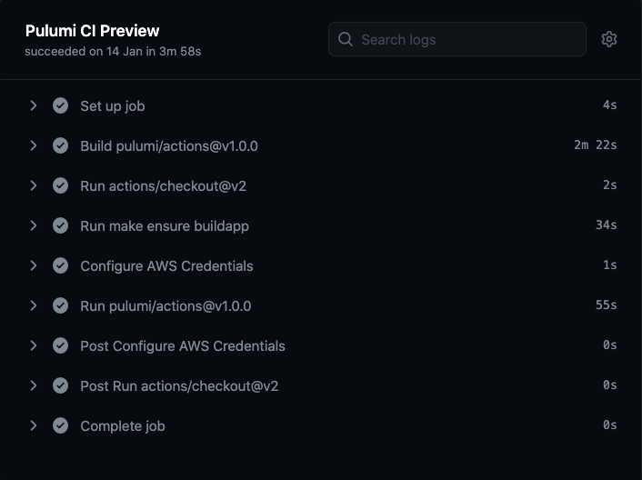
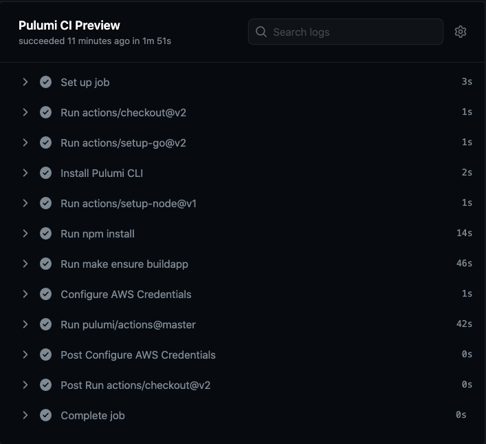

**Guest Article:** [Simen A. W. Olsen](https://github.com/cobraz) is a Software Architect and Manager at [Bjerk](https://bjerk.io),
a software development agency based in Oslo, Norway. He joins Paul Stack to talk about the new GitHub Action powered by
the Pulumi Automation API.

In this article, we'll take a look at how our [GitHub Action](https://github.com/pulumi/actions) has been re-architected
to be built on top of our [Automation API]().

<!--more-->

As a GitHub Actions launch partner in 2018, we released our original GitHub Action, built as a [Docker container action](https://docs.github.com/en/actions/creating-actions/creating-a-docker-container-action).
This Action packaged all the prerequisites with the Pulumi CLI to let users
run Pulumi commands. As the Pulumi ecosystem has grown, so too did the container run in GitHub Actions.

Since then, GitHub released an alternative way to create a GitHub Action
[by writing JavaScript](https://docs.github.com/en/actions/creating-actions/creating-a-javascript-action).
At Pulumi, and in our community, we love expressing everything we possibly can in code, so the new JavaScript support got us quite
excited about the "better together" possibilities! [Enter Pulumi's new Automation API](),
a new feature we launched in public preview in October 2020. This new capability lets you build infrastructure as code&mdash;in
pure code&mdash;without even needing to run a CLI. This sounded like a perfect match for a JavaScript Action.
Creating a JavaScript Action allows us to programmatically invoke the right Pulumi commands in response to actions, without needing to awkwardly
script a CLI. Instead, we were able to leverage the Automation API to fundamentally rethink our GitHub Action.

### Under the Hood

Let's take a look at the new JavaScript-based GitHub Action and see how it uses Automation API to execute Pulumi:

```typescript
const main = async () => {
  const config = await makeConfig();

  if (environmentVariables.PULUMI_ACCESS_TOKEN !== '') {
    await pulumiCli.run('login');
  } else if (config.cloudUrl) {
    await pulumiCli.run('login', config.cloudUrl);
  }

  const workDir = resolve(
    environmentVariables.GITHUB_WORKSPACE,
    config.workDir,
  );

  const stack = await LocalWorkspace.selectStack({
    stackName: config.stackName,
    workDir: workDir,
  });

  const onOutput = (msg: string) => {
    .....
  };

  const actions: Record<Commands, () => Promise<string>> = {
    up: () => stack.up({ onOutput }).then((r) => r.stdout),
    refresh: () => stack.refresh({ onOutput }).then((r) => r.stdout),
    destroy: () => stack.destroy({ onOutput }).then((r) => r.stdout),
    preview: async () => {
      const { stdout, stderr } = await stack.preview();
      onOutput(stdout);
      onOutput(stderr);
      return stdout;
    },
  };

  const output = await actions[config.command]();

  const outputs = await stack.outputs();

  for (const [outKey, outExport] of Object.entries(outputs)) {
    core.setOutput(outKey, outExport.value);
    if (outExport.secret) {
      core.setSecret(outExport.value);
    }
  }
};
```

The Action code is clean and concise because the power lies in the Automation API itself. The Action uses the Automation
API to drive Pulumi as part of your GitHub Actions workflows. This means that your workflows can take advantage of changes to Pulumi
and the Automation API as soon as they're released! And, of course, you can always write your own custom logic
using the Automation API like our Action does.

### Customizing Your Environment

The new Action puts you in control of the environment that it runs on. By comparison, the previous Docker-based
Action bundled specific tool versions, which left your CI pipeline at the mercy of our opinionated container. Now, if
you want to pin to specific versions of NodeJS / Python / Go / .NET or even Pulumi, you have that power!

You can even include a matrix strategy to test your Pulumi code against different language runtime versions and
different operating systems:

```yaml
name: 'Sample Pulumi NodeJS Application'
on:
  pull_request:

jobs:
  test-workflow:
    runs-on: ${{ matrix.os }}
    name: Testing Pulumi Preview on ${{ matrix.os }} with NodeJS ${{ matrix.node_version }}
    strategy:
      matrix:
        os: [ubuntu-latest, macos-latest, windows-latest]
        node_version: [10.x, 12.x, 14.x]
      fail-fast: false
    steps:
      - uses: actions/checkout@v2
      - uses: actions/setup-node@v1
        with:
          node-version: ${{ matrix.node_version }}
      - name: Install pulumi
        uses: pulumi/action-install-pulumi-cli@v1.0.1
      - run: npm install
      - uses: pulumi/actions@v2
        env:
          PULUMI_CONFIG_PASSPHRASE: not-a-secret
        with:
          command: preview
          cloud-url: file://~
          stack-name: dev
```

### Cloud Interaction

The previous Docker-based Action would look for the `GOOGLE_CREDENTIALS` environment
variable; if your workflow set that variable, the Action would run the following commands on your behalf:

```shell
gcloud auth activate-service-account --key-file=$GOOGLE_APPLICATION_CREDENTIALS
gcloud --quiet auth configure-docker $GOOGLE_DOCKER_HOSTNAME_LIST
```

With the new Action, you're fully in control of  authentication to cloud providers. To authenticate
with AWS / Azure / Google Cloud, you can now use their official Actions:

{}

{}

```yaml
      - name: Configure AWS Credentials
        uses: aws-actions/configure-aws-credentials@v1
        with:
          aws-access-key-id: ${{ secrets.AWS_ACCESS_KEY_ID }}
          aws-region: ${{ secrets.AWS_REGION }}
          aws-secret-access-key: ${{ secrets.AWS_SECRET_ACCESS_KEY }}
```



{}

```yaml
    - uses: azure/login@v1
      with:
        creds: ${{ secrets.AZURE_CREDENTIALS }}
```



{}

```yaml
      - uses: google-github-actions/setup-gcloud@v0
        with:
          service_account_key: ${{ secrets.GCP_KEY }}
          project_id: ${{ env.PROJECT_ID }}
          export_default_credentials: true
```



We recommend that you store all sensitive environment variables, like cloud credentials, in the
Actions [secret storage](https://docs.github.com/en/actions/reference/encrypted-secrets/)
and consume them using
[the `secrets` attribute](https://docs.github.com/en/actions/reference/encrypted-secrets#using-encrypted-secrets-in-a-workflow)
on your workflow's action.

### Faster

The new GitHub Action is much smaller and no longer needs to download a (very!) large Docker container. In the Docker-based
Action, we frequently saw workflows take up to 3 minutes to download the container. The new Action is much faster;
let's take a look:

#### Old Docker-based Action (v1)



#### New JavaScript-based Action, powered by Automation API (v2)



The new Pulumi GitHub Action is ready for you to use. Here's how to get started:

- Already use the v1 Pulumi GitHub Action? Migrate to the new one with our [migration guide]().
- New to Pulumi and GitHub Actions? Use our [getting started guide]() to set up your first Pulumi workflow.

We're eager to hear your feedback on this new Action. If you haven’t already signed up for our [Community Slack](https://slack.pulumi.com/), it’s
quick and easy! You can join in on conversations you like and get help from other community members, as well as the Pulumi Team. That’s it for now!
