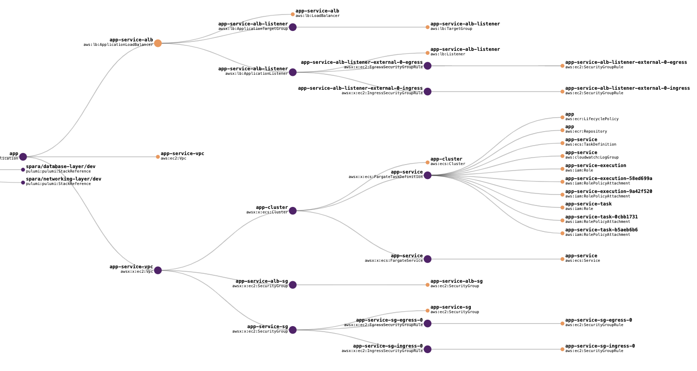
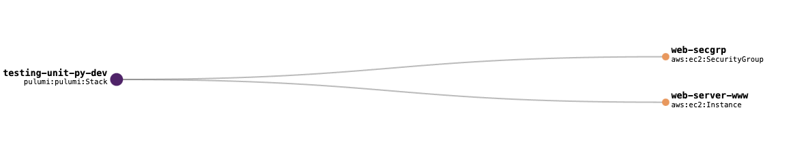

In the [previous article]() we discussed how to apply software testing methodologies to cloud engineering. We also examined testing regimes starting from the testing pyramid to the trophy and honeycomb models of testing better suited to distributed and cloud architectures. These testing regimes include three types of tests suited for cloud architectures:

- unit tests for testing methods and functions within a service
- property tests for validating specified service outputs
- integration tests to ensure that resources interact as specified

In this article, we'll do a deep dive into each of these testing methods.

<!--more-->

Cloud engineering testing differs from application testing because multiple dependencies between components can have high latency. Let's examine these dependencies using an [example application](https://github.com/pulumi/examples/tree/master/aws-stackreference-architecture) composed of an application layer, a database layer, and a network layer. We can visualize these dependencies with Pulumi's resource graph.The graph is constructed from the [inputs]() needed to create a resource.

The resource graph for the application layer shows many dependencies. The application deploys containers in AWS Fargate, which are instantiated with an application service that requires a service definition with many inputs.



Unit tests are ideal for validating inputs and ensuring that cloud resources are created. Let's look at a simple example with just two resources, an EC2 instance running a web server and a SecurityGroup policy.



We can use [mocks](https://devopedia.org/mock-testing) to test if the webserver has a name tag. First, we'll create the mocks and import the infrastructure that uses the mocks.

```python
import unittest
import pulumi

class MyMocks(pulumi.runtime.Mocks):
    def new_resource(self, args: pulumi.runtime.MockResourceArgs):
        outputs = args.inputs
        if args.type == "aws:ec2/instance:Instance":
            outputs = {
                **args.inputs,
                "publicIp": "203.0.113.12",
                "publicDns": "ec2-203-0-113-12.compute-1.amazonaws.com",
            }
        return [args.name + '_id', outputs]
    def call(self, args: pulumi.runtime.MockCallArgs):
        if args.token == "aws:ec2/getAmi:getAmi":
            return {
                "architecture": "x86_64",
                "id": "ami-0eb1f3cdeeb8eed2a",
            }
        return {}

pulumi.runtime.set_mocks(MyMocks())

# Now actually import the code that creates resources, and then test it.
import infra
```

We can write a test that checks if the web server has tags and specifically a name tag. First, here's the code that creates the web server instance:

```python
server = ec2.Instance('web-server-www',
    instance_type="t2.micro",
    vpc_security_group_ids=[ group.id ], # reference the group object above
    # Comment out to fail a test:
    tags={'Name': 'webserver'},          # name tag
    # Uncomment to fail a test:
    #user_data=user_data)                # start a simple web server
    ami=ami_id)
```

Using Python's `unittest` framework, the test looks like this:

```python
@pulumi.runtime.test
def test_server_tags():
    def check_tags(args):
        urn, tags = args
        assert tags, f'server {urn} must have tags'
        assert 'Name' in tags, 'server {urn} must have a name tag'

    return pulumi.Output.all(infra.server.urn, infra.server.tags).apply(check_tags)
```

The test has two assertions: one for tags on the server urn and another if the instance has a `Name` tag. When we call the test, we pass the server urn and tags. Note that we did not instantiate an EC2 instance and used a mock. This is why it can run unit tests frequently with quick results.

## Property tests

In addition to unit tests, we want to test the properties of a cloud resource. For example, we want to restrict access to a resource by creating a policy that limits ingress. For this use case, we need a property test to ensure the exact values required by a policy. The resource graph from our simple example shows that a `SecurityGroupRule sets ingress to the web server`. We can test if port 22 is open, which would enable logging into the server via ssh.

```python
group = ec2.SecurityGroup('web-secgrp', ingress=[
    { "protocol": "tcp", "from_port": 22, "to_port": 22, "cidr_blocks": ["0.0.0.0/0"] },
    { "protocol": "tcp", "from_port": 80, "to_port": 80, "cidr_blocks": ["0.0.0.0/0"] },
])
```

The code that tests for an open port 22  for any rule that includes `from_port` and `cidr_blocks` in the resource definition.

```python
# Test if port 22 for ssh is exposed.
@pulumi.runtime.test
def test_security_group_rules():
    def check_security_group_rules(args):
        urn, ingress = args
        ssh_open = any([rule['from_port'] == 22 and any([block == "0.0.0.0/0" for block in rule['cidr_blocks']]) for rule in ingress])
        assert ssh_open == False, f'security group {urn} exposes port 22 to the Internet (CIDR 0.0.0.0/0)'

    # Return the results of the unit tests.
    return pulumi.Output.all(infra.group.urn, infra.group.ingress).apply(check_security_group_rules)
```

Because `web-secgrp` has port 22 open to all IP addresses, we can expect it to fail this test. You can find the complete example for the unit and property tests on [Pulumi's example Github repository](https://github.com/pulumi/examples/tree/master/testing-unit-py).

## Integration testing

Integration testing requires deploying resources in either a test environment or an ephemeral environment. In this [integration testing example](https://github.com/pulumi/examples/tree/master/testing-integration-py), we'll deploy a single resource using Pulumi's [Automation API](). Spinning up [ephemeral environments]() for integration testing is an excellent use for the Automation API, which provides a programmatic interface for building infrastructure without a CLI or web-based console.

In this simple example, we'll use Automation API to create an S3 bucket and perform a set of tests that include:

- verifying the bucket name and AWS region
- upload a test file
- delete the file
- delete the stack with the bucket

The following code sets up the Pulumi [stack]() and S3 bucket with Automation API. It's interesting to note that the tests don't import the Pulumi AWS SDK and uses a combination of Python's built-in `unittest` framework and Amazon's [`boto3`](https://aws.amazon.com/sdk-for-python/) Python library. This illustrates the extensibility and flexibility of infrastructure as code by letting developers choose the tools and SDKs.

```python
import os
import unittest

import boto3
from pulumi.x import automation as auto

from resource_s3 import BUCKET_NAME, OUTPUT_KEY_BUCKET_NAME, OUTPUT_KEY_REGION


class TestS3(unittest.TestCase):

    @classmethod
    def setUpClass(cls) -> None:
        cls.STACK_NAME = 'staging'
        cls.REGION_NAME = 'eu-north-1'
        cls.WORK_DIR = os.path.join(os.path.dirname(__file__))
        cls.FILE_NAME = 'bucket.txt'

        cls.stack = auto.create_or_select_stack(stack_name=cls.STACK_NAME, work_dir=cls.WORK_DIR)
        cls.stack.set_config("aws:region", auto.ConfigValue(value=cls.REGION_NAME))
        cls.stack.up(on_output=print)
        cls.outputs = cls.stack.outputs()
        cls.s3 = boto3.resource('s3')
```

The `TestS3` class has a second `@classmethod` decorator for the tests; for example, the following code uploads a file and checks to see if the file is stored in the bucket.

```python
    def test_s3_create_permission(self):
        output_bucket_name = self.outputs.get(OUTPUT_KEY_BUCKET_NAME).value
        created_response = self.s3.Bucket(output_bucket_name).put_object(Key=self.FILE_NAME, Body='Hi')
        self.assertEqual(created_response.key, self.FILE_NAME)
```

When we run the test, it creates the stack and resource, runs the tests, and tears down the infrastructure. This process can be part of a CI/CD pipeline to run an automated integration test as part of the build process. The complete example for integration testing is available on [Github](https://github.com/pulumi/examples/tree/master/testing-integration-py).

## Summary

Although distributed infrastructure presents some unique challenges because of its asynchronous nature, we can perform efficient and automated testing. Whether it is unit and property testing that uses mocks and stubs or integration testing that requires deployed resources, infrastructure as code lets you use familiar testing frameworks and SDKs. Moreover, Pulumi's Automation API makes it simple to create stacks and spin up ephemeral infrastructure for integration testing. Learn more about [infrastructure testing]() with [Pulumi's Testing User Guide]() and get hands-on with our [testing examples](https://github.com/pulumi/examples/#testing).
