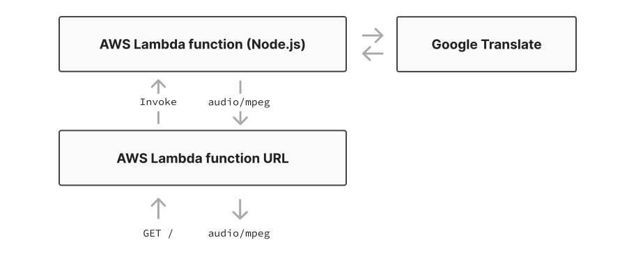

When I was a kid growing up in Southern California, there was a phone number you could call to find out what time it was. It was a local number, 853-1212 (easy to remember as the arrangement of the numbers on the keypad made a capital T), and I used it all the time, to set my watch, adjust the alarm clock, fix the display on the VCR. I don't recall the last time I used it, probably sometime in the mid '90s, but I do remember clearly the sound of [the voice at the other end of the line](https://telephoneworld.org/telephone-sounds/modern-north-american-telephone-sounds/time-temperature-weather-forecast-recordings/).

Services like these were called [speaking clocks](https://en.wikipedia.org/wiki/Speaking_clock) (although I never called them that; to me, it was just "calling Time"), and they date back to the early 1930s or so. In the U.S., most were powered by a machine called an [Audichron](https://en.wikipedia.org/wiki/Audichron) that used mechanical drums to play back the time of day, often with a little advertisement or the current temperature to go along with it.



By the mid-2000s, though, most of these locally run services had been shut down --- by then, we had clocks baked into our phones --- and today, only a handful of Audichrons survive. Thanks to the National Institute of Standards and Technology, however, [you can still call a phone number to get the time](https://www.theatlantic.com/technology/archive/2016/06/remember-when-you-could-call-the-time/488273/), and while the voice might not be the same, and long distance rates will apply, it's definitely there, and you can use it. So on the off chance you happen to find yourself with no idea what time it is and only an analog phone line in reach, fear not --- old-school telephone tech has your back. For now. Assuming you remember the number.

Recalling all this stuff did make me wonder, though, what a more modern version of a speaking clock might look like. So in this post, we're going to build one ourselves. We won't use an actual phone number, but we will use Pulumi and AWS --- and because we want to do it _right_, we'll take a test-driven approach to developing the infrastructure with [Jest, the JavaScript testing framework](https://jestjs.io). We'll use TypeScript and Node.js for everything, focus on [unit tests](), and when we're done, we'll have a single, serverless, browser-friendly HTTPS endpoint that returns an MP3 audio stream that speaks the current time.

Let's get started.

## Sketching it out

The first thing we'll need is a runtime environment --- someplace to run some server-side JavaScript that can render and deliver an audio file. Until recently, the easiest way to get an HTTP endpoint up and running on AWS has generally been with [AWS Lambda](https://aws.amazon.com/lambda/) and [API Gateway](https://aws.amazon.com/api-gateway/), using Lambda to run the requisite code and API Gateway to expose the Lambda to the internet. Pulumi Crosswalk actually makes this [really easy](), too --- but with the [release of AWS Lambda Function URLs]() this April, we now have another option, one that doesn't need API Gateway at all.

A [Lambda Function URL](https://docs.aws.amazon.com/lambda/latest/dg/lambda-urls.html) is just what it sounds like: a URL that exposes a Lambda function. Specifically, it's an AWS cloud resource that consists of a few properties that tell AWS whether to allow anonymous access to the function or to [protect it with AWS IAM](https://docs.aws.amazon.com/lambda/latest/dg/urls-auth.html#urls-auth-iam), and optionally, you can also provide a few [cross-origin resource-sharing (CORS) rules](https://docs.aws.amazon.com/lambda/latest/dg/urls-configuration.html#urls-cors) to provide (or restrict) access by websites running on other domains.

For an app like this one, a Function URL is a good fit, as it's simple, quick to deploy (and update), and it gives us all the control we need to get the job done. Architecturally, then, our little app will look something like this:



That about covers the infrastructure --- but what about the sound?

As it happens, [Google Translate](https://translate.google.com/) offers a publicly accessible text-to-speech API that can, as long as you don't overuse it, render a string to MP3 audio. We can use that API to generate the time-of-day message, tack the sound of a beep onto the end of it (for maximum nostalgic effect), and voil&agrave;: instant, infinitely scalable, cloud-native speaking clock.

Plan in place, we can kick things off by creating a new Pulumi project.

## Create a new TypeScript project

Start by creating a new AWS TypeScript project [in the usual way](/docs/get-started/aws/create-project?language=nodejs):

```bash
$ mkdir audichron-2022 && cd audichron-2022
$ pulumi new aws-typescript
```

Step through the prompts to create a new [stack]() (you'll only need one stack for this project), and when the new-project wizard completes, clear out the contents of `index.ts` entirely, as we'll be building this program entirely from the ground up.

## Install and configure Jest

Since we're working with TypeScript, we can use [`ts-jest`](https://github.com/kulshekhar/ts-jest), which conveniently brings Jest along for the ride:

```bash
$ npm install ts-jest @types/jest --save-dev
```

Jest requires a bit of [configuration](https://jestjs.io/docs/configuration), so add a new file at the root of the project, called `jest.config.ts`, with the following code:

```typescript
import type { Config } from "@jest/types";

const config: Config.InitialOptions = {
    preset: "ts-jest",
};

export default config;
```

With Jest now installed and configured, and its helpers (like `describe` and `expect`) declared globally, you can create a new spec file to hold your tests. Add another file at the root of the project called `index.spec.ts`, and give it the following temporary content:

```typescript
import "jest";

describe("My speaking clock", () => {
    it ("works", () => {
        expect(true).toBeTruthy;
    });
});
```

Lastly, in `package.json`, add a `scripts` block with a helper to make running the tests a little easier:

```javascript
{
    "name": "audichron-2022",
    "devDependencies": {
        "@types/node": "^14",
        "ts-jest": "^28.0.3"
    },
    ...
    "scripts": {
        "test": "jest"
    }
}
```

Now run the tests, just to make sure you've got everything wired up correctly. If all goes well, you should see that the temporary spec we just added happily passes:

```bash
$ npm test

PASS  ./index.spec.ts
  My speaking clock
    ✓ works
```

With that, it's time to get to start writing some real tests.

## Start with some failing tests

As devoted practitioners of [test-driven development](https://en.wikipedia.org/wiki/Test-driven_development), we're going to start by writing some unit tests --- specifically, some _failing_ unit tests that we can fix by writing the Pulumi code to make them pass.

Recall that our design requires just two cloud resources: a Lambda function and a Lambda function URL. For the function itself, we'll use the high-level [`aws.lambda.CallbackFunction`]() resource, one of my favorites for managing for Lambdas because it requires only one property: an inline JavaScript function to handle the event that triggers the Lambda.

For the URL resource --- the eventual triggerer of that event ---  you'll use an [`aws.lambda.FunctionURL`]() configured to make the Lambda publicly accessible (i.e., available to anyone on the internet) and embeddable on any domain, making it easy, for example, to embed the URL as the `src` attribute of an [HTML5 `audio` element](https://developer.mozilla.org/en-US/docs/Web/HTML/Element/audio).

So to get things going, we'll need to:

* Configure Pulumi to [mock AWS resources](). We're writing unit tests, after all, and we want them to be fast, so we'll need to prevent those tests from provisioning any real cloud infrastructure.

* Import your Pulumi resource declarations --- the function and the function URL --- into `index.spec.ts` so you can reference them in tests.

In that light, replace the contents of `index.spec.ts` with the following code, which, after some setup to switch Pulumi into unit-testing mode, contains just one test: a check to make sure that the function URL is configured with the right [`authorizationType`](https://docs.aws.amazon.com/lambda/latest/dg/urls-auth.html). I've included some comments to help explain what each line is doing:

```typescript
import * as pulumi from "@pulumi/pulumi";
import "jest";

describe("My speaking clock", () => {

    // Define the infra variable as a type whose shape matches that of the
    // to-be-defined resources module.
    // https://www.typescriptlang.org/docs/handbook/2/typeof-types.html
    let infra: typeof import("./resources");

    beforeAll(() => {

        // Put Pulumi in unit-test mode, mocking all calls to cloud-provider APIs.
        pulumi.runtime.setMocks({

            // Mock requests to provision cloud resources and return a canned response.
            newResource: (args: pulumi.runtime.MockResourceArgs): {id: string, state: any} => {

                // Here, we're returning a same-shaped object for all resource types.
                // We could, however, use the arguments passed into this function to
                // customize the mocked-out properties of a particular resource based
                // on its type. See the unit-testing docs for details:
                // https://www.pulumi.com/docs/guides/testing/unit
                return {
                    id: `${args.name}-id`,
                    state: args.inputs,
                };
            },

            // Mock function calls and return whatever input properties were provided.
            call: (args: pulumi.runtime.MockCallArgs) => {
                return args.inputs;
            },
        });
    });

    beforeEach(async () => {

        // Dynamically import the resources module.
        // https://developer.mozilla.org/en-US/docs/Web/JavaScript/Reference/Statements/import#dynamic_imports
        infra = await import("./resources");
    });

    describe("function URL", () => {

        it("is publicly accessible", (done) => {
            infra.timeURL.authorizationType.apply(authType => {
                try {
                    expect(authType).toBe("NONE");
                    done();
                } catch (err) {
                    done(err);
                }
            });
        });
    });
});
```

We can't quite run these tests just yet, though, as they rely on a module called `resources` that we haven't yet defined. Let's do that now by creating a new file, `resources.ts`, containing some stubs for the cloud resources we've elected to use:

```typescript
import * as pulumi from "@pulumi/pulumi";
import * as aws from "@pulumi/aws";

export const timeFunction = new aws.lambda.CallbackFunction("time-function", {
    callback: () => {
        // Leave the callback implementation empty for now.
    },
});

export const timeURL = new aws.lambda.FunctionUrl("time-url", {
    functionName: timeFunction.name,
    authorizationType: "", // Leave this empty, too. (We want our first test to fail.)
});
```

Now run the tests, and you should see that the public-accessibility test fails --- which shouldn't be surprising, as we haven't yet supplied an acceptable value:

```bash
$ npm test

FAIL  ./index.spec.ts
  My speaking clock
    function URL
      ✕ is publicly accessible

  ● My speaking clock › function URL › is publicly accessible

    expect(received).toBe(expected) // Object.is equality

    Expected: "NONE"
    Received: ""
```

Now let's turn that sad-looking ❌ into a ✅.

## Make the tests pass

Update the `FunctionUrl` resource to change its `authorizationType` input to `NONE` (meaning for anonymous access, no authorization required):

```diff
export const timeURL = new aws.lambda.FunctionUrl("time-url", {
    functionName: timeFunction.name,
-   authorizationType: "",
+   authorizationType: "NONE",
});
```

Once you do that, you should be able to run the test suite again, and this time, see it pass:

```bash
$ npm test

PASS  ./index.spec.ts
  My speaking clock
    function URL
      ✓ is publicly accessible
```

Excellent: you're now well on your way to writing more tests with Jest --- and we'll do that in a moment. But first, let's digress momentarily to explore a few other ways of writing Jest specs with Pulumi.

## Tidy up the specs

If you've written JavaScript tests before, particularly with tools like Jest, [Jasmine](https://jasmine.github.io/), and [Mocha](https://mochajs.org/), there's a good chance you've gotten used to writing those tests in a particular way. And if you're like me, you might've raised a bit of an eyebrow when you saw how that first test was written. Here it is again, this time with comments that capture the questions I might've had myself if I were seeing this code for the first time:

```typescript
it("is publicly accessible", (done) => {
    infra.timeURL.authorizationType.apply(auth => { // Why do I have to use .apply() here?
        try {                                       // What happens if I don't try/catch?
            expect(auth).toBe("NONE");              // Is it possible to use expect() by itself?
            done();                                 // Do I have to call done()? What if I don't?
        } catch (err) {                             // How can I make these tests more readable?
            done(err);                              // Is all of this code necessary?
        }
    });
});
```

This is a perfectly valid test, of course; we know because we just ran it. Still, you might wonder, especially since we're only checking one property, whether this test might be written a bit more concisely --- something more like this, maybe:

```typescript
it("is publicly accessible", () => {
    expect(infra.timeURL.authorizationType).toBe("NONE");  // Alas, nope.
});
```

The main reason is the asynchronous nature of the objects we're testing. An `aws.lambda.FunctionUrl`, after all, isn't just a plain ol' JavaScript object --- it's a [Pulumi `CustomResource`](), a representation of an eventual resource running in the cloud, with properties that may not be known until sometime after the resource has been deployed. While it's true we provided `authorizationType` as a regular JavaScript `string`, by the time we attempt to read it in the test, it's been transformed into a [`pulumi.Output<string>`]() --- an asynchronous value, like a [promise](https://developer.mozilla.org/en-US/docs/Web/JavaScript/Reference/Global_Objects/Promise), that has to be unwrapped with a call to `apply()` before it can be read.

However, just adding `apply` and calling `expect` from within its callback doesn't quite work, either:

```typescript
it("is publicly accessible", () => {
    infra.timeURL.authorizationType.apply(authType => {
        expect(authType).toBe("NONE");  // Also nope.
    });
});
```

Although that might not be obvious at first, since on the surface, the test _appears_ to pass:

```bash
$ npm test

PASS  ./index.spec.ts
  My speaking clock
    function URL
      ✓ is publicly accessible
```

It isn't until you force the test to fail that it becomes clearer something's gone sideways. Try changing the expected `authorizationType` to something other than `NONE` and you'll see what I mean:

```bash
$ npm test

PASS  ./index.spec.ts
  My time app
    function URL
      ✓ is publicly accessible

Test Suites: 1 passed, 1 total
Tests:       1 passed, 1 total

[UnhandledPromiseRejection: This error originated either by throwing inside of an async function
without a catch block, or by rejecting a promise which was not handled with .catch(). The promise
rejected with the reason "Error: expect(received).toBe(expected) // Object.is equality

Expected: "AWS_IAM"
Received: "NONE"".] {
  code: 'ERR_UNHANDLED_REJECTION'
}
```

All is not lost, though. We do have other options, and that `UnhandledPromiseRejection` offers a bit of a clue.

## Turn outputs into promises

Jest actually has [built-in support for writing asynchronous tests with promises](https://jestjs.io/docs/asynchronous), and there are a couple of ways you can write specs that use them:

* Have the function passed to `it` (or its alias, `test`) return a promise containing your expectation
* Pass an `async` function to `it` and `await` the promise in the usual way

There's only one problem: `pulumi.Output`s may indeed be promise-_like_, but they aren't actual promises.

They can, however, be wrapped in promises pretty easily. I like the way Pulumi community member [@aviflax](https://github.com/aviflax) handled this [with a little utility function](https://github.com/pulumi/pulumi/issues/5924#issuecomment-897938240) that wraps the `Output` and preserves the type of its underlying value. Here's that function, followed by a couple of examples that use it:

```typescript
// Convert a pulumi.Output to a promise of the same type.
function promiseOf<T>(output: pulumi.Output<T>): Promise<T> {
    return new Promise(resolve => output.apply(resolve));
}

// Our test, rewritten to have it() return a Promise<string>.
it("is publicly accessible", () => {
    return promiseOf(infra.timeURL.authorizationType).then(authType => {
        expect(authType).toBe("NONE");
    });
});

// The same test, rewritten to use async/await.
it("is publicly accessible", async () => { // <-- Don't miss that async!
    const authType = await promiseOf(infra.timeURL.authorizationType);
    expect(authType).toBe("NONE");
});
```

Either approach works equally well, but I'm slightly more partial to the latter for its conciseness. So for now, update `index.spec.ts` to add the `promiseOf` helper and adjust the test accordingly, then run the suite one more time to make sure all's well:

```typescript
// ...

// Convert a pulumi.Output to a promise of the same type.
function promiseOf<T>(output: pulumi.Output<T>): Promise<T> {
    return new Promise(resolve => output.apply(resolve));
}

describe("My speaking clock", () => {
    // ...

    describe("function URL", () => {

        it("is publicly accessible", async () => {
            const authType = await promiseOf(infra.timeURL.authorizationType);
            expect(authType).toBe("NONE");
        });
     });
});
```

Assuming you're back in ✅ territory, let's move on so we can finish things off.

## Finish the app

We're in good shape: we've got scaffolding for our Jest-powered unit tests and we're generally happy with how they look, so it's time to round out the rest of the app and its tests so we can deploy. We'll go through this last part briskly, as we've covered most of the important stuff at this point, and pause only briefly to point out what's important as we go.

Here's the plan:

* We'll add one more test to make sure the function URL is CORS-friendly
* We'll add another test to make sure the URL resource is bound to the right Lambda function
* We'll add the Lambda code to generate and return the audio file
* We'll deploy, and bask in the warm glow of nostalgia

Let's get to it.

### Add the remaining tests

To `index.spec.ts`, add two more tests, one to ensure the function is accessible to browsers running [on any domain](https://developer.mozilla.org/en-US/docs/Web/HTTP/CORS), the other to verify the function URL resource is exposing the right function (if we didn't, it'd be easy to change that reference by mistake and accidentally expose the wrong function):

```typescript
describe("My speaking clock", () => {
    // ...

    describe("function URL", () => {
        // ...

        it("is CORS-friendly", async () => {
            const authType = await promiseOf(infra.timeURL.cors);
            expect(authType).toEqual({
                allowOrigins: ["*"],
                allowMethods: ["GET"],
            });
        });

        it("is bound to the right Lambda function", async () => {
            const timeFuncName = await promiseOf(infra.timeFunction.name);
            const timeURLFunc = await promiseOf(infra.timeURL.functionName);
            expect(timeFuncName).toEqual(timeURLFunc);
        });
    });
});
```

Run the tests, and you should see one failure:

```bash
$ npm test

FAIL  ./index.spec.ts (14.256 s)
  My speaking clock
    function URL
      ✓ is publicly accessible (3022 ms)
      ✕ is CORS-friendly (3 ms)
      ✓ is bound to the right Lambda function (1 ms)

    Expected: {"allowMethods": ["GET"], "allowOrigins": ["*"]}
    Received: undefined

Tests:       1 failed, 2 passed, 3 total
```

A quick addition to the `FunctionUrl` in `resources.ts` should get you to green:

```diff
// ...
export const timeURL = new aws.lambda.FunctionUrl("time-url", {
    functionName: timeFunction.name,
    authorizationType: "NONE",
+   cors: {
+       allowOrigins: ["*"],
+       allowMethods: ["GET"],
+   },
});
```

```bash
$ npm test

PASS  ./index.spec.ts
  My speaking clock
    function URL
      ✓ is publicly accessible
      ✓ is CORS-friendly
      ✓ is bound to the right Lambda function

Tests:       3 passed, 3 total
```

That's it for the tests! Now for the final additions.

### Produce the audio message

The last thing we'll need to do is render some audio. For this, we'll need to communicate with Google Translate, our text-to-speech provider of choice, and that means we'll need an HTTP client. I generally like [`node-fetch`](https://www.npmjs.com/package/node-fetch), so let's go with that:

```bash
npm install --save node-fetch@2
```

Now, finish the program by importing `node-fetch` into `resources.ts`, adding a function to produce a speech-friendly string indicating the current time and updating the `CallbackFunction`'s `callback` property to send the string to Google Translate to produce the desired result. Here's the complete file, with comments, for reference:

```typescript
import * as pulumi from "@pulumi/pulumi";
import * as aws from "@pulumi/aws";

const fetch = require("node-fetch");

// Convert the current time into a speech-friendly string.
export function getSpeechText() {
    const now = new Date();
    now.setSeconds(now.getSeconds() + 6);

    const local = new Date(now.toLocaleString("en-US", { timeZone: "America/Los_Angeles" }));
    const localHour = local.getHours();
    const localMinute = local.getMinutes();
    const h = localHour > 12 ? localHour - 12 : localHour;
    const m = localMinute < 10 ? `oh ${localMinute}` : localMinute; // So 2:03 -> "two-oh-three"
    const s = local.getSeconds();

    return `At the tone, the time will be ${h} ${m}. And ${s} seconds.`;
}

export const timeFunction = new aws.lambda.CallbackFunction("time-function", {

    // Update the Lambda callback body to convert the current time into an MP3 file.
    callback: async () => {
        const text = getSpeechText();
        const speechURL = `https://translate.google.com/translate_tts?ie=UTF-8&q=${encodeURIComponent(text)}&textLen=${text.length}&tl=en&client=tw-ob`;
        const beepURL = "https://www.pulumi.com/uploads/beep.mp3";
        const ttsResponse = await fetch(speechURL);
        const beepResponse = await fetch(beepURL);
        const speech = await ttsResponse.arrayBuffer();
        const beep = await beepResponse.arrayBuffer();

        // Tack a beep onto the end of the audio returned from Google Translate, then
        // render the whole thing as a base-64 encoded string.
        const body = Buffer.concat([Buffer.from(speech), Buffer.from(beep)]).toString("base64");

        // Return an appropriately shaped HTTP response.
        return {
            body,
            headers: { "Content-Type": "audio/mpeg" },
            isBase64Encoded: true,
            statusCode: 200,
        };
    },
});

export const timeURL = new aws.lambda.FunctionUrl("time-url", {
    functionName: timeFunction.name,
    authorizationType: "NONE",
    cors: {
        allowOrigins: ["*"],
        allowMethods: ["GET"],
    },
});

// Export the public URL of our shiny new service.
export const audioURL = timeURL.functionUrl;
```

Finally, open `index.ts` (which should still be empty) and add a couple of lines to import the `resources` module and export the function URL as a Pulumi [stack output]():

```typescript
import "./resources";

export { audioURL } from "./resources";
```

And that's it. We're ready to deploy.

## Deploy the service

Doublecheck your AWS credentials are [configured](), then deploy the new service with a single `pulumi up`:

```bash
$ pulumi up

...
Updating (dev)

View Live: https://app.pulumi.com/cnunciato/audichron-2022/dev/updates/1

     Type                             Name                    Status
 +   pulumi:pulumi:Stack              audichron-2022-dev      created
 +   ├─ aws:iam:Role                  time-function           created
 +   ├─ aws:lambda:Function           time-function           created
 +   ├─ aws:iam:RolePolicyAttachment  time-function-7cd09230  created
 +   ├─ aws:iam:RolePolicyAttachment  time-function-a1de8170  created
 +   ├─ aws:iam:RolePolicyAttachment  time-function-1b4caae3  created
 +   ├─ aws:iam:RolePolicyAttachment  time-function-019020e7  created
 +   ├─ aws:iam:RolePolicyAttachment  time-function-4aaabb8e  created
 +   ├─ aws:iam:RolePolicyAttachment  time-function-74d12784  created
 +   ├─ aws:iam:RolePolicyAttachment  time-function-e1a3786d  created
 +   ├─ aws:iam:RolePolicyAttachment  time-function-6c156834  created
 +   ├─ aws:iam:RolePolicyAttachment  time-function-b5aeb6b6  created
 +   └─ aws:lambda:FunctionUrl        time-url                created

Outputs:
    audioURL: "https://52rjmmybwfwcud3nxxhosznpum0cycbw.lambda-url.us-west-2.on.aws/"

Resources:
    + 13 created

Duration: 20s
```

When the update completes, open the URL in your browser of choice, and you should hear the message you've been waiting for --- one that might even make [Pat Fleet](https://en.wikipedia.org/wiki/Pat_Fleet) proud:

```bash
$ open $(pulumi stack output audioURL)
```



When you're ready, you can tear everything down with a `pulumi destroy`.

## Wrapping up

Beyond just having a nifty (and admittedly rather silly) new way to tell time, you should have a much better sense at this point of how you can use Pulumi with Jest to write better, safer infrastructure code.

From here, there's a bunch more you might think about next: writing more tests to cover the code we just added, [exploring some additional flavors of testing]() in the docs, or [having a look at a few examples](https://github.com/pulumi/examples). You'll find the [full source for this walkthrough up on GitHub](https://github.com/cnunciato/pulumi-jest-unit-testing-example) as well.

Happy testing!
