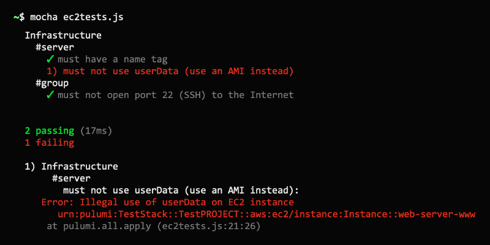
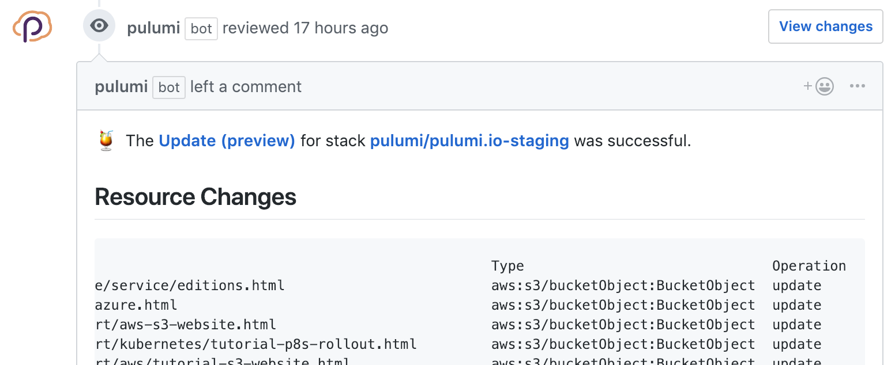

Using Pulumi and general purpose languages for infrastructure as code
comes with many benefits: leveraging existing skills and knowledge,
eliminating boilerplate through abstraction, and using the same
ecosystem of tools like IDEs and linters that your team already knows
and loves. In general, these are all attributes of software engineering,
which not only make us more productive, but also improve the quality of
our code. It's only natural, therefore, that using general purpose
languages unlocks another important software engineering practice:
**testing**.

In this article, we will see the many ways in which Pulumi lets us test
our infrastructure as code.
<!--more-->



## Why Test Your Infrastructure?

Before jumping into the details, it's worth asking: Why test your
infrastructure, anyway? There are many reasons to do this, however here
are a few examples:

- Unit testing individual functions or pieces of logic in your program
- Ensuring that the program's desired infrastructure state meets
  certain constraints
- Catching common mistakes, like forgetting to encrypt your storage
  buckets, or exposing virtual machines unprotected to the open
  Internet
- Ensuring that the provisioned infrastructure has certain desired
  attributes
- Doing runtime testing of the application logic that is running
  inside of your compute infrastructure, to ensure that it is healthy
  after your infrastructure has been provisioned

As we see, there's a broad spectrum of infrastructure testing options
available. Pulumi has mechanisms available for testing at each point
along this spectrum. Let's dig in and see how.

## Unit Testing

Pulumi programs are authored in a general purpose language like
JavaScript, Python, TypeScript, or Go. The full power of each language
is available, including access to tools and libraries for that runtime,
including testing frameworks. Pulumi is also multi-cloud, meaning the
full underlying platform for each cloud is available too, and therefore
available for testing.

(Despite being multi-language and multi-cloud, for the purposes of this
article let's assume we are using JavaScript, with Mocha for testing,
and targeting AWS. Python `unittest`, Go's test framework, or any of
your favorite unit test frameworks in your language of choice would do,
and of course Pulumi works great with Azure, Google Cloud, and
Kubernetes, among others.)

As we've seen, there are several reasons you may want to test your
infrastructure code. One of them is basic unit testing. Because your
code may have functions -- say, to compute CIDR blocks, dynamically
compute names and tags, etc. -- you probably want to test them. Doing
this is the same as writing ordinary unit tests against any program in
your language as choice.

Going one step further, you may want to test the way your program
allocates resources. To illustrate, let's imagine we want to create a
simple EC2-based webserver, but want to ensure:

- Instances have a `Name` tag.
- Instances must not use an inline `userData` script -- we must use
  an AMI (image).
- Instances must not have SSH open to the Internet.

Our running example is loosely based on
[our aws-js-webserver example](https://github.com/pulumi/examples/tree/master/aws-js-webserver):

**index.js:**

```javascript
let aws = require("@pulumi/aws");
 
let group = new aws.ec2.SecurityGroup("web-secgrp", {
    ingress: [
    { protocol: "tcp", fromPort: 22, toPort: 22, cidrBlocks: ["0.0.0.0/0"] },
    { protocol: "tcp", fromPort: 80, toPort: 80, cidrBlocks: ["0.0.0.0/0"] },
    ],
});
 
let userData =
`#!/bin/bash echo "Hello, World!" > index.html nohup python -m SimpleHTTPServer 80 &`;
 
let server = new aws.ec2.Instance("web-server-www", {
    instanceType: "t2.micro",
    securityGroups: [ group.name ], // reference the group object above
    ami: "ami-c55673a0"             // AMI for us-east-2 (Ohio),
    userData: userData              // start a simple web server
});
 
exports.group = group;
exports.server = server;
exports.publicIp = server.publicIp;
exports.publicHostName = server.publicDns;
```

This is a basic Pulumi program: it simply allocates an EC2 security
group and instance. Notice, however, that we are violating all three of
the rules stated above -- let's write some tests!

### Writing the Tests

The overall structure and scaffolding of our tests will look like any
ordinary Mocha testing:

**ec2tests.js**

```javascript
let assert = require("assert");
let mocha = require("mocha");
let pulumi = require("@pulumi/pulumi");
let infra = require("./index");
 
describe("Infrastructure", function() {
    let server = infra.server;
    describe("#server", function() {
    // TODO(check 1): Instances have a Name tag.
    // TODO(check 2): Instances must not use an inline userData script.
    });
    let group = infra.group;
    describe("#group", function() {
    // TODO(check 3): Instances must not have SSH open to the Internet.
    });
});
```

Now let's implement our first test: ensuring that instances have a
`Name` tag. To verify this we simply need to grab hold of the EC2
instance object, and check the relevant `tags` property:

```javascript
// check 1: Instances have a Name tag.
it("must have a name tag", function(done) {
    pulumi.all([server.urn, server.tags]).apply(([urn, tags]) => {
        if (!tags || !tags["Name"]) {
            done(new Error(`Missing a name tag on server ${urn}`));
        } else {
            done();
        }
    });
});
```

This looks like a normal test, with a few noteworthy pieces:

- Since we're querying resource state before we've done a deployment,
  our tests are always effectively running in "plan" (or "preview")
  mode. Thus, there are many properties whose values will simply not
  resolve yet or will be undefined. This includes any output
  properties computed by your cloud provider. That's fine for these
  tests -- we're checking for valid inputs anyway. We'll revisit this
  later when it comes to integration testing.
- Because all Pulumi resource properties are "outputs" -- since many
  of them are computed asynchronously -- we need to use the apply
  method to get access to the values. This is a lot like promises and
  the `then` function.
- Because we are using multiple properties, mostly just so we can show
  the resource URN in the error message, we need to use the
  `pulumi.all` function to join all of them.
- Finally, since these outputs are resolved asynchronously, we need to
  use Mocha's built-in asynchronous test capability, with the `done`
  callback, or by returning a promise.

After we've gotten through that setup, we get access to the raw inputs
as plain JavaScript values. The `tags` property is a map, so we just
make sure it is (1) not falsey, and (2) not missing an entry for the
`Name` key in the map. This is very basic, but we can check anything!

Now let's write our second check. It's even easier:

```javascript
// check 2: Instances must not use an inline userData script.
    it("must not use userData (use an AMI instead)", function(done) {
        pulumi.all([server.urn, server.userData]).apply(([urn, userData]) => {
            if (userData) {
                done(new Error(`Illegal use of userData on server ${urn}`));
            } else {
                done();
            }
    });
});
```

And finally, let's write our third check. It's a bit more complex
because we're searching for ingress rules associated with a security
group -- of which there may be many -- and CIDR blocks within those
ingress rules -- of which there may also be many. But it's still easy:

```javascript
// check 3: Instances must not have SSH open to the Internet.
it("must not open port 22 (SSH) to the Internet", function(done) {
    pulumi.all([ group.urn, group.ingress ]).apply(([ urn, ingress ]) => {
        if (ingress.find(rule =>
            rule.fromPort == 22 && rule.cidrBlocks.find(block => block === "0.0.0.0/0"))) {
                done(new Error(`Illegal SSH port 22 open to the Internet (CIDR 0.0.0.0/0) on group ${urn}`));
        } else {
            done();
        }
    });
});
```

That's it -- now let's actually run the tests!

### Running the Tests

For the most part, we can run the tests in the usual way in your test
framework of choice. There is one thing specific to Pulumi we need to
cover first, however.

Usually you run your Pulumi programs with the pulumi CLI. That
configures the language runtime, monitors execution from the engine so
that resource operations can be recorded and turned into a plan, and so
on. There is one problem, however: When running under the watchful eye
of your test framework, this connection to the CLI, and Pulumi's engine,
will not exist.

To work around this problem, we simply have to mock three pieces of
information:

- Your project name, which can be supplied with the
  `PULUMI_NODEJS_PROJECT` environment variable (or more generally
  `PULUMI_<LANGUAGE>_PROJECT` in other languages).
- Your stack name, which can be supplied with the
  `PULUMI_NODEJS_STACK` environment variable (or more generally
  `PULUMI_<LANGUAGE>_STACK` in other languages).
- Your stack configuration variables. These can be supplied using the
  `PULUMI_CONFIG` environment variable, and its format is a JSON map
  of configuration key/value pairs.

The program will emit some warning messages indicating the connection to
the CLI/engine is not available at runtime. This is important to know,
because your program won't actually be deploying anything -- which can
come as a surprise if that's not what you meant to do! To tell Pulumi
that's what you intended, you can set `PULUMI_TEST_MODE` to `true`.

Imagine we want a project name of `my-ws`, stack name of `dev`, and AWS
region of `us-west-2`. The command line to run your Mocha tests would
therefore be:

```bash
$ PULUMI_TEST_MODE=true  \
  PULUMI_NODEJS_STACK="my-ws" \
  PULUMI_NODEJS_PROJECT="dev" \
  PULUMI_CONFIG='{ "aws:region": "us-west-2" }'  \
  mocha tests.js
```

Running this will tell us that we have three failing tests, as we had
hoped!

```
      Infrastructure
        #server
     1) must have a name tag      2) must not use userData (use an AMI instead)
        #group
     3) must not open port 22 (SSH) to the Internet 
      0 passing (17ms)
      3 failing
     
     1) Infrastructure
           #server
         must have a name tag:
     Error: Missing a name tag on server
     urn:pulumi:my-ws::my-dev::aws:ec2/instance:Instance::web-server-www 
     2) Infrastructure
           #server
         must not use userData (use an AMI instead):
     Error: Illegal use of userData on server
     urn:pulumi:my-ws::my-dev::aws:ec2/instance:Instance::web-server-www 
     3) Infrastructure
           #group
         must not open port 22 (SSH) to the Internet:
     Error: Illegal SSH port 22 open to the Internet (CIDR 0.0.0.0/0) on group   
```

Let's fix our program to comply:

```javascript
"use strict";
 
let aws = require("@pulumi/aws");
 
let group = new aws.ec2.SecurityGroup("web-secgrp", {
    ingress: [
    { protocol: "tcp", fromPort: 80, toPort: 80, cidrBlocks: ["0.0.0.0/0"] },
    ],
});
 
let server = new aws.ec2.Instance("web-server-www", {
    tags: { "Name": "web-server-www" },
    instanceType: "t2.micro",
    securityGroups: [ group.name ], // reference the group object above
    ami: "ami-c55673a0"             // AMI for us-east-2 (Ohio),
});
 
exports.group = group;
exports.server = server;
exports.publicIp = server.publicIp;
exports.publicHostName = server.publicDns;
```

And then rerun our tests:

```
      Infrastructure
        #server
          ✓ must have a name tag
          ✓ must not use userData (use an AMI instead)
        #group
          ✓ must not open port 22 (SSH) to the Internet
     
     
     3 passing (16ms)
```

They all passed -- huzzah! **✓✓✓**

## Deployment Testing

This style of testing is powerful and lets us do white box testing of
the innards of how our infrastructure code works. This style of testing
is somewhat limited in what we can check, however. The tests run on an
in-memory representation of Pulumi's deployment plan -- before actually
performing the deployment -- and so cannot test anything the deployment
itself. For that, Pulumi has an integration test framework. The two
approaches work great together!

Pulumi's integration test framework is written in Go and is how we test
much of our internal code. If the earlier unit test approach took more
of a white box testing approach, the integration test framework is very
much black box. (There are also options for thorough internals-oriented
testing.) This framework has been built to take a directory containing a
full Pulumi program and drive various lifecycle operations against it
-- such as deploying a new stack from scratch, updating it with
variations, and tearing it down afterwards, potentially multiple times.
We run these in checkin suites, on a recurring basis (such as nightly),
and as stress tests.

(We have [an open work item](https://github.com/pulumi/pulumi/issues/2287) which will bring
similar integration testing capabilities to each native language SDK.
You can use the Go integration test framework no matter the language
your Pulumi program is written in, however.)

By running a program through this integration test framework, you can
ensure:

- Your project's code is syntactically well formed and runs without
  errors.
- Your stack's configuration and secrets settings work and are
  interpreted correctly.
- Your project can be successfully deployed to your cloud provider of
  choice.
- Your project can be successfully updated from its starting state to
  N other states.
- Your project can be successfully destroyed and removed from your
  cloud provider.

As we will see soon, you can also leverage this framework to perform
runtime validation.

### A Basic Integration Test

To see this in action, we'll look from the pulumi/examples repo, since
our team and community here at Pulumi use that to validate our own
examples in pull requests, checkins, and nightlies.

The following is a simplified test of our example that provisions an
[S3 bucket and some objects in Pulumi](https://github.com/pulumi/examples/tree/master/aws-js-s3-folder):

**example_test.go:**

```go
package test

import (
    "os"
    "path"
    "testing"
 
    "github.com/pulumi/pulumi/pkg/testing/integration"
)
 
func TestExamples(t *testing.T) {
    awsRegion := os.Getenv("AWS_REGION")
    if awsRegion == "" {
    awsRegion = "us-west-1"
    }
    cwd, _ := os.Getwd()
    integration.ProgramTest(t, &integration.ProgramTestOptions{
    Quick:       true,
    SkipRefresh: true,
    Dir:         path.Join(cwd, "..", "..", "aws-js-s3-folder"),
    Config: map[string]string{
        "aws:region": awsRegion,
    },
    })
}
```

This test runs through a basic lifecycle of stack creation, updating,
and destruction, for the `aws-js-s3-folder` example. It takes about a
minute or so to report success:

```
$ go test .
PASS
ok      ... 43.993s
```

There are many, many options to control the behavior of these tests. For
a full set of options, see [the `ProgramTestOptions` data
structure](https://godoc.org/github.com/pulumi/pulumi/pkg/testing/integration#ProgramTestOptions).
For instance, you can configure a Jaeger endpoint for tracing
(`Tracing`), tell the harness to expect failure for negative testing
(`ExpectFailure`), apply a series of "edits" to the program for a
sequence of update state transitions (`EditDirs`), and more. Let's see
how to use these to do validate that we deployed what we expected.

### Validating the Shape of Resources

All of the above integration ensures that our program "works" -- as in,
it does not crash. But what if we want to validate properties of the
resulting stack? For example, that certain kinds of resources did (or
did not) get provisioned, and that they have certain attributes.

The `ExtraRuntimeValidation` option for `ProgramTestOptions` allows us
to look at the post-deployment state that Pulumi has captured, so that
we can do extra validation on it. This includes a full snapshot of the
resulting stack's state, including configuration, exported outputs, all
resources and their property values, and all inter-resource
dependencies.

To see a basic example of this, let's check that our program creates a
single S3 Bucket:

```go
integration.ProgramTest(t, &integration.ProgramTestOptions{
    // as before...
    ExtraRuntimeValidation: func(t *testing.T, stack integration.RuntimeValidationStackInfo) {
        var foundBuckets int
        for _, res := range stack.Deployment.Resources {
            if res.Type == "aws:s3/bucket:Bucket" {
                foundBuckets++
            }
        }
        assert.Equal(t, 1, foundBuckets, "Expected to find a single AWS S3 Bucket")
    },
})
```

Now when we run `go test`, it will not only run through the battery of
lifecycle tests but will also, after successfully standing up the stack,
perform the extra validation against the resulting state.

## Runtime Testing

All of the testing thus far has been exclusively about deployment
behavior and the Pulumi resource model. What if you want to test that
your provisioned infrastructure is actually working, however? For
example, that our VM is alive, our S3 bucket contains what we expect,
and so on.

You may have already guessed how to accomplish some of this: the
`ExtraRuntimeValidation` option for `ProgramTestOptions` is the perfect
opportunity to do this. At this point, you are running an arbitrary Go
test, with access to the full state of your program's resources. This
state includes information such as VM IP addresses, URLs, and everything
you need to actually interact with your resulting cloud applications and
infrastructure to perform verification.

For instance, our test program above exports the bucket's
`websiteEndpoint` property, as the stack output named `websiteUrl`,
which is a full URL that we can use to fetch the bucket's configured
index document. Although we could just as well have dug through the
state file to find the bucket and read this property directly, many
times our stacks will export useful properties like this that we can use
conveniently for verification:

```go
    integration.ProgramTest(t, &integration.ProgramTestOptions{
        // as before ...
    ExtraRuntimeValidation: func(t *testing.T, stack integration.RuntimeValidationStackInfo) {
        url := "http://" + stack.Outputs["websiteUrl"].(string)
        resp, err := http.Get(url)
        if !assert.NoError(t, err) {
        return
        }
        if !assert.Equal(t, 200, resp.StatusCode) {
        return
        }
        defer resp.Body.Close()
        body, err := ioutil.ReadAll(resp.Body)
        if !assert.NoError(t, err) {
        return
        }
        assert.Contains(t, string(body), "Hello, Pulumi!")
    },
})
```

Like our previous runtime validation checks, this will run in the
harness right after the stack is stood up, all in response to a simple
`go test` invocation. This just scratches the surface of what's possible
-- anything you can write in code using Go's test capabilities is
within reach!

## Continuous Infrastructure Integration

It's wonderful to be able to easily run these on demand, on a laptop,
when you're iterating on infrastructure changes and want to verify them
before submitting for code review. But we and many of our customers run
infrastructure testing at various points in the development lifecycle:

- In each pull request opened, to validate before allowing it to be
  merged.
- In response to each commit, to double check it was merged correctly.
- On a recurring basis, such as nighty or even weekly for extended
  testing.
- As part of more exotic and thorough test programs, such as
  performance or stress testing, which typically run over a longer
  period of time, execute many things in parallel, and/or deploy the
  same program multiple times.

For each of these, Pulumi supports integration with your favorite
continuous integration system. This gives you similar continuous
integration testing coverage for your infrastructure as you might
already enjoy for your application software or in other programming
domains.

Pulumi supports your existing CI systems. Here are a few of those
supported:

- [AWS Code Services]()
- [Azure DevOps]()
- [CircleCI]()
- [GitHub Actions]()
- [GitLab CI]()
- [Google Cloud Build]()
- [Travis]()

Please refer to the
[Continuous Delivery documentation]()) for a more
comprehensive guide.

## Ephemeral Environments

A very powerful capability this unlocks is the ability to spin up
ephemeral environments solely for purposes of acceptance testing.
Pulumi's concept of [projects and stacks]() is
designed to make it very easy to stand up entirely isolated and
independent environments, and to tear them down, all in either a few
easy CLI gestures, or by using the integration testing framework.

If you are using GitHub, Pulumi offers a
[GitHub App]() that helps to glue
together your Pull Request workflow with this sort of acceptance testing
run inside of your CI pipelines. Simply install the App into your GitHub
repos, and Pulumi in your CI, and your Pull Requests will light up with
infrastructure previews, updates, and test results seamlessly:



By leveraging Pulumi for your core acceptance test workflow, you'll
unlock new automation capabilities that improve your team's productivity
and confidence in the quality of changes.

## In Summary

In this post, we saw that by using general purpose programming
languages, we unlock many software engineering practices we've benefited
from in our application development. This includes unit testing,
integration testing, and even the intersection of both to do extensive
runtime testing. It's easy to run these on demand and harness them in
your CI system of choice.

Pulumi is open source, free to use, and works with your favorite
languages and clouds -- [give it a try today]()!
