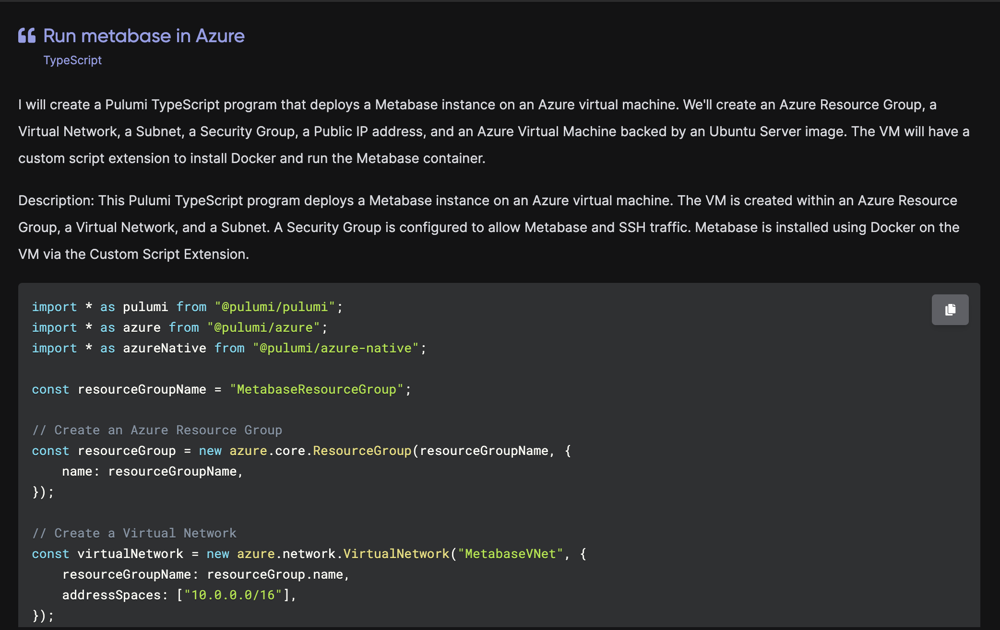

AI is impacting almost every industry today, and for good reason - we are seeing fundamentally new experiences being made possible across a wide variety of products, and a set of new AI capabilities that promise even more incredible change in the near future.

Software development is among the earliest and most prominent fields to realize the benefits of AI, evidenced by the rapid adoption of tools like Github Copilot which is now one of the most heavily adopted developer tools of all time. Developers are benefiting from an incredible increase in their productivity with better scale and faster time to market.

We’re seeing the impacts of AI in the cloud Infrastructure development space in two impactful and complimentary directions: 

* 🤖➜☁️: AI is transforming how we author, build and manage cloud infrastructure
* ☁️➜🤖: Cloud infrastructure tooling is changing how we build and deliver AI-based applications

At Pulumi, we’ve already seen profound impacts from AI in both of these directions. 

<!--more-->

Infrastructure engineers are using [Pulumi AI](/ai/) to discover solutions for cloud infrastructure needs, leading to a dynamic experience where you can generate solutions in seconds with a few simple prompts, and using tools like GitHub Copilot to quickly iterate on and test their infrastructure. 

At the same time, thousands of organizations are using Pulumi and Pulumi Cloud to manage the fundamentally cloud-native infrastructure and services available to build and scale AI-based applications - managed vector databases, elastic compute services, model serving, streaming API management services, and workflow management - all evolving at the rapid pace of the AI space, and scaling with the demand that organizations are seeing for AI.

In this article, we'll dig into both of these trends and the impacts that they are already having today, as well as the trends we are expecting to see (and build) for the near future.

## AI transforming Infrastructure as Code

### Today

The scale of the cloud is truly incredible, and the sheer size of the AWS API is huge relative to almost any other computing platform, while AWS is just one of over 135 cloud providers for which Pulumi supports building and managing infrastructure. The result is more than 50,000 infrastructure resource types that can be managed, and over 1,000,000 configurable input properties on those resources. In practice, cloud engineers face a daunting task as they figure out how to combine these resources and properties to solve their unique problems. Finding an example or guidance for how to combine these together, given the enormous variety of possible ways, can be hard or impossible.

As a result, one of the most fundamental challenges in enabling developers to use the cloud is helping them discover how to solve their problems using the enormous collection of available cloud infrastructure building blocks. For example, two years ago, I tried looking up how to **“deploy Metabase on Azure using managed PostreSQL and containers”** to solve a problem I was working on. I couldn’t find any content on the internet that directly answered this. Not just for Pulumi, there was no answer using any other IaC or deployment technology.

AI is perfectly suited for this challenge. With [Pulumi AI](/ai/), I can ask a question and get back an answer to the exact things I’m looking for - even if that specific use case has never been answered before. Pulumi AI doesn’t always get it completely right on the first try, but it typically gets very close, and points me in the direction I’m looking for. When I try its suggestion and get errors, I can ask it to fix them to iterate to a working solution.

The adoption of Pulumi AI since its release less than a year ago has been incredible, with tens of thousands of users submitting hundreds of thousands of prompts. And, perhaps surprisingly, usage hasn’t been driven only by or primarily by new Pulumi users. We’ve seen many of the most advanced Pulumi users with the deepest cloud knowledge leverage Pulumi AI the most heavily, helping them accelerate the development of new infrastructure solutions and discover more effective approaches to solving their infrastructure needs using the best of their cloud platforms.

<!--  -->

On top of providing individual users a way to answer their unique questions, it is also helpful to get answers for the most common questions available on the internet, avoiding the need to generate new answers when solutions are needed. With Pulumi AI Answers, we’ve made answers to many of the most asked questions about cloud infrastructure available directly on the internet, making it even easier to find solutions to cloud infrastructure problems and IaC code to solve for them.

As Infrastructure as Code tooling and cloud development generally embraces traditional programming languages like in Pulumi or CDK, we see the breadth of amazing tools and tooling ecosystems available in the Node.js, Python, Go, .NET and Java ecosystems all come to bear to support scalable cloud infrastructure management. AI-based tooling is no exception, with tools like GitHub Copilot, Amazon CodeWhisperer and SourceGraph Cody changing how developers write, iterate on and test their code, including their infrastructure code in popular languages that have huge training data sets. These tools are simply incredible at understanding and working with these popular languages, and modern IaC users are benefiting from these tools for productivity and discoverability.

Of course, it’s not enough just to have the code you need; you actually have to deploy that code to create and manage your cloud infrastructure. This means getting the code into source control, setting up continuous delivery, and connecting to the configuration and secrets needed for the environment you are deploying to. Recently, we added “Deploy with Pulumi” support to each Pulumi AI answer, along with `pulumi new` support in the Pulumi CLI, enabling you can go from a few simple text prompts to a working solution fully integrated with source control, CI/CD and Pulumi ESC in [less than 30 seconds](/blog/pulumi-ai-new/).



### Near Future

Even with the rapid progress over the last year, we’re clearly still just getting started in realizing the impact of AI on cloud infrastructure management.  

Tightening the feedback loop for tools like Pulumi AI will continue to enable AI to iterate and solve more complex cloud infrastructure challenges, and arrive at correct working solutions. And instead of asking questions and getting back code, these tools will soon be able to actually do the deployments and verify that they work. The result is a natural language interface, which can build and evolve cloud infrastructure. Even as the interface becomes natural language, Infrastructure as Code is a uniquely good “code-behind” for this because it maintains a desired state configuration for the infrastructure, which AI tools can easily iterate on and manage. The incredible pace of improvement in AI model skill and performance for writing code in particular will accrue directly into improvements here.

|  |
|:-:|
| *An early prototype of interactive AI infrastructure development* |

AI-based tooling will also extend well beyond just creating and managing infrastructure, most importantly to the operational tooling used to understand, support, and diagnose that infrastructure, including policy enforcement across cost, compliance, and security. Giving AI-based tools and agents the ability to access things like cloud [resource search](/blog/resource-search/), the ability to run operational CLI commands inside target [environments](/blog/environments-secrets-configurations-management/), [policy definition](/crossguard/), and the opportunity to trigger [deployment workflows](/blog/pulumi-deployments/) will empower these tools to support and ultimately automated broad classes of cloud infrastructure management tasks.

## Infrastructure as Code transforming AI

### Today

One of the biggest imperatives in almost every development organization today is to identify and invest in ways to leverage AI to improve software-based products, tools and processes. This has led, in turn, to massive growth in the need for cloud infrastructure to support and enable building and delivering these applications.

One of the most striking things about modern AI-based applications is that they are significantly more cloud-native than previous generations of application architectures. This is true for several reasons:

* Modern AI technology and services have been built around cloud-native assumptions
* AI-based applications frequently have especially bursty compute needs
* AI applications and the space overall is scaling rapidly, requiring elasticity and low operational overhead
* New managed services, like vector datastores, managed model serving APIs, managed data and training pipelines

This cloud-native quality of AI-based applications makes Infrastructure as Code even more important and valuable for AI applications than in other, more traditional applications.

The services to support building AI applications have all been built over the last two years around the assumption of the cloud. GPUs are dominantly accessed through cloud services. LLMs are invoked via managed services from OpenAI or via managed hosting of open-source models via SageMaker, Huggingface, or others. Retrieval Augmented Generation (RAG) is powered by dozens of managed database offerings, from dedicated vector databases like Pinecone, to vector extensions in Amazon Aurora PostgreSQL and more. Developers coming to AI assume they will stitch these services into rich application offerings.

At Pulumi, we've seen [dozens of AI-focused companies](/solutions/ai/) adopting and using Pulumi to manage their infrastructure, motivated by a combination of these AI-oriented infrastructure needs, along with the ease of using Python (already heavily used within the AI space), and TypeScript (popular due to a wide variety of AI-oriented front end frameworks). Pulumi also exposes the ability to manage many of these services directly, provisioning and managing the lifecycle of AI services across your infrastructure through support for things like [Azure OpenAI Service](/registry/packages/azure-native/api-docs/cognitiveservices/deployment/), [Pinecone Indexes](/registry/packages/pinecone/api-docs/pineconeindex/), [Amazon SageMaker Endpoints](/registry/packages/aws/api-docs/sagemaker/endpoint/), and much more.

As these applications move from prototypes to production, the need for robust and scalable infrastructure to deploy these applications in the major cloud platforms is essential, and IaC offers the best way to manage this at scale. For example, deploying a [LangChain application in production](/blog/easy-ai-apps-with-langserve-and-pulumi/), or deploying the production-grade infrastructure for [deploying AI applications leveraging Pinecone’s vector database at scale](https://www.pulumi.com/blog/pinecone-serverless/).  Both of these highlight ready-to-deploy cloud architectures for running an AI application in a production environment.

The cloud-native foundations of the modern AI application wave also lead to a lot of adoption and usage of Kubernetes as an orchestration platform. Infrastructure as code with Pulumi helps teams manage the Kubernetes cluster, the workloads, and the external AI service dependencies all in a consistent way, using a unified programming model and tools, and ensuring consistent delivery of changes, the ability to easily spin up test and development environments, and consistent application of policy and insights.

One particular trend in the rapid growth of IaC is in fast-growing companies building the new managed AI infrastructure services themselves - from data services (e.g. [Pinecone](https://www.pinecone.io/)) to compute (e.g. [Modal](https://modal.com/)). These products face the need to manage complex cloud infrastructure as part of both multi-tenant and single-tenant solutions in order to offer simple abstracted data and compute services for their AI-application developer customers. Automation of infrastructure provisioning and changes via tools like Pulumi Automation API and Pulumi Deployments has seen rapid adoption and scaling among these customers. The ability to deploy across many cloud providers to offer low latency data and compute services to customers, data sovereignty, and access scarce GPU and accelerated computing resources across all cloud providers with a single consistent programming model and deployment strategy proves more important than ever.

### Near Future

The growth in the development of AI-based applications is still in its early days, and all the trends we’re seeing will only accelerate over the coming year.

As these AI applications transition from prototypes to production deployment, their infrastructure needs are growing and maturing. Simple prototyping environments like Jupyter notebooks or Vercel deployments will transition into AWS/Azure/Google Cloud for the security, cost, compliance and management benefits. Larger development teams and faster customer-facing iteration will require standing up testing and ephemeral development environments, and some of the managed service dependencies will be brought in-house into self-managed open source model-service, training infrastructure and data pipelines.

As patterns continue to solidify around common architectures, higher-level infrastructure components will abstract away some of this production infrastructure complexity, initially within organizations, and then in public components shared in the Pulumi Registry and elsewhere.

And of course, the set of managed cloud services to support the AI ecosystem will continue to grow, expand and mature. Whether delivered as part of a major cloud platform or via a fast-growing startup, it will all be available to use productively at scale via infrastructure as code in Pulumi.

## Conclusion

At Pulumi we often say that All Software is Cloud Software, and that All Developers are Cloud Developers. This has been truer than ever as AI has risen to the forefront of every organization’s software development priorities over the last 15 months. AI is transforming every aspect of software development, including cloud infrastructure development. Cloud infrastructure supports, enables, and accelerates how AI applications are built and scaled in production. We’ve already seen incredible impacts of both of these trends, yet there is so much more ahead on these arcs.

We’re hard at work on all of these at Pulumi, and excited to see all of the innovation across the industry to build the future of AI-enabled cloud infrastructure management.  Check out [Pulumi AI](/ai/) and the [AI with Pulumi](/solutions/ai/) page to get started experiencing the future of AI for Infrastructure as Code today!
