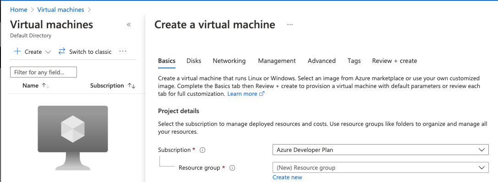
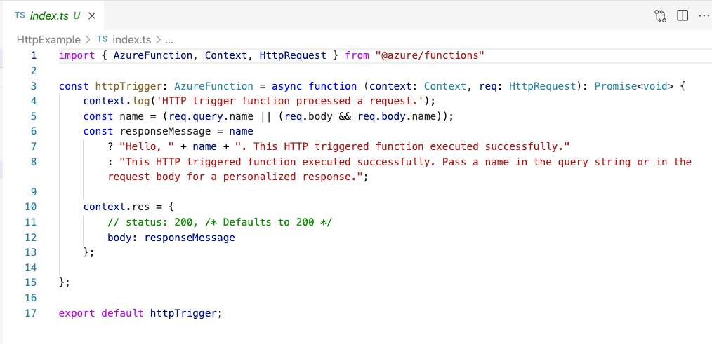
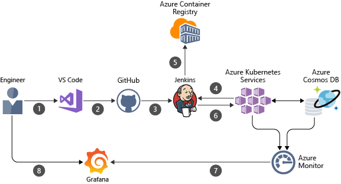

The Azure cloud platform includes over 200 products and cloud services. Wherever you are in your Microsoft cloud engineering journey, you should be familiar with these top 5 cloud tasks that are essential building blocks commonly used to deploy applications and infrastructure to the Azure cloud.

In this series of articles, we'll go in-depth on virtual machines, Azure Functions, building an Azure Kubernetes Service cluster and deploying applications on AKS, and DevOps with Azure App Service.

<!--more-->

## Azure - a comprehensive cloud platform

With Azure, you can develop, test, deploy and manage your applications in an integrated cloud computing environment. With the Azure Portal, you can manage the cloud infrastructure for your applications. Azure gives you the choice of a portal for managing services or managing them programmatically using service APIs and templates.

With over 200 services, knowing which one to use can be confusing. Deciding where to host your application is the first step. This series of articles covers the most commonly used Azure services such as virtual machines, serverless functions, static websites, Kubernetes, and Azure App Service.  In addition, we'll cover how to deploy applications using Azure DevOps.

In this article, we'll match use cases to cloud services to help you navigate Azure.

## Azure Virtual Machines

A common cloud migration path is to use virtual machines if you have existing infrastructure or on-premise applications. It is especially true if you want complete control over the infrastructure and application environment.

Azure provides Infrastructure as a Service (IaaS) for deploying your applications on either Linux or Windows VMs. IaaS includes all necessary support, such as Azure Virtual Network and storage. As with any IaaS solution, you are responsible for the installation of software, configuration, and maintenance of your application and any maintenance the VM might require, such as operating system patches.

If your application doesn't fit into a Platform as a Service (PaaS) model, consider using virtual machines to provide the fine-grained control required for your deployment.

## Serverless

At the opposite end of cloud infrastructure is serverless computing. Serverless eliminates the need to manage infrastructure and lets you focus on writing and deploying code. Azure automatically provisions, scales, and manages the infrastructure. You can write code that runs in response to events or on a schedule.

Azure Functions lets you focus on the application's business logic, and the code executes when called by a webhook, an HTTP or REST request, a schedule, or an event. Serverless is particularly appealing because you can use the development language of your choice, ranging from PHP, Python, Node.js, or .NET languages. Azure functions scale as needed, and consumption-based pricing means that you're charged only when the code runs.

If you don’t need a completely hosted project and only pay for what you use, choose Azure Functions triggered by web-based events, a schedule, or other Azure services.

## Static websites

Static websites are quickly becoming the defacto way to publish content. Built from libraries and frameworks that don't use server side rendering like React, Angular, or Vue, they include HTML, CSS, image assets, and Javascript in the application. Instead of serving assets from a server or servers scaled horizontally, the static assets are distributed through a Content Delivery Network (CDN). This reduces latency, resulting in faster websites and increased customer satisfaction.

Azure provides two ways to deploy static websites. Azure lets you deploy a static web application with Azure App Service and the recently released Azure Static Web Apps. Azure App Service deploys websites by uploading the website to Azure storage configured to serve web content. Azure App Service automatically builds and deploys full stack web apps to Azure from a code repository, which follows the [Jamstack](https://jamstack.org/) model for developing and deploying websites.

We'll look at both methods and discuss the pros and cons of both methods.

## Kubernetes

Kubernetes is the leading container orchestration service. Azure Kubernetes Service (AKS) is a hosted service that can deploy, scale, and manage containerized applications in a cluster. AKS fulfills many different use cases, for example:

- If you have an existing application, think n-tier applications, you can containerize the components and "lift and shift" your application to run in Kubernetes.
- You can deploy microservices on AKS to add horizontal scaling, load balancing, secrets management, and self-healing.
- Data scientists are training machine learning models on AKS using TensorFlow and Kubeflow.
- You can even use AKS as part of a build pipeline by pairing with a CI, such as Jenkins, to build containers for your application.

AKS supports many use cases by providing provisioning, scaling, and resource upgrades without requiring expertise in container orchestration. With AKS, the Kubernetes master nodes are managed by Azure, and you are only charged for the worker nodes in your cluster.

We’ll do two separate deep dives into deploying AKS clusters and deploying applications in AKS in this series.

### Deploy AKS

Azure provides many ways to deploy an AKS cluster, including:

- [Azure CLI](https://docs.microsoft.com/en-us/cli/azure/)
- [Azure portal](https://docs.microsoft.com/en-us/azure/aks/kubernetes-walkthrough-portal)
- [Azure Resource Manager templates](https://docs.microsoft.com/en-us/azure/azure-resource-manager/management/overview)
- [Bicep](https://github.com/Azure/bicep)
- [Infrastructure as Code]()

When you deploy an AKS Cluster, the worker nodes and Kubernetes master are configured with a basic configuration. You can additionally configure networking, storage, monitoring, and policies. We'll cover configuring AKS in this series.

### Deploy Applications

Deploying applications on AKS is equally flexible, and you can deploy using:

- [kubectl](https://kubernetes.io/docs/reference/generated/kubectl/kubectl-commands#-strong-app-management-strong-) and YAML manifests
- [Helm](https://docs.microsoft.com/en-us/azure/aks/kubernetes-helm), an open-source Kubernetes packaging tool
- [Azure Pipelines](https://docs.microsoft.com/en-us/azure/devops/pipelines/apps/cd/deploy-aks?view=azure-devops&tabs=java)
[Infrastructure as Code]()

We'll examine these options and do a deep dive on application deployment in a follow-up article.

## DevOps integration

Before Continuous integration (CI) and Continuous Deployment (CD) became prevalent, applications were manually built, compiled, and maintained in a large codebase. CI/CD automation lets you build quickly, test, and deploy services. Both application fixes and new features are shipped quickly to your customers, and you can rapidly respond to changing customer demands. For example, if demand increases, you can quickly add resources to your application or add a serverless function that increases and decreases resources as needed.

If you're deploying applications on Azure Functions, virtual machines, AKS, or provisioning infrastructure, the build process should be automated. Azure offers a range of services such as Azure Container Registry, AKS, and Azure Cosmos DB that can integrate with popular CI/CD pipelines like Azure DevOps, Jenkins, Github, and TeamCity.

If you're interested in using Azure DevOps to automate infrastructure and application delivery, stay tuned!

## Let's Get Started!

So here are the top 5 things essential to know as an Azure developer:

- configuring and deploying virtual machines
- developing and deploying Azure Functions
- deploying static websites on Azure
- configuring Azure Kubernetes Service and deploying containerized applications
- using Azure DevOps to automate the building and deployment of infrastructure and applications

First up and next in this series of articles is deploying an Azure virtual machine with an application.
