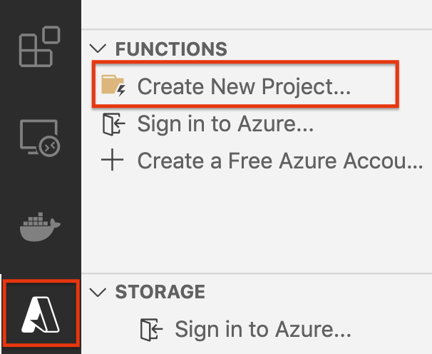
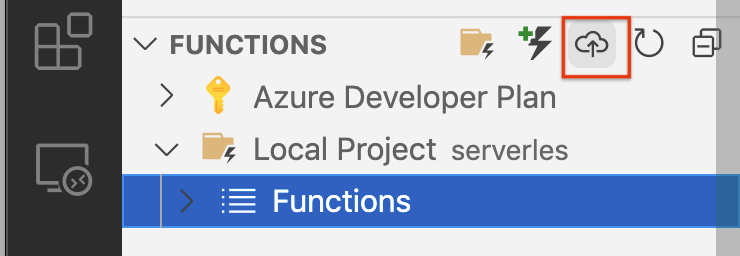
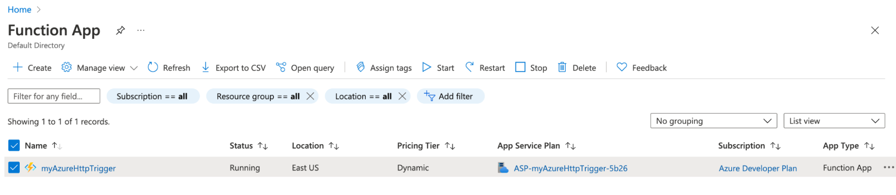

The [previous article]() was a deep dive into virtual machines. First, we used the Azure Portal to create and deploy a virtual machine; then, we repeated the process using infrastructure as code. We further demonstrated how to automate provisioning as part of cloud engineering's build and deploy processes.

This article will explore the other end of the cloud infrastructure with serverless, which is an on-demand, fully-managed cloud architecture.

<!--more-->

## What is serverless, and when to use it?

Serverless is an event-driven architecture that executes code when triggered. Azure implements serverless with Azure Functions and Events. A function typically performs a single task, such as saving a log file. A function can perform multiple tasks, but in general, functions adhere to the principle of "you only had one job."  Functions can be written in any Azure supported language: C #, F#, JavaScript, PowerShell, Python, and Typescript.

An Event calls a function to execute. It can be a webhook, an HTTP request, or a scheduled trigger. Azure provides many function templates with a range of triggers; furthermore, they can be customized to application requirements.

Azure Functions are ideal for specific use cases that include:

- when demand varies unpredictably, serverless can scale automatically
- when a service is used infrequently, serverless can reduce costs by only charging per use
- serverless can eliminate maintenance costs
- when you have client-heavy applications, where most of the business logic is in the client
- if you have high latency tasks like data processing

Serverless is not ideal if the application runs constantly, needs a quick response (otherwise known as the [cold start problem]()), or is a long-running process that can exceed the [timeout period](https://docs.microsoft.com/en-us/azure/azure-functions/functions-scale#timeout) for your execution plan.

With those caveats, let's jump into creating a serverless function using the Azure Portal to understand how to write a function and how the pieces work together.

## Our first serverless function

For this example, we'll use [Visual Studio Code](https://code.visualstudio.com/) and the [Azure Functions extension](https://marketplace.visualstudio.com/items?itemName=ms-azuretools.vscode-azurefunctions).

**Step 1**: With the Azure Functions extension installed, click on the Activity Bar and click on Create New Project.

- Select a folder for your project.
- Select a language, use Typescript.
- Select HTTP trigger.
- Name your function, e.g., myHttpTrigger.
- Set the Authorization level to Anonymous



When finished, you'll have a template.

```typescript
import { AzureFunction, Context, HttpRequest } from "@azure/functions"

const httpTrigger: AzureFunction = async function (context: Context, req: HttpRequest): Promise<void> {
    context.log('HTTP trigger function processed a request.');
    const name = (req.query.name || (req.body && req.body.name));
    const responseMessage = name
        ? "Hello, " + name + ". This HTTP triggered function executed successfully."
        : "This HTTP triggered function executed successfully. Pass a name in the query string or in the request body for a personalized response.";

    context.res = {
        // status: 200, /* Defaults to 200 */
        body: responseMessage
    };

};

export default httpTrigger;
```

**Step 2**: (Optional) If you have Azure Functions Core tools installed, you can run the function locally. Press F5 or click on `Run` > `Start debugging`.

The service will run locally and provide you with a URL:

```bash
Functions:

        myHttpTrigger: [GET,POST] http://localhost:7071/api/myHttpTrigger
```

Navigate to the URL in a browser or use `curl`.

```bash
$ curl http://localhost:7071/api/myHttpTrigger
This HTTP triggered function executed successfully. Pass a name in the query string or in the request body for a personalized response.
```

Press `Control-C` in the terminal to stop the debugger.

**Step 3**: Publish the function to Azure.

Make sure you are signed into Azure and click on `Deploy function app…`



- Select `Create a new Function App in Azure` and enter a name, "exampleHttpTrigger"
- Select a runtime stack, `Node.js 14 LTS`
- Select a location for new resources, East US

In the terminal pane, click on the `Output` tab, and you'll see the URL for the function. You can call the function with curl with the name parameter.

```bash
$ curl https://myazurehttptrigger.azurewebsites.net/api/myhttptrigger?name=Pulumipus
Hello, Pulumipus. This HTTP triggered function executed successfully.
```

Don't forget to delete the function in the Azure Portal!



## Deploying Azure Functions with code

Creating and deploying an Azure Function is a bit more involved than using the Azure Function extension with VS Code. What goes on behind the scenes after you write the function is a process that includes:

1. Creating a ResourceGroup

    ```typescript
    // Create a separate resource group for this example.
    const resourceGroup = new resources.ResourceGroup("functions-rg");
    ```

2. Creating the storage account and code container that holds the function

    ```typescript
    // Storage account is required by Function App.
    // Also, we will upload the function code to the same storage account.
    const storageAccount = new storage.StorageAccount("sa", {
        resourceGroupName: resourceGroup.name,
        sku: {
            name: storage.SkuName.Standard_LRS,
        },
        kind: storage.Kind.StorageV2,
    });

    // Function code archives will be stored in this container.
    const codeContainer = new storage.BlobContainer("zips", {
        resourceGroupName: resourceGroup.name,
        accountName: storageAccount.name,
    });
    ```

3. Uploading the function code as a zip file to the storage account. Note that the `source` parameter points to the function's directory.

    ```typescript
    // Upload Azure Function's code as a zip archive to the storage account.
    const codeBlob = new storage.Blob("zip", {
        resourceGroupName: resourceGroup.name,
        accountName: storageAccount.name,
        containerName: codeContainer.name,
        source: new pulumi.asset.FileArchive("./javascript"),
    });
    ```

4. Setting the [Consumption Plan](https://azure.microsoft.com/en-us/pricing/details/functions/) to determine how to bill when the function executes

    ```typescript
    // Define a Consumption Plan for the Function App.
    // You can change the SKU to Premium or App Service Plan if needed.
    const plan = new web.AppServicePlan("plan", {
        resourceGroupName: resourceGroup.name,
        sku: {
            name: "Y1",
            tier: "Dynamic",
        },
    });
    ```

5. Set the connection string to the storage account and the zip archive's [Shared Access Signature (SAS)](https://docs.microsoft.com/en-us/rest/api/storageservices/delegate-access-with-shared-access-signature) to grant rights to use the storage account. We will need these to create the function in Azure.

    ```typescript
    // Build the connection string and zip archive's SAS URL. They will go to Function App's settings.
    const storageConnectionString = getConnectionString(resourceGroup.name, storageAccount.name);
    const codeBlobUrl = signedBlobReadUrl(codeBlob, codeContainer, storageAccount, resourceGroup);
    ```

6. Now that we have all the parameters needed to deploy the function: the resource group,
the billing plan, the connection string to Azure storage, the Functions version (3), the runtime (Node.js), the runtime Node version (14.0), and the SAS url for the function code, we can build and deploy our Azure Function.

    ```typescript
    const app = new web.WebApp("fa", {
        resourceGroupName: resourceGroup.name,
        serverFarmId: plan.id,
        kind: "functionapp",
        siteConfig: {
            appSettings: [
                { name: "AzureWebJobsStorage", value: storageConnectionString },
                { name: "FUNCTIONS_EXTENSION_VERSION", value: "~3" },
                { name: "FUNCTIONS_WORKER_RUNTIME", value: "node" },
                { name: "WEBSITE_NODE_DEFAULT_VERSION", value: "~14" },
                { name: "WEBSITE_RUN_FROM_PACKAGE", value: codeBlobUrl },
            ],
            http20Enabled: true,
            nodeVersion: "~14",
        },
    });

    export const endpoint = pulumi.interpolate`https://${app.defaultHostName}/api/HelloNode?name=Pulumi`;
    ```

At the very end of the script, we export the URL to the service for you to trigger.

## Why is it so complicated?

Isn't infrastructure as code supposed to simplify infrastructure deployments? This seems more effort than using the Visual Studio Code extension or even [the Azure CLI](https://docs.microsoft.com/en-us/cli/azure/install-azure-cli) on the surface. However, it's important to note that this is *boiler-plate* code that you can reuse to deploy multiple functions with different runtimes and Consumption Plans. The key to using infrastructure code is that it is repeatable, customizable, and a CI/CD pipeline can deploy changes automatically.

Try out the complete example in either [Typescript](https://github.com/pulumi/examples/tree/master/azure-ts-functions) or [C#](https://github.com/pulumi/examples/tree/master/azure-ts-functions) to get familiar with Azure Functions. You can also learn how Functions are written in all supported languages by checking out the [Azure Functions in All Supported Languages](https://github.com/pulumi/examples/tree/master/azure-ts-functions-many) example.

In the following article, we'll do a deep dive into Azure static websites, which is a popular option for [Jamstacks](https://jamstack.org/).
