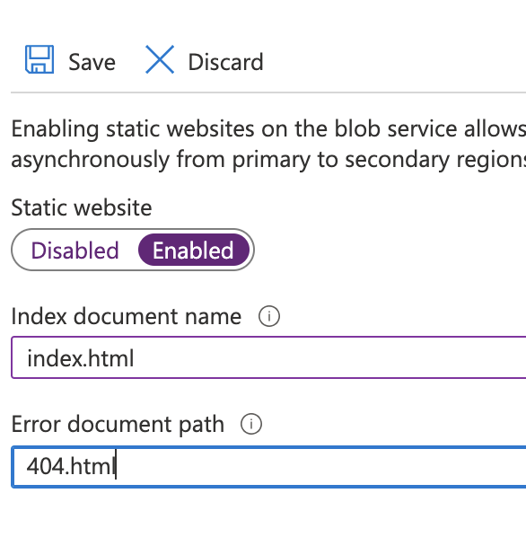

Static web applications are a popular way to publish websites. There are many reasons for adopting static web applications, including speed, security, version control, scalability, and reduced cost.

This article goes into depth about the two types of static web applications that Azure offers. The first uses Azure Blob Storage to serve static data. The second method is Azure Static Web Apps which follows the pattern of [Jamstack](https://jamstack.org) applications that use a static website generator integrated with source control that publishes to a [Content Delivery Network](https://en.wikipedia.org/wiki/Content_delivery_network). We'll take an in-depth look at both methods and consider the pros and cons of each.

<!--more-->

## Static Websites with Azure Storage

Hosting a static website on Azure Store is an option for serving web content without a web server. You can upload HTML, CSS, images, and JavaScript to an Azure storage container named `$web`. Because the content is in a storage container, you can also use other PaaS services like Azure Functions or Azure CDN.

### Azure Portal

Let's get started using the Azure Portal.

**Step 1**: Create a storage account (optional if you have an existing storage account)

In the Azure Portal, navigate to **Storage accounts**, and follow the defaults.


**Step 2**: In the **Storage account** page, select **Data management > Static website**


Select **enabled** for the **Static website**, and enter values for the **Index document** and **Error document** fields. Save the changes.



**Step 3**: Upload files

Here are example files to upload or you can use your own.

index.html

```html
<html>
  <body>
    <h1>This file is served from Blob Storage (courtesy of Pulumi!)</h1>
  </body>
</html>
```

404.html

```html
<html>
  <body>
    <h1>That's a 404! Still, from the Blob Storage.</h1>
  </body>
</html>
```

We'll use **Storage Explorer (preview)**, and select **BLOB CONTAINERS > $web**. In the **Upload blob** pane, add the `index.html` and `404.html` files, and select **Upload**.


**Step 4**: Get the URL

Select **Static website** in the overview pane, and the URL is the **Primary endpoint**.


### Build and deploy a static website with code

We can repeat the same process using a programming language. The process includes:

- Create a storage account
- Enable `Static website`
- Upload files
- Configure and publish endpoints

We can reproduce this process in code with C#, Go, Python, Typescript, or in any language Pulumi supports. Let's step through the code.

**Step 1**: Create a `Resource group` and `Storage account`.



    {}

            var resourceGroup = new Resources.ResourceGroup("resourceGroup");

            var storageAccount = new Storage.StorageAccount("storageaccount", new Storage.StorageAccountArgs
            {
                Kind = Storage.Kind.StorageV2,
                ResourceGroupName = resourceGroup.Name,
                Sku = new Storage.Inputs.SkuArgs
                {
                    Name = Storage.SkuName.Standard_LRS,
                },
            });

    {}
    {}


        pulumi.Run(func(ctx *pulumi.Context) error {
            resourceGroup, err := resources.NewResourceGroup(ctx, "website-rg", nil)
            if err != nil {
                return err
            }

            storageAccount, err := storage.NewStorageAccount(ctx, "sa", &storage.StorageAccountArgs{
                ResourceGroupName: resourceGroup.Name,
                Kind:              storage.KindStorageV2,
                Sku: &storage.SkuArgs{
                    Name: storage.SkuName_Standard_LRS,
                },
            })
            if err != nil {
                return err
            }

    {}
    {}

    resource_group = resources.ResourceGroup("resourceGroup")

    storage_account = storage.StorageAccount(
        "storageaccount",
        access_tier=storage.AccessTier.HOT,
        enable_https_traffic_only=True,
        encryption=storage.EncryptionArgs(
            key_source=storage.KeySource.MICROSOFT_STORAGE,
            services=storage.EncryptionServicesArgs(
                blob=storage.EncryptionServiceArgs(
                    enabled=True,
                ),
                file=storage.EncryptionServiceArgs(
                    enabled=True,
                ),
            ),
        ),
        kind=storage.Kind.STORAGE_V2,
        network_rule_set=storage.NetworkRuleSetArgs(
            bypass=storage.Bypass.AZURE_SERVICES,
            default_action=storage.DefaultAction.ALLOW,
        ),
        resource_group_name=resource_group.name,
        sku=storage.SkuArgs(
            name=storage.SkuName.STANDARD_LRS,
        ))

    {}
    {}

    const resourceGroup = new resources.ResourceGroup("resourceGroup");

    const storageAccount = new storage.StorageAccount("storageaccount", {
        enableHttpsTrafficOnly: true,
        kind: storage.Kind.StorageV2,
        resourceGroupName: resourceGroup.name,
        sku: {
            name: storage.SkuName.Standard_LRS,
        },
    });

    {}


**Step 2**: Enable static website



    {}

    // Enable static website support
    var staticWebsite = new Storage.StorageAccountStaticWebsite("staticWebsite", new Storage.StorageAccountStaticWebsiteArgs
    {
        AccountName = storageAccount.Name,
        ResourceGroupName = resourceGroup.Name,
        IndexDocument = "index.html",
        Error404Document = "404.html",
    });

    {}
    {}

    // Enable static website support
    staticWebsite, err := storage.NewStorageAccountStaticWebsite(ctx, "staticWebsite", &storage.StorageAccountStaticWebsiteArgs{
        AccountName:       storageAccount.Name,
        ResourceGroupName: resourceGroup.Name,
        IndexDocument:     pulumi.String("index.html"),
        Error404Document:  pulumi.String("404.html"),
    })
    if err != nil {
        return err
    }

    {}
    {}

    # Enable static website support
    static_website = storage.StorageAccountStaticWebsite(
        "staticWebsite",
        account_name=storage_account.name,
        resource_group_name=resource_group.name,
        index_document="index.html",
        error404_document="404.html")


    {}
    {}

    // Enable static website support
    const staticWebsite = new storage.StorageAccountStaticWebsite("staticWebsite", {
        accountName: storageAccount.name,
        resourceGroupName: resourceGroup.name,
        indexDocument: "index.html",
        error404Document: "404.html",
    });

    {}


**Step 3**: Upload content



    {}

    var index_html = new Storage.Blob("index.html", new Storage.BlobArgs
    {
        ResourceGroupName = resourceGroup.Name,
        AccountName = storageAccount.Name,
        ContainerName = staticWebsite.ContainerName,
        Source = new FileAsset("./wwwroot/index.html"),
        ContentType = "text/html",
    });
    var notfound_html = new Storage.Blob("404.html", new Storage.BlobArgs
    {
        ResourceGroupName = resourceGroup.Name,
        AccountName = storageAccount.Name,
        ContainerName = staticWebsite.ContainerName,
        Source = new FileAsset("./wwwroot/404.html"),
        ContentType = "text/html",
    });

    {}
    {}

    // Upload the files
    _, err = storage.NewBlob(ctx, "index.html", &storage.BlobArgs{
        ResourceGroupName: resourceGroup.Name,
        AccountName:       storageAccount.Name,
        ContainerName:     staticWebsite.ContainerName,
        Source:            pulumi.NewFileAsset("./wwwroot/index.html"),
        ContentType:       pulumi.String("text/html"),
    })
    if err != nil {
        return err
    }
    _, err = storage.NewBlob(ctx, "404.html", &storage.BlobArgs{
        ResourceGroupName: resourceGroup.Name,
        AccountName:       storageAccount.Name,
        ContainerName:     staticWebsite.ContainerName,
        Source:            pulumi.NewFileAsset("./wwwroot/404.html"),
        ContentType:       pulumi.String("text/html"),
    })
    if err != nil {
        return err
    }

    {}
    {}

    # Upload the files
    index_html = storage.Blob(
        "index_html",
        resource_group_name=resource_group.name,
        account_name=storage_account.name,
        container_name=static_website.container_name,
        source=pulumi.FileAsset("./wwwroot/index.html"),
        content_type="text/html")
    notfound_html = storage.Blob(
        "notfound_html",
        resource_group_name=resource_group.name,
        account_name=storage_account.name,
        container_name=static_website.container_name,
        source=pulumi.FileAsset("./wwwroot/404.html"),
        content_type="text/html")

    {}
    {}

    // Upload the files
    ["index.html", "404.html"].map(name =>
        new storage.Blob(name, {
            resourceGroupName: resourceGroup.name,
            accountName: storageAccount.name,
            containerName: staticWebsite.containerName,
            source: new pulumi.asset.FileAsset(`./wwwroot/${name}`),
            contentType: "text/html",
        }),
    );

    {}


**Step 4**: Configure and publish endpoints



    {}

    // Web endpoint to the website
    this.StaticEndpoint = storageAccount.PrimaryEndpoints.Apply(primaryEndpoints => primaryEndpoints.Web);

    // (Optional) Add a CDN in front of the storage account.
    var profile = new Cdn.Profile("profile", new Cdn.ProfileArgs
    {
        ResourceGroupName = resourceGroup.Name,
        Location = "global",
        Sku = new Cdn.Inputs.SkuArgs
        {
            Name = Cdn.SkuName.Standard_Microsoft,
        },
    });

    var endpointOrigin = storageAccount.PrimaryEndpoints.Apply(pe => pe.Web.Replace("https://", "").Replace("/", ""));


    [Output("staticEndpoint")]
    public Output<string> StaticEndpoint { get; set; }
    }

    {}
    {}

    endpointOrigin := storageAccount.PrimaryEndpoints.Web().ApplyT(func(endpoint string) string {
        endpoint = strings.ReplaceAll(endpoint, "https://", "")
        endpoint = strings.ReplaceAll(endpoint, "/", "")
        return endpoint
    }).(pulumi.StringOutput)

    // Web endpoint to the website
    ctx.Export("staticEndpoint", storageAccount.PrimaryEndpoints.Web())

    }

    {}
    {}

    endpoint_origin = storage_account.primary_endpoints.apply(
        lambda primary_endpoints: primary_endpoints.web.replace("https://", "").replace("/", ""))

    # Web endpoint to the website
    pulumi.export("staticEndpoint", storage_account.primary_endpoints.web)

    {}
    {}

    // Web endpoint to the website
    export const staticEndpoint = storageAccount.primaryEndpoints.web;

    {}


The complete examples for [C#](https://github.com/pulumi/examples/tree/master/azure-cs-static-website), [Go](https://github.com/pulumi/examples/blob/master/azure-go-static-website/), [Python](https://github.com/pulumi/examples/blob/master/azure-py-static-website/), and [Typescript](https://github.com/pulumi/examples/blob/master/azure-ts-static-website/index.ts) are on Github.

## Azure Static Web Apps

Azure Static Web Apps (SWA) builds and deploys web apps from a code repository. Azure works directly with GitHub or Azure DevOps to watch a branch on your repository. When you push a commit or accept a pull request, your app is built and deployed to Azure. When you build web apps with SWA, your static assets are deployed to a CDN that serves files from geographically distributed points.

Static web apps can be built with popular frameworks that don't require server-side rendering, such as React, Angular, and Vue. Web applications typically include HTML, JavaScript, images, and CSS. In addition to these assets, you can create API endpoints hosted in an Azure Function.

The key thing to remember with SWAs is that you build the application from a repository.

Let's jump into Azure Static Web Apps!

### Build and deploy

We'll use Visual Studio Code's [Azure Static Web App Extension](https://marketplace.visualstudio.com/items?itemName=ms-azuretools.vscode-azurestaticwebapps) and a [GitHub](https://github.com/) account.

**Step 1**: Install the [Azure Web Static Web Apps](https://marketplace.visualstudio.com/items?itemName=ms-azuretools.vscode-azurestaticwebapps) extension.

Follow the instructions to authorize Visual Studio Code to access your GitHub account.

**Step 2**: Create a web application

For convenience, we can use the Azure template for generating web applications. Open this [link](https://github.com/staticwebdev/vanilla-basic/generate) to generate a basic React application.


Clone the repository to your computer.

```bash
$ git clone https://github.com/spara/bookish-doodle.git
```

**Step 3**: Create a static web app with Visual Studio Code

Open your repository with Visual Studio Code and activate the [Azure extension](https://code.visualstudio.com/docs/azure/extensions). On the **APP SERVICE** item, select the **+** to create a web app.


Follow the prompts:

- Create a unique name.


- Select a project structure.


- Select an application directory.


- Select a build directory.


When VS Code completes configuring your application, you will be prompted to deploy.


You can view the application in the browser.

**Step 3**: Change the code

Edit `./src/app.js` and change *World* to *Cloud Engineers*.

```javascript
function App() {
  const value = 'Cloud Engineers';
  return <div>Hello {value}</div>;
}
```

Add, commit, and push your changes to GitHub.

```bash
$ git add .
$ git commit -m 'changed message'
$ git push
```

Select the **Actions** tab of your repository to see the workflows. Select the **changed message**, and then select **Build and Deploy Job**.


To see the details of the deployment, select **Build and Deploy**.


So what happened here? First, we used the Azure Static Web Apps for Visual Studio Code to authorize access to GitHub. Next, we created a deployment using the extension, created a GitHub Actions workflow, and deployed the application. We edited the code and pushed it to the repository. The push triggered the GitHub Action, rebuilt, and deployed the application.

The Azure Static Web Apps service lets you create a complete DevOps workflow.

### Build and deploy with code and Pulumi

Can we create a complete DevOps workflow with code? Of course, we can! The Pulumi Azure Native provider uses the same API as VS Code. In the example below, we can duplicate the process without using an extension or the Azure CLI.

```typescript
import pulumi
import pulumi_azure_native as azure_native

static_site = azure_native.web.StaticSite("staticSite",
    branch="master",
    build_properties=azure_native.web.StaticSiteBuildPropertiesArgs(
        api_location="api",
        app_artifact_location="build",
        app_location="app",
    ),
    location="West US 2",
    name="testStaticSite0",
    repository_token="repoToken123",
    repository_url="https://github.com/username/RepoName",
    resource_group_name="rg",
    sku=azure_native.web.SkuDescriptionArgs(
        name="Basic",
        tier="Basic",
    ))
```

In the example above, creating a static web app requires configuring the same parameters we used in the Visual Studio Code example. The difference is that we create a Pulumi Project with our application at the root of the project directory in a folder called `app`. Once the static web app stack is created, you can push changes and trigger a deployment. One of the advantages of using infrastructure as code is that you can use the development environment and toolchain that you prefer. You are not bound to using a specific extension or development environment. We can be productive with our toolchain and create a complete deployment workflow using GitHub Actions with cloud engineering and Azure Static Web Apps.

## Summary

This article demonstrates two ways to build static websites with Azure. The first way is to use Azure Storage to deploy the website. We showed how to use the Azure Portal and infrastructure as code to deploy. The other way to deploy a static website is to use the Azure Static Web Apps Service. We used the Visual Studio Code extension to configure GitHub Actions to deploy the React application in this example. We demonstrated how to deploy using code because the Pulumi Azure Native provider uses the Azure API. Infrastructure as code lets us choose our development environment where we are productive. In the next installment of this series, we’ll tackle deploying Kubernetes.
