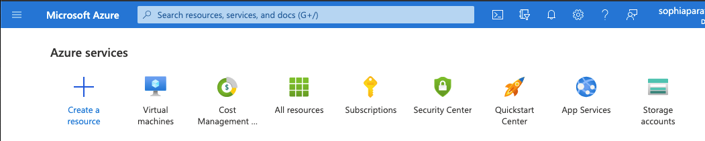
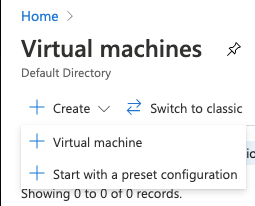
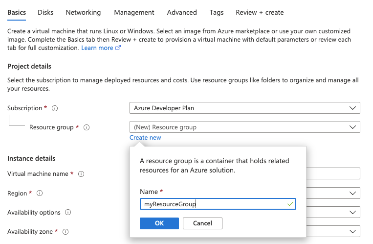
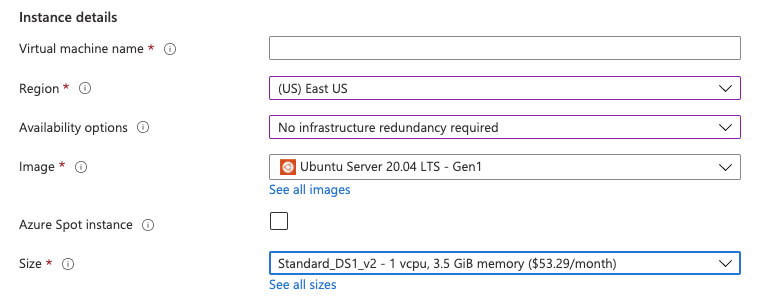
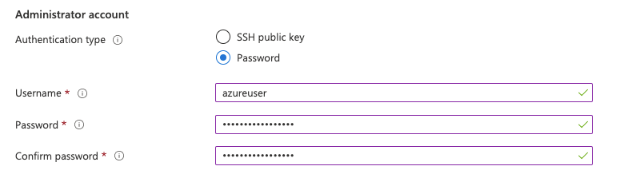
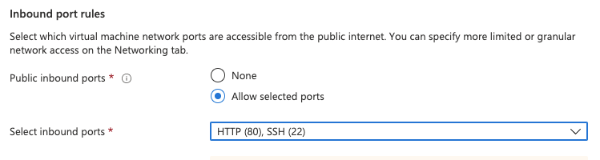
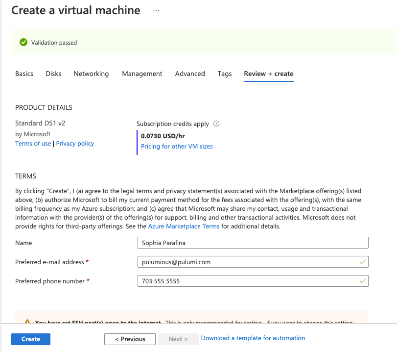
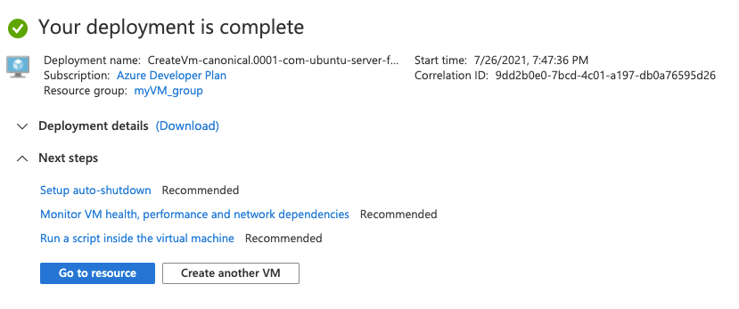
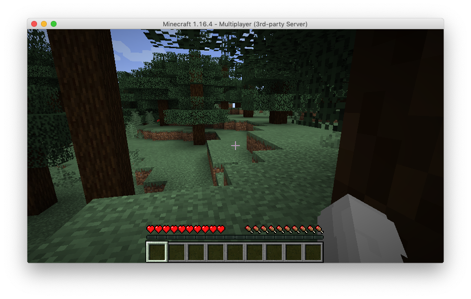

So you want to be an Azure dev and all-around infrastructure wizard? Let's start with the basics, virtual machines! In the previous article, the common use case for virtual machines is migrating applications from dedicated hardware. You want full control of the machine to install required software for the application or configure storage and networking.

Azure provides many ways to create and configure virtual machines ranging from [the Azure CLI](https://docs.microsoft.com/en-us/cli/azure/install-azure-cli) to [the Azure Portal](https://azure.microsoft.com/en-us/features/azure-portal/). In this article, we'll first create a virtual machine using the portal to understand the requirements and process; then, we'll do it with code using [Pulumi's Azure Native provider](https://www.pulumi.com/docs/intro/cloud-providers/azure/), which is built directly from the Azure API.

A native provider provides functionality mapped directly from the underlying API; in the case of the new Azure Provider, functionality is mapped directly from the Azure Resource Manager API surface.

<!--more-->

## Creating a VM with the Azure Portal

When creating virtual machines, you should consider the operating system, storage requirements, and VM size with regard to CPU to memory ratio. Azure offers [many sizes for virtual machines](https://docs.microsoft.com/en-us/azure/virtual-machines/sizes) depending on your workload. If you're migrating a traditional n-tier application to the cloud, it's best to start with virtual machines that match your current configuration.

This article will use a simple example of deploying a static web application on a virtual machine to illustrate the process step by step. To get started, sign in to the [Azure Portal](https://portal.azure.com/).

**Step 1**:

Under `Azure Services`, select `Virtual machines`



Select `Create` > `Virtual Machine`



**Step 2**: Create a Resource Group

A Resource Group is a logical collection of virtual machines, storage, virtual networks, web apps, and databases. Users will commonly group an application's related resources. We'll create `myResourceGroup` for our application.



**Step 3**: Configure the VM

Next, we'll provide details for the VM by giving it a name, `myVM`, setting the `Region` and `Availability options` to `No infrastructure redundancy required`. We'll use an Ubuntu image and set the VM size `Standard_DS1_v2`.



**Step 4**: Configure the Administrator Account

Virtual machines are Infrastructure as a Service, which means you will have to perform provisioning, updates, and maintenance. You'll need an administrator account to perform these tasks. To keep this example simple, we'll use `Password` as the `Authentication type`, but in practice, you should use [Public Key Infrastructure (PKI)](https://en.wikipedia.org/wiki/Public_key_infrastructure) because it is more secure than a password that can be brute-forced.



**Step 5**: Configure inbound ports

You have to log into your virtual machine as well as allowing inbound requests to the static website. Select both `HTTP (80)` and `SSH (22)` then click on `Review + create`.  Note that you can also add storage by clicking on `Disks`, but we'll use the defaults for this example.



If your configuration is valid, you'll see the following screen. Click `Create` to instantiate the vm.



**Step 6**: Enjoy your success

You can go and check out your VM by clicking on `Go to resource`.



Well, that seems simple and easy, but what if you had to deploy several virtual machines for the application that includes a web server, a worker to process requests, a message queuing system, and a database? What if your current system has multiple web servers and backend workers behind a load balancer? You'll have to create, deploy, and maintain each VM because this is an IaaS.

There's a better way using infrastructure as code and cloud engineering methodologies to create an automated process for creating, provisioning, and maintaining virtual machines.

## Cloud Engineering to the Rescue!

Creating and provisioning one VM isn't difficult, but migrating a traditional n-tier application often requires multiple virtual machines including those needed for horizontal scaling. This is where infrastructure as code excels. By using [cloud engineering](), we can automate [build]({{ < relref "/blog/wtf-is-cloud-engineering#build" >}}), [deploy]({{ < relref "/blog/wtf-is-cloud-engineering#deploy" >}}), and [manage]({{ < relref "/blog/wtf-is-cloud-engineering#manage" >}}) process for any infrastructure or application.

Let's look at an example of deploying a web server using a virtual machine. The complete example is available in either [Python](https://github.com/pulumi/examples/tree/master/azure-py-webserver) or [Typescript](https://github.com/pulumi/examples/tree/master/azure-ts-webserver). We will examine the Python code.

We're using the Azure Native provider, which implements the best possible support for the Azure platform in Pulumi. It exposes the entire API surface of Azure to developers and operators. The native provider supports over 1,000 resource types, with more added as they are released by Azure.

The script starts with importing the Pulumi Azure Native SDK modules and retrieving configuration parameters such as the username and password required to log into the server for provisioning. It also creates a resource group.

```python
import base64
from pulumi import Config, Output, export
import pulumi_azure_native.compute as compute
import pulumi_azure_native.network as network
import pulumi_azure_native.resources as resources

config = Config()
username = config.require("username")
password = config.require("password")

resource_group = resources.ResourceGroup("server")
```

The next part createst the networking resources, including a dynamically allocated public IP address for the server.

```python
net = network.VirtualNetwork(
    "server-network",
    resource_group_name=resource_group.name,
    address_space=network.AddressSpaceArgs(
        address_prefixes=["10.0.0.0/16"],
    ),
    subnets=[network.SubnetArgs(
        name="default",
        address_prefix="10.0.1.0/24",
    )])

public_ip = network.PublicIPAddress(
    "server-ip",
    resource_group_name=resource_group.name,
    public_ip_allocation_method=network.IPAllocationMethod.DYNAMIC)

network_iface = network.NetworkInterface(
    "server-nic",
    resource_group_name=resource_group.name,
    ip_configurations=[network.NetworkInterfaceIPConfigurationArgs(
        name="webserveripcfg",
        subnet=network.SubnetArgs(id=net.subnets[0].id),
        private_ip_allocation_method=network.IPAllocationMethod.DYNAMIC,
        public_ip_address=network.PublicIPAddressArgs(id=public_ip.id),
    )])

```

And here's our web server and index page using Python's `simpleHTTPServer`.

```python
init_script = """#!/bin/bash
echo "Hello, World!" > index.html
nohup python -m SimpleHTTPServer 80 &"""
```

Finally, here's how we create the virtual machine. We add the VM to the resource group and associate the `network_profile` to `network_iface` that we defined previously. We set the `vm_size`, set up the `os_profile` with the hostname and username and password. In the example, we create a `storage profile` and use Ubuntu for the image profile. The script ends by exporting the public IP address of the webserver.

```python
vm = compute.VirtualMachine(
    "server-vm",
    resource_group_name=resource_group.name,
    network_profile=compute.NetworkProfileArgs(
        network_interfaces=[
            compute.NetworkInterfaceReferenceArgs(id=network_iface.id),
        ],
    ),
    hardware_profile=compute.HardwareProfileArgs(
        vm_size=compute.VirtualMachineSizeTypes.STANDARD_A0,
    ),
    os_profile=compute.OSProfileArgs(
        computer_name="hostname",
        admin_username=username,
        admin_password=password,
        custom_data=base64.b64encode(init_script.encode("ascii")).decode("ascii"),
        linux_configuration=compute.LinuxConfigurationArgs(
            disable_password_authentication=False,
        ),
    ),
    storage_profile=compute.StorageProfileArgs(
        os_disk=compute.OSDiskArgs(
            create_option=compute.DiskCreateOptionTypes.FROM_IMAGE,
            name="myosdisk1",
        ),
        image_reference=compute.ImageReferenceArgs(
            publisher="canonical",
            offer="UbuntuServer",
            sku="16.04-LTS",
            version="latest",
        ),
    ))

combined_output = Output.all(vm.id, public_ip.name, resource_group.name)
public_ip_addr = combined_output.apply(
    lambda lst: network.get_public_ip_address(
        public_ip_address_name=lst[1],
        resource_group_name=lst[2]))
export("public_ip", public_ip_addr.ip_address)
```

On the face of it, this seems more complex than using the Azure Portal. The critical thing to remember is that this process is reproducible, so if you require additional virtual machines, you can add a loop to create the necessary number of VMs.

But what about provisioning? Because this is code, you can write a [provisioning script](https://github.com/pulumi/examples/blob/master/aws-py-ec2-provisioners/provisioners.py) using Pulumi's [dynamic provider]() that connects to the webserver, copies files, and executes commands. Here's a code snippet of a dynamic provider that copies files to your VM using `scp`.

```python
# CopyFileProvider implements the resource lifecycle for the CopyFile resource type below.
class CopyFileProvider(ProvisionerProvider):
    def on_create(self, inputs: Any) -> Any:
        ssh = connect(inputs['conn'])
        scp = ssh.open_sftp()
        try:
            scp.put(inputs['src'], inputs['dest'])
        finally:
            scp.close()
            ssh.close()
        return inputs

# CopyFile is a provisioner step that can copy a file over an SSH connection.
class CopyFile(dynamic.Resource):
    def __init__(self, name: str, conn: pulumi.Input[ConnectionArgs],
                 src: str, dest: str, opts: Optional[pulumi.ResourceOptions] = None):
        self.conn = conn
        """conn contains information on how to connect to the destination, in addition to dependency information."""
        self.src = src
        """
        src is the source of the file or directory to copy. It can be specified as relative to the current
        working directory or as an absolute path. This cannot be specified if content is set.
        """
        self.dest = dest
        """dest is required and specifies the absolute path on the target where the file will be copied to."""

        super().__init__(
            CopyFileProvider(),
            name,
            {
                'dep': conn,
                'conn': conn,
                'src': src,
                'dest': dest,
                'fileHash': sha256sum(src),
            },
            opts,
        )
```

## Summary

Although it's relatively simple to create virtual machines using the Azure Portal or the Azure CLI, provisioning and maintaining them manually can be complex and error-prone. If we use code to build, deploy, and manage VMs and applications, we can automate the process making updates and maintenance repeatable processes and reduce errors. We can tear down existing VMs and replace them with updated and provisioned versions using infrastructure as code. This is a lot of information if you're starting your Azure cloud journey, so try something fun and deploy [Minecraft on Azure]()!


