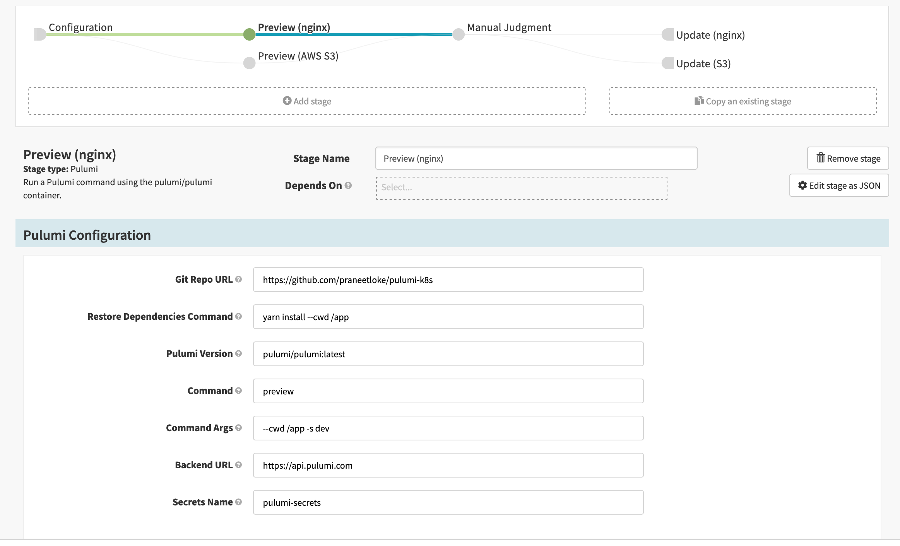
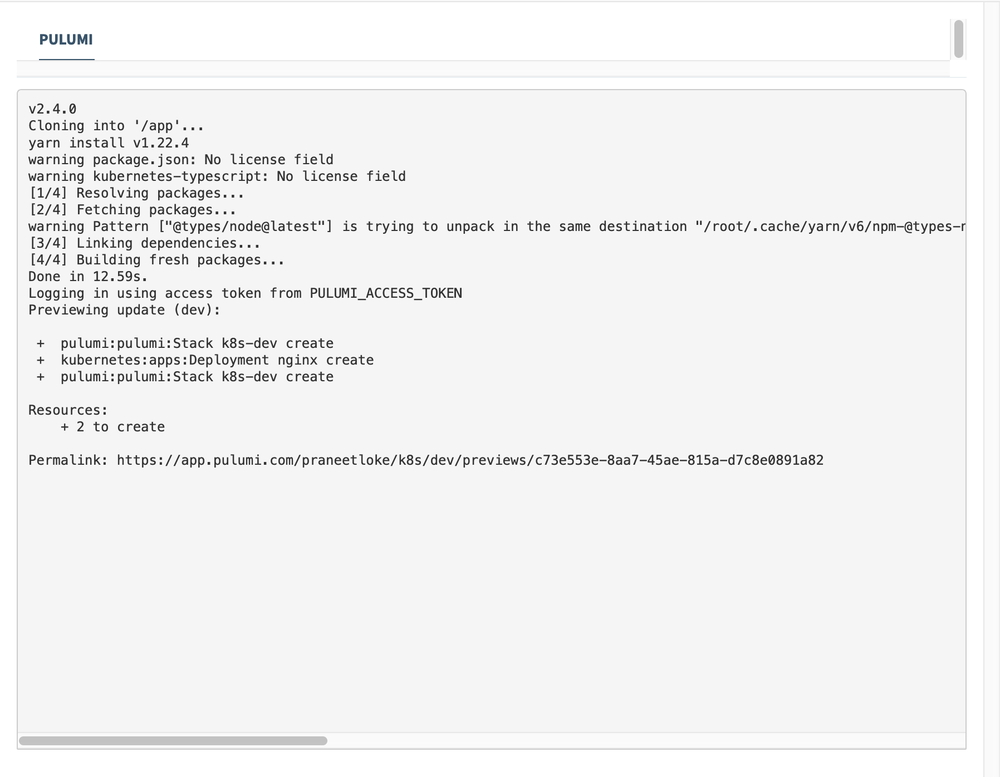

Spinnaker is an open source, multi-cloud continuous delivery platform for releasing software changes with high velocity and confidence.
This makes it a perfect fit for Pulumi to unleash the power of Spinnaker and its continuous delivery capabilities to all of the providers
that Pulumi supports today and in the future.

We have written a developer [guide]() showing you how to install the [plugin](https://github.com/pulumi/spinnaker-preconfigured-job-plugin) in your Spinnaker instance and start using it right away.

Here's a brief overview of the plugin.

* Create a new Spinnaker pipeline with the Pulumi stage.

* When you run a pipeline that has a Pulumi stage in it, you'll be able to see the logs of the Pulumi CLI within your pipeline execution details window. Click the **Console Output** to view the logs.

Here's a demo of the plugin:



If you have any questions or feedback about the plugin, please feel free to open an [issue](https://github.com/pulumi/spinnaker-preconfigured-job-plugin/issues) in the repo or join the conversation on our [Community Slack](https://slack.pulumi.com) as always.
