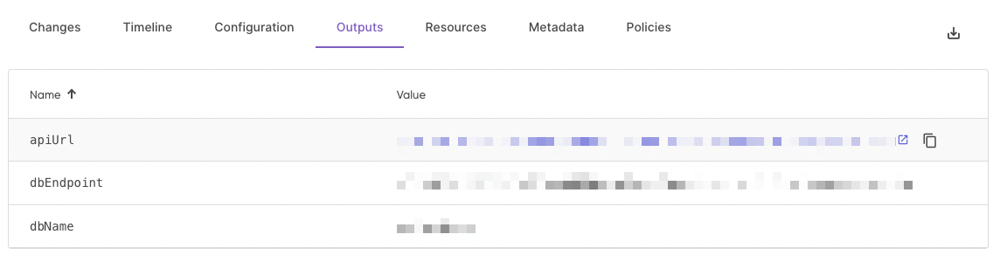

As part of our ongoing commitment to providing developers and infrastructure teams with powerful tools, we're thrilled to introduce the latest enhancement to Pulumi Cloud's stack update pages. We have shipped an improvement to Pulumi Cloud stack update pages where all update pages now show the resources in the stack at that time and the stack outputs going back since your first update on the stack.

<!--more-->

### Expanded Resource Information

Now, each update will provide detailed information about the resources. This includes a list of resources created, modified, or deleted in each update, offering a clearer understanding of the changes made to your infrastructure.

### Stack Outputs

The updated pages also now include information on the stack's outputs for each update instead of just the current point in time. The value of this is being able to go back and see what output values were after any update.

### The Value of Enhanced Data Visibility

Having a more detailed and transparent view of your stack updates provides several key benefits:

1. **Resource Lifecycle Management**: Understanding when and why a resource was added, modified, or deleted helps in better managing your infrastructure's lifecycle and planning future changes.

2. **Enhanced Troubleshooting and Analysis**: The ability to go back to a specific point in time and analyze the state of your infrastructure at that moment can be invaluable in troubleshooting issues or understanding the impact of certain changes.

In summary, the improved Pulumi Cloud stack update pages offer a more detailed, transparent, and insightful view of your infrastructure changes. This upgrade came directly from customer asks, and underscores our commitment to empowering developers with the tools and information they need to effectively manage and understand their cloud resources and how they change over time.

Stay tuned for more updates as we continue to enhance our platform to better meet your needs. As always, submit any feedback on the feature in the [Pulumi Cloud Requests](https://github.com/pulumi/pulumi-cloud-requests/issues/new/choose) repository.
