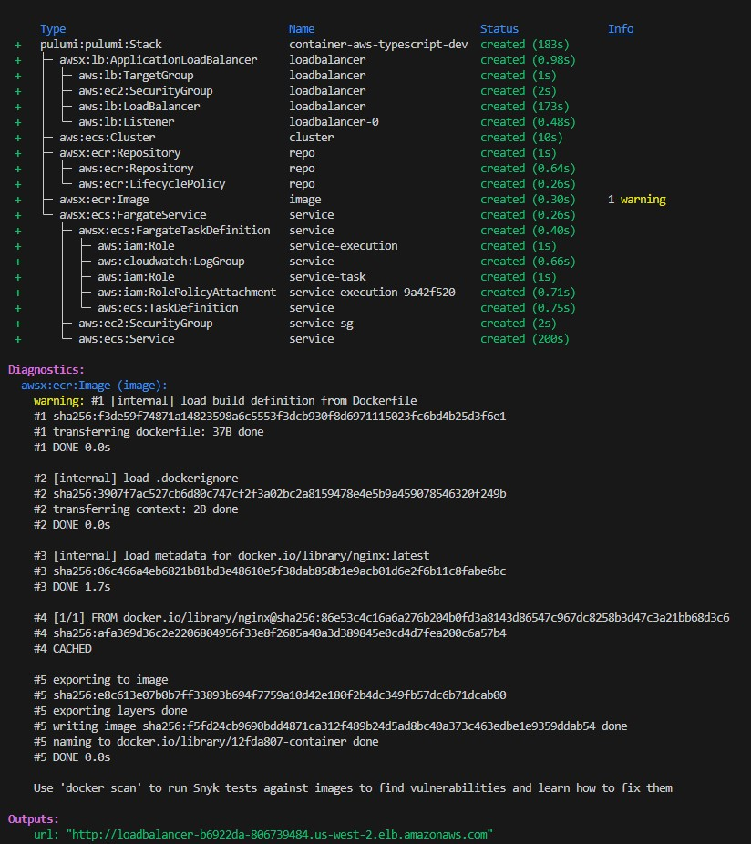
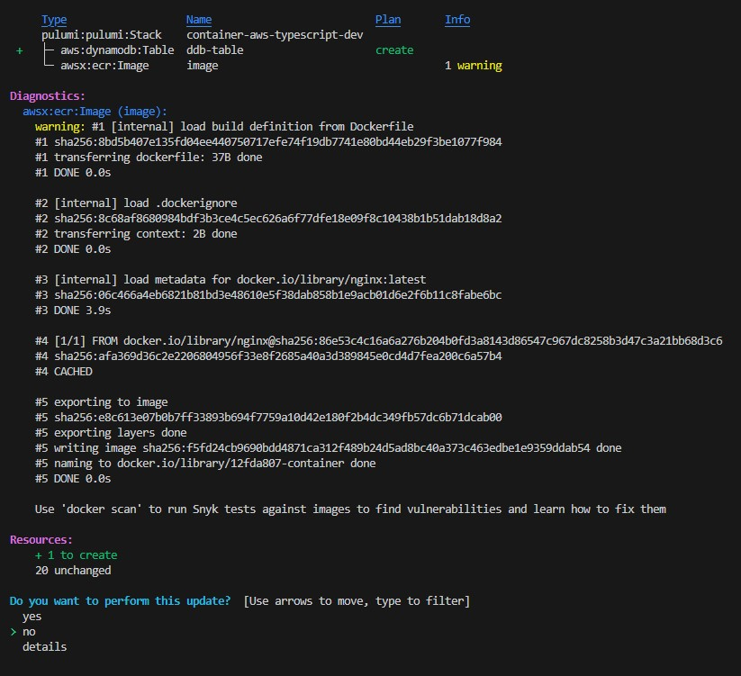

*This is the second of a three-part series originally published on The New Stack.*

Following the first piece in this series, [Infrastructure as Code in Any Programming Language](/blog/infrastructure-as-code-in-any-programming-language/), this walkthrough will show what it takes to get up and running with Infrastructure as Code. Everything we show will be done with Pulumi’s [free and open source Infrastructure as Code SDK](/docs/install/). You can also sign up for [Pulumi Cloud](https://app.pulumi.com/signup). After discussing the basics of how to get going, we’ll then dive into some advanced use cases to show what you can do from there.

## Migrating to Infrastructure as Code

When you pick an Infrastructure as Code tool, there is a major decision up front: Is this going to be net new infrastructure, or are you adopting existing infrastructure? In the latter case, maybe you clicked to experiment in the AWS console but are now ready to use Infrastructure as Code. Or maybe you started with Terraform and now want to migrate to Pulumi. In either case, there’s no getting around it. This is a trickier situation.

In some cases, it’s better to just toss that infrastructure and start over from scratch. Or perhaps you can focus on succeeding first with a “new” part of the system and integrate with the existing infrastructure until you’re convinced it’s time to migrate. In many cases, however, that’s infeasible: Maybe you actually have a mission-critical service already that you need to bring under the management of [Infrastructure as Code](/what-is/what-is-infrastructure-as-code/). The good news is that Pulumi offers [tools to migrate](/migrate/) from existing tools like Terraform, AWS CloudFormation/CDK, Azure Resource Manager (ARM), Kubernetes YAML and more, bringing existing infrastructure under the management of Pulumi without any disruption. The user guides in the [Migration Hub](/migrate/) walk through this process.

## Getting Started with Infrastructure as Code

Let’s assume we are starting out with new infrastructure, even though most concepts are relevant even if you’re starting with a migration.

### Cloud Infrastructure Resources: Architectures and Topologies

We usually start by provisioning a certain cloud architecture given our unique scenario. Maybe we’re creating a containerized application, a machine learning pipeline, or spinning up a Kubernetes cluster. In all of these cases, it begins by understanding the cloud resources that make up our architecture. In Pulumi, these are the programmable objects you’ll write code against.

The world of cloud infrastructure is a bit daunting. Pulumi supports over 100 clouds. AWS has over 200 services with over 1,000 individual resources and over 300,000 configurable properties across all of them. Pulumi is a multicloud tool, but “multicloud” does not mean “lowest common denominator.” Instead, Pulumi exposes all those individual clouds, resources and properties in their raw, unadulterated form. The benefit of this is that you have the entire capabilities of all of these clouds right at your fingertips. The downside is that to use them you need to understand these clouds and how to use them properly. As a result, you’ll probably quickly find that you want a starting point, rather than a blank page.

[Pulumi Templates](/templates/) are a good way to get started. They represent over a dozen of the most common application and infrastructure architectures on the most popular clouds. They were built to be simple enough to be understandable at a glance but complete enough to be useful in practice. That includes containerized services, serverless applications, static websites, virtual machines and Kubernetes clusters across AWS, Azure, and Google Cloud, in addition to common Kubernetes workloads. Each template generates a fully working project that you can kick the tires with or even use as a starting point for your own customized architecture.

[Pulumi Examples](https://github.com/pulumi/examples) is an open source collection of over 300 fully working examples covering more clouds and more services. If you didn’t find a good starting point with the templates, there is a good chance you’ll find an approximation of your desired architecture here. If not, there are over 100,000 individual API examples in the [Pulumi Registry](/registry/), such as [this one, which demonstrates provisioning a new Snowflake database with replication](/registry/packages/snowflake/api-docs/database/#example-usage). Although these aren’t always as complete as examples and templates, they can also provide a great jumping-off point, in addition to serving as great reference material as you create additional code.

Let’s take a quick look at several examples that represent common application architectures.

### Architecture 1: Containerized Service

In this example, we build and publish a Docker image running an NGINX web server to a private container registry, and then run that image in a load-balanced service. The load balancer ensures that we can easily scale up the number of replicas on the backend as our workload increases without fundamentally changing how clients can access it. There are many ways to accomplish this depending on the cloud we choose, and the detailed resources will differ.

If our chosen cloud is AWS, we will need an Elastic Container Service (ECS) cluster and registry, with a Fargate service and application load balancer in front of it. This enables our service to be accessed over the internet:


*See the template for AWS [here](/templates/container-service/aws/)*.

If we choose Google Cloud, on the other hand, we can either use Google Kubernetes Engine (GKE) or Google Cloud Run. In this example, we use Cloud Run and the built-in artifact repository, since these services are generally easier to use when just getting started:


In both cases, after deploying the infrastructure, we will have a fully functioning microservice environment with one load-balanced service running the NGINX web server. The Infrastructure as Code tool will give us a URL for the internet-accessible load balancer so we can browse to it.

*See the template for GCP [here](/templates/container-service/gcp/)*.

### Architecture 2: Serverless Application

In this example, we will create a serverless application. Unlike containers, which are fairly consistent across clouds (largely thanks to technologies like Docker and Kubernetes), the way serverless works varies greatly across clouds.

For Azure, we’ll need to create an Azure Blob Storage container to host our code, upload the serverless function bundle, and then configure an Azure Function app that will make our function available over HTTPS:


*See the template for Azure [here](/templates/serverless-application/azure/)*.

For AWS, although the architecture is in spirit very similar, the details differ greatly. We will use Amazon API Gateway and Lambda together to allow our function to be accessed over HTTPS:

In both cases, after deploying the infrastructure, we get back a web URL to access it. This example is a good reminder that each of the clouds is very different in its details. Infrastructure as Code doesn’t necessarily shield you from those details, although it is possible to build abstractions that do, which is both a strength but also something you’ll need to navigate.


*See the template for AWS [here](/templates/serverless-application/aws/)*.

### Architecture 3: Kubernetes Cluster

For the final example, let’s switch gears and focus on more “foundational” infrastructure than the applications themselves. This is the sort of thing a platform engineer might care more about than, say, a backend systems engineer who is focused mostly on building and shipping services. In this specific case, we’ll spin up a managed Kubernetes cluster in AWS and Azure.

In the case of Azure’s Kubernetes Service (AKS), the design of the service is fairly chunky. So we can simply spin up a managed cluster with the associated networking infrastructure:


*See the template for Azure [here](/templates/kubernetes/azure/)*.

In the case of AWS’s Elastic Kubernetes Service (EKS), on the other hand, the service itself is rather complex to set up, involving many moving parts. That includes the control plane itself, the worker node groups, an autoscaling group, the AWS container network interface plugin to manage pod networking and more:


*See the template for AWS [here](/templates/kubernetes/aws/)*.

You can see here even greater differences between the equivalent cloud services on different cloud providers and AWS’s more “building blocks” style of approach in action. This is also a great example of Infrastructure as Code’s ability to bundle best practices so that they can be reused. This uses the [Pulumi EKS Package](/registry/packages/eks/), which configures all of the above in the standard way so that you don’t need to figure out every little detail when you’re just getting started.

In both cases, we end up with a fully managed Kubernetes cluster that is ready to use. The tool spits out a kubeconfig file so we can immediately deploy into or inspect it.

## Infrastructure Projects and Stacks

All of these examples had one thing in common: The Infrastructure as Code program’s job is to declare individual resource objects, their properties and how they relate to each other. That was true no matter the scenario, the cloud or the language we have chosen. Once the program has done that, the Infrastructure as Code tool takes care of the rest.

Pulumi uses the term **project** to refer to the code that declares all of this, and each instance of said project that is configured and ready to deploy — each “environment,” if you will — is called a **stack**.


Each project can have many running stacks. That is useful for managing developer stacks (perhaps one per teammate) in addition to staging and production environments. It’s common to have many production environments when scaling a worldwide service. It’s also increasingly common to use short-lived stacks, for example, by creating a temporary stack for the duration of a pull request so pre-commit tests can be run against the hypothetical deployment.

The Pulumi CLI makes it easy to create both. The `pulumi new` command creates a new project:

```bash
$ pulumi new
```

It will prompt you for the project layout, name and other related settings. A project is just a name, program and associated metadata, and a parent for subsequent stacks.

The new command creates a starter stack, too, often called dev, for early-development purposes when getting going with a new project. However, additional ones can be created and managed using the `pulumi stack` command:

```bash
$ pulumi stack init   # create a new stack for this project
$ pulumi stack ls     # list stacks in this project
$ pulumi stack select # switch the current stack we're using
$ pulumi stack rm     # delete a stack
```

Everything defined at the project level is shared among all stacks, including the code itself. This is nice because usually we want to keep all of the environments consistent with one another. But clearly sometimes we’ll want certain elements to intentionally diverge. Perhaps we want to deploy different stacks to different regions, use smaller or fewer VMs in our development stack than in production to keep cloud costs down and so on.

This is where Pulumi **configuration** enters the picture. Using configuration, you can easily set different values for specific settings in one stack versus another, and then the program can change its behavior accordingly. This allows you to keep most of your project’s declared infrastructure consistent across stacks by default but explicitly alter it when needed.

```bash
$ pulumi config set aws:region us-west-2
```

That’s not where configuration ends, however. Some of our configuration may entail using sensitive information, like Stripe access keys, database passwords or other kinds of secret tokens. Although Pulumi treats all state securely with in-transit and at-rest encryption, we never want settings like these to show up in plaintext anywhere. That’s where the Pulumi **secrets** system comes in handy by providing built-in encryption and secure storage of these settings.

```bash
$ pulumi config set dbPassword --secret [redacted]
```

Finally, Pulumi gives you tools to manage your projects and stacks according to your own requirements, similar to how git can be used for many different source control philosophies such as monorepos. For a description of the tradeoffs involved, see the [“Organizing Projects and Stacks” user guide](/docs/guides/organizing-projects-stacks/) or the [IaC Recommended Best Practices blog series](/blog/iac-recommended-practices-structuring-pulumi-projects/). For complex systems, we will likely want a separation of concerns between pieces of our infrastructure, which means it is possible for one stack to depend on another.

For example, there could be a base networking and security layer, a data stack and a Kubernetes cluster that consume information from a lower-level layer but are provisioned separately, with applications above that depending on different assortments of all of the above.

Each stack is a unit of security and deployment concurrency. By layering stacks in this manner, we can let different teammates work in isolation from one another, ensure that the most secure and robust parts of our infrastructure are under lock and key, and just generally let different parts of the team go faster without affecting one another. The feature that enables this is called “Stack References,” and you can [read more about how to use them in the documentation](/docs/intro/concepts/stack/#stackreferences/).

## Doing a Deployment

After we’ve got everything wired up — a project, its code containing the declaration of a desired cloud resource topology, and at least one stack — it’s time to actually get something up and running. Since our code is written in an ordinary language, it’s tempting to think we would just run it outright. (Indeed, we will see later on that with the Automation API, we can do just that.) Infrastructure as Code is special, though; because of its declarative nature, we will run it using the Pulumi CLI, which ensures a declarative Infrastructure as Code workflow.

The `pulumi up` command is the key behind that workflow in action:

```bash
$ pulumi up
```

The `pulumi up` command evaluates our program, generates a desired state resource graph and gives us a preview of what will occur should we proceed with our deployment. (We can run the `pulumi preview` command explicitly if we want to run that as an independent step.) That preview will show any creates, updates or deletes, as well as interesting metadata about our deployment. The first time we ever deploy to a stack, there will be only creates, but after that we will see things like detailed diffs down to the property level for everything that has changed from one up to the next. These changes may arise due to code changes or even configuration updates.

Let’s take a look at all of this in action. First, we’ll create a new stack to run a load-balanced service in AWS (although it’s AWS, the same workflow applies no matter our choice of cloud):

```bash
$ pulumi new container-aws-typescript
```

Now let’s inspect the code that got generated:

```typescript
import * as pulumi from "@pulumi/pulumi";
import * as aws from "@pulumi/aws";
import * as awsx from "@pulumi/awsx";

const config = new pulumi.Config();
const containerPort = config.getNumber("containerPort") || 80;
const cpu = config.getNumber("cpu") || 512;
const memory = config.getNumber("memory") || 128;

// An ECS cluster to deploy into
const cluster = new aws.ecs.Cluster("cluster", {});

// An ALB to serve the container endpoint to the internet
const loadbalancer = new awsx.lb.ApplicationLoadBalancer("loadbalancer", {});

// An ECR repository to store our application's container image
const repo = new awsx.ecr.Repository("repo", {
    forceDelete: true,
});

// Build and publish our application's container image from ./app to the ECR repository
const image = new awsx.ecr.Image("image", {
    repositoryUrl: repo.url,
    path: "./app",
});

// Deploy an ECS Service on Fargate to host the application container
const service = new awsx.ecs.FargateService("service", {
    cluster: cluster.arn,
    assignPublicIp: true,
    taskDefinitionArgs: {
        container: {
            name: "app",
            image: image.imageUri,
            cpu: cpu,
            memory: memory,
            essential: true,
            portMappings: [{
                containerPort: containerPort,
                targetGroup: loadbalancer.defaultTargetGroup,
            }],
        },
    },
});

// The URL at which the container's HTTP endpoint will be available
export const url = pulumi.interpolate`http://${loadbalancer.loadBalancer.dnsName}`;
```

If we deploy this, we will see the full resource graph and the load-balanced service at the end:



That’s what the initial deployment looks like. Now let’s create a database for our application. We’ll first add these code changes:

```typescript
const basic_dynamodb_table = new aws.dynamodb.Table("ddb-table", {
    attributes: [
        {
            name: "UserId",
            type: "S",
        },
        {
            name: "GameTitle",
            type: "S",
        },
        {
            name: "TopScore",
            type: "N",
        },
    ],
    billingMode: "PROVISIONED",
    globalSecondaryIndexes: [{
        hashKey: "GameTitle",
        name: "GameTitleIndex",
        nonKeyAttributes: ["UserId"],
        projectionType: "INCLUDE",
        rangeKey: "TopScore",
        readCapacity: 10,
        writeCapacity: 10,
    }],
    hashKey: "UserId",
    rangeKey: "GameTitle",
    readCapacity: 20,
    tags: {
        Environment: "production",
        Name: "dynamodb-table-1",
    },
    ttl: {
        attributeName: "TimeToExist",
        enabled: false,
    },
    writeCapacity: 20,
});
```

And then run `pulumi up` again. Notice that it shows us the diffs this time, down to individual properties that have changed in addition to what is new:



Note that, thanks to understanding of dependencies between resources, Infrastructure as Code tools will run many operations in parallel. You’ll see that timings are displayed as things are updated. Provisioning cloud infrastructure can be a slow process, but because of parallelism, Pulumi not only knows in what order to run various operations, it can do so as fast as possible.

After all is said and done, we can `pulumi destroy` our stack, which deletes all infrastructure within it:

```bash
$ pulumi destroy
```

This is clearly a dangerous but necessary operation. Pulumi has two features to help avoid mistakes. First, [protecting a resource](/docs/intro/concepts/resources/options/protect/) ensures extra steps are required to delete it, and second, [the retain-on-delete option](/docs/intro/concepts/resources/options/retainondelete/) keeps the physical resource around even when the logical resource has been removed from your Pulumi stack. These are good to use with critical and precious resources whose destruction might be catastrophic, like databases — better safe than sorry!

In Part 3 of our series, the final installation, we will discuss advanced IaC use cases and how you can use Pulumi Cloud to develop cloud infrastructure with code and tame cloud infrastructure management at scale. We will be using Pulumi Cloud, which is available [here](https://app.pulumi.com/signup).
