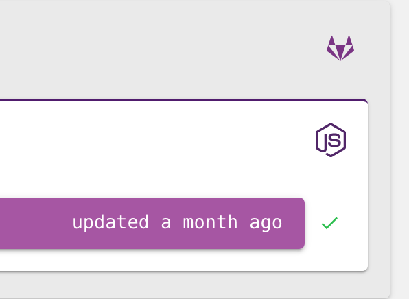

We are very pleased to announce that [Pulumi](/) now
supports signing-in with your GitLab account. Don't have an account on
GitLab yet? Head on over to <https://gitlab.com> and sign-up for an
account.
<!--more-->

## Why GitLab?

GitLab is a fully-integrated DevOps service that not only provides git
repository management but also allows you to collaborate using issue
boards, setup build and deployment pipelines. It provides an end-to-end
solution that starts from your code and ends with your customers, all
without ever having to leave GitLab.

And with Pulumi on GitLab, you truly never have to leave GitLab, not
even to provision your infrastructure to run your services on the cloud.

[Learn more about GitLab](https://about.gitlab.com/why/).

## Login and create a GitLab-backed Pulumi organization

- Log into `app.pulumi.com` using the GitLab Sign-in.
- Click on the organizations dropdown menu and select **Add an
  organization**.

- On the next page, you may select your GitLab group, based on which a
  Pulumi organization will be created.
- Once the organization is created, you can create stacks in your
  newly created organization, so that other members of your
  organization can collaborate with you.

## Inviting members in your GitLab group to use Pulumi

Select the organization you created from the organization dropdown menu.
You should see a **People** tab. Select the People tab.

> - You will see the People tab if *you* added the organization on
>   Pulumi or if you are an Owner of the GitLab group on
>   [gitlab.com](http://gitlab.com).
> - Members must have an active and valid role in your GitLab group,
>   so that you may invite them.

From the People tab, you can invite additional members in your group to
also use Pulumi. By inviting members in your group to join Pulumi, you
can collaborate with them more easily and share stacks, just like you
would collaborate on a project on GitLab.

## Running Pulumi on GitLab

Pulumi can be run in [many CI/CD environments](). Pulumi can be easily
integrated in your [CI pipeline on GitLab](), too.

## Deep-linking to your GitLab projects, branches and commits

When you run Pulumi in a GitLab-based repo, the pulumi CLI recognizes
the correct metadata based on your repository's `remote` configuration
and uses that information to enhance your experience on
`app.pulumi.com`.

Here's an example of a project hosted on
[gitlab.com](http://gitlab.com).

Here's the same project with some activity having links to the
commit-hash, and the branch in which this stack was updated.

## FAQs

### I use my GitHub identity to login into GitLab. How do I do that with Pulumi?

Click the **GitLab** sign-in button on <app.pulumi.com>, Pulumi
will redirect you to [gitlab.com](http://gitlab.com) where GitLab will
present you with the sign-in options to login into your GitLab account.
At that point, you may choose any of the sign-in options GitLab provides
to sign-in.

### I already have an account on Pulumi. Will signing-in with my GitLab identity create a new account?

Yes. Signing-in with a GitLab account will create a new account. That
means, your stacks and activity will stay with the other account. You
can migrate them by performing a
[`pulumi stack export`]()
from your source stack and then importing it using
[`pulumi stack import`]()
in a new stack in your GitLab-based account.

If you would like to add your GitLab identity to your _existing_ Pulumi account, you can
do so by connecting your GitLab identity from your Pulumi account's profile page.

### How do I login into the pulumi CLI on my local machine using my GitLab-backed Pulumi account?

One of the benefits of using <app.pulumi.com> is to track the state of
your stacks. When you are running the pulumi CLI on your machine, you
can login into your account by typing `pulumi login`. There are two
options for you to complete the login process. You can either create an
Access Token on <app.pulumi.com> or simply press **ENTER** to let the
CLI launch the browser.

If you would like to let the CLI launch the browser, ensure that you are
already signed-in using GitLab at <app.pulumi.com> using your machine's
*default* browser. This way, when the browser is launched by the CLI,
your Pulumi account based on your GitLab identity would be automatically
used.
