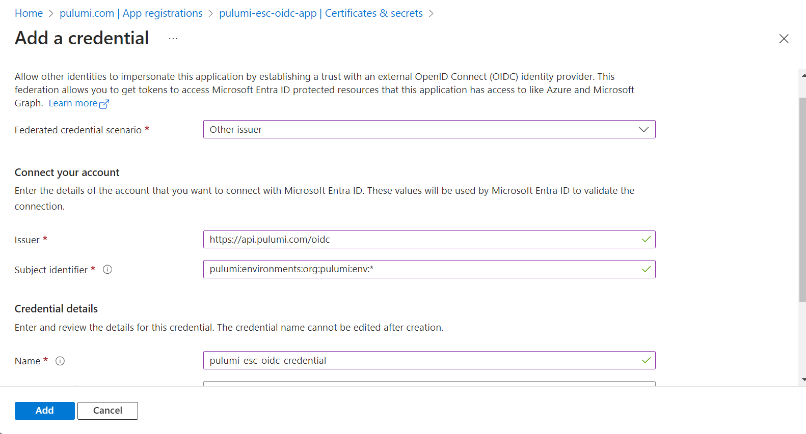

[Pulumi ESC (Environments, Secrets, and Configuration)](/product/esc/) is a service that helps to alleviate the burden of managing cloud configuration and secrets by providing a centralized way to handle these critical aspects of cloud development. This guide will provide the step-by-step process for how to run Azure CLI commands using the `esc run` functionality of Pulumi ESC.

## Step 1: Install and login to Pulumi ESC

To begin, you will need to [install Pulumi ESC](/docs/install/esc/). Once the installation is complete, run the `esc login` command and follow the steps to login to the CLI.

```
$ esc login
Manage your Pulumi ESC environments by logging in.
Run `esc --help` for alternative login options.
Enter your access token from https://app.pulumi.com/account/tokens
    or hit <ENTER> to log in using your browser                   :  
Logged in to pulumi.com as …
```

## Step 2: Create the OIDC configuration

Pulumi ESC offers you the ability to [manually set your credentials as secrets](/docs/esc-cli/commands/esc_env_set/) in your Pulumi ESC environment files. When it comes to something like OpenID Connect (OIDC) configuration, a more secure and efficient alternative is to leverage yet another great feature of Pulumi ESC: dynamic credentials.

This service can dynamically generate credentials on your behalf each time you need to interact with your cloud environments. To do so, you'll need to [configure OIDC between Pulumi and your cloud provider of choice](/docs/pulumi-cloud/esc/providers/#setting-up-oidc).

For Azure, there are three resources you will need to create:

- A Microsoft Entra application
- Federated credentials
- A service principal

Let's start by creating the Microsoft Entra application. There are a number of ways you can do this, but we will demonstrate how to create it via the Azure portal.


Please note that while we’re providing steps and screenshots that are accurate as of the date of this post, Azure documentation is subject to change. For the most current and precise information, always refer to the [official Azure documentation](https://learn.microsoft.com/en-us/entra/identity-platform/howto-create-service-principal-portal).


### a. Create a new application registration

In the navigation pane of the [Microsoft Entra console](https://portal.azure.com/#view/Microsoft_AAD_IAM/ActiveDirectoryMenuBlade/~/Overview), choose **App registrations** and then click **New registration**.



Provide a name for your application (ex: `pulumi-esc-oidc-app`) and make sure that under the **Supported account types** section, the radion button next to **Accounts in this organizational directory only** is selected. Then click **Register**.



### b. Create federated credentials

Once you have created your new application registration, you will be redirected to the application's **Overview** page. In the left navigation menu, click the link for **Certificates & secrets**. Then click the **Federated credentials tab** followed by the **Add credential** button.



In the dropdown next to **Federated creential scenario**, select the **Other issuer** option. You will be presented with a number of fields to complete.



Provide the following values to the corresponding fields:

- **Issuer**: `https://api.pulumi.com/oidc`
- **Subject identifier**: `pulumi:environments:org:<organization name>:env:*`
  - Make sure to replace `<organization name>` with the name of your own Pulumi organization
- **Name**: Provide a name for your credential (ex: `pulumi-esc-oidc-credential`)



For the **Audience** field, click the **Edit** link and provide the name of your Pulumi organization.




In the above configuration, the value provided to the **Subject identifier field** currently allows access to these credentials from any Pulumi ESC environment from within your organization . You can edit this configuration to futher limit access to a specific Pulumi ESC environment by replacing the wildcard (*) with the name of the designated environment.

This guide will show you how to create an environment in a later step, and you can learn more about the details of this configuration in the [relevant Pulumi documentation](https://www.pulumi.com/docs/pulumi-cloud/esc/providers/azure-login/#adding-federated-credentials).


### c. Create a service principal

Now that you have your federated credentials created, the next step is to create a service principal. This is where you will define what permissions you will allow your Pulumi ESC environment to have in your Azure account.

Navigate the the [subscriptions page of your Azure portal](https://portal.azure.com/#view/Microsoft_Azure_Billing/SubscriptionsBladeV1) and select the subscription to create the service principal in. In the left navigation menu, select **Access control (IAM)**, then click **Add** > **Add role assignment**.



You will be directed to the **Add role assignment** wizard. Under the **Job function roles** tab, select the **Reader** role from the list, then click **Next**.




For the purposes of this guide, we will be demonstrating how to run the `az vm list` command using the `esc run` functionality. The **Reader** role will provide the permissions we need to do this, but you should select the role that best meets the requirements of your particular business use case.


Make sure the radio button next to **User, group, or service principal** is selected, then click **Select members**. In the search box, type in the name of the application you created in a previous step, select it from the list, then click **Select**. From there, click **Next** and then **Review + assign**.



After creating your Azure resources, make sure to make a note of the following details as you will need it in the next steps:

- Application (client) ID
- Directory (tenant) ID
- Subscription ID

## Step 3: Create a new environment

Now that you have created all of the necessary Azure resources, the next step is to create a new environment in the [Pulumi Cloud](https://app.pulumi.com/). Make sure that you have the correct organization selected in the left-hand navigation menu. Then click the **Environments** link, and click the **Create environment** button. In the following pop-up, provide a name for your environment before clicking the  **Create environment** button.



## Step 4: Add the Azure provider integration

Once you have created your new environment, you will be presented with a split-pane editor view. Delete the default placeholder content in the editor on the left-hand side and replace it with the following code, making sure to replace `<your-client-id>`, `<your-tenant-id>`, and `<your-subscription-id>` with the values from the previous step:

```yaml
values:
  azure:
    login:
      fn::open::azure-login:
        clientId: <your-client-id>
        tenantId: <your-tenant-id>
        subscriptionId: /subscriptions/<your-subscription-id>
        oidc: true
  environmentVariables:
    ARM_CLIENT_ID: ${azure.login.clientId}
    ARM_TENANT_ID: ${azure.login.tenantId}
    ARM_SUBSCRIPTION_ID: ${azure.login.subscriptionId}
```

The variables defined under the `environmentVariables` parameter above are the same environment variables that the Azure CLI uses if you were authenticating with something like the `az login` command.  What the above configuration is doing is dynamically generating the credentials and projecting those credential values into your local environment. From there, the Azure CLI picks up those environment variables and runs the designated command. You can find out more about this provider definition and how it works in the Pulumi ESC documentation for [the Azure provider](/docs/pulumi-cloud/esc/providers/azure-login/#example) as well as the documentation for [projecting environment variables](https://www.pulumi.com/docs/pulumi-cloud/esc/environments/#projecting-environment-variables).

Scroll to the bottom of the page and click **Save**.

[add-environment-config video here]

## Step 5: Run your command

With your environment set up, first run the `az logout` command to make sure your local environment does not have any Azure credentials configured. Next run the `az vm list` command as normal. You should see the following response:

```
$ az vm list

Please run 'az login' to setup account.
```

Now run the command using `esc run` as shown below, making sure to replace `<your-pulumi-org-name>` and `<your-environment-name>` with the names of your own Pulumi organization and environment respectively:

```bash
esc run <your-pulumi-org-name>/<your-environment-name> -i az vm list
```

You should see something similar to the following output:

```
TBD
```
