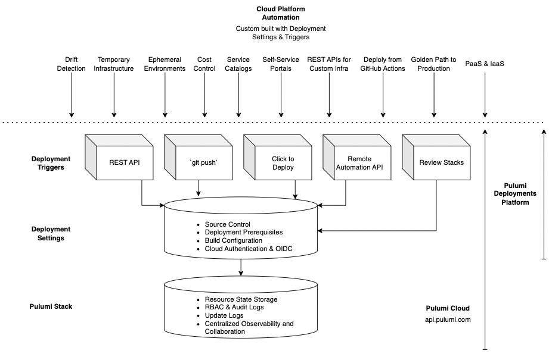

Pulumi Deployments is a fully managed platform for managing infrastructure at scale. Whether you are just getting started in the cloud and want the easiest path to set up secure CI/CD, or are a platform engineer building a self-service platform to support thousands of engineers, Pulumi Deployments is the fastest way to go from code to cloud. We provide the building blocks that enable you to scale your cloud footprint without scaling your headcount, with tools that are designed to power public and private cloud platforms, APIs, and self-service infrastructure portals.

It provides:

- **Compute** - run infrastructure deployments and workloads (i.e. `pulumi up`) on fully managed, secure, and elastic compute.
- **Configuration** - A simple, centralized place to specify everything you need to deploy your infrastructure at the stack level. Source code, cloud credentials, OpenID Connect (OIDC), environment variables, build prerequisites, and dependencies are bundled in an atomic unit.
- **Composition** - Trigger deployments via our REST API, click to deploy in the Pulumi Cloud UI, Git Push to Deploy, Review Stacks, Remote Automation API, and other programmatic building blocks that you can compose to build custom cloud automation.

While Pulumi Deployments has some overlap in functionality offered by a traditional CI/CD system (such as GitHub Actions) it is far more flexible and does not have the constraints and limitations of a CI/CD system. When you configure your infrastructure for Deployments, you get to choose what triggers will cause your stack to update. You may choose a `git push` based workflow, as you get with many CI/CD systems, or trigger deployments via the REST API, or choose multiple triggers.

## Deployment Settings

Each stack in your organization can be configured with deployment settings that describes everything needed to run an update. Deployment settings turns a stack into an atomic, deployable unit of infrastructure that self-describes all of its requirements and dependencies. That includes:

- Source Control - the Pulumi program and stack configuration
- Deployment Prerequisites - custom docker images, build steps, npm package resolution, and acquisition of necessary tools like `ssh`, and environment variables
- Cloud Auth - IAM roles, OIDC configuration for temporary credentials, and any other identity-related config required to deploy into your cloud of choice

These settings can be configured through the Pulumi Cloud Console, via a REST API, or via Pulumi using the Pulumi Service provider. The console interface is simple and lets you configure settings in just a few minutes, while the REST API and Pulumi Service provider allows you to build tools on top of Pulumi Deployments such as internal dev portals and service catalogs that help internal users kickstart their infrastructure journey with a secure, best practice workflow.

Once configured, every deployment will inherit stack settings. A one-line POST payload can trigger a new deployment run, without having to restate any configuration or cloud credentials. This means that privileged users can configure deployments, and less privileged users can subsequently trigger updates without having direct access to sensitive credentials and data on their local machines.

## Deployment Triggers

Pulumi Deployments offers several triggers that you can compose to build higher-level infrastructure automation. Because each trigger inherits deployment settings, you only have to configure a stack once.

- Deployments REST API - an endpoint available at api.pulumi.com that can trigger a variety of pulumi (`up/destroy/refresh/preview`) operations. Calls to this trigger can override individual settings to customize deployment behavior (i.e. - deploy a different branch, or override a particular environment variable).
- `git push` to Deploy - Deep integration with the Pulumi GitHub App that enables automatic previews on every pull request, and an automated update whenever code is pushed to the target branch.
- [Review Stacks](/docs/pulumi-cloud/deployments/review-stacks) - dedicated cloud environments that get created automatically every time a pull request is opened.
- Click to Deploy - trigger a deployment from the Pulumi Cloud Console with the push of a button. Very useful for day-to-day operational activities such as debugging a stuck stack, or rectifying drift via a refresh without having to pull a stack and its accompanying source code onto your machine.
- Remote Automation API - Your favorite strongly typed Pulumi orchestration tool, Automation API, lets you offload update workloads into the cloud. Write deployment scripts that update thousands of environments simultaneously without worrying about compute.

Triggers can be used together, or not at all. Some users like to use the REST API to trigger deployments from GitHub Actions and disable the built-in `git push` integration. Doing so gives them the flexibility to compose deployment settings, the REST API, and click to deploy into useful platform workflows outside of CI/CD.

Deployment settings plus triggers are the key building blocks of the deployment platforms. With them, you can build highly customized infrastructure automation and developer platforms such as service catalogs, drift detection, temporary infrastructure workflows for cost savings, infrastructure REST APIs, and more. These scenarios and more are discussed further with demos and source code.
