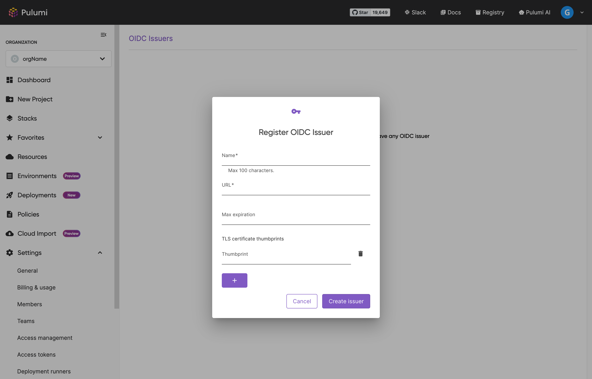
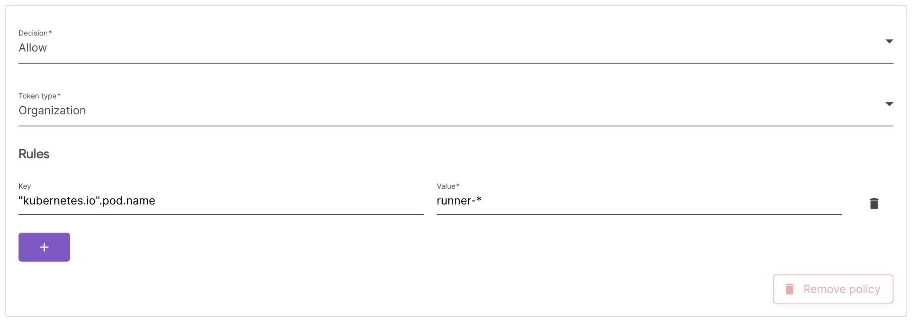

Pulumi supports establishing trust relationships with third party OIDC providers by leveraging id_tokens and allowing it to be exchanged by a short-lived Pulumi access token. This mechanism enhances security by eliminating the necessity for hardcoded credentials.

## Overview

For third party services that have capabilities to issue OIDC id_tokens, it is possible to register them as a trusted OICD Issuer to leverage these tokens to be exchanged by a short-lived Pulumi access token automatically to avoid having to store hardcoded credentials.

## Configuring trust relationships

### Register the OIDC issuer

Navigate to **OIDC Issuers** under your Organization's **Settings** and click on **Register a new issuer**.



The issuer URL is used to fetch the OpenID Configuration metadata by appending `/.well-known/openid-configuration`.

The max expiration is used to limit the duration of the Pulumi access token. By default, the max duration will be 25 hours.

To prevent a range of security attacks, Pulumi stores the provider's TLS certificate thumbprint. This is used in further interactions to verify the provider's certificate. By default, Pulumi will store the thumbprint of the certificate used to serve the OpenID configuration. If the provider uses multiple certificates to serve content, it is required to manually configure them when registering the issuer (this can also be used for other operations such as certificate rotation).

#### How to calculate the certificate thumbprint

1. Use OpenSSL to fetch the certificates used by the issuer. From the following example, replace example.com with the issuer URL

   ```bash
   openssl s_client -servername example.com -showcerts -connect example.com:443
   ```

1. From its output, look for the certificate returned (if there is more than one, look for the first one) and copy it to a file named “certificate.crt”
1. Calculate the certificate digest (SHA256) by running the following command

   ```bash
   openssl x509 -in certificate.crt -fingerprint -sha256 -noout

   > sha256 Fingerprint=2B:60:30:08:8E:8D:08:FC:D6:1B:8B:89:70:19:F2:D9:9F:4B:9A:0F:7B:46:5B:06:5C:2B:90:E1:C5:3B:C0:7D
   ```

1. Remove all the colon (:) characters and copy the result

   ```
   2B6030088E8D08FCD61B8B897019F2D99F4B9A0F7B465B065C2B90E1C53BC07D
   ```

1. Use that value to configure the issuer thumbprints. If multiple certificates are used to serve content from that route, a digest for each of those certificates is required.

### Configure the authorization policies

When a new OIDC issuer is registered, a default authorization policy is provisioned denying any token exchange. Explicitly configuring **allow** policies is required.

When configuring a policy, it needs to explicitly call out what kind of token can be requested as well what team or user it will be scoped to for such token types.

It is also required to configure at least one claim validation rule. When defining the claim key, it is possible to target nested claims by defining the claim path. For example, having the following structure:

```json
{
  "aud": [
    "urn:pulumi:ORG_NAME"
  ],
  "exp": ...,
  "iat": ...,
  "iss": "https://container.googleapis.com/v1/projects/sample/locations/us-west1/clusters/sample",
  "kubernetes.io": {
    "namespace": "default",
    "pod": {
      "name": "runner-ddfaa34e-dfrjh",
      "uid": "b99b58df-cce5-405a-a33d-49a4cf8cf7bd"
    },
    "serviceaccount": {
      "name": "default",
      "uid": "5993991f-ee08-4eaf-b5a8-714b71739058"
    }
  },
  "nbf": ...,
  "sub": "system:serviceaccount:default:default"
}
```

You can target the pool name by defining the path as `"kubernetes.io".pod.name`.

Note the use of quotes to scape dots in the object keys.

For the claim values, it is possible to use the following wildcard notation for flexible matching:

- `*`: match zero or more characters
- `?`: match zero or one character
- `.`: match exactly one character

In this example, it can be configured as `runner-*` to match any pod name with the `runner-` prefix.



## Exchanging OIDC tokens

To exchange OIDC tokens for Pulumi access tokens, the oauth2 token endpoint and token exchange grant type are used.

This endpoint supports both `application/json` and `application/x-www-form-urlencoded` content types are supported.

Parameters:

- `audience`: `urn:pulumi:org:{ORG_NAME}`
- `grant_type`: `urn:ietf:params:oauth:grant-type:token-exchange`
- subject_token_type: `urn:ietf:params:oauth:token-type:id_token`
- requested_token_type:
    - Org token: `urn:pulumi:token-type:access_token:organization`
    - Team token (scope is required): `urn:pulumi:token-type:access_token:team`
    - Personal token (scope is required): `urn:pulumi:token-type:access_token:personal`
- scope: a single scope will be supported initially and used to define when asking for a team or personal token, what team/user it should be assigned to. Format: `team:TEAM_NAME` (for example: `team:OPS_AUTOMATIONS`) or `user:USER_LOGIN` (for example: `user:djohn`)
- expiration: (int, time in seconds) used to customize the token expiration required by the operation. The default token expiration (2 hours) will be used.
- subject_token: token issued by the IdP

```bash
curl -X POST  \
    -H 'Content-Type: application/x-www-form-urlencoded' \
    -d 'audience=urn:pulumi:org:test' \
    -d 'grant_type=urn:ietf:params:oauth:grant-type:token-exchange' \
    -d 'subject_token_type=urn:ietf:params:oauth:token-type:id_token' \
    -d 'requested_token_type=urn:pulumi:token-type:access_token:organization' \
    -d 'subject_token='...' \
    https://api.pulumi.com/oauth/token
```

## Configuring OpenID Connect

To configure OIDC, refer to one of our guides:

- [Configuring OIDC for Github](/docs/pulumi-cloud/oidc-client/github/)
