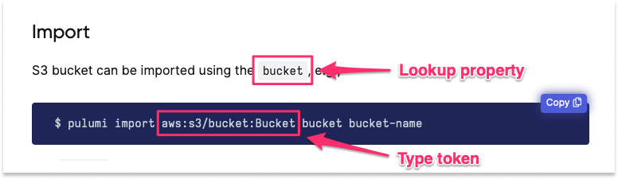

Most infrastructure as code projects require working with existing cloud resources, whether those resources were originally created with another IaC tool or manually provisioned with a cloud provider console or CLI. Interacting with a previously created cloud resource with Pulumi typically happens in one of two ways:

1. Referencing the properties of the existing cloud resource in order to use those properties to configure a Pulumi-managed resource.
1. Adopting the existing resource to bring it under management by Pulumi.

The first scenario is sometimes called _coexistence_, and you can learn more it in [Adopting Pulumi > Coexistence](/docs/using-pulumi/adopting-pulumi#coexistence). The second scenario is called _adoption_ or _import_, and you can learn more about it the sections that follow.

## Two ways to import a resource

There are two ways to import an existing cloud resource into a Pulumi project:

1. With the [`pulumi import`](/docs/cli/commands/pulumi_import) CLI command. This command imports the resource into the currently selected [stack](3/docs/concepts/stack/) and generates code describing the resource's current configuration for you to add to your Pulumi program.

1. In code, with the [`import` resource option](/docs/concepts/options/import/). This option is supplied by as an additional property on a resource declaration that you write into your Pulumi program yourself.

Both approaches allow you to adopt and begin managing existing cloud resources with Pulumi, but they work in slightly different ways, and are suited to slightly different use cases. The sections below explain both in more detail.

## How resource import works

Import uses the selected stack's configured [provider](/docs/concepts/resources/providers/) to look up the desired resource in the cloud provider, read its current configuration, and add the resource to the stack to bring it under management by Pulumi from that point forward. For this, it requires two pieces of information:

* The _type_ of cloud resource to import --- either as a type _token_ (a string that uniquely identifies a Pulumi resource type) when using the CLI or as a resource declaration when importing in code. The type token of an Amazon S3 Bucket resource, for example, is `aws:s3/bucket:Bucket`.

* The _name_ and _value_ of the property to use for the resource lookup. Lookup properties vary by resource. For an Amazon S3 bucket, the property used for lookup is [`bucket`](/registry/packages/aws/api-docs/s3/bucket/#bucket_nodejs), so the value to use for the lookup would be the bucket's globally unique name. For an Amazon VPC, however, the property used for lookup is [`id`](/registry/packages/aws/api-docs/ec2/vpc/#id_nodejs), so the value to use for it would be its AWS-assigned unique identifier.

### Where to find the type token and lookup property {#where-to-find}

You'll find the type token and lookup property in the Import section of the resource's API documentation in the [Pulumi Registry](/registry/). The type token is quoted in the `pulumi import` example, and the lookup property can be found in the description just above it:




Make sure the resource provider is configured in a way that allows it to locate the resource you want to import --- e.g., that the resource is in the same region as other resources in your stack --- or the import operation may fail.


## Importing resources with the CLI

The `pulumi import` command looks up the resource using the specified type token and resource identifier, adds the resource to the stack's current state, and emits the code required to manage the resource with Pulumi from that point forward. This option requires the least manual effort, so is generally recommended, and is best suited to projects consisting consisting of only one stack.

To import an existing cloud resource with the Pulumi CLI, use the following syntax:

```bash
$ pulumi import <type> <name> <id>
```

* The first argument, `type`, is the Pulumi type token to use for the imported resource.

    As mentioned in [Where to find the type token and lookup property](#how-import-works), you'll find the type token for a given resource by navigating to the Import section of the resource's API documentation in the [Pulumi Registry](/registry/). For example, the type token of an [Amazon S3 Bucket](/registry/packages/aws/api-docs/s3/bucket/#import) resource, for example, is `aws:s3/bucket:Bucket`.

* The second argument, `name`, is the [resource name](/docs/concepts/resources/names) to apply to the resource once it's imported. The generated code will use this name for the resource declaration (the first parameter in any resource), so like all Pulumi resource names, it must be unique among all resources for this type within the scope of the containing project. (That is, you may have an S3 bucket and a VPC named `foo`, but you cannot have two S3 buckets named `foo`.)

* The third argument, `id`, is the value to use for the resource lookup in the cloud provider. This value should correspond to the designated lookup property specified in the Import section of the resource's API documentation in the Registry.

For help identifying a resource's type token and lookup property, see [Where to find the type token and lookup property](#where-to-find) above. To learn more about the additional options available on the `pulumi import` command, see the [`import` command documentation](/docs/cli/commands/pulumi_import/).

### Example

In this example, a previously provisioned Amazon S3 bucket named `company-infra-logs` is imported into a Pulumi stack named `dev` (the currently [selected](/docs/cli/commands/pulumi_stack_select/) stack) and given a resource name of `infra-logs`:

```bash
$ pulumi import aws:s3/bucket:Bucket infra-logs company-infra-logs

Previewing import (dev)

     Type                 Name        Plan
 +   pulumi:pulumi:Stack  dev         create
 =   └─ aws:s3:Bucket     my-bucket   import

Resources:
    + 1 to create
    = 1 to import
    2 changes

Do you want to perform this import?
> yes
  no
  details
```

Choosing to proceed immediately adds the resource to the current stack's state and emits a block of code to `STDOUT` to be added to the Pulumi program. If the current program were written in TypeScript, for example, the resulting CLI output would resemble the following:

```plain
...

Importing (dev)

     Type                 Name        Status
 +   pulumi:pulumi:Stack  dev         created (3s)
 =   └─ aws:s3:Bucket     my-bucket   imported (1s)

Resources:
    + 1 created
    = 1 imported
    2 changes

Duration: 4s

Please copy the following code into your Pulumi application. Not doing so
will cause Pulumi to report that an update will happen on the next update command.

Please note that the imported resources are marked as protected. To destroy them
you will need to remove the `protect` option and run `pulumi update` *before*
the destroy will take effect.

import * as pulumi from "@pulumi/pulumi";
import * as aws from "@pulumi/aws";

const my_bucket = new aws.s3.Bucket("infra-logs", {
    arn: "arn:aws:s3:::company-infra-logs",
    bucket: "company-infra-logs",
    hostedZoneId: "Z3BJ4Q6RFIQJ6N",
    requestPayer: "BucketOwner",
    serverSideEncryptionConfiguration: {
        rule: {
            applyServerSideEncryptionByDefault: {
                sseAlgorithm: "AES256",
            },
        },
    },
}, {
    protect: true,
});
```

After importing the resource and pasting the generated code into your program, you can run `pulumi up`, and all subsequent operations
will behave as though Pulumi had provisioned the new resource from the outset:

```plain
$ pulumi up
...

Updating (dev)

    Type                 Name
    pulumi:pulumi:Stack  dev

Resources:
    2 unchanged

Duration: 2s
```

Notice that by default, resources imported with the CLI are marked as _protected_ to guard against accidental deletion. If you forgot, for example, to append the generated code to your program before running another `pulumi up`, Pulumi would first interpret the missing code as an intention to delete the new resource, but then fail on the existence of the `protect` property, leaving the resource intact. See the [`protect`](/docs/concepts/resources/#protect) documentation to learn more.

### Demo

The following short video illustrates the `pulumi import` process end to end:



## Importing resources in code

Another way to import existing cloud resources into a Pulumi project is in code, using the [`import` resource option](/docs/concepts/options/import/). This approach involves writing the code to define the resource yourself, which may be preferable in scenarios that call for importing multiple resources of the same type across multiple stacks and/or deployment environments.

Code-based import also differs from the CLI-based approach in that it doesn't imperatively modify the state of the current stack. Whereas running `pulumi import` with the CLI adds imported resources to your stack state directly, using the `import` resource option delegates that responsibility to the program to be handled as part of the normal infrastructure lifecycle --- for example, on the next `pulumi up`.

### Example

The following example imports an existing AWS EC2 security group with an assigned cloud provider ID of `sg-04aeda9a214730248`:



{}

```javascript
const aws = require("@pulumi/aws");

const group = new aws.ec2.SecurityGroup("my-sg", {
    name: "my-sg-62a569b",
    ingress: [{
        protocol: "tcp",
        fromPort: 80,
        toPort: 80,
        cidrBlocks: ["0.0.0.0/0"]
    }],
}, {
    import: "sg-04aeda9a214730248"
});
```

{}
{}

```typescript
import * as aws from "@pulumi/aws";

const group = new aws.ec2.SecurityGroup("my-sg", {
    name: "my-sg-62a569b",
    ingress: [{
        protocol: "tcp",
        fromPort: 80,
        toPort: 80,
        cidrBlocks: ["0.0.0.0/0"]
    }],
}, {
    import: "sg-04aeda9a214730248"
});
```

{}
{}

```python
# IMPORTANT: Python appends an underscore (`import_`) to avoid conflicting with the keyword.

import pulumi_aws as aws
from pulumi import ResourceOptions

group = aws.ec2.SecurityGroup('my-sg',
    name='my-sg-62a569b',
    description='Enable HTTP access',
    ingress=[
        { 'protocol': 'tcp', 'from_port': 80, 'to_port': 80, 'cidr_blocks': ['0.0.0.0/0'] }
    ],
    opts=ResourceOptions(import_='sg-04aeda9a214730248'))
```

{}
{}

```go
group, err := ec2.NewSecurityGroup(ctx, "web-sg",
    &ec2.SecurityGroupArgs{
        Name:        pulumi.String("web-sg-62a569b"),
        Description: pulumi.String("Enable HTTP access"),
        Ingress: ec2.SecurityGroupIngressArray{
            ec2.SecurityGroupIngressArgs{
                Protocol:   pulumi.String("tcp"),
                FromPort:   pulumi.Int(80),
                ToPort:     pulumi.Int(80),
                CidrBlocks: pulumi.StringArray{pulumi.String("0.0.0.0/0")},
            },
        },
    },
    pulumi.Import(pulumi.ID("sg-04aeda9a214730248")),
)
if err != nil {
    return err
}
```

{}
{}

```csharp
var group = new SecurityGroup("my-sg",
    new SecurityGroupArgs {
        Name = "my-sg-62a569b",
        Description = "Enable HTTP access",
        Ingress = {
            new SecurityGroupIngressArgs {
                Protocol = "tcp",
                FromPort = 80,
                ToPort = 80,
                CidrBlocks = { "0.0.0.0/0" }
            }
        }
    },
    new CustomResourceOptions {
        ImportId = "sg-04aeda9a214730248"
    }
);
```

{}



When Pulumi encounters a resource with the `import` option set, it looks up the resource in the cloud provider using the specified ID, where the ID value corresponds to the resource's [designated lookup property](#where-to-find). On the next `pulumi up`, if the resource is found, you'll notice an `=` symbol beside the resource indicating that it'll be imported:

```
$ pulumi up
Previewing update (dev):

     Type                       Name              Plan
     pulumi:pulumi:Stack        dev
 =   └─ aws:ec2:SecurityGroup   my-sg             import

Resources:
    = 1 to import
    1 unchanged
```

If the resource isn't found, the preview will fail:

```
error: Preview failed: importing sg-04aeda9a214730248: security group not found
```

After successfully importing a resource, you can delete the `import` option if you like, then re-run `pulumi up`, and all subsequent operations will now behave as though Pulumi had provisioned the imported resource from the outset.

Be aware this applies to `destroy` operations also. Once an imported resource has been brought under management with Pulumi, destroying its containing stack will delete the imported resource as well in the usual way. If you wish to ensure that an imported resource survives through `pulumi destroy`, consider using the [`retainOnDelete`](/docs/concepts/options/protect/) resource option.

### Mismatched state

An important part of importing resources using the `import` resource option is that the resulting Pulumi program, after the import is complete, will faithfully generate the same desired state as your existing infrastructure's actual state. After the import, you may edit your program to generate and apply new desired states to update your infrastructure.

Because of this, all properties need to be fully specified. If you forget to specify a property, or that property's value is incorrect, you'll first receive a warning during preview, and then an error during the actual import update.

For instance, keeping with the example above, if you'd specified the wrong `ingress` rule by choosing port `22` instead of port `80`, you'd see a warning:

```
$ pulumi preview
Previewing update (dev):
     Type                      Name        Plan       Info
     pulumi:pulumi:Stack       dev
 =   └─ aws:ec2:SecurityGroup  my-sg       import     [diff: ~ingress]; 1 warning

Diagnostics:
  aws:ec2:SecurityGroup (my-sg):
    warning: imported resource sg-04aeda9a214730248's property 'ingress'
             does not match the existing value; importing this resource
             will fail
```

To see details on what specifically didn't match, you can select the `details` option:

```
+ pulumi:pulumi:Stack: (create)
    [urn=urn:pulumi:dev::import::pulumi:pulumi:Stack::dev]
    = aws:ec2/securityGroup:SecurityGroup: (import)
        [id=sg-0d188488272df7df8]
        [urn=urn:pulumi:dev::import::aws:ec2/securityGroup:SecurityGroup::my-sg]
        [provider=urn:pulumi:dev::import::pulumi:providers:aws::default_1_22_0::04da6b54-80e4-46f7-96ec-b56ff0331ba9]
      ~ ingress: [
          ~ [0]: {
                  ~ cidrBlocks : [
                      ~ [0]: "0.0.0.0/0" => "0.0.0.0/0"
                    ]
                  - description: ""
                  ~ fromPort   : 80 => 22
                  ~ protocol   : "tcp" => "tcp"
                  ~ self       : false => false
                  ~ toPort     : 80 => 22
                }
        ]
```

Attempting to proceed will fail completely with an error:

```
Diagnostics:
  pulumi:pulumi:Stack (dev):
    error: update failed

  aws:ec2:SecurityGroup (my-sg):
    error: imported resource sg-04aeda9a214730248's property 'ingress'
           does not match the existing value
```

{}
Because of [auto-naming](/docs/concepts/resources/#autonaming), it's easy to get into a situation where names don't match. For example, in the earlier example, if you'd left off the security group's `name`, `my-sg-62a569b`, Pulumi would auto-name the resource by default, leading to an error: `imported resource sg-04aeda9a214730248's property 'name' does not match the existing value`. To fix this problem, make sure to specify the names of all resources explicitly, using [Pulumi configuration](/docs/concepts/config/) where necessary to handle naming conflicts across multiple stacks.
{}

## Bulk Import Operations

If you need to import multiple resources, the CLI `import` command can be used with a JSON file that contains references to existing cloud resources. Using a JSON file with the `import` command can be helpful as part of scripting large bulk imports of cloud resources.

```json
{
	"resources": [
        {
			"type": "aws:ec2/vpc:Vpc",
			"name": "application-vpc",
			"id": "vpc-0ad77710973388316"
		},
		{
			"type": "aws:ec2/subnet:Subnet",
			"name": "public-1",
			"id": "subnet-0fb5fdff92b9e5a3b"
		},
		{
			"type": "aws:ec2/subnet:Subnet",
			"name": "private-1",
			"id": "subnet-0a39d25dd9f7b7808"
		}
	]
}
```

Pass the path to the JSON file using the `--file` (`-f`) option:

```bash
$ pulumi import --file ./my-resources.json
```

After adding the specified resources to the current stack state, Pulumi will generate all of the code necessary for managing the resources from that point forward:



{}

```typescript
import * as pulumi from "@pulumi/pulumi";
import * as aws from "@pulumi/aws";

const application_vpc = new aws.ec2.Vpc("application-vpc", {
    assignGeneratedIpv6CidrBlock: false,
    cidrBlock: "172.16.0.0/16",
    enableDnsSupport: true,
    instanceTenancy: "default",
    tags: {
        Name: "pulumi-vpc",
        Owner: "pulumi",
        Project: "pulumi-k8s-aws-cluster",
    },
}, {
    protect: true,
});
const public_1 = new aws.ec2.Subnet("public-1", {
    assignIpv6AddressOnCreation: false,
    cidrBlock: "172.16.32.0/19",
    mapPublicIpOnLaunch: true,
    tags: {
        Name: "pulumi-vpc-public-1",
        Owner: "pulumi",
        Project: "pulumi-k8s-aws-cluster",
        "kubernetes.io/role/elb": "1",
        type: "public",
    },
    vpcId: "vpc-0ad77710973388316",
}, {
    protect: true,
});
const private_1 = new aws.ec2.Subnet("private-1", {
    assignIpv6AddressOnCreation: false,
    cidrBlock: "172.16.160.0/19",
    mapPublicIpOnLaunch: false,
    tags: {
        Name: "pulumi-vpc-private-1",
        Owner: "pulumi",
        Project: "pulumi-k8s-aws-cluster",
        "kubernetes.io/role/internal-elb": "1",
        type: "private",
    },
    vpcId: "vpc-0ad77710973388316",
}, {
    protect: true,
});
```

{}
{}

```python
import pulumi
import pulumi_aws as aws

application_vpc = aws.ec2.Vpc("application-vpc",
    assign_generated_ipv6_cidr_block=False,
    cidr_block="172.16.0.0/16",
    enable_dns_support=True,
    instance_tenancy="default",
    tags={
        "Name": "pulumi-vpc",
        "Owner": "pulumi",
        "Project": "pulumi-k8s-aws-cluster",
    },
    opts=ResourceOptions(protect=True))
public_1 = aws.ec2.Subnet("public-1",
    assign_ipv6_address_on_creation=False,
    cidr_block="172.16.32.0/19",
    map_public_ip_on_launch=True,
    tags={
        "Name": "pulumi-vpc-public-1",
        "Owner": "pulumi",
        "Project": "pulumi-k8s-aws-cluster",
        "kubernetes.io/role/elb": "1",
        "type": "public",
    },
    vpc_id="vpc-0ad77710973388316",
    opts=ResourceOptions(protect=True))
private_1 = aws.ec2.Subnet("private-1",
    assign_ipv6_address_on_creation=False,
    cidr_block="172.16.160.0/19",
    map_public_ip_on_launch=False,
    tags={
        "Name": "pulumi-vpc-private-1",
        "Owner": "pulumi",
        "Project": "pulumi-k8s-aws-cluster",
        "kubernetes.io/role/internal-elb": "1",
        "type": "private",
    },
    vpc_id="vpc-0ad77710973388316",
    opts=ResourceOptions(protect=True))
```

{}
{}

```go
package main

import (
	"github.com/pulumi/pulumi-aws/sdk/v4/go/aws/ec2"
	"github.com/pulumi/pulumi/sdk/v3/go/pulumi"
)

func main() {
	pulumi.Run(func(ctx *pulumi.Context) error {
		_, err := ec2.NewVpc(ctx, "application_vpc", &ec2.VpcArgs{
			AssignGeneratedIpv6CidrBlock: pulumi.Bool(false),
			CidrBlock:                    pulumi.String("172.16.0.0/16"),
			EnableDnsSupport:             pulumi.Bool(true),
			InstanceTenancy:              pulumi.String("default"),
			Tags: pulumi.StringMap{
				"Name":    pulumi.String("pulumi-vpc"),
				"Owner":   pulumi.String("pulumi"),
				"Project": pulumi.String("pulumi-k8s-aws-cluster"),
			},
		}, pulumi.Protect(true))
		if err != nil {
			return err
		}
		_, err = ec2.NewSubnet(ctx, "public_1", &ec2.SubnetArgs{
			AssignIpv6AddressOnCreation: pulumi.Bool(false),
			CidrBlock:                   pulumi.String("172.16.32.0/19"),
			MapPublicIpOnLaunch:         pulumi.Bool(true),
			Tags: pulumi.StringMap{
				"Name":                   pulumi.String("pulumi-vpc-public-1"),
				"Owner":                  pulumi.String("pulumi"),
				"Project":                pulumi.String("pulumi-k8s-aws-cluster"),
				"kubernetes.io/role/elb": pulumi.String("1"),
				"type":                   pulumi.String("public"),
			},
			VpcId: pulumi.String("vpc-0ad77710973388316"),
		}, pulumi.Protect(true))
		if err != nil {
			return err
		}
		_, err = ec2.NewSubnet(ctx, "private_1", &ec2.SubnetArgs{
			AssignIpv6AddressOnCreation: pulumi.Bool(false),
			CidrBlock:                   pulumi.String("172.16.160.0/19"),
			MapPublicIpOnLaunch:         pulumi.Bool(false),
			Tags: pulumi.StringMap{
				"Name":                            pulumi.String("pulumi-vpc-private-1"),
				"Owner":                           pulumi.String("pulumi"),
				"Project":                         pulumi.String("pulumi-k8s-aws-cluster"),
				"kubernetes.io/role/internal-elb": pulumi.String("1"),
				"type":                            pulumi.String("private"),
			},
			VpcId: pulumi.String("vpc-0ad77710973388316"),
		}, pulumi.Protect(true))
		if err != nil {
			return err
		}
		return nil
	})
}
```

{}
{}

```csharp
using Pulumi;
using Aws = Pulumi.Aws;

class MyStack : Stack
{
    public MyStack()
    {
        var application_vpc = new Aws.Ec2.Vpc("application-vpc", new Aws.Ec2.VpcArgs
        {
            AssignGeneratedIpv6CidrBlock = false,
            CidrBlock = "172.16.0.0/16",
            EnableDnsSupport = true,
            InstanceTenancy = "default",
            Tags =
            {
                { "Name", "pulumi-vpc" },
                { "Owner", "pulumi" },
                { "Project", "pulumi-k8s-aws-cluster" },
            },
        }, new CustomResourceOptions
        {
            Protect = true,
        });
        var public_1 = new Aws.Ec2.Subnet("public-1", new Aws.Ec2.SubnetArgs
        {
            AssignIpv6AddressOnCreation = false,
            CidrBlock = "172.16.32.0/19",
            MapPublicIpOnLaunch = true,
            Tags =
            {
                { "Name", "pulumi-vpc-public-1" },
                { "Owner", "pulumi" },
                { "Project", "pulumi-k8s-aws-cluster" },
                { "kubernetes.io/role/elb", "1" },
                { "type", "public" },
            },
            VpcId = "vpc-0ad77710973388316",
        }, new CustomResourceOptions
        {
            Protect = true,
        });
        var private_1 = new Aws.Ec2.Subnet("private-1", new Aws.Ec2.SubnetArgs
        {
            AssignIpv6AddressOnCreation = false,
            CidrBlock = "172.16.160.0/19",
            MapPublicIpOnLaunch = false,
            Tags =
            {
                { "Name", "pulumi-vpc-private-1" },
                { "Owner", "pulumi" },
                { "Project", "pulumi-k8s-aws-cluster" },
                { "kubernetes.io/role/internal-elb", "1" },
                { "type", "private" },
            },
            VpcId = "vpc-0ad77710973388316",
        }, new CustomResourceOptions
        {
            Protect = true,
        });
    }

}
```

{}
{}

The bulk import JSON file follows this schema:

| Property    | Type              | Required | Description                                                                                                     |
| ----------- | ----------------- | -------- | --------------------------------------------------------------------------------------------------------------- |
| `nameTable` | `map[URN]`        | No       | A mapping from in-language variable names to URNs. Used on when generating references to parents and providers. |
| `resources` | `array[Resource]` | Yes      | The list of resources to import.                                                                                |

A `Resource` has the following schema:

| Property     | Type            | Required | Description                                                                                                                                                    |
|--------------|-----------------|----------|----------------------------------------------------------------------------------------------------------------------------------------------------------------|
| `id`         | `string`        | Yes      | The provider determined ID for this resource type. The is required unless `component` is `true`                                                                |
| `type`       | `Type Token`    | Yes      | The type of the corresponding Pulumi resource.                                                                                                                 |
| `name`       | `string`        | Yes      | The name of the resource.                                                                                                                                      |
| `logicalName` | `string`       | No       | The [logical name](/docs/concepts/resources/names/#logicalname) of the resource. The original `name` property is then used just for codegen purposes (i.e. the source name). If either property is not set then the other field is used to fill it in. |
| `parent`     | `string`        | No       | The name of the [parent](/docs/concepts/options/parent/) resource. The mentioned name must be present in the `nameTable`.                                      |
| `provider`   | `string`        | No       | The name of the [provider](/docs/concepts/options/provider/) resource. The mentioned name must be present in the `nameTable`. |
| `version`    | `string`        | No       | The [version](/docs/concepts/options/version/) of the provider to use.                                                        |
| `properties` | `array[string]` | No       | The list of properties to include in the generated code. If unspecified all properties will be included.                                                       |
| `component`  | `boolean`       | No       | This import should create an empty component resource. `id` must not be set if this is `true`.                                                                 |
| `remote`     | `boolean`       | No       | This is a component in a [component package](/docs/using-pulumi/pulumi-packages/#types-of-pulumi-packages). `component` must be `true` if this is `true`.      |

To make it easier to import resources into complex programs and/or components, you can run `pulumi preview --import-file <file>` to generate a placeholder import file for every resource that would be created. The generated file will contain all the names, URNs, and types already filled in, with blank `id` fields that need to be filled in.
