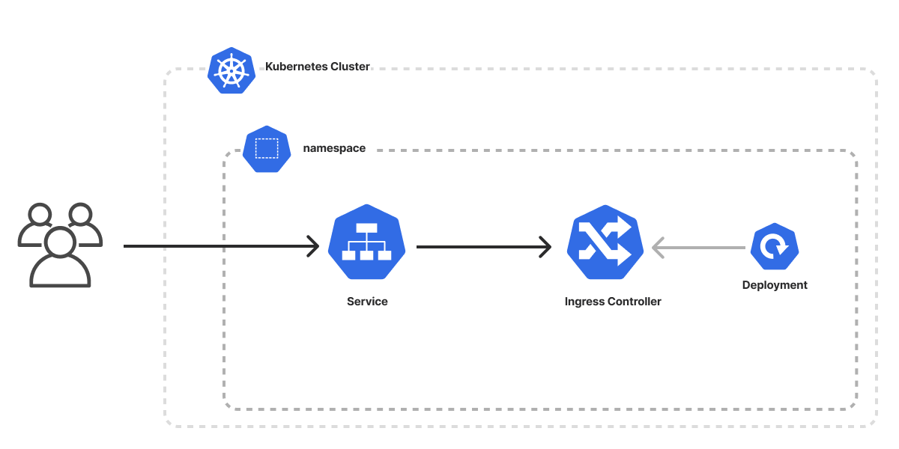

The Helm Chart template creates an infrastructure as code project in your favorite language that deploys a Helm chart to an existing cluster using Pulumi. It uses Pulumi's [Native Kubernetes Provider](/registry/packages/kubernetes) to create a new namespace in an existing Kubernetes cluster and a new [Helm chart](/registry/packages/kubernetes/api-docs/helm/v3) that deploys an application (in this case, the Nginx ingress controller). The template generates a complete infrastructure as code program, including sample application code, to give you a working project out of the box that you can customize easily and extend to suit your needs.



## Using this template

To use this template to deploy a Helm chart to a Kubernetes cluster, make sure you've already provisioned a [Kubernetes cluster](/templates/kubernetes), [installed Pulumi](/docs/install/) and [`kubectl`](https://kubernetes.io/docs/tasks/tools/install-kubectl/), and [configured your kubeconfig file](/registry/packages/kubernetes/installation-configuration#setup). Then create a new [project](/docs/concepts/projects/) using the template in your language of choice:



Follow the prompts to complete the new-project wizard. When it's done, you'll have a complete Pulumi project that's ready to deploy and configured with the most common settings. Feel free to inspect the code in  for a closer look.

## Deploying the project

The template requires no additional configuration. By default, it will install an Nginx ingress controller with Helm. Once the new project is created, you can deploy it immediately with [`pulumi up`](/docs/cli/commands/pulumi_up):

```bash
$ pulumi up
```

When the deployment completes, Pulumi exports the following [stack output](/docs/concepts/stack#outputs) values:

name
: The name of your new Helm chart deployment.

Output values like these are useful in many ways, most commonly as inputs for other stacks or related cloud resources.

## Customizing the project

Projects created with the Helm Chart template expose the following [configuration](/docs/concepts/config) settings:

k8sNamespace
: The name of the namespace to be created in your existing cluster. Defaults to `nginx-ingress`.

All of these settings are optional and may be adjusted either by editing the stack configuration file directly (by default, `Pulumi.dev.yaml`) or by changing their values with [`pulumi config set`](/docs/cli/commands/pulumi_config_set) as shown below.

```bash
$ pulumi config set someProp ../some/value
$ pulumi up
```

You can customize the Helm chart by passing values to it in your Pulumi code. An example of passing a few values to the Helm chart is already included in the template for easy reference.

## Tidying up

You can cleanly destroy the stack and all of its infrastructure with [`pulumi destroy`](/docs/cli/commands/pulumi_destroy):

```bash
$ pulumi destroy
```

## Learn more

Congratulations! You're now well on your way to managing a production-grade Kubernetes application with Pulumi --- and there's lots more you can do from here:

* Discover more architecture templates in [Templates &rarr;](/templates)
* Dive into the Kubernetes package by exploring the [API docs in the Registry &rarr;](/registry/packages/kubernetes)
* Expand your understanding of how Pulumi works in [Learn Pulumi &rarr;](/learn)
* Read up on the latest new features [in the Pulumi Blog &rarr;](/blog/tag/kubernetes)
