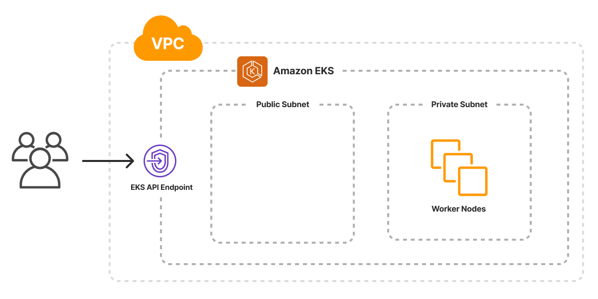

The Kubernetes Cluster template creates an infrastructure as code project in your favorite language and deploys a managed Kubernetes cluster to AWS. The architecture includes a VPC with public and private subnets and deploys an [Amazon EKS cluster]() that provides a managed Kubernetes control plane. Kubernetes worker nodes are deployed on private subnets for improved security. Load balancers created by workloads deployed on the EKS cluster will be automatically created in the public subnets. The template generates a complete infrastructure as code program to give you a working project out of the box that you can customize easily and extend to suit your needs.



## Using this template

To use this template to deploy your own managed Kubernetes cluster, make sure you've [installed Pulumi]() and [configured your AWS credentials](), then create a new [project]() using the template in your language of choice:



Follow the prompts to complete the new-project wizard. When it's done, you'll have a complete Pulumi project that's ready to deploy and configured with the most common settings. Feel free to inspect the code in  for a closer look.

## Deploying the project

The template requires no additional configuration. Once the new project is created, you can deploy it immediately with [`pulumi up`]():

```bash
$ pulumi up
```

When the deployment completes, Pulumi exports the following [stack output]() values:

kubeconfig
: The cluster's kubeconfig file which you can use with `kubectl` to access and communicate with your clusters.

vpcId
: The ID for the VPC that your cluster is running in.

Output values like these are useful in many ways, most commonly as inputs for other stacks or related cloud resources.
<!-- The computed `someOutput`, for example, can be used from the command line to open the newly deployed website in your favorite web browser:

```bash
$ open $(pulumi stack output cdnURL)
``` -->

## Customizing the project

Projects created with the Kubernetes template expose the following [configuration]() settings:

minClusterSize
: The minimum number of nodes allowed in your cluster. Defaults to `3`.

maxClusterSize
: The maximum number of nodes allowed in your cluster. Defaults to `6`.

desiredClusterSize
: The desired number of nodes in your cluster. Defaults to `3`.

eksNodeInstanceType
: The EC2 instance type used to run your nodes. Defaults to `t2.medium`.

vpcNetworkCidr
: The IPv4 address for your VPC in a CIDR block. Defaults to `10.0.0.0/16`.

All of these settings are optional and may be adjusted either by editing the stack configuration file directly (by default, `Pulumi.dev.yaml`).
or by changing their values with [`pulumi config set`]().

## Tidying up

You can cleanly destroy the stack and all of its infrastructure with [`pulumi destroy`]():

```bash
$ pulumi destroy
```

## Learn more

Congratulations! You're now well on your way to managing a production-grade Kubernetes cluster on AWS with Pulumi infrastructure as code --- and there's lots more you can do from here:

* Discover more architecture templates in [Templates &rarr;]()
* Dive into the API docs to explore the [Amazon EKS package]() or [AWSx (Crosswalk) package]()
* Expand your understanding of how Pulumi works in [Learn Pulumi &rarr;]()
* Read up on the latest new features [in the Pulumi Blog &rarr;](/blog/tag/kubernetes)
