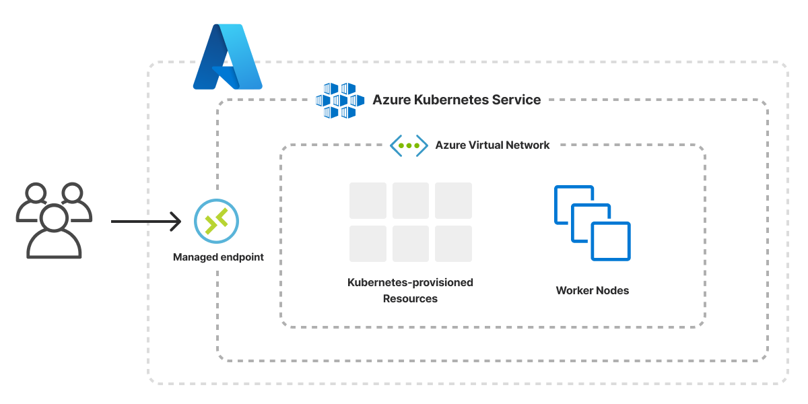

The Kubernetes Cluster template creates an infrastructure as code project in your favorite language and deploys a managed Kubernetes cluster to Azure with Pulumi. The architecture includes an [Azure Virtual Network]() with three subnets (for future scalability) and deploys an [Azure Kubernetes Service (AKS) cluster]() that provides a managed Kubernetes control plane. Kubernetes worker nodes are deployed with private IP addresses for improved security and across multiple availability zones for improved resilience. The template gives you a working project out of the box that you can customize easily and extend to suit your needs.



## Using this template

To use this template to deploy your own Kubernetes cluster, make sure you've [installed Pulumi]() and [configured your Azure credentials](), then create a new [project]() using the template in your language of choice:



Follow the prompts to complete the new-project wizard. When it's done, you'll have a complete Pulumi project that's ready to deploy and configured with the most common settings. Feel free to inspect the code in  for a closer look.

## Deploying the project

You must supply two values in order to deploy the cluster. You can input the values through the new-project wizard. No additional configuration is required. The required values are below:

mgmtGroupId
: The object ID of your existing Azure AD group which will serve as cluster administrator.

sshPubKey
: Contents of your public key which will be used for SSH access to the cluster nodes you will deploy.

Once the new project is created, you can deploy it immediately with [`pulumi up`]():

```bash
$ pulumi up
```

When the deployment completes, Pulumi exports the following [stack output]() values:

rgname
: The name of the Azure Resource Group containing the Kubernetes cluster resources.

vnetName
: The name of the Azure Virtual Network used for worker nodes, apps, and workloads.

clusterName
: The name of the AKS cluster.

kubeconfig
: The cluster's kubeconfig file which you can use with `kubectl` to access and communicate with your clusters.

Output values like these are useful in many ways, most commonly as inputs for other stacks or related cloud resources.

## Customizing the project

Projects created with the Kubernetes Cluster template expose the following [configuration]() settings:

numWorkerNodes
: The number of nodes in your cluster. Defaults to `3`.

kubernetesVersion
: The version of Kubernetes used in your AKS cluster. Defaults to `1.24.3`.

prefixForDns
: The unique DNS prefix for your AKS cluster. Defaults to `pulumi`.

nodeVmSize
: The VM instance type used to run your nodes. Defaults to `Standard_DS2_v2`.

All of these settings are optional and may be adjusted either by editing the stack configuration file directly (by default, `Pulumi.dev.yaml`) or by changing their values with [`pulumi config set`]() as shown below:

```bash
$ pulumi config set someProp ../some/value
$ pulumi up
```

## Tidying up

You can cleanly destroy the stack and all of its infrastructure with [`pulumi destroy`]():

```bash
$ pulumi destroy
```

## Learn more

Congratulations! You're now well on your way to managing a production-grade Kubernetes cluster on Azure with Pulumi --- and there's lots more you can do from here:

* Discover more architecture templates in [Templates &rarr;]()
* Dive into the API docs to explore the [Azure Native package &rarr;]()
* Expand your understanding of how Pulumi works in [Learn Pulumi &rarr;]()
* Read up on the latest new features [in the Pulumi Blog &rarr;](/blog/tag/kubernetes)
