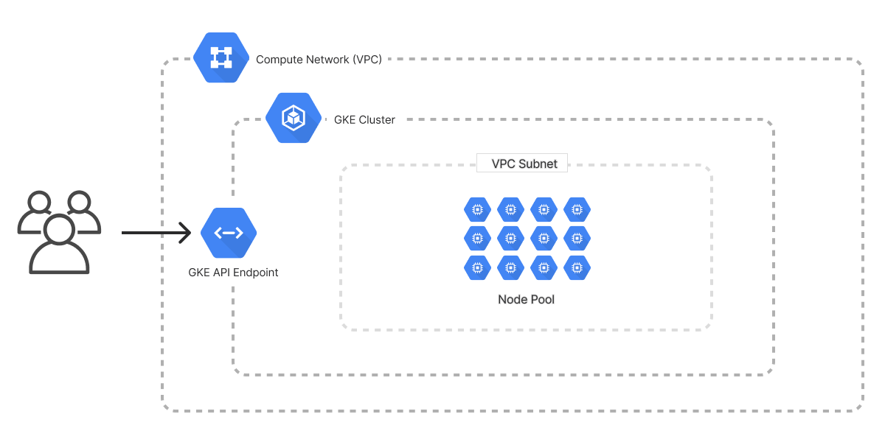

The Kubernetes Cluster template creates an infrastructure as code project in your favorite language and deploys a managed Kubernetes cluster to Google Cloud with Pulumi. The architecture includes a [VPC network](/registry/packages/gcp/api-docs/compute/network) with a [subnet](/registry/packages/gcp/api-docs/compute/subnetwork) and deploys a [Google Kubernetes Engine (GKE) cluster](/registry/packages/gcp/api-docs/container/cluster) that provides a managed Kubernetes control plane and a [nodepool](/registry/packages/gcp/api-docs/container/nodepool) for the cluster. Kubernetes worker nodes are deployed with private IP addresses for improved security. The template gives you a working project out of the box that you can customize easily and extend to suit your needs.



## Using this template

To use this template to deploy your own Kubernetes cluster, make sure you've [installed Pulumi](/docs/install/) and [configured your Google Cloud credentials](/registry/packages/gcp/installation-configuration#credentials), then create a new [project](/docs/concepts/projects/) using the template in your language of choice:



Follow the prompts to complete the new-project wizard. When it's done, you'll have a complete Pulumi project that's ready to deploy and configured with the most common settings. Feel free to inspect the code in  for a closer look.

## Deploying the project

You must supply an existing project ID to deploy the cluster. You can input the project ID through the new-project wizard. No additional configuration is required.

Once the new project is created, you can deploy it immediately with [`pulumi up`](/docs/cli/commands/pulumi_up):

```bash
$ pulumi up
```

When the deployment completes, Pulumi exports the following [stack output](/docs/concepts/stack#outputs) values:

networkName
: The name of the virtual network containing the Kubernetes cluster resources.

networkId
: The unique ID of the virtual network containing the Kubernetes cluster resources.

clusterName
: The name of the GKE cluster.

clusterId
: The unique ID of the GKE cluster

kubeconfig
: The cluster's kubeconfig file which you can use with `kubectl` to access and communicate with your clusters.

Output values like these are useful in many ways, most commonly as inputs for other stacks or related cloud resources.

## Customizing the project

Projects created with the Kubernetes Cluster template expose the following [configuration](/docs/concepts/config) settings:

gcp:project
: The Google Cloud project ID to deploy into.

gcp:region
: The Google Cloud region to deploy into. Defaults to `us-central1`.

nodesPerZone
: The desired number of nodes per zone in the nodepool. Defaults to `1`.

All of these settings are optional and may be adjusted either by editing the stack configuration file directly (by default, `Pulumi.dev.yaml`) or by changing their values with [`pulumi config set`](/docs/cli/commands/pulumi_config_set) as shown below:

```bash
$ pulumi config set someProp ../some/value
$ pulumi up
```

## Tidying up

You can cleanly destroy the stack and all of its infrastructure with [`pulumi destroy`](/docs/cli/commands/pulumi_destroy):

```bash
$ pulumi destroy
```

## Learn more

Congratulations! You're now well on your way to managing a production-grade Kubernetes cluster on Google Cloud with Pulumi --- and there's lots more you can do from here:

* Discover more architecture templates in [Templates &rarr;](/templates)
* Dive into the Google Cloud Classic package by exploring the [API docs in the Registry &rarr;](/registry/packages/gcp)
* Expand your understanding of how Pulumi works in [Learn Pulumi &rarr;](/learn)
* Read up on the latest new features [in the Pulumi Blog &rarr;](/blog/tag/google-cloud)
