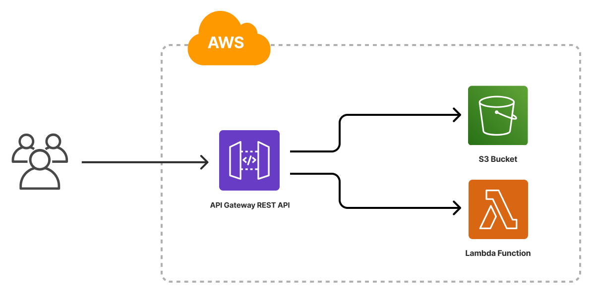

The AWS Serverless Application template creates an infrastructure as code project in your favorite language that deploys a serverless application to AWS with Pulumi. It deploys an [Amazon S3 bucket](/registry/packages/aws/api-docs/s3/bucket/) for hosting a static website, deploys an [AWS Lambda function](/registry/packages/aws/api-docs/lambda/function/) that runs the business logic, and an [Amazon API Gateway REST API](/registry/packages/aws/api-docs/apigateway/restapi/) that routes requests to HTML content and the Lambda function. The template ships with a placeholder website that displays the current time to give you a working Pulumi project out of the box that you can customize easily and extend to suit your needs.



## Creating a new AWS serverless application project

To use this template to deploy your own AWS serverless application, make sure you've [installed Pulumi](/docs/install/} and [configured your AWS credentials](/registry/packages/aws/installation-configuration/), then create a new [project](/docs/concepts/projects/) using the template in your language of choice.



Follow the prompts to complete the new-project wizard. When it’s done, you’ll have a complete Pulumi project that’s ready to deploy and configured with the most common settings. Feel free to inspect the code in  for a closer look.

## Deploying the project

The template requires no additional configuration. Once the new project is created, you can deploy it immediately with [`pulumi up`](/docs/cli/commands/pulumi_up):

```bash
$ pulumi up
```

When the deployment completes, Pulumi exports the following [stack output](/docs/concepts/stack#outputs) values:

url
: The HTTP URL for the application.

Stack outputs are useful in a number of ways, most commonly as inputs to other stacks or cloud resources.

## Customizing the project

Projects created with the AWS Serverless template expose the following [configuration](/docs/concepts/config/) settings:

path
: The path to the folder containing the files of the website. Defaults to `www`, which is the name (and relative path) of the folder included with the template. The /date path is a GET method that retrieves the current time from the Lambda function.

code
: References the folder containing the Lambda function code, which is in a file called `handler`

None of these settings is required; by default, the AWS Serverless template is set up to deploy the website using the files contained in the `www` and `function` folders that are bundled with the template.

### Using your own web content

If you already have a website you'd like to deploy, you can do so by replacing contents of the `www` folder and redeploying with `pulumi up`.

Alternatively, you can configure the stack to deploy from another folder on your machine by using [`pulumi config set`](/docs/cli/commands/pulumi_config_set) to change the value of the `path` setting:

```bash
$ pulumi config set path ../my-website/dist
$ pulumi up
```

### Customizing the application's functionality

You can customize the placeholder website's functionality by editing the Lambda function to perform another action, such as displaying a countdown until a specific time in the future. You could also add new functionality by creating a new Lambda function, adding a new path to the REST API, and updating the HTML script to call the new path.

## Tidying up

You can cleanly destroy the stack and all of its infrastructure with [`pulumi destroy`](/docs/cli/commands/pulumi_destroy):

```bash
$ pulumi destroy
```

## Learn more

Congratulations! You're now well on your way to managing  production-grade AWS serverless infrastructure with Pulumi --- and there's lots more you can do from here:

* Discover more architecture templates in [Templates &rarr;](/templates)
* Dive into the AWS package by exploring the [API docs in the Registry &rarr;](/registry/packages/aws)
* Expand your understanding of how Pulumi works in [Learn Pulumi](/learn/)
* Read up on the latest new features [in the Pulumi Blog &rarr;](/blog/tag/serverless)
