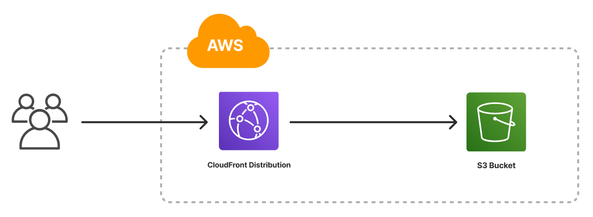

The Static Website template creates an infrastructure as code project in your favorite language that deploys an HTML website to AWS with Pulumi. It uses an [Amazon S3 bucket]() for file storage, configures the bucket to host a website, and deploys an [Amazon CloudFront Distribution]() to serve the website with low latency, caching, and HTTPS. The template generates a complete Pulumi program, including placeholder web content, to give you a working project out of the box that you can customize easily and extend to suit your needs.



## Using this template

To use this template to deploy a website of your own, make sure you've [installed Pulumi]() and [configured your AWS credentials](), then create a new [project]() using the template in your language of choice:



Follow the prompts to complete the new-project wizard. When it's done, you'll have a finished project that's ready to deploy and configured with the most common settings. Feel free to inspect the code in  for a closer look.

## Deploying the project

The template requires no additional configuration. Once the new project is created, you can deploy it immediately with [`pulumi up`]():

```bash
$ pulumi up
```

When the deployment completes, Pulumi exports the following [stack output]() values:

originHostname
: The provider-assigned hostname of the S3 bucket.

originURL
: The fully-qualified HTTP URL of the S3 bucket endpoint.

cdnHostname
: The provider-assigned hostname of the CloudFront CDN. Useful for creating `CNAME` records to associate custom domains.

cdnURL
: The fully-qualified HTTPS URL of the CloudFront CDN.

Output values like these are useful in many ways, most commonly as inputs for other stacks or related cloud resources. The computed `cdnURL`, for example, can be used from the command line to open the newly deployed website in your favorite web browser:

```bash
$ open $(pulumi stack output cdnURL)
```

## Customizing the project

Projects created with the Static Website template expose the following [configuration]() settings:

path
: The path to the folder containing the files of the website. Defaults to `www`, which is the name (and relative path) of the folder included with the template.

indexDocument
: The file to use for top-level pages. Defaults to `index.html`.

errorDocument
: The file to use for error pages. Defaults to `error.html`.

All of these settings are optional and may be adjusted either by editing the stack configuration file directly (by default, `Pulumi.dev.yaml`) or by changing their values with [`pulumi config set`]() as shown below.

### Using your own web content

If you already have a static website you'd like to deploy on AWS with Pulumi, you can do so either by replacing placeholder content in the `www` folder or by configuring the stack to point to another folder on your computer with the `path` setting:

```bash
$ pulumi config set path ../my-existing-website/build
$ pulumi up
```

### Adjusting your cache settings

By default, the generated program configures the CloudFront CDN to cache files for 600 seconds (10 minutes), which may or may not be the best fit for your project or stack. You can adjust these settings by changing the code in :

{}

{}

```diff
const cdn = new aws.cloudfront.Distribution("cdn", {
    defaultCacheBehavior: {
-       defaultTtl: 600,
-       maxTtl: 600,
-       minTtl: 600,
+       defaultTtl: 3600,
+       maxTtl: 3600,
+       minTtl: 3600,
```

{}

{}

```diff
cdn = aws.cloudfront.Distribution(
    default_cache_behavior=aws.cloudfront.DistributionDefaultCacheBehaviorArgs(
-       default_ttl=600,
-       max_ttl=600,
-       min_ttl=600,
+       default_ttl=3600,
+       max_ttl=3600,
+       min_ttl=3600,
```

{}

{}

```diff
cdn, err := cloudfront.NewDistribution(ctx, "cdn", &cloudfront.DistributionArgs{
    DefaultCacheBehavior: &cloudfront.DistributionDefaultCacheBehaviorArgs{
-       DefaultTtl: pulumi.Int(600),
-       MaxTtl:     pulumi.Int(600),
-       MinTtl:     pulumi.Int(600),
+       DefaultTtl: pulumi.Int(3600),
+       MaxTtl:     pulumi.Int(3600),
+       MinTtl:     pulumi.Int(3600),
```

{}

{}

```diff
var cdn = new Aws.CloudFront.Distribution("cdn", new()
{
    DefaultCacheBehavior = new Aws.CloudFront.Inputs.DistributionDefaultCacheBehaviorArgs
    {
-       DefaultTtl = 600,
-       MaxTtl = 600,
-       MinTtl = 600,
+       DefaultTtl = 3600,
+       MaxTtl = 3600,
+       MinTtl = 3600,
```

{}

{}

```diff
cdn:
  type: aws:cloudfront:Distribution
  properties:
    defaultCacheBehavior:
-     defaultTtl: 600
-     maxTtl: 600
-     minTtl: 600
+     defaultTtl: 600
+     maxTtl: 600
+     minTtl: 600
```

{}

Alternatively, and perhaps better, you could make these settings configurable as well, which would allow them to vary between other stacks in your project.

## Next steps

Templated projects are meant to be customized, and every web project comes with its own unique set of needs. This section includes a few examples aimed at helping you to adapt your new project to address some of the more common ones.

### Adding a custom domain

Once your website is deployed on AWS, you may want to give it a domain of its own. For this, you have many options, and they generally fall into one of two categories: using [Amazon Route 53](https://aws.amazon.com/route53/), which is a good choice if your domain is already being managed on AWS, or using a third-party service like [DNSimple](https://dnsimple.com) or [Google Cloud DNS](https://cloud.google.com/dns/). Both options are easily managed with Pulumi.

#### Using a Route 53 managed domain

If the domain you'd like to use is already configured as a Route 53 [hosted zone](https://docs.aws.amazon.com/Route53/latest/DeveloperGuide/hosted-zones-working-with.html), you can easily add a subdomain for your website by making a few small changes to your program.

To do so, start by adding two new configuration settings --- one for the domain, another for subdomain to use for the website:

```bash
$ pulumi config set domain example.com
$ pulumi config set subdomain www
```

Then, in your editor of choice, open  and add the following lines to the configuration section at the top of the program to import the new settings and capture the domain as a reusable value:



{}

```typescript
const domain = config.require("domain");
const subdomain = config.require("subdomain");
const domainName = `${subdomain}.${domain}`;
```

{}

{}

```python
domain = config.require("domain");
subdomain = config.require("subdomain");
domain_name = f"{subdomain}.{domain}";
```

{}

{}

```go
domain := cfg.Require("domain")
subdomain := cfg.Require("subdomain")
domainName := fmt.Sprintf("%s.%s", subdomain, domain)
```

{}

{}

```csharp
var domain = config.Require("domain");
var subdomain = config.Require("subdomain");
var domainName = $"{subdomain}.{domain}";
```

{}

{}

```yaml
configuration:
  # ...
  domain:
    type: String
  subdomain:
    type: String

variables:
  domainName: ${subdomain}.${domain}
```

{}

Next, just above the `aws.cloudfront.Distribution` declaration, add these lines to provision and validate a new SSL/TLS certificate with [AWS Certificate Manager](https://aws.amazon.com/certificate-manager/) (ACM):



{}

```typescript
// Look up your existing Route 53 hosted zone.
const zone = aws.route53.getZoneOutput({ name: domain });

// Provision a new ACM certificate.
const certificate = new aws.acm.Certificate("certificate",
    {
        domainName: domainName,
        validationMethod: "DNS",
    },
    {
        // ACM certificates must be created in the us-east-1 region.
        provider: new aws.Provider("us-east-provider", {
            region: "us-east-1",
        }),
    },
);

// Validate the ACM certificate with DNS.
const validationOption = certificate.domainValidationOptions[0];
const certificateValidation = new aws.route53.Record("certificate-validation", {
    name: validationOption.resourceRecordName,
    type: validationOption.resourceRecordType,
    records: [ validationOption.resourceRecordValue ],
    zoneId: zone.zoneId,
    ttl: 60,
});
```

{}

{}

```python
# Look up your existing Route 53 hosted zone.
zone = aws.route53.get_zone_output(name=domain)

# Provision a new ACM certificate.
certificate = aws.acm.Certificate(
    "certificate",
    domain_name=domain_name,
    validation_method="DNS",
    opts=pulumi.ResourceOptions(
        # ACM certificates must be created in the us-east-1 region.
        provider=aws.Provider("us-east-provider", region="us-east-1"),
    ),
);

# Validate the ACM certificate with DNS.
options = certificate.domain_validation_options.apply(lambda options: options[0])
certificate_validation = aws.route53.Record(
    "certificate-validation",
    name=options.resource_record_name,
    type=options.resource_record_type,
    records=[options.resource_record_value],
    zone_id=zone.zone_id,
    ttl=60,
);
```

{}

{}

```go
// Look up your existing Route 53 hosted zone.
zone, err := route53.LookupZone(ctx, &route53.LookupZoneArgs{
	Name: pulumi.StringRef(domain),
}, nil)
if err != nil {
	return err
}

// Provision a new ACM certificate in the us-east-1 region.
provider, _ := aws.NewProvider(ctx, "us-east-provider", &aws.ProviderArgs{
	Region: pulumi.StringPtr("us-east-1"),
})
certificate, err := acm.NewCertificate(ctx, "certificate", &acm.CertificateArgs{
	DomainName:       pulumi.String(domainName),
	ValidationMethod: pulumi.String("DNS"),
}, pulumi.Provider(provider))
if err != nil {
	return err
}

validationOption := certificate.DomainValidationOptions.Index(pulumi.Int(0))
_, err = route53.NewRecord(ctx, "certificate-validation", &route53.RecordArgs{
	Name: validationOption.ResourceRecordName().Elem(),
	Type: validationOption.ResourceRecordType().Elem(),
	Records: pulumi.StringArray{
		validationOption.ResourceRecordValue().Elem(),
	},
	ZoneId: pulumi.String(zone.ZoneId),
	Ttl:    pulumi.Int(60),
})
if err != nil {
	return err
}
```

You'll need these imports as well, for ACM and Route 53 support:

```go
import (
	// ...
	"github.com/pulumi/pulumi-aws/sdk/v5/go/aws/acm"
	"github.com/pulumi/pulumi-aws/sdk/v5/go/aws/route53"
)
```

{}

{}

```csharp
// Look up your existing Route 53-managed zone.
var zone = Aws.Route53.GetZone.Invoke(new()
{
	Name = domain,
});

// Provision a new ACM certificate.
var certificate = new Aws.Acm.Certificate("certificate", new()
{
	DomainName = domainName,
	ValidationMethod = "DNS",
},
// ACM certificates must be created in the us-east-1 region.
new CustomResourceOptions {
	Provider = new Aws.Provider("us-east-provider", new() {
		Region = "us-east-1",
	})
});

// Validate the ACM certificate with DNS.
var validationOption = certificate.DomainValidationOptions.GetAt(0);
var certificateValidation = new Aws.Route53.Record("certificate-validation", new()
{
	Name = validationOption.Apply(option => option.ResourceRecordName!),
	Type = validationOption.Apply(option => option.ResourceRecordType!),
	Records = new[]
	{
		validationOption.Apply(option => option.ResourceRecordValue!),
	},
	ZoneId = zone.Apply(zone => zone.ZoneId),
	Ttl = 60,
});
```

{}

{}

```yaml
variables:
  # ...

  # Add this block to the variables section to look up your existing
  # Route 53 hosted zone.
  zone:
    Fn::Invoke:
      Function: aws:route53:getZone
      Arguments:
        name: ${domain}

resources:
  # ...

  # ACM certificates must be provisioned in the us-east-1 region, so
  # we configure an explicit provider for this resource.
  us-east-provider:
    type: pulumi:providers:aws
    properties:
      region: us-east-1

  # Provision a new ACM certificate.
  certificate:
    type: aws:acm:Certificate
    properties:
      domainName: ${domainName}
      validationMethod: DNS
    options:
      # ACM certificates must be created in the us-east-1 region.
      provider: ${us-east-provider}

  # Validate the ACM certificate with DNS.
  certificateValidation:
    type: aws:route53:Record
    properties:
      name: ${certificate.domainValidationOptions[0].resourceRecordName}
      type: ${certificate.domainValidationOptions[0].resourceRecordType}
      zoneId: ${zone.zoneId}
      ttl: 60
      records:
        - ${certificate.domainValidationOptions[0].resourceRecordValue}
```

{}

Extend the CloudFront configuration to handle requests for the new domain by adding an `aliases` argument to the CDN configuration and adjusting  `viewerCertificate` to use the newly provisioned ACM certificate:



{}

```typescript
const cdn = new aws.cloudfront.Distribution("cdn", {
    // ...
    aliases: [
        domainName,
    ],
    viewerCertificate: {
        cloudfrontDefaultCertificate: false,
        acmCertificateArn: certificate.arn,
        sslSupportMethod: "sni-only",
    },
});
```

{}

{}

```python
cdn = aws.cloudfront.Distribution(
    # ...
    aliases=[
        domain_name,
    ],
    viewer_certificate=aws.cloudfront.DistributionViewerCertificateArgs(
        cloudfront_default_certificate=False,
        acm_certificate_arn=certificate.arn,
        ssl_support_method="sni-only",
    ),
)
```

{}

{}

```go
cdn, err := cloudfront.NewDistribution(ctx, "cdn", &cloudfront.DistributionArgs{

    // ...
	Aliases: &pulumi.StringArray{
		pulumi.String(domainName),
	},
	ViewerCertificate: &cloudfront.DistributionViewerCertificateArgs{
		CloudfrontDefaultCertificate: pulumi.Bool(false),
		AcmCertificateArn:            certificate.Arn,
		SslSupportMethod:             pulumi.String("sni-only"),
	},
})
```

{}

{}

```csharp
var cdn = new Aws.CloudFront.Distribution("cdn", new()
{
    // ...
    Aliases = new[]
    {
        domainName
    },
    ViewerCertificate = new Aws.CloudFront.Inputs.DistributionViewerCertificateArgs
    {
        CloudfrontDefaultCertificate = false,
        AcmCertificateArn = certificate.Arn,
        SslSupportMethod = "sni-only",
    },
});
```

{}

{}

```yaml
cdn:
  type: aws:cloudfront:Distribution
  properties:
    # ...
    aliases:
      - ${domainName}
    viewerCertificate:
      cloudfrontDefaultCertificate: false
      acmCertificateArn: ${certificate.arn}
      sslSupportMethod: sni-only
```

{}

Below that, add a Route 53 `A` record to create a DNS record pointing to the CloudFront CDN:



{}

```typescript
// Create a DNS A record to point to the CDN.
const record = new aws.route53.Record(domainName, {
    name: subdomain,
    zoneId: zone.zoneId,
    type: "A",
    aliases: [
        {
            name: cdn.domainName,
            zoneId: cdn.hostedZoneId,
            evaluateTargetHealth: true,
        }
    ],
}, { dependsOn: certificate });
```

{}

{}

```python
# Create a DNS A record to point to the CDN.
my_site = aws.route53.Record(domain_name,
    zone_id=zone.zone_id,
    name=subdomain,
    type="A",
    aliases=[
        aws.route53.RecordAliasArgs(
            name=cdn.domain_name,
            zone_id=cdn.hosted_zone_id,
            evaluate_target_health=True,
        )
    ],
    opts=pulumi.ResourceOptions(
        depends_on=certificate,
    ),
)
```

{}

{}

```go
// Create a DNS A record to point to the CDN.
_, err = route53.NewRecord(ctx, domainName, &route53.RecordArgs{
	Name:   pulumi.String(subdomain),
	ZoneId: pulumi.String(zone.ZoneId),
	Type:   pulumi.String("A"),
	Aliases: route53.RecordAliasArray{
		&route53.RecordAliasArgs{
			Name:                 cdn.DomainName,
			ZoneId:               cdn.HostedZoneId,
			EvaluateTargetHealth: pulumi.Bool(true),
		},
	},
}, pulumi.DependsOn([]pulumi.Resource{certificate}))
if err != nil {
	return err
}
```

{}

{}

```csharp
// Create a DNS A record to point to the CDN.
var record = new Aws.Route53.Record(domainName, new()
{
    Name = subdomain,
    ZoneId = zone.Apply(zone => zone.ZoneId),
    Type = "A",
    Aliases = new[]
    {
        new Aws.Route53.Inputs.RecordAliasArgs
        {
            Name = cdn.DomainName,
            ZoneId = cdn.HostedZoneId,
            EvaluateTargetHealth = true,
        }
    },
},
new CustomResourceOptions {
    DependsOn = certificate,
});
```

{}

{}

```yaml
resources:
  # ...

  # Create a DNS A record to point to the CDN.
  ${domainName}:
    type: aws:route53:Record
    properties:
      name: ${subdomain}
      zoneId: ${zone.zoneId}
      type: A
      aliases:
        - name: ${cdn.domainName}
          zoneId: ${cdn.hostedZoneId}
          evaluateTargetHealth: true
    options:
      dependsOn:
        - ${certificate}
```

{}

And finally, complete the program by exporting the new URL as a Pulumi stack output:



{}

```typescript
export const domainURL = `https://${domainName}`;
```

{}

{}

```python
pulumi.export("domainURL", f"https://{domain_name}")
```

{}

{}

```go
ctx.Export("domainURL", pulumi.Sprintf("https://%s", domainName))
```

{}

{}

```csharp
["domainURL"] = $"https://{subdomain}.{domain}",
```

{}

{}

```yaml
outputs:
  # ...
  domainURL: https://${domainName}
```

{}

Save your changes, then preview and deploy with another `pulumi up`:

```bash
$ pulumi up
```

In a few moments, you should be able to browse to your website using the custom domain:

```bash
$ open $(pulumi stack output domainURL)
```

#### Using a third-party DNS service

If the domain you'd like to use is being managed by a third-party DNS service, you can generally use the exported `cdnHostname` to create a `CNAME` record with your DNS provider. You can obtain this value with `pulumi stack output`:

```bash
$ pulumi stack output cdnHostname
```

Pulumi supports many third-party DNS providers, all of which are available in the [Pulumi Registry]() and accompanied by examples, including:

* [DNSimple]()
* [Cloudflare]()
* [Google Cloud DNS]()
* [Akamai]()
* [NS1]()

Integration details vary by provider, so we suggest exploring the Pulumi API documentation of your provider of choice to learn more. [See the Registry]() for a complete list supported providers.

## Tidying up

You can cleanly destroy the stack and all of its infrastructure with [`pulumi destroy`]():

```bash
$ pulumi destroy
```

## Learn more

Congratulations! You're now well on your way to managing a production-grade static website on AWS with Pulumi --- and there's lots more you can do from here:

* Discover more architecture templates in [Templates &rarr;]()
* Dive into the AWS package by exploring the [API docs in the Registry &rarr;]()
* Expand your understanding of how Pulumi works in [Learn Pulumi &rarr;]()
* Read up on the latest new features [in the Pulumi Blog &rarr;]()
