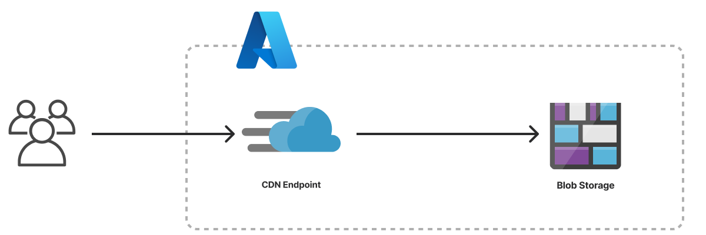

The Static Website template creates an infrastructure as code project in your favorite language that deploys an HTML website to Microsoft Azure with Pulumi. It uses an [Azure Blob Storage account]() for file storage, configures the storage account to host a website, and deploys an [Azure CDN Endpoint]() to serve the website with low latency, caching, and HTTPS. The template generates a complete Pulumi program, including placeholder web content, to give you a working project out of the box that you can customize easily and extend to suit your needs.



## Using this template

To use this template to deploy a website of your own, make sure you've [installed Pulumi]() and [configured your Azure credentials](), then create a new [project]() using the template in your language of choice:



Follow the prompts to complete the new-project wizard. When it's done, you'll have a finished that's ready to deploy and configured with the most common settings. Feel free to inspect the code in  for a closer look.

## Deploying the project

The template requires no additional configuration. Once the new project is created, you can deploy it immediately with [`pulumi up`]():

```bash
$ pulumi up
```

When the deployment completes, Pulumi exports the following [stack output]() values:

originHostname
: The provider-assigned hostname of the Azure Blob Storage container.

originURL
: The fully-qualified HTTP URL of the storage container endpoint.

cdnHostname
: The provider-assigned hostname of the Azure CDN. Useful for creating `CNAME` records to associate custom domains.

cdnURL
: The fully-qualified HTTPS URL of the Azure CDN.

Output values like these are useful in many ways, most commonly as inputs for other stacks or related cloud resources. The computed `cdnURL`, for example, can be used from the command line to open the newly deployed website in your favorite web browser:

```bash
$ open $(pulumi stack output cdnURL)
```

## Customizing the project

Projects created with the Static Website template expose the following [configuration]() settings:

path
: The path to the folder containing the files of the website. Defaults to `www`, which is the name (and relative path) of the folder included with the template.

indexDocument
: The file to use for top-level pages. Defaults to `index.html`.

errorDocument
: The file to use for error pages. Defaults to `error.html`.

All of these settings are optional and may be adjusted either by editing the stack configuration file directly (by default, `Pulumi.dev.yaml`) or by changing their values with [`pulumi config set`]() as shown below.

### Using your own web content

If you already have a static website you'd like to deploy on Azure with Pulumi, you can do so either by replacing placeholder content in the `www` folder or by configuring the stack to point to another folder on your computer with the `path` setting:

```bash
$ pulumi config set path ../my-existing-website/build
$ pulumi up
```

## Tidying up

You can cleanly destroy the stack and all of its infrastructure with [`pulumi destroy`]():

```bash
$ pulumi destroy
```

## Learn more

Congratulations! You're now well on your way to managing a production-grade static website on Microsoft Azure with Pulumi --- and there's lots more you can do from here:

* Discover more architecture templates in [Templates &rarr;]()
* Dive into the Azure Native package by exploring the [API docs in the Registry &rarr;]()
* Expand your understanding of how Pulumi works in [Learn Pulumi &rarr;]()
* Read up on the latest new features [in the Pulumi Blog &rarr;]()
