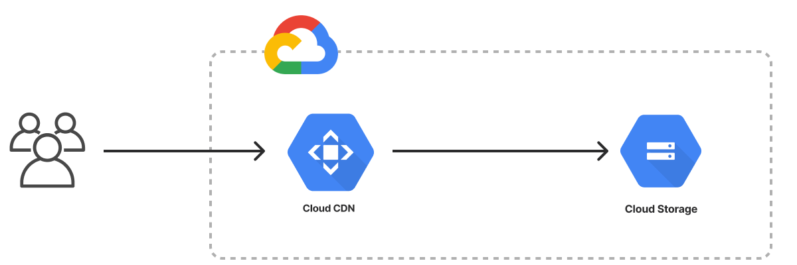

The Google Cloud Static Website template deploys an HTML website on Google Cloud Platform.



{}

{}

```bash
$ mkdir my-site && cd my-site
$ pulumi new static-website-gcp-typescript
```

{}

{}

```bash
$ mkdir my-site && cd my-site
$ pulumi new static-website-gcp-python
```

{}

{}

```bash
$ mkdir my-site && cd my-site
$ pulumi new static-website-gcp-go
```

{}

{}

```bash
$ mkdir my-site && cd my-site
$ pulumi new static-website-gcp-csharp
```

{}

{}

```bash
$ mkdir my-site && cd my-site
$ pulumi new static-website-gcp-yaml
```

{}
