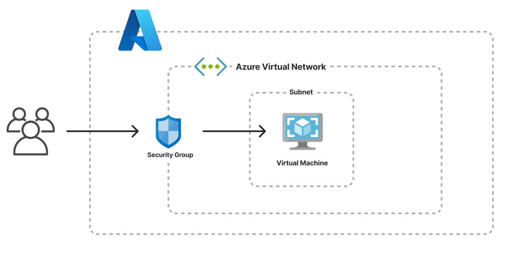

The Virtual Machine template creates an infrastructure as code project in your favorite language that deploys a virtual machine to Azure. You can then use the virtual machine to build your own web application, backend service, or database. The architecture includes Azure Virtual Machines for the virtual machine and Azure Virtual Network for the virtual network. The template generates a complete Pulumi program, including a simple HTTP server, to give you a working project out of the box that you can customize easily and extend to suit your needs.



## Using this template

To use this template to deploy a website of your own, make sure you've [installed Pulumi](/docs/install/) and [configured your Azure credentials](/registry/packages/azure-native/installation-configuration#credentials), then create a new [project](/docs/concepts/projects/) using the template in your language of choice:



Follow the prompts to complete the new-project wizard. When it's done, you'll have a complete Pulumi project that's ready to deploy and configured with the most common settings. Feel free to inspect the code in  for a closer look.

## Deploying the project

The template requires no additional configuration. Once the new project is created, you can deploy it immediately with [`pulumi up`](/docs/cli/commands/pulumi_up):

```bash
$ pulumi up
```

When the deployment completes, Pulumi exports the following [stack output](/docs/concepts/stack#outputs) values:

ip
: The IP address of the virtual machine.

hostname
: The provider-assigned hostname of the virtual machine.

url
: The fully-qualified HTTP URL of the HTTP server running on the virtual machine.

Output values like these are useful in many ways, most commonly as inputs for other stacks or related cloud resources. The computed `url`, for example, can be used from the command line to open the newly deployed website in your favorite web browser:

```bash
$ open $(pulumi stack output url)
```

## Customizing the project

Projects created with the Virtual Machine template expose the following [configuration](/docs/concepts/config) settings:

adminUsername
: The user account to create on the VM. Defaults to `pulumiuser`.

vmName
: The DNS hostname prefix to use for the VM. Defaults to `my-server`.

vmSize
: The machine size to use for the VM. Defaults to `Standard_A1_v2`.

osImage
: The Azure URN of the base image to use for the VM. Defaults to `Debian:debian-11:11:latest`.

servicePort
: The HTTP service port to expose on the VM. Defaults to `80`.

sshPublicKey
: The public key data to use for SSH authentication.

All of these settings are optional and may be adjusted either by editing the stack configuration file directly (by default, `Pulumi.dev.yaml`) or by changing their values with [`pulumi config set`](/docs/cli/commands/pulumi_config_set) as shown below.

## Cleaning up

You can cleanly destroy the stack and all of its infrastructure with [`pulumi destroy`](/docs/cli/commands/pulumi_destroy):

```bash
$ pulumi destroy
```

## Learn more

Congratulations! You're now well on your way to managing a production-grade virtual machine on Azure with Pulumi --- and there's lots more you can do from here:

* Discover more architecture templates as they're available in [Templates &rarr;](/templates)
* Dive into the Azure Native package by exploring the [API docs in the Registry &rarr;](/registry/packages/azure-native)
* Expand your understanding of how Pulumi works in [Learn Pulumi &rarr;](/learn)
* Read up on the latest new features [in the Pulumi Blog &rarr;](/blog/tag/azure)
