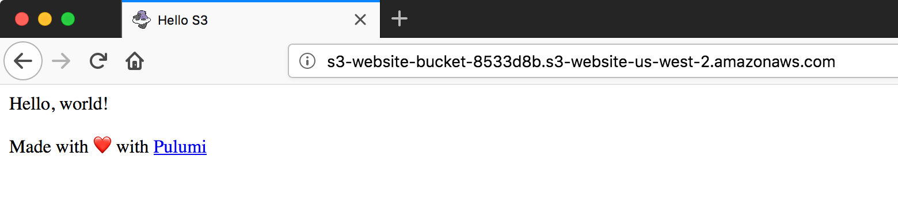

<!-- TODO: add link to reference doc for cloud-aws -->
There are two ways to host a static website on S3 using Pulumi: you can use raw AWS resources to create a bucket and bucket objects, or you can use the higher-level `@pulumi/cloud-aws` package. 




## Option 1: Use the Pulumi Cloud framework {#pulumi-cloud}

The [Pulumi Cloud] framework provides high-level components that encode common infrastructure and application patterns. Using the class [HttpEndpoint], you can create an AWS API Gateway resource that proxies requests to S3.

1.  In a new folder `cloud-static`, create an empty project with `pulumi new`:

    ```bash
    $ mkdir cloud-static; cd cloud-static
    $ pulumi new javascript
    ```

1.  Create some files in `www`:
    - Create a subfolder of `cloud-static` called `www`.
    - Download [favicon.png](/examples/favicon.png) and save it to `www`.
    - In `www`, save the following as `index.html`:

      ```html
      <html><head>
        <title>Hello S3</title><meta charset="UTF-8">
        <link rel="shortcut icon" href="favicon.png" type="image/png">
      </head>
      <body><p>Hello, world!</p><p>Made with ❤️ with <a href="https://pulumi.com">Pulumi</a></p>
      </body></html>
      ```

1.  Replace the contents of `index.js` with the following:

    ```javascript
    const cloud = require("@pulumi/cloud-aws");
    
    const endpoint = new cloud.HttpEndpoint("cloud-static");
    endpoint.static("/", "www"); // Serve static files from the `www` folder, using S3
    
    exports.url = endpoint.publish().url; // Export the public URL for the HTTP service
    ```

1.  Add and install the NPM dependencies:

    ```bash
    $ npm install --save @pulumi/cloud-aws
    ```

1.  Configure the AWS region to deploy to, such as `us-west-2`:

    ```bash
    $ pulumi config set aws:region us-west-2
    ```

1.  Run `pulumi update` to preview and deploy AWS resources. This creates a stack component, a Bucket, two S3 Objects (one for each file in the `www` folder), and several API Gateway resources.

    ```bash
    $ pulumi update
    Previewing update of stack 'cloud-static-dev'
    ...

    Do you want to perform this update? yes
    Updating stack 'cloud-static-dev'
    Performing changes:

        Type                                Name                              Status      Info
    +   pulumi:pulumi:Stack                 cloud-static-cloud-static-dev     created     
    +   └─ cloud:http:HttpEndpoint          cloud-static                      created     
    +      ├─ aws:s3:Bucket                 cloud-static                      created     
    +      ├─ aws:iam:Role                  cloud-static4c238266              created     
    +      ├─ aws:s3:BucketObject           cloud-static4c238266/favicon.png  created     
    +      ├─ aws:s3:BucketObject           cloud-static4c238266/index.html   created     
    +      ├─ aws:iam:RolePolicyAttachment  cloud-static4c238266              created     
    +      ├─ aws:apigateway:RestApi        cloud-static                      created     
    +      ├─ aws:apigateway:Deployment     cloud-static                      created     
    +      └─ aws:apigateway:Stage          cloud-static                      created     
    
    ---outputs:---
    url: "https://g8tc01nssk.execute-api.us-west-2.amazonaws.com/stage/"

    info: 10 changes performed:
        + 10 resources created
    Update duration: 13.403487743s

    Permalink: https://pulumi.com/lindydonna/cloud-static-dev/updates/1
    ```

1.  Open the url shown in the "outputs" section to view the page and the favicon.
  
1.  To display just the endpoint that was created, run `pulumi stack output`. 

    ```bash
    $ pulumi stack output
    Current stack outputs (1):
        OUTPUT               VALUE
        url                  https://simc3a8ieg.execute-api.us-west-1.amazonaws.com/stage/
    ```

### Clean up



## Option 2: Configure AWS resources directly {#pulumi-aws}

The Pulumi Cloud framework has been created as a higher-level abstraction over AWS resources. For full control over you resources, you can use [@pulumi/aws] directly.

First, we'll create a Pulumi program that uploads files from the `www` directory to S3. Then, we'll configure the bucket to serve a website.

### Create a bucket and upload files 

1.  In a new folder `s3website`, create an empty project with `pulumi new`:

    ```bash
    $ mkdir s3website; cd s3website
    $ pulumi new javascript
    ```

1.  Edit `index.js` and replace with the following. The code creates a new S3 bucket, then iterates over the files in the `www` folder to create an S3 Object for each file.

    ```javascript
    const aws = require("@pulumi/aws");
    const pulumi = require("@pulumi/pulumi");
    const mime = require("mime");

    // Create an S3 bucket
    let siteBucket = new aws.s3.Bucket("s3-website-bucket");

    let siteDir = "www"; // directory for content files

    // For each file in the directory, create an S3 object stored in `siteBucket`
    for (let item of require("fs").readdirSync(siteDir)) {
      let filePath = require("path").join(siteDir, item);
      let object = new aws.s3.BucketObject(item, { 
        bucket: siteBucket,
        source: new pulumi.asset.FileAsset(filePath),     // use FileAsset to point to a file
        contentType: mime.getType(filePath) || undefined, // set the MIME type of the file
      });
    }

    exports.bucketName = siteBucket.bucket; // create a stack export for bucket name
    ```

    Here, we're again using the [@pulumi/aws] package to create an [aws.s3.Bucket]. For each file in `www`, we create an [aws.s3.BucketObject], using the helper [pulumi.asset.FileAsset] to reference a local file.

    In order to serve the files to a browser, the content type for each S3 Object must be set. For this, we use the [NPM `mime` package](https://www.npmjs.com/package/mime). Just like a regular Node program, Pulumi programs can use any Node.js package.

1.  Create some files in `www`:
    - Create a subfolder of `s3website` called `www`.
    - Download [favicon.png](/examples/favicon.png) and save it to `www`.
    - In `www`, save the following as `index.html`:

      ```html
      <html><head>
        <title>Hello S3</title><meta charset="UTF-8">
        <link rel="shortcut icon" href="/favicon.png" type="image/png">
      </head>
      <body><p>Hello, world!</p><p>Made with ❤️ with <a href="https://pulumi.com">Pulumi</a></p>
      </body></html>
      ```

1.  Add and install the NPM dependencies:

    ```bash
    $ npm install --save @pulumi/aws mime
    ```

1.  Create a new [stack](../reference/stack.html) via `pulumi stack init website-testing`.

1.  Configure the AWS region to deploy to, such as `us-west-2`. After this step, a new file `Pulumi.website-testing.yaml` is created, next to your [Pulumi.yaml project file](../reference/project.html). See [Defining and setting stack settings](../reference/config.html#config-stack) for more information about this file.

    ```bash
    $ pulumi config set aws:region us-west-2
    ```

1.  Run `pulumi update` to preview and deploy AWS resources. This creates a stack component, a Bucket and two S3 Objects (one for each file in the `www` folder).

1.  To see the name of the bucket that was created, run `pulumi stack output`. Note that an extra 7-digit identifier is appended to the name. All Pulumi resources add this identifier automatically, so that you don't have to manually create unique names.

    ```bash
    $ pulumi stack output
    Current stack outputs (1):
        OUTPUT                                           VALUE
        bucketName                                       s3-website-bucket2-c198168
    ```

1.  To see that the S3 objects exist, you can either use the AWS Console or the AWS CLI:

    ```bash
    $ aws s3 ls $(pulumi stack output bucketName)
    2018-04-17 15:40:47      13731 favicon.png
    2018-04-17 15:40:48        249 index.html
    ```

### Add S3 website support

In this section, we configure the S3 bucket to serve the files to a browser. To do this, we use the [aws.s3.Bucket.websites] property and attach an [aws.s3.BucketPolicy] object. 

1.  Change the declaration of `siteBucket` to specify an `indexDocument`:

    ```javascript
    ...

    // REMOVE previous declaration and add this
    let siteBucket = new aws.s3.Bucket("s3-website-bucket", {
      website: {
        indexDocument: "index.html",
      },
    });
    ...
    ```

1.  Add the following code, which defines the S3 public read policy, applies it to the bucket, and defines a new stack output:

    ```javascript
    // Create an S3 Bucket Policy to allow public read of all objects in bucket
    // This reusable function can be pulled out into its own module
    function publicReadPolicyForBucket(bucketName) {   
      return JSON.stringify({
        Version: "2012-10-17",
        Statement: [{
          Effect: "Allow",
          Principal: "*",
          Action: [
              "s3:GetObject"
          ],
          Resource: [
              `arn:aws:s3:::${bucketName}/*` // policy refers to bucket name explicitly
          ]
        }]
      })
    }

    // Set the access policy for the bucket so all objects are readable
    let bucketPolicy = new aws.s3.BucketPolicy("bucketPolicy", {   
      bucket: siteBucket.bucket, // depends on siteBucket -- see explanation below
      policy: siteBucket.bucket.apply(publicReadPolicyForBucket) 
              // transform the siteBucket.bucket output property -- see explanation below
    });

    exports.websiteUrl = siteBucket.websiteEndpoint; // output the endpoint as a stack output
    ```

    To make [all objects in the bucket publicly readable](https://docs.aws.amazon.com/AmazonS3/latest/dev/WebsiteAccessPermissionsReqd.html), we create a [BucketPolicy][aws.s3.BucketPolicy] object. The definition of `bucketPolicy` illustrates how Pulumi tracks dependencies between resources. The property [aws.s3.Bucket.bucket] is an output property of type [pulumi.Output] --- a marker class that encodes the relationship between resources in a Pulumi program. An object of type `Output` can be passed directly to the inputs of a resource constructor, such as the `bucket` property. 
    
    For the `policy` property, the IAM policy must include the target bucket name. Since the value of output properties are not known until the underlying resource is created (such as the generated name for the S3 bucket), we use the `apply` method of [pulumi.Output] rather than directly calling `publicReadPolicyForBucket`. 

    Whenever you need to create a dependency between resources, simply use the output property of one resource as the input to another one. Pulumi uses this information to create physical resources in the correct order. 

1.  Run `pulumi update`, which shows the change to **update** the `Bucket` resource and **create** a new `BucketPolicy` resource:

    ```bash
    $ pulumi update
    ...

    #: Resource Type        Name                       Status     Extra Info
    1: pulumi:pulumi:Stack  s3website-website-testing  done
    2: aws:s3:Bucket        s3-website-bucket          ~ updated  changes: + websites
    3: aws:s3:BucketPolicy  bucketPolicy               + created

    ...
    ```

1.  Open the site URL in a browser to see both the rendered HTML and the favicon:

    ```bash
    $ pulumi stack output websiteUrl
    s3-website-bucket-8533d8b.s3-website-us-west-2.amazonaws.com
    ```

    {:width="700px"}

### Clean up



## Summary

In this part, we saw that you can use the `@pulumi/aws` package for fine-grain control over resources, or the higher-level `@pulumi/cloud-aws` package which provides a more streamlined default experience. The `@pulumi/cloud-aws` package is just a set of JavaScript classes that use `@pulumi/aws`, so you can create your version to suit your needs.

## Next steps

The full source of the example is available in the [Pulumi examples repo](https://github.com/pulumi/examples) on GitHub:
- [S3 website][s3-folder]
- [S3 website as component][s3-folder-component]

To learn how to convert the raw AWS option to a high-level component, see the [Pulumi Components](../reference/component-tutorial.html) tutorial.

<!-- Common links -->
[@pulumi/aws]: /packages/pulumi-aws/index.html
[aws.s3.Bucket]: /packages/pulumi-aws/classes/_s3_bucket_.bucket.html
[aws.s3.Bucket.bucket]: /packages/pulumi-aws/classes/_s3_bucket_.bucket.html#bucket
[aws.s3.BucketObject]: /packages/pulumi-aws/classes/_s3_bucketobject_.bucketobject.html
[pulumi.asset.FileAsset]: /packages/pulumi/classes/_asset_asset_.fileasset.html
[aws.s3.BucketPolicy]: /packages/pulumi-aws/classes/_s3_bucketpolicy_.bucketpolicy.html
[aws.s3.Bucket.websites]: /packages/pulumi-aws/classes/_s3_bucket_.bucket.html#websites
[pulumi.Output]: /packages/pulumi/classes/_resource_.output.html
[pulumi.Output.apply]: /packages/pulumi/classes/_resource_.output.html#apply
[pulumi.Input]: /packages/pulumi/modules/_resource_.html#input
[pulumi.ComponentResource]: /packages/pulumi/classes/_resource_.componentresource.html
[Component]: ../reference/programming-model.html#components
[s3-folder]: https://github.com/pulumi/examples/tree/master/aws-js-s3-folder
[s3-folder-component]: https://github.com/pulumi/examples/tree/master/aws-js-s3-folder-component
[Pulumi Cloud]: ../reference/cloud.html
[HttpEndpoint]: ../packages/pulumi-cloud/interfaces/_httpendpoint_.httpendpoint.html
<!-- End common links -->
