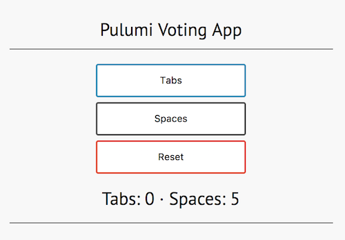

<p><a href="/quickstart">Quickstart</a> &gt; <b>Programming the Cloud</b></p>

# Programming the Cloud

The `@pulumi/cloud` package lets you program infrastructure and application logic, side by side in harmony, using
simple, high-level cloud building blocks.  This package has three key defining attributes:

* __Easy Cloud Development__: The `@pulumi/cloud` library makes it simple to build robust and scalable cloud
  applications with just a few lines of code.
* __Cloud Agnostic__: The `@pulumi/cloud` library doesn't tie you to using any one particular cloud (AWS, Azure,
  Google Cloud, Kubernetes, and various on-premises clouds).  Applications built using the high-level `@pulumi/cloud`
  components like [Service](/packages/pulumi-cloud/interfaces/_service_.service.html), [Table](/packages/pulumi-cloud/interfaces/_table_.table.html), [Topic](
  /packages/pulumi-cloud/interfaces/_topic_.topic.html) and [HttpEndpoint](
  /packages/pulumi-cloud/interfaces/_httpendpoint_.httpendpoint.html) can be deployed to a variety of cloud platforms. (Currently, only support for AWS is implemented, but we plan to support all major providers.)
* __Serverless__: The `@pulumi/cloud` makes it easy to build applications with minimal fixed infrastructure,
  event-driven application logic, and using resources that are charged only based on actual consumption.

## A voting app with two containers

In this example, we'll show how a Pulumi application is deployed to AWS managed services, the same services you would use if you had authored the application manually. Pulumi does not reinvent the infrastructure, but makes it dramatically easier to author and evolve your application.

To solve the never-ending debate of "tabs vs. spaces" once and for all, we'll create a voting app. The app has two containers: Redis for the data store, and a Python Flask app for the frontend. In future tutorials, we'll add a database hosted in a container, then show how easy it is to move to a managed database and cache service (such as AWS RDS and ElastiCache).

Even in this simple example, it would be tedious and error prone to define this infrastructure with CloudFormation and similar tools. In AWS terms, the application needs an ECS cluster, a load balancer, an AWS Container Registry (ECR) instance, IAM roles, and so forth. If we were to do this manually, we'd provision around 38 resources. Pulumi handles this automatically!

### Prerequisites

Since this example builds a custom container, you should first have [Docker](https://docs.docker.com/engine/installation/) installed. 

### Set up the project

1. Clone or download the `examples` repo at the [tutorial-initial branch](https://github.com/pulumi/examples/tree/tutorial-initial). This has the project setup and Flask app, but not the Pulumi program itself.

1. In the `voting-app` folder, add the following file as `index.ts`:

   ```typescript
   import * as cloud from "@pulumi/cloud";

   // To simplify this example, we have defined the password directly in code
   // In a real app, would add the secret via `pulumi config secret <key> <value>` and
   // access via pulumi.Config APIs
   let redisPassword = "SECRETPASSWORD"; 

   // The data layer for the application
   // Use the 'image' property to point to a pre-built Docker image.
   let redisCache = new cloud.Service("voting-app-cache", {
      containers: {
         redis: {
               image: "redis:alpine",
               memory: 128,
               ports: [{ port: 6379 }],
               command: ["redis-server", "--requirepass", redisPassword],
         },
      },
   });

   // A custom container for the frontend, which is a Python Flask app
   // Use the 'build' property to specify a folder that contains a Dockerfile.
   // Pulumi builds the container for you and pushes to an ECR registry
   let frontend = new cloud.Service("voting-app-frontend", {
      containers: {
         votingAppFrontend: {
               build: "./frontend",   // path to the folder containing the Dockerfile
               memory: 128,
               ports: [{ port: 80 }],            
               environment: { 
                  // pass the Redis container info in environment variables
                  // (the use of promises will be improved in the future)
                  "REDIS": redisCache.getEndpoint().then(e => e.hostname),
                  "REDIS_PORT": redisCache.getEndpoint().then(e => e.port.toString()),
                  "REDIS_PWD": redisPassword
               }
         },
      },
   });

   // Export a variable that will be displayed during 'pulumi update'
   export let frontendURL = frontend.getEndpoint().then(e => `http://${e.hostname}:${e.port}`);
   ```

#### Understanding the code

Even though this Pulumi program is just over 36 lines long, it does quite a bit:

- Creates a container `redisCache`. This is a Redis cache that just uses the `redis` image with tag `alpine` from Docker Hub. Since it's a built image, you just have to specify the port and startup command.
- Creates a custom container `frontend`:
  - Uses the `build` property to point to a folder with a Dockerfile. Pulumi automatically invokes `docker build` for you and pushes the container to ECR.
  - Exports the output `frontendURL`, via the line `export let frontEndUrl = ...`. This creates an output property that can be used by other parts of your program and is displayed during `pulumi update`.
  - Uses Pulumi APIs to statically lookup the server name and port for the container `redisCache` and set environment variables. This makes it easy to connect containers to each other. The Flask app uses these environment variables to connect to the Redis cache container. See these definitions in `frontend/app/main.py` in the `voting-app` folder:

    ```python
    redis_server =   os.environ['REDIS']
    redis_port =     os.environ['REDIS_PORT']
    redis_password = os.environ['REDIS_PWD']
    ```

### Build, preview, and update

Now, lets deploy this elegant program to AWS.

1. Run `yarn install` or `npm install` to install the dependencies to your `node_modules` directory.

1. Link with the Pulumi SDK packages so that your `require`s will find the right thing, using either `yarn` or `npm`:

   ```bash
   $ yarn link pulumi @pulumi/cloud
   ```

1. Compile the code via `yarn build`.

1. Create a new Pulumi repository and stack:

   ```bash
   $ pulumi init
   $ pulumi stack init votingapp-testing --local
   ```

1. Set your AWS region via `pulumi config set aws:config:region us-west-2` (or whichever region you prefer).

1. The `cloud.Service` component can either create a new ECS cluster or deploy into an existing one. Let's use the "autocluster" functionality:

   ```bash
   $ pulumi config set cloud-aws:config:ecsAutoCluster true
   ```

1. Ensure the Docker daemon is running on your machine, then preview changes via `pulumi preview`. This step will create the Docker container but will not provision resources.

   There are a number of resources that are automatically created for you, such as the ECS cluster, EFS instance, networking resources, log group, and so on. This is all implemented using the patterns specified in AWS reference architectures, freeing you to think in terms of high-level concepts.

   ```bash
   $ pulumi preview --summary
   Previewing changes:
   + pulumi:pulumi:Stack: (create)
      [urn=urn:pulumi:votingapp-testing::voting-app::pulumi:pulumi:Stack::voting-app-votingapp-testing]
      + aws:ec2/vpc:Vpc: (create)
         [urn=urn:pulumi:votingapp-testing::voting-app::aws:ec2/vpc:Vpc::pulumi-votingapp--global]
      + aws:ec2/internetGateway:InternetGateway: (create)
         [urn=urn:pulumi:votingapp-testing::voting-app::aws:ec2/internetGateway:InternetGateway::pulumi-votingapp--global]
      + aws:ec2/routeTable:RouteTable: (create)
         [urn=urn:pulumi:votingapp-testing::voting-app::aws:ec2/routeTable:RouteTable::pulumi-votingapp--global]
      + aws:ec2/subnet:Subnet: (create)
         [urn=urn:pulumi:votingapp-testing::voting-app::aws:ec2/subnet:Subnet::pulumi-votingapp--global-0]
      + aws:ec2/routeTableAssociation:RouteTableAssociation: (create)
         [urn=urn:pulumi:votingapp-testing::voting-app::aws:ec2/routeTableAssociation:RouteTableAssociation::pulumi-votingapp--global-0]
      + aws:ec2/subnet:Subnet: (create)
         [urn=urn:pulumi:votingapp-testing::voting-app::aws:ec2/subnet:Subnet::pulumi-votingapp--global-1]
      + aws:ec2/routeTableAssociation:RouteTableAssociation: (create)
         [urn=urn:pulumi:votingapp-testing::voting-app::aws:ec2/routeTableAssociation:RouteTableAssociation::pulumi-votingapp--global-1]
      + aws:ecs/cluster:Cluster: (create)
         [urn=urn:pulumi:votingapp-testing::voting-app::aws:ecs/cluster:Cluster::pulumi-votingapp--global]
      + aws:iam/role:Role: (create)
         [urn=urn:pulumi:votingapp-testing::voting-app::aws:iam/role:Role::pulumi-votingapp--global]
      + aws:iam/rolePolicyAttachment:RolePolicyAttachment: (create)
         [urn=urn:pulumi:votingapp-testing::voting-app::aws:iam/rolePolicyAttachment:RolePolicyAttachment::pulumi-votingapp--global-5e4162cd]
      + aws:iam/rolePolicyAttachment:RolePolicyAttachment: (create)
         [urn=urn:pulumi:votingapp-testing::voting-app::aws:iam/rolePolicyAttachment:RolePolicyAttachment::pulumi-votingapp--global-efc8f10d]
      + aws:iam/instanceProfile:InstanceProfile: (create)
         [urn=urn:pulumi:votingapp-testing::voting-app::aws:iam/instanceProfile:InstanceProfile::pulumi-votingapp--global]
      + aws:ec2/securityGroup:SecurityGroup: (create)
         [urn=urn:pulumi:votingapp-testing::voting-app::aws:ec2/securityGroup:SecurityGroup::pulumi-votingapp--global]
      + aws:efs/fileSystem:FileSystem: (create)
         [urn=urn:pulumi:votingapp-testing::voting-app::aws:efs/fileSystem:FileSystem::pulumi-votingapp--global]
      + aws:ec2/securityGroup:SecurityGroup: (create)
         [urn=urn:pulumi:votingapp-testing::voting-app::aws:ec2/securityGroup:SecurityGroup::pulumi-votingapp--global-fs]
      + aws:efs/mountTarget:MountTarget: (create)
         [urn=urn:pulumi:votingapp-testing::voting-app::aws:efs/mountTarget:MountTarget::pulumi-votingapp--global-0]
      + aws:efs/mountTarget:MountTarget: (create)
         [urn=urn:pulumi:votingapp-testing::voting-app::aws:efs/mountTarget:MountTarget::pulumi-votingapp--global-1]
      + aws:ec2/launchConfiguration:LaunchConfiguration: (create)
         [urn=urn:pulumi:votingapp-testing::voting-app::aws:ec2/launchConfiguration:LaunchConfiguration::pulumi-votingapp--global]
      + aws:cloudformation/stack:Stack: (create)
         [urn=urn:pulumi:votingapp-testing::voting-app::aws:cloudformation/stack:Stack::pulumi-votingapp--global]
      + cloud:service:Service: (create)
         [urn=urn:pulumi:votingapp-testing::voting-app::cloud:service:Service::voting-app-cache]
      + aws:elasticloadbalancingv2/loadBalancer:LoadBalancer: (create)
         [urn=urn:pulumi:votingapp-testing::voting-app::aws:elasticloadbalancingv2/loadBalancer:LoadBalancer::pulumi-vo-ne1]
         + aws:elasticloadbalancingv2/targetGroup:TargetGroup: (create)
               [urn=urn:pulumi:votingapp-testing::voting-app::cloud:service:Service$aws:elasticloadbalancingv2/targetGroup:TargetGroup::pulumi-vo-ne0]
         + aws:elasticloadbalancingv2/listener:Listener: (create)
               [urn=urn:pulumi:votingapp-testing::voting-app::cloud:service:Service$aws:elasticloadbalancingv2/listener:Listener::pulumi-vo-ne0]
      + cloud:global:infrastructure: (create)
         [urn=urn:pulumi:votingapp-testing::voting-app::cloud:global:infrastructure::global-infrastructure]
         + aws:iam/role:Role: (create)
               [urn=urn:pulumi:votingapp-testing::voting-app::cloud:global:infrastructure$aws:iam/role:Role::pulumi-vot-load-balancer]
         + aws:iam/rolePolicy:RolePolicy: (create)
               [urn=urn:pulumi:votingapp-testing::voting-app::cloud:global:infrastructure$aws:iam/rolePolicy:RolePolicy::pulumi-vot-load-balancer]
         + aws:cloudwatch/logGroup:LogGroup: (create)
               [urn=urn:pulumi:votingapp-testing::voting-app::cloud:service:Service$aws:cloudwatch/logGroup:LogGroup::voting-app-cache]
      + cloud:logCollector:LogCollector: (create)
         [urn=urn:pulumi:votingapp-testing::voting-app::cloud:logCollector:LogCollector::pulumi-votingapp-testing]
         + aws:serverless:Function: (create)
               [urn=urn:pulumi:votingapp-testing::voting-app::cloud:logCollector:LogCollector$aws:serverless:Function::pulumi-votingapp-testing]
               + aws:iam/role:Role: (create)
                  [urn=urn:pulumi:votingapp-testing::voting-app::cloud:logCollector:LogCollector$aws:serverless:Function$aws:iam/role:Role::pulumi-votingapp-testing]
               + aws:iam/rolePolicyAttachment:RolePolicyAttachment: (create)
                  [urn=urn:pulumi:votingapp-testing::voting-app::cloud:logCollector:LogCollector$aws:serverless:Function$aws:iam/rolePolicyAttachment:RolePolicyAttachment::pulumi-votingapp-testing-32be53a2]
               + aws:lambda/function:Function: (create)
                  [urn=urn:pulumi:votingapp-testing::voting-app::cloud:logCollector:LogCollector$aws:serverless:Function$aws:lambda/function:Function::pulumi-votingapp-testing]
         + aws:lambda/permission:Permission: (create)
               [urn=urn:pulumi:votingapp-testing::voting-app::cloud:logCollector:LogCollector$aws:lambda/permission:Permission::pulumi-votingapp-testing]
         + aws:cloudwatch/logSubscriptionFilter:LogSubscriptionFilter: (create)
               [urn=urn:pulumi:votingapp-testing::voting-app::cloud:service:Service$aws:cloudwatch/logSubscriptionFilter:LogSubscriptionFilter::voting-app-cache]
         + aws:iam/role:Role: (create)
               [urn=urn:pulumi:votingapp-testing::voting-app::cloud:global:infrastructure$aws:iam/role:Role::pulumi-votingapp-te-task]
         + aws:iam/rolePolicyAttachment:RolePolicyAttachment: (create)
               [urn=urn:pulumi:votingapp-testing::voting-app::cloud:global:infrastructure$aws:iam/rolePolicyAttachment:RolePolicyAttachment::pulumi-vot-task-32be53a2]
         + aws:iam/rolePolicyAttachment:RolePolicyAttachment: (create)
               [urn=urn:pulumi:votingapp-testing::voting-app::cloud:global:infrastructure$aws:iam/rolePolicyAttachment:RolePolicyAttachment::pulumi-vot-task-fd1a00e5]
         + aws:ecs/taskDefinition:TaskDefinition: (create)
               [urn=urn:pulumi:votingapp-testing::voting-app::cloud:service:Service$aws:ecs/taskDefinition:TaskDefinition::voting-app-cache]
         + aws:ecs/service:Service: (create)
               [urn=urn:pulumi:votingapp-testing::voting-app::cloud:service:Service$aws:ecs/service:Service::voting-app-cache]
      + cloud:service:Service: (create)
         [urn=urn:pulumi:votingapp-testing::voting-app::cloud:service:Service::voting-app-frontend]
      + aws:elasticloadbalancingv2/loadBalancer:LoadBalancer: (create)
         [urn=urn:pulumi:votingapp-testing::voting-app::aws:elasticloadbalancingv2/loadBalancer:LoadBalancer::pulumi-vo-ne2]
         + aws:elasticloadbalancingv2/targetGroup:TargetGroup: (create)
               [urn=urn:pulumi:votingapp-testing::voting-app::cloud:service:Service$aws:elasticloadbalancingv2/targetGroup:TargetGroup::pulumi-vo-ne1]
   info: Building container image 'pulum-df6d90cb-container' from ./frontend
         + aws:elasticloadbalancingv2/listener:Listener: (create)
               [urn=urn:pulumi:votingapp-testing::voting-app::cloud:service:Service$aws:elasticloadbalancingv2/listener:Listener::pulumi-vo-ne1]
         + aws:cloudwatch/logGroup:LogGroup: (create)
               [urn=urn:pulumi:votingapp-testing::voting-app::cloud:service:Service$aws:cloudwatch/logGroup:LogGroup::voting-app-frontend]
         + aws:cloudwatch/logSubscriptionFilter:LogSubscriptionFilter: (create)
               [urn=urn:pulumi:votingapp-testing::voting-app::cloud:service:Service$aws:cloudwatch/logSubscriptionFilter:LogSubscriptionFilter::voting-app-frontend]
      + aws:ecr/repository:Repository: (create)
         [urn=urn:pulumi:votingapp-testing::voting-app::aws:ecr/repository:Repository::pulum-df6d90cb-container]
   info: Sending build context to Docker daemon  12.29kB
   <snip>
   info: Skipping image publish during preview: pulum-df6d90cb-container
         + aws:ecs/taskDefinition:TaskDefinition: (create)
               [urn=urn:pulumi:votingapp-testing::voting-app::cloud:service:Service$aws:ecs/taskDefinition:TaskDefinition::voting-app-frontend]
         + aws:ecs/service:Service: (create)
               [urn=urn:pulumi:votingapp-testing::voting-app::cloud:service:Service$aws:ecs/service:Service::voting-app-frontend]
   info: 49 changes previewed:
       + 49 resources to create
   ```

1. Deploy the changes with `pulumi update`. This is when the resources are provisioned and will take 20-30 minutes. (In the future, Pulumi will parallelize resource creations so that the experience is smoother.) You'll see that there is a stack output `frontendUrl`:

   ```bash
   ---outputs:---
   frontendURL: "http://pulumi-vo-ne2-d7f97ef-7c5e2c22a22ec44a.elb.us-west-2.amazonaws.com:34567"
   ```

1. In a browser, navigate to the URL specified for `frontendURL`. You should see the voting app webpage. 

   

### Clean up resources

Clean up your resources with `pulumi destroy`. This will take a few minutes, as deletes for some AWS resources can take some time.

## Summary

That's a quick tour of the `@pulumi/cloud` framework.  There is a lot you can do with this powerful cloud programming 
framework, and we are excited to see what the community builds on top of it.  Many more examples will be coming
soon; however, in the meantime, please check out the [API documentation](/packages/pulumi-cloud/) for more details.

## Next Up: [Further Reading](./reading.html)

