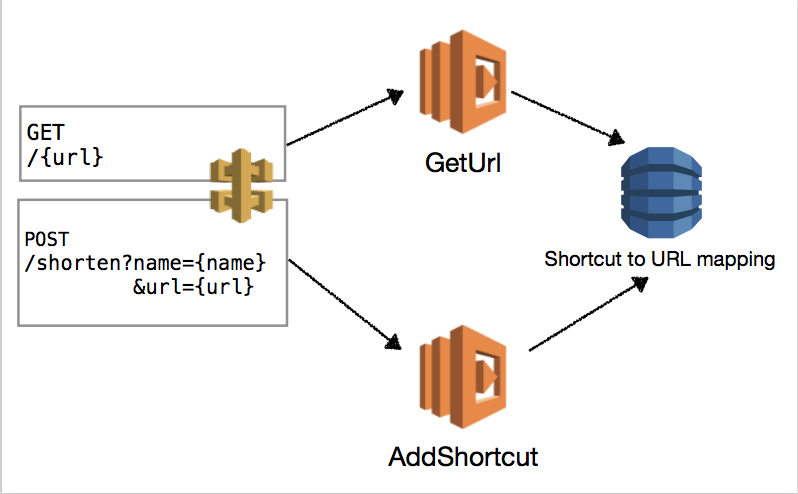

<p><a href="/quickstart">Quickstart</a> &gt; <b>Programming the Cloud</b></p>

# Programming the Cloud

The `@pulumi/cloud` package lets you program infrastructure and application logic, side by side in harmony, using
simple, high-level cloud building blocks.  This package has three key defining attributes:

* __Easy Cloud Development__: The `@pulumi/cloud` library makes it simple to build robust and scalable cloud
  applications with just a few lines of code.
* __Cloud Agnostic__: The `@pulumi/cloud` library doesn't tie you to using any one particular cloud (AWS, Azure,
  Google Cloud, Kubernetes, and various on-premises clouds).  Applications built using the high-level `@pulumi/cloud`
  components like [Table](/packages/pulumi-cloud/interfaces/_table_.table.html), [Topic](
  /packages/pulumi-cloud/interfaces/_topic_.topic.html) and [HttpEndpoint](
  /packages/pulumi-cloud/interfaces/_httpendpoint_.httpendpoint.html) can be deployed to a variety of cloud platforms.
* __Serverless__: The `@pulumi/cloud` makes it easy to build applications with minimal fixed infrastructure,
  event-driven application logic, and using resources that are charged only based on actual consumption.

## A Simple Application

As our first example, we'll build a simple URL shortener REST API. The API will have two routes, `GET /{name}` to navigate to a URL by its short name and `POST /shorten?name={name}&url={url}` to create a new shortcut.

If we were to build this application directly on AWS, we would create several resources: two Lambdas (for each of the two operations), an API Gateway configured with the two routes, and a Dynamo DB instance for storing the shortname to URL mapping. (Of course, there are many ways to build this application, but this is a common serverless architecture.) The following diagram illustrates this architecture.



Even in this simple example, there is much more involved than just defining the application code. To automate the provisioning of resources, using CloudFormation or a similar tool, we must define at least 12 resources. For instance, each of the arrows in the diagram requires several IAM rules to set up access control. If we later want to add a new resource, such as a cache of the most recently used URLs, we need to update both Lambda implementations as well as the CloudFormation templates that provision the cache. In modern cloud applications, this is a common problem: as applications use more and more managed resources, code becomes more tightly coupled with infrastructure requirements. 

Pulumi simplifies this process by enabling developers to define resources directly in code. You don't need to learn a new language to provision your resources. Adding a new resource is done directly in code and the Pulumi tools ensure that a resource is defined before it is used. The Pulumi CLI will then provision any new resources (and delete any removed resources) before deploying the new application code. 

Because code and infrastructure are defined together, Pulumi is a more productive experience for a development team. Code and infrastructure can be versioned together and application developers reason about their application as a whole, instead of considering just infrastructure or just application code.

Pulumi is not itself a cloud hosting environment; Pulumi applications can be deployed to one or more public or private clouds. Although this walkthrough targets AWS, Pulumi provides a high-level, cloud-neutral programming model that can be deployed to AWS, Azure, Google Cloud Platform, or an on-premises datacenter. 

In this example, we'll show how a Pulumi application is deployed to AWS managed services, the same services you would use if you had authored the application manually. Pulumi does not reinvent the infrastructure, but rather offers an easier way to author and evolve your application.

### Creating a simple Hello World application in Pulumi

#### Set up the project

1. Create a new directory:

    ```bash
    $ mkdir urlshortener
    $ cd urlshortener
    ```

1. In that folder, create a `Pulumi.yaml` file to describe the Pulumi application:

    ```yaml
    name: url-shortener
    description: Basic example of an AWS web server accessible over HTTP.
    runtime: nodejs
    ```

1. Since this example uses TypeScript, create `package.json` in the project folder:

    ```json
    {
        "name": "url-shortener",
        "version": "1.0.0",
        "license": "MIT",
        "main": "bin/index.js",
        "typings": "bin/index.d.ts",
        "scripts": {
            "build": "tsc"
        },
        "devDependencies": {
            "typescript": "^2.1.4"
        },
        "peerDependencies": {
            "@pulumi/cloud": "*"
        },
        "dependencies": {
            "@types/node": "^8.0.26"
        }  
    }
    ```

1. Link with the Pulumi SDK packages so that your `require`s will find the right thing:

    ```bash
    $ yarn link pulumi @pulumi/cloud
    ```

1. Run `yarn install` to install the dependencies to your `node_modules` directory.

1. Create a `tsconfig.json` file with the TypeScript compiler settings and a list of your program files:

    ```json
    {
        "compilerOptions": {
            "outDir": "bin",
            "target": "es6",
            "module": "commonjs",
            "moduleResolution": "node",
            "declaration": true,
            "sourceMap": true,
            "stripInternal": true,
            "experimentalDecorators": true,
            "pretty": true,
            "noFallthroughCasesInSwitch": true,
            "noImplicitAny": true,
            "noImplicitReturns": true,
            "forceConsistentCasingInFileNames": true,
            "strictNullChecks": true
        },
        "files": [
            "index.ts"
        ]
    }
    ```

#### Define application code

Now let's get to the application logic and infrastruture definition, which are defined at the same time in TypeScript.

1. Save the following as `index.ts`:

    ```typescript
    import * as cloud from "@pulumi/cloud";

    let app = new cloud.HttpEndpoint("urlshortener");

    app.get("/", (req,res) => {
        res.json({hello: "world"});
    });

    app.publish().then(url => console.log(`Serving at: ${url}`));
    ```

    Here, we used the `HttpEndpoint` class to create a publicly accessible HTTP endpoint.  Note that the signature of the `get` method is similar to popular JavaScript web routing frameworks, like Express.js, and uses standard request/response parameters and familiar `res.json` APIs.  Under the covers, however, this program will use a true AWS API Gateway that supports infinite scale out, DDOS protection, SSL, and more.

1.  Run `yarn build`. This is just a shortcut for invoking the TypeScript compiler, `tsc`, so you may use that instead.

    You should now have the following files in your `urlshortener` folder:

    ```bash
    Pulumi.yaml    bin/           index.ts       node_modules/  package.json   tsconfig.json  yarn.lock
    ```

1. Set the AWS region to deploy the application into:

    ```bash
    $ pulumi config aws:config:region us-west-2
    ```

1. Run `pulumi update` to deploy this code and activate our HTTPS endpoint:

    ```bash
    $ pulumi update
    ...
    <snip>
    ...
    info: Serving at: https://yoururl.execute-api.us-west-2.amazonaws.com/stage/
    info: 14 changes performed:
        + 14 resources created
    Update duration: 38.783839863s
    ```

    After that, we can curl our newly created HTTPS endpoint to see our message. Replace `yoururl` with the URL shown in the output of `pulumi update`:

    ```bash
    $ curl https://yoururl.execute-api.us-west-2.amazonaws.com/stage/
    {"hello":"world"}
    ```

    *Note: In the future we will support custom domains for APIs rather than the auto-generated AWS URL shown above.*

### From Hello World to URL shortener

We can turn this into a robust hosted URL shortener service in just a few steps.  

1. To persist the mapping between short `name` and `url`, we create a data store directly within the application:

    ```typescript
    let urls = new cloud.Table("urls", "name");
    ```

    This one line tells `pulumi update` that it should provision a new Dynamo DB resource. We can then simply use this infrastructure resource within our code; there is no need to set up access rules or perform any other configuration. 

1. Add a `/shorten` route to `index.ts`, using the `urls` table:

    ```typescript
    app.post("/shorten", async (req, res) => {
        let url = req.query["url"];
        let name = req.query["name"];
        console.log(`POST /shorten ${url} ${name}`);
        await urls.insert({name, url});
        res.json({shortenedURLName: name});
    });
    ```

    Note that we continue to use Express.js-like syntax to define the route. The function simply captures a reference to the `urls` object and calls runtime APIs on it.  Pulumi automatically handles all of the configuration and wiring necessary to make this happen: there is no need to manually configure URLs or set environment variables. 

    We can use standard JavaScript/TypeScript asynchronous code via `async` and `await`, so that the code waits for the table insert to complete before returning the HTTP response. 

1. To push this updated code, provision the data store, update the hosted REST API, and wire up the
route handlers to the new code, simply call `pulumi update`. Pulumi determine what resources have changed and makes the minimal required resource modifications.

    ```bash
    $ pulumi update

    ...
    <snip>
    ...
    info: Serving at: https://yoururl.execute-api.us-west-2.amazonaws.com/stage/
    ...
    ```

1. Now, call the API to create a short URL: 

    ```bash
    $ curl -X POST "https://yoururl.execute-api.us-west-2.amazonaws.com/stage/shorten?name=g&url=http://www.google.com"
    {"shortenedURL":"g"}
    ```

1. Finally, we'll implement the `GET `handlers for any registered short name, returning a 301 response with
`Location` header to redirect:

    ```typescript 
    app.get("/{name}", async (req, res) => {        
        let name = req.params["name"];
        let data = await urls.get({name});

        if (data) {
            console.log(`GET /${name} => ${data.url}`)
            res.setHeader("Location", data.url);
            res.status(301);
            res.end("");
        }
        else {
            res.status(404);
            res.end("");
        }
    });
    ```

1. Re-deploy and invoke the API:

    ```bash
    $ pulumi update
    ...
    $ curl https://yoururl.execute-api.us-west-2.amazonaws.com/stage/g
    <!doctype html>...contents of google.com ...
    ...
    ```

And just like that, we have created a URL shorter with persistent storage, hosted on robust and scalable compute! 

That's a quick tour of the `@pulumi/cloud` framework.  There is a lot you can do with this powerful cloud programming 
framework, and we are excited to see what the community builds on top of it.  Many more examples will be coming
soon; however, in the meantime, please check out the [API documentation](/packages/pulumi-cloud/) for more details.

## Next Up: [Further Reading](./reading.html)

