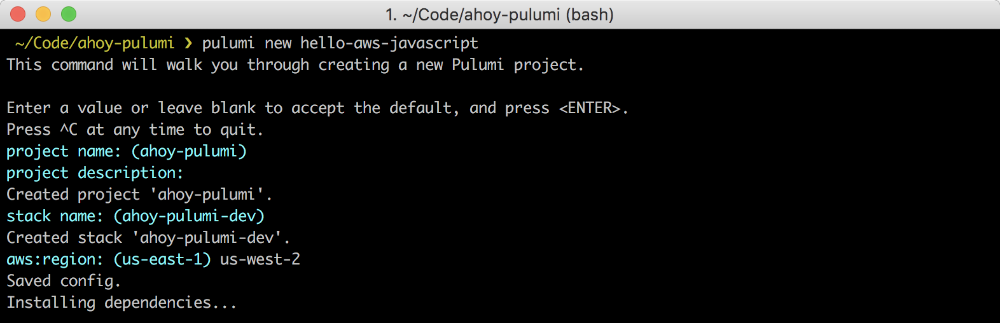
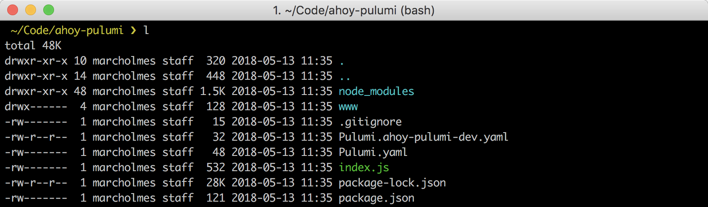
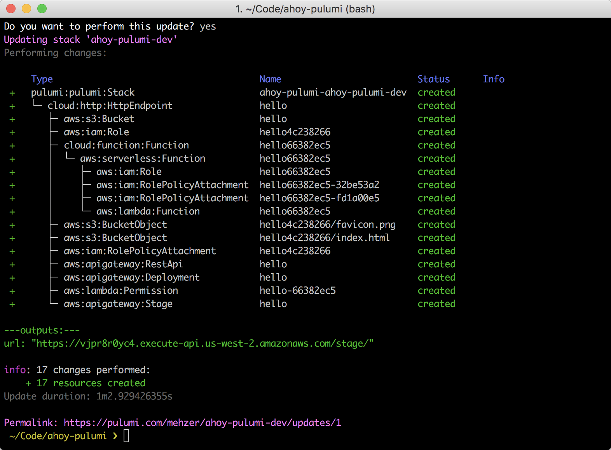
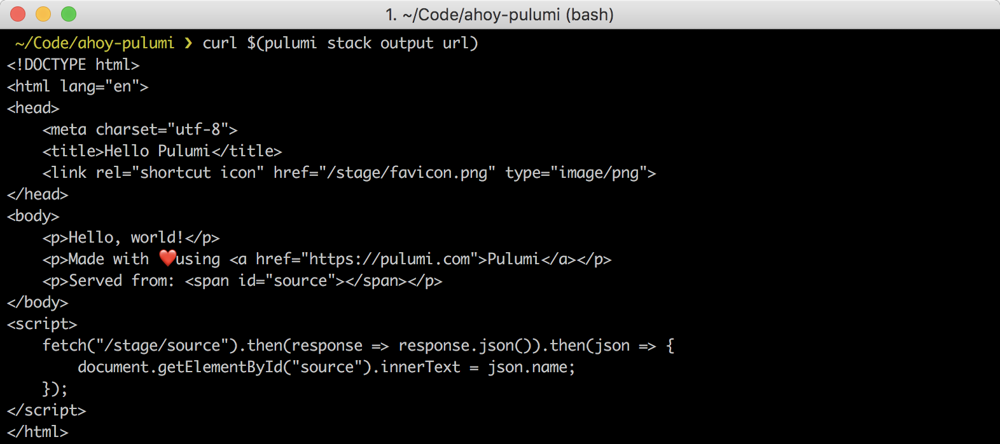
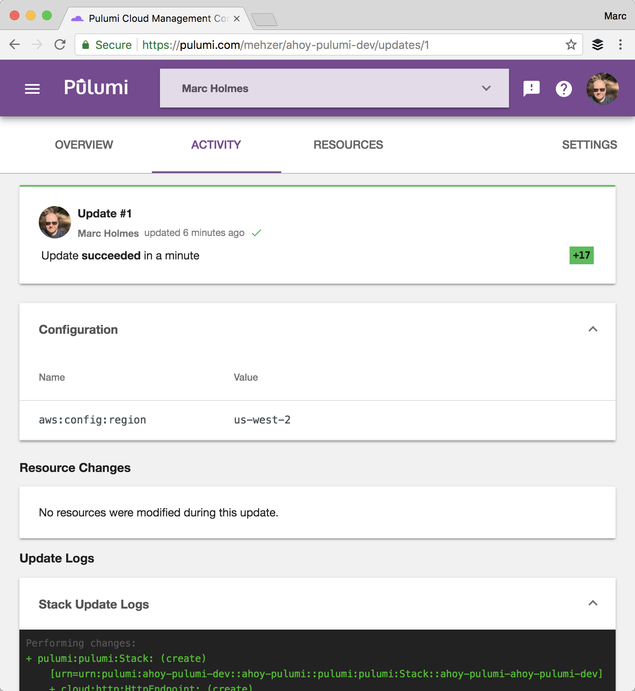
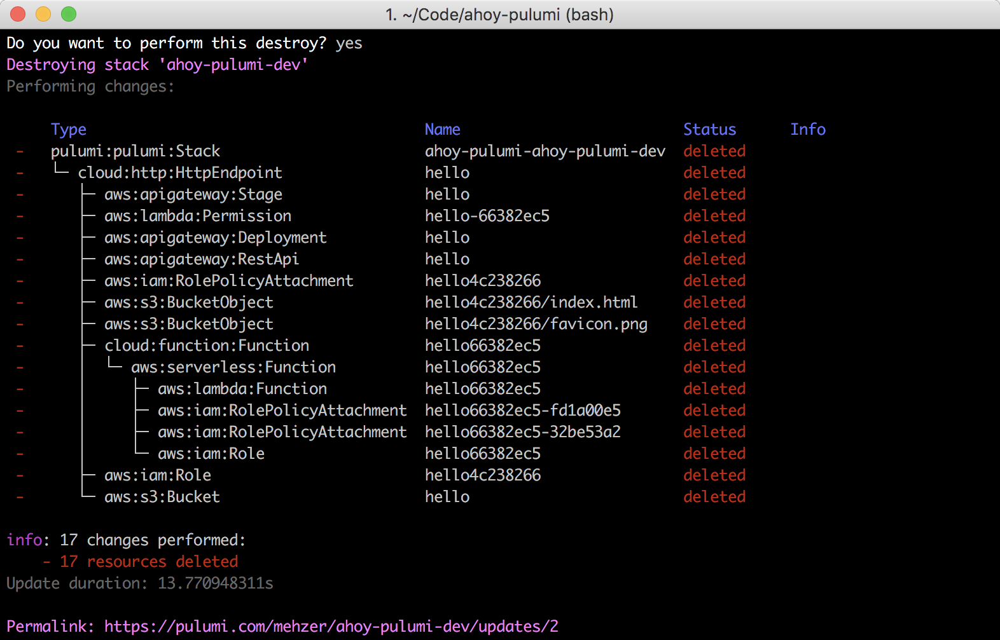

<!-- LINKS: -->
[Pulumi examples repo]: https://github.com/pulumi/examples
<!-- END LINKS: -->

In this quickstart, we are going to use **[Pulumi Cloud](http://pulumi.com)** to create a simple web server that serves static content held on an AWS S3 bucket using AWS Lambda. This is going to take 5 lines of JavaScript code, a few lines of configuration, and whatever static content we wish to serve (in this case some simple HTML).

# Pulumi helps you get code to the cloud. Together. Faster.

Pulumi is a set of tools and services to help Development and DevOps teams define, deploy, and manage cloud native infrastructure. 

Pulumi enables teams to define cloud native infrastructure in familiar languages (e.g. JavaScript, Python) meaning they can be more productive by taking advantage of existing skills and language features, rather than learning multiple DSLs depending on their deployment context.

Pulumi enables teams to deploy cloud stacks to any cloud. It has high-level, cloud agnostic capabilities to ‘write once, run anywhere’, but also has low-level, cloud specific capabilities for full control of a chosen cloud stack.

Pulumi enables teams to manage cloud native infrastructure with familiar code management and application lifecycle techniques meaning that cloud native infrastructure defined in Pulumi can easily be incorporated into existing Development and DevOps software delivery processes.

# What we'll do

- Install and configure Pulumi.
- **Initialize** a new Pulumi project.
- **Define** our stack in NodeJS.
- **Deploy** our stack to AWS.
- **Manage** our stack in the Pulumi dashboard.
- Tear it down.

# First time using Pulumi?

If so, then you need to install the CLI, and configure AWS and NPM. [More instructions can be found here](../install/index.html).

## Install Pulumi
```
curl -fsSL https://get.pulumi.com | sh
```
## ⚠️ Prerequisites: configure AWS and NPM

Pulumi relies on your AWS credentials to work, so [make sure you have them set up](../install/aws.html).

The Pulumi libraries are currently private NPM packages (while we're in beta), [so make sure to set up NPM too](../install/configure-npm.html).  

# Initialize the project

We will set up a folder set one up. 
```
mkdir ahoy-pulumi && cd ahoy-pulumi
```
Now let's use the Pulumi CLI to initialize a new project.
```
pulumi new hello-aws-javascript
```
You can accept the defaults to this command. In my example, I changed the AWS region to `us-west-2`.



After some dependency installations from NPM, you'll see a few files have been generated from this initialization process. 



Let's look at some of those.

- `Pulumi.yaml` is the overall [configuration file](../reference/yaml.html)  for the project.
- `Pulumi.ahoy-pulumi-dev.yaml` is the [configuration file](../tour/basics-configuring.html) for the stack we initialized.
- `www` contains our sample static content.
- The key file for defining our stack is `index.js` so let's examine that.

# Define our stack.

Normally, we'd write some code to define our cloud stack, but in the quickstart this work is done for us. 

```javascript
// Import the @pulumi/cloud-aws package
const cloud = require("@pulumi/cloud-aws");
    
// Create a public HTTP endpoint (using AWS APIGateway)
const endpoint = new cloud.HttpEndpoint("hello");
    
// Serve static files from the `www` folder (using AWS S3)
endpoint.static("/", "www");
    
// Serve a simple REST API on `GET /name` (using AWS Lambda)
endpoint.get("/source", (req, res) => res.json({name: "AWS"}))
    
// Export the public URL for the HTTP service
exports.url = endpoint.publish().url;
```
You can examine the [reference documentation](../reference/index.html) for the detail on these API calls.

# Deploy our stack.

The stack is ready to immediately deploy. This can be done as follows.
```bash
pulumi update
```
This command instructs Pulumi to figure out the resources needed to create the stack. These are then returned in preview.


Choosing `yes` will create the stack in AWS. This may take a minute or two.



In the output, we can see that we have exported the url of the endpoint, so we can quickly test the stack.
```bash
curl $(pulumi stack output url)
```


# Manage our stack.

Our output also contained a permalink to the Pulumi dashboard. We can review the stack in the UI, and examine logs and resource usage, along with inviting friends and co-workers to collaborate on stacks. 



# Tear Down

Let's not forget to tear down this stack.
```bash
pulumi destroy
```
Once confirmed, Pulumi will go ahead and remove all of the resources you've used. The stack itself is preserved in the Pulumi dashboard and is ready to go again as needed.



# Recap

In this example we've seen:

- How Pulumi makes the definition of cloud resources and stacks a highly productive, code-driven activity.
- How the Pulumi CLI can initialize, configure, deploy, and manage cloud stacks.
- How the Pulumi dashboard can log, monitor, and manage information about a cloud stack.

# Next Steps

From here, you can dive deeper:

- Take a tour of the [core concepts of Pulumi](../concepts/index.html).
- Take a look at more quickstarts including:
  - [Create a serverless REST API](./aws-rest-api.html)
  - [Host a static site on S3](./aws-s3-website.html)
  - [Create EC2 instances on AWS](./aws-ec2.html)
- Examine the [reference material](../reference/index.html)] for the Pulumi APIs.

## More Examples

We have a number of code examples available in the [Pulumi examples repo] on GitHub. If you don't have access to the GitHub repo, please email [support@pulumi.com](mailto:support@pulumi.com) to get access, or download the [Pulumi examples zipfile](/examples/pulumi-examples.zip).

To learn more, check out the [featured example list](./examples.html).
