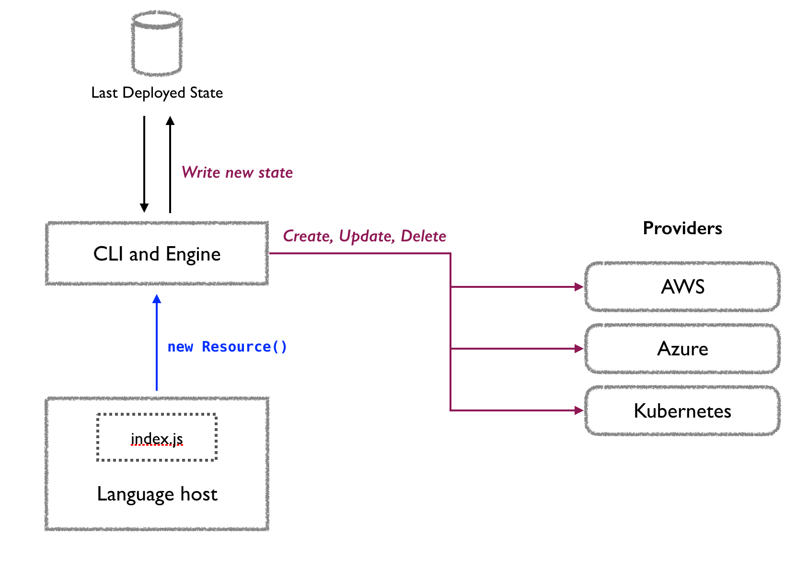

Let's describe what happens when a Pulumi program is run via `pulumi update`. Your program essentially runs within a language host process which observes the running program, known as the **language host**. The host interacts with the Pulumi **engine**; this is the part of the CLI that determines which resource changes to make (if any). Any resource changes are then executed via an underlying **provider**, such as [AWS](./aws.html), [Azure](./azure.html), [Kubernetes](./kubernetes.html), and so on. The engine uses a **checkpoint file** to store the last known state of provisioned resources. 

During program execution, whenever there is a resource creation statement (via `new Resource()` in JavaScript or TODO in Python), the resource is registered with the engine. This does not necessarily mean that a new resource should be created, it simply means that the program intends for the resource to exist. Using the last state in the checkpoint file, the engine then determines which requests it should make to the underlying **provider** in order to create, delete, or replace the resource. At the end the program execution, if a particular resource **R** is never registered, the engine will make a delete request to the resource provider. The following diagram illustrates the interaction between these parts of the system.

{:width="500px"}

For instance, suppose we have the following Pulumi program, which creates one security group and one EC2 instance:

```javascript
let group = new aws.ec2.SecurityGroup("web-secgrp", { /* ... */ });

let size = "t2.micro";

let server = new aws.ec2.Instance("web-server-www", {
    instanceType: size,
    securityGroups: [ group.name ],
    ami: getLinuxAMI(size)
});
```

Now, we run `pulumi stack init mystack`. Since `mystack` is a new stack, the stack checkpoint file is empty. 

Next, we run `pulumi update`. When the program runs to completion, it encounters two statements that create resources, `new aws.ec2.SecurityGroup()` and `new aws.ec2.Instance()`. So, the language host registers the following with the engine: a resource corresponding to `group` and a resource corresponding to `server`, using a naming scheme TODO. (🚧 TODO:need to explain how the program name corresponds to a URN that the language host/program and engine both understand.)

The engine consults the checkpoint file, and sees that these two resources do not already exist. So, the engine calls the AWS resource provider, requesting that it create a security group. Once the operation succeeds, this state is written to the checkpoint file, including the value of the security group `name` property. Next, an EC2 instance is created, referencing this same `name` property. So, the resource graph will look like the following:

```
stack mystack
   - aws.ec2.SecurityGroup "web-secgrp"
   - aws.ec2.Instance "web-server-www" size: "t2.micro"
```

Now, suppose that we change the instance size from `t2.micro` to `t2.nano`. This time, the engine will not create another security group, because it exists in the checkpoint file. The engine then makes a "replace" call to the AWS provider. Since changing the instance size requires recreating the EC2 instance, a new instance of size `t2.nano` is created. Once the creation is successful, the original `t2.micro` instance is deleted.

🚧 TODO:consider diagrams showing the changes in resource state