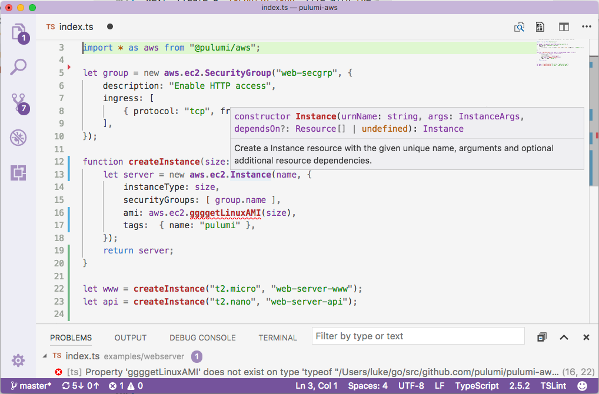

The fastest way to get started in JavaScript is using a template.  From the directory in which you'd like to create a new project:

```bash
$ pulumi new javascript
Your project was created successfully.
```

This will create a `Pulumi.yaml` [project file](./project.html), a `package.json` file for dependencies, and an `index.js` file, containing your program. The name of the directory is used as the project name in `Pulumi.yaml`.

## Pulumi packages

All Pulumi packages are regular NPM packages in the [`@pulumi` organization scope](https://www.npmjs.com/org/pulumi) on NPMJS. 

To add a new package from the `@pulumi` namespace, run `npm install --save @pulumi/package-name`.  The following packages are available:

- [@pulumi/pulumi](https://www.npmjs.com/package/@pulumi/pulumi): the core Pulumi JavaScript SDK package
- [@pulumi/aws](https://www.npmjs.com/package/@pulumi/aws): the AWS resource provider package, for programming AWS directly
- [@pulumi/aws-infra](https://www.npmjs.com/package/@pulumi/aws-infra): infrastructure components on top of `@pulumi/aws`
- [@pulumi/aws-serverless](https://www.npmjs.com/package/@pulumi/aws-serverless): easily create Lambda functions that subscribe to AWS events
- [@pulumi/cloud](https://www.npmjs.com/package/@pulumi/cloud): Pulumi's high-level, cross-cloud programming framework
- [@pulumi/cloud-aws](https://www.npmjs.com/package/@pulumi/cloud-aws): the implementation package for Pulumi's cloud framework, for use when targeting AWS
- [@pulumi/kubernetes](https://www.npmjs.com/package/@pulumi/kubernetes): the Kubernetes resource provider package, for programming Kubernetes directly
- [@pulumi/azure](https://www.npmjs.com/package/@pulumi/azure): the Azure resource provider package, for programming Azure directly
- [@pulumi/gcp](https://www.npmjs.com/package/@pulumi/gcp): the Google Cloud Platform resource provider package

> **Note:** To use `@pulumi/cloud` on AWS, you must also include the package `@pulumi/cloud-aws`.

## Node.js runtime

Any Node.js version after 6.10.x is supported, as long it is under **Active LTS** or is the **Current** stable release.

## Using Pulumi configuration values

To use configuration values in JavaScript, use the [`pulumi.Config`] class. For more information, see [Using configuration values in JavaScript].

## TypeScript

You can elect to write Pulumi programs in TypeScript to get additional verification and tooling benefits.  To use TypeScript, some additional steps are required, because you will be compiling code using the TypeScript compiler.

The fastest way to get started with Pulumi in TypeScript, is to use a template:

```bash
$ pulumi new typescript
Your project was created successfully.
```

This will auto-generate all the basic artifacts required to use TypeScript.  If you prefer, you can instead run the following manual steps.

### 1. Update package.json

Update your `package.json` to look like the following (with your own values for `name`, `version`, etc.).  This
is what tells Node.js and NPM what packages you depend on, where to find your code's entry points, and so on:

```json
{
    "name": "my-package",
    "version": "1.0.0",
    "main": "bin/index.js",
    "typings": "bin/index.d.ts",
    "scripts": {
        "build": "tsc"
    },
    "devDependencies": {
        "typescript": "^2.5.3",
        "@types/node": "^8.0.26"
    },
    "dependencies": {
        ... as before ...
    }
}
```

You can customize this however you'd like, such as adding test scripts, npm package dependencies, etc.  For more information on `package.json`, please refer to [the NPM documentation](https://docs.npmjs.com/files/package.json).

### 2. Install dependencies

Run `npm install` or `yarn install` to install the new development-time dependencies to your `node_modules` directory.

### 3. Create tsconfig.json

Create a `tsconfig.json` file with the TypeScript compiler settings and a list of your program files:

```json
{
    "compilerOptions": {
        "outDir": "bin",
        "target": "es6",
        "lib": [
            "es6"
        ],        
        "module": "commonjs",
        "moduleResolution": "node",
        "declaration": true,
        "sourceMap": true,
        "stripInternal": true,
        "experimentalDecorators": true,
        "pretty": true,
        "noFallthroughCasesInSwitch": true,
        "noImplicitAny": true,
        "noImplicitReturns": true,
        "forceConsistentCasingInFileNames": true,
        "strictNullChecks": true
    },
    "files": [
        "index.ts"
    ]
}
```

You may customize this however you'd like, including the TypeScript settings that work for you.  For
information on additional settings, see the [TypeScript documentation for `tsconfig.json`](https://www.typescriptlang.org/docs/handbook/tsconfig-json.html).

### 4. Build

Before running `pulumi update`, you should run `tsc` or `yarn build`. If you use Visual Studio Code, you can also do a continuous background build.

Tools like VS Code will give you completion lists, live error reporting and inline documentation help.

{:width="700px"}

<!-- LINKS -->
[`pulumi.Config`]: pkg/nodejs/@pulumi/index.html#Config
[Using configuration values in JavaScript]: ./config.html#javascript
<!-- END LINKS -->
